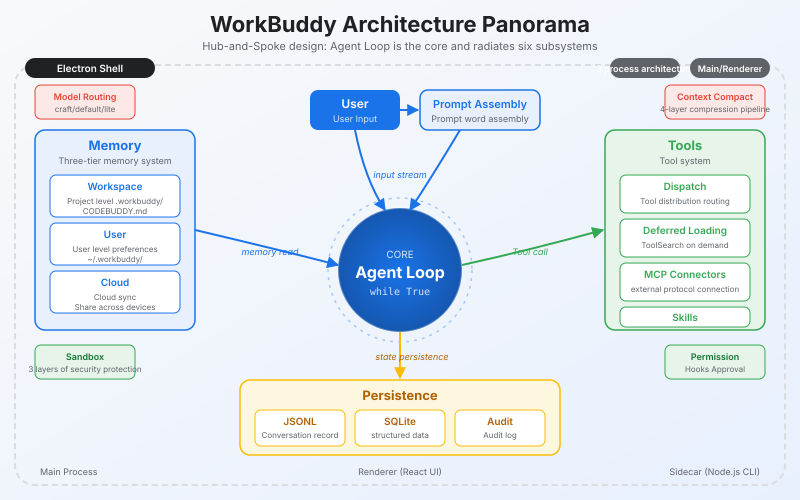
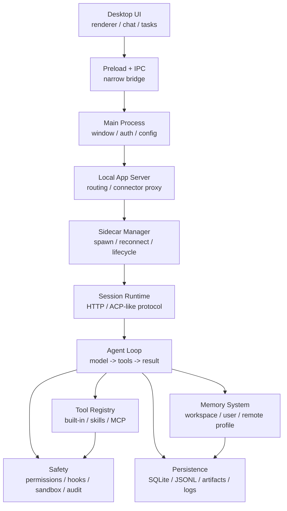
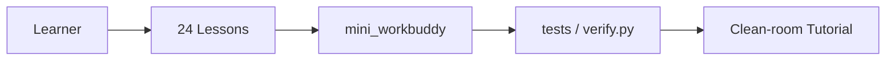

# 🔥 Desktop AI assistant from scratch · Replicate the WorkBuddy architecture in 24 lessons
[中文](README.md) · [English](README.en.md)
**An open source teaching blueprint - not product source code, but a runnable Agent engineering course. **

> The model is the brain and the Harness is the operating system.

<p align="center">
  <a href="./LICENSE"></a>
  <a href="./docs/legal/clean-room.md"></a>
  
  

</p>

<p align="center">
  <a href="https://github.com/adongwanai/learn-workbuddy" target="_blank">
    
  </a>
</p>

<table align="center">
  <tr>
<td align="center"><b>📚 Chapter 24</b><br/><sub>From agent loop to audit sandbox</sub></td>
<td align="center"><b>📐 28 pictures</b><br/><sub>Chapter and example architecture diagrams</sub></td>
<td align="center"><b>⚡ 1 command</b><br/><sub>Run the complete link offline</sub></td>
<td align="center"><b>🔌 Multiple Providers</b><br/><sub>DeepSeek/OpenAI/Anthropic</sub></td>
  </tr>
</table>

> ⭐ **If this project is helpful to you, please give a star to support us in continuing to provide classes! **



---

## 🤔 Are you also stuck by these?

You have written a CLI agent, which can run through `while True` + tool calling, but it gets stuck as soon as it comes to the desktop - **The project complexity increases by 10 times**:

- 😫 Session persistence, recovery, and reconnection - it is not a "run and shut down" process, it is a long-term living process
- 😫 The context window explodes when there are too many tools - OOM occurs before the model is even started.
- 😫 How many MB does the tool output —— Can’t fit into the context, the model will be ruined directly
- 😫 Where to put long-term memory and when to inject it - privacy and cost are out of control
- 😫 Agent can execute commands - how to design permissions so as not to become a backdoor
- 😫 Front-end, sidecar, runtime, model, tools - how to decouple each layer of the six-layer architecture

**This repository breaks these questions down into 24 lessons. Each lesson only adds one new mechanism, and each lesson has a `code.py` and a picture. **

---

## 🗺️ Why choose this?

| Dimensions | learn-workbuddy | learn-claude-code | See WorkBuddy directly |
|---|---|---|---|
| Positioning | Desktop Agent Engineering System | CLI Agent Starting Point | Product Usage |
| Depth of coverage | sidecar/memory/audit/automation | single process/terminal/MCP | black box experience |
| Code is visible | Chapter 24 original Python teaching code | Yes | Closed source |
| Multiple Provider | DeepSeek/OpenAI/Anthropic | Anthropic | Binding |
| Can be run offline | ✅ Run all demos without key | Part | ❌ |
| Who is it suitable for | Want to thoroughly understand the desktop Agent architecture | Getting started with Agent programming | Daily use |

The two projects taken together are a complete engineering pedigree from **CLI agent to desktop agent**.

---

## 🧠 30 seconds to understand
```sh
python3 -m venv .venv
source .venv/bin/activate
pip install -r requirements.txt
python3 examples/full_tour/code.py
```

When using Conda to manage Python and uv to manage dependencies:
```bash
conda env create -f environment.yml
conda activate learn-workbuddy
uv sync --python "$CONDA_PREFIX/bin/python" --no-python-downloads
uv run python examples/full_tour/code.py
```

When the environment already exists, run `conda env update -f environment.yml --prune`, activate the environment and then execute the `uv sync` command above to synchronize. Project dependencies are installed in `.venv`, and its Python interpreter comes from the Conda environment.

This command will run a complete harness tour offline: provider adapter, session, memory, tools, permissions, externalization, JSONL, HTTP, auditing and artifacts. If you want to follow the course, go to [Learning Guide](./docs/learning-guide.md); if you want to see the pictures first, go to [Visual Tour](./docs/visual-tour.md).

---

## 🏗️ Harness General Picture


One sentence version:
```text
Desktop Agent = User Interface Shell
             + Sidecar/session runtime
             + Agent loop
             + Tool registry
             + Context and memory management
             + persistent storage
             + Permissions and auditing
```

The model is just the "brain". Harness is the operating system that enables the brain to work over time, use tools, maintain context, deliver documents, and be governed.

The warehouse also contains a minimal harness implemented by the standard library - [Mini WorkBuddy](#mini-workbuddy), which makes it easier for you to understand the complete request link.

---

## 📐 Six-layer architecture
```text
Layer 1: User Interface Goal: Feature-rich without overwhelming the user
Layer 2: Agent reasoning Goal: autonomous decision-making but can be orchestrated
Layer 3: Tool Execution Goal: Powerful but with safety boundaries
Layer 4: Expanding the system Goal: Open ecosystem but manageable
Layer 5: Memory System Goal: Long-term memory but control privacy and cost
Layer 6: Security Governance Goal: Local execution but approvable, auditable, and rollable
```

These six layers are not "nice-looking" layers, but the boundaries of responsibility in product engineering: the UI does not directly execute world actions, the Agent does not directly bypass permissions, the tool output does not directly flood the context, the memory does not brainlessly stuff the prompt, the extension is not naturally credible, and all high-risk actions need to leave evidence.

---

## 🤖 Agent role division

Different products will have different internal Agent numbers and naming. The tutorial does not require you to memorize numbers. What is really worth learning is the division of labor:

| Categories | Responsibilities | Typical model slots | Tool permissions |
|---|---|---|---|
| Main Agent | Facing users, making final decisions and delivery | craft | Complete but subject to permission control |
| Universal sub-Agent | Undertakes isolationable exploration, analysis, and planning tasks | default | Inherited or restricted |
| Lightweight auxiliary Agent | Memory screening, Hook evaluation, content analysis | lite | Usually no tools |
| Compression/Summary Agent | Contextual compression, headers, session summary | default/lite | Usually no tools |

The design principles are three sentences: **Least Permission**, no tools are given to Agents who do not need them; **Cost Match**, light tasks are given to cheaper models; **Context Isolation**, the complete reasoning of child Agents should not directly pollute the main window.

---

## 🔄 SubAgent Communication
```text
Pattern A: asTool function call
Main Agent -> Sub-Agent -> Return high-density results

Mode B: Team blackboard collaboration
Multiple Agents -> Share TaskList/Plan/Status Summary -> Claim and write back individually
```

asTool is suitable for encapsulated tasks such as "Help me explore this directory", "Analyze this code" and "Give me a plan"; Team is more suitable for long tasks, writing the status of multiple Agents to a shared blackboard, rather than letting them send unlimited messages to each other. The key point is: it is best for the main Agent to only see the results, status, and summary, rather than the entire thinking process of each child Agent.

---

## ⚡ Three fundamental contradictions

| Fundamental contradiction | Direct consequences | Corresponding mechanism |
|---|---|---|
| Limited context vs unlimited information | Tool output, history, memory and schema will crowd the window | Lazy loading, output externalization, JSONL, compression, memory filtering |
| Autonomous execution vs. security and controllability | The more useful the Agent, the more like a local execution system | Permission hooks, sandbox boundaries, request headers, audit hash chain |
| Model cost vs. task complexity | The cost of using all the strongest models is too high, and the quality of all using light models is unstable | lite/default/craft routing, multi-Agent division of labor |

Chapter 24 actually answers these three things: how to make the limited context carry unlimited work, how to keep the autonomous agent from crossing the boundary, and how to put different models and different agents in the right positions.

---

## Code architecture diagram


---

## 📚 Learning Path

| Stages | Chapters | What will you build |
|---|---|---|
| Agent basics | [s01](./s01_agent_loop/) - [s04](./s04_permission_hooks/) | Loops, tool distribution, lazy loading, permission hooks |
| Desktop runtime | [s05](./s05_electron_shell/) - [s09](./s09_jsonl_transcript/) | Electron layering, sidecar, session, model routing, JSONL |
| Memory system | [s10](./s10_workspace_memory/) - [s12](./s12_cloud_memory/) | Workspace memory, user memory, remote profile/search |
| Context management | [s13](./s13_output_externalization/) - [s15](./s15_prompt_assembly/) | Large output externalization, compression, prompt assembly |
| Expanded Ecology | [s16](./s16_skills_system/) - [s18](./s18_experts_system/) | Skills, MCP connectors, Experts |
| Productization capabilities | [s19](./s19_visualizer/) - [s24](./s24_comprehensive/) | Visualization, delivery, SQLite, automation, security audit, comprehensive version |

For a more detailed module division, see [Chapter Map](./docs/chapter-map.md). How the code of each chapter inherits the previous chapter and only adds a core mechanism, see [Progression Contract](./docs/progression-contract.md). For recommended reading paths for external materials, see [Further Reading Map](./docs/further-reading.md). For code quality choices after benchmarking learn-claude-code, see [Code Quality Review](./docs/code-quality-review.md).

---

## 📖Chapter Table of Contents

| Chapters | Topics | Key Mechanics |
|---|---|---|
| [s01 Agent Loop](./s01_agent_loop/) | A loop is the heart of the agent | `while True` / `tool_use` / `tool_result` |
| [s02 Tool Dispatch](./s02_tool_dispatch/) | Tool registration and distribution | dispatch map / concurrent tools |
| [s03 Deferred Loading](./s03_deferred_loading/) | Tool expansion on demand | `ToolSearch` / `DeferExecuteTool` |
| [s04 Permission Hooks](./s04_permission_hooks/) | Draw boundaries first, then give freedom | permission rule / hook evaluator |
| [s05 Electron Shell](./s05_electron_shell/) | One process is not enough, it needs to be layered | main / renderer / preload |
| [s06 Sidecar Server](./s06_sidecar_server/) | The main process does not run agent | local RPC / sidecar lifecycle |
| [s07 Session Management](./s07_session_management/) | Logical sessions are recoverable and must be rebuilt at runtime | session create/resume/close |
| [s08 Model Routing](./s08_model_routing/) | Use models to manage model costs | lite / default / craft |
| [s09 JSONL Transcript](./s09_jsonl_transcript/) | Additional writing, crash recoverable | event log / replay |
| [s10 Workspace Memory](./s10_workspace_memory/) | Write down your daily work | append-only workspace log |
| [s11 User Memory](./s11_user_memory/) | Put user-level preferences across projects | user memory / preference distill |
| [s12 Cloud Memory](./s12_cloud_memory/) | Remote profile and history recall | profile injection / recall history |
| [s13 Output Externalization](./s13_output_externalization/) | Large output is written to disk, and the context leaves a pointer | tool-result swap |
| [s14 Context Compact](./s14_context_compact/) | The context is always full | truncate / prune / summarize |
| [s15 Prompt Assembly](./s15_prompt_assembly/) | Prompt is assembled at runtime | context blocks / budget |
| [s16 Skills System](./s16_skills_system/) | List the skills first and then expand them after they are used | `SKILL.md` / lazy load |
| [s17 MCP Connectors](./s17_mcp_connectors/) | External tools must have standard protocols | discovery / trust / call |
| [s18 Experts System](./s18_experts_system/) | Full package loading of domain experts | expert pack / routing |
| [s19 Visualizer](./s19_visualizer/) | Not just text, but also drawing | SVG / HTML widget |
| [s20 Result Presentation](./s20_result_presentation/) | Deliver upon completion | artifacts / file cards |
| [s21 SQLite Database](./s21_sqlite_database/) | Sessions, usage, and tasks must be queryable | WAL / schema / usage |
| [s22 Automation Scheduler](./s22_automation_scheduler/) | Automatically run when the point is reached | recurring / once / queue |
| [s23 Audit Sandbox](./s23_audit_sandbox/) | Every step leaves traces and cannot be tampered with | hash chain / command policy |
| [s24 Comprehensive](./s24_comprehensive/) | Many mechanisms, one loop | RAG-memory harness end-to-end and restart playback |

---

## 🚀 Quick Start
```sh
git clone https://github.com/adongwanai/learn-workbuddy
cd learn-workbuddy

python3 -m venv .venv
source .venv/bin/activate
pip install -r requirements.txt
```

Run the completely offline chapter first, no API key is required:
```sh
python3 s01_agent_loop/code.py --demo
python3 s03_deferred_loading/code.py
python3 s08_model_routing/code.py
MINI_WORKBUDDY_HOME=.tmp/mini python3 examples/mini_workbuddy_demo/code.py --mode offline
# Track Distillation -> Evaluation -> Manual Approval -> Versioned Skill (completely offline):
python3 examples/self_evolving_skills/code.py --approve
# Repeat failure + successful recovery -> Evaluation -> Manual Approval -> Reflection Memory (completely offline):
python3 examples/reflection_memory/code.py --approve
# Skill / Memory / Reflection Retrieve routing evaluation (completely offline):
python3 examples/retrieval_routing_eval/code.py
# Markdown ingestion, incremental indexing, BM25, secure gates and verifiable citations (completely offline):
python3 examples/source_grounded_rag/code.py
# End-to-end combination of RAG + Skill/Memory/Reflection routing + S15 total budget (completely offline):
python3 examples/context_pipeline_walkthrough/code.py
# Answer Claim, referential integrity, gold source alignment and no-evidence rejection evaluation (completely offline):
python3 examples/answer_grounding_eval/code.py
# Hierarchical Memory writing, deduplication, isolation, recall, compression and recovery across reboots (completely offline):
python3 examples/layered_memory_walkthrough/code.py
# Memory concurrency, identity conflicts, scope, damaged storage and restart recall fault injection (completely offline):
python3 examples/memory_resilience_eval/code.py
# Run through all harness layers (provider/session/memory/permissions/externalization/JSONL/HTTP/auditing) at once and produce artifacts:
python3 examples/full_tour/code.py
python3 scripts/verify.py
```

`scripts/verify.py` will override:

- Syntax checking of all Python files
- pytest behavioral testing: mini harness, REST/ACP protocol, chapter smoke, document assets
- Offline chapter demo: lazy loading, model routing, JSONL, output externalization, mini harness
- `--demo` offline learning entrance for 24 chapters
- Offline interactive mode: key chapters `--interactive` can enter and exit normally
- mini HTTP server smoke
- 24 chapters table of contents, code architecture diagram of each README, all picture references, clean-room desensitization scan

Fill in the key like learn-claude-code and run it online. It is recommended to use DeepSeek first. Each chapter has two entrances:

- `python3 sXX_xxx/code.py --provider deepseek`: Enter the chapter's own interactive teaching CLI.
- `python3 sXX_xxx/code.py --eval --provider deepseek`: Run a unified model evaluation entrance and write model/tool ​​JSONL trace.
```sh
cp .env.example .env
# Edit .env, just fill in DEEPSEEK_API_KEY to get started
python3 examples/mini_workbuddy_demo/code.py --mode real --provider deepseek
python3 scripts/run_real_smoke.py --provider deepseek --targets mini
python3 s01_agent_loop/code.py --provider deepseek
python3 s01_agent_loop/code.py --eval --provider deepseek
python3 s24_comprehensive/code.py --provider deepseek
python3 scripts/run_real_smoke.py --provider deepseek --targets all-lessons
```

The running status of the teaching chapter is written to `~/.learn_workbuddy/` by default and will not touch the `~/.workbuddy/` of your real WorkBuddy.
When you need to specify a directory, you can set `WORKBUDDY_HOME=/tmp/learn-workbuddy python3 s24_comprehensive/code.py --provider deepseek`.

You can also use Anthropic or OpenAI:
```sh
# Anthropic-compatible lessons
python3 s01_agent_loop/code.py --provider anthropic

# OpenAI Responses API provider adapter (mini harness / full tour / chapter eval path)
python3 examples/mini_workbuddy_demo/code.py --mode real --provider openai
python3 examples/full_tour/code.py --provider openai
python3 s01_agent_loop/code.py --eval --provider openai

# OpenAI-compatible gateway, such as Sub2API /v1/chat/completions
OPENAI_CHAT_BASE_URL=https://your-openai-compatible-gateway.example/v1 \
OPENAI_CHAT_MODEL=gpt-5.5 \
python3 examples/mini_workbuddy_demo/code.py --mode real --provider openai-chat

OPENAI_CHAT_BASE_URL=https://your-openai-compatible-gateway.example/v1 \
OPENAI_CHAT_MODEL=gpt-5.5 \
python3 scripts/run_real_smoke.py --provider openai-chat --targets mini full all-lessons
```

Boundary description: Most of the chapters' own interactive CLI retain the Anthropic-compatible `tool_use/tool_result` shape to facilitate benchmarking with learn-claude-code; the unified `--eval` path normalizes the DeepSeek/Anthropic/OpenAI/OpenAI-compatible gateway through `mini_workbuddy.providers`, so all 24 chapters can enter model evaluation and write traces.

---

## 🧪 Mini WorkBuddy

The warehouse also contains a minimal harness implemented by the standard library to facilitate your understanding of the complete request link:
```sh
MINI_WORKBUDDY_HOME=.tmp/mini python3 -m mini_workbuddy.server --port 8765

curl --noproxy '*' \
  -H 'X-Mini-WorkBuddy-Request: 1' \
  -H 'Content-Type: application/json' \
  -d '{"cwd":".","prompt":"list files"}' \
  http://127.0.0.1:8765/api/v1/runs
```

It contains:

- `mini_workbuddy.agent`: deterministic agent loop
- `mini_workbuddy.tools`: bash/read/tool-search + permission guard
- `mini_workbuddy.storage`: JSONL transcript + memory + externalized tool results
- `mini_workbuddy.audit`: append-only hash chain audit log
- `mini_workbuddy.server`: REST + ACP-like JSON-RPC
- `mini_workbuddy.sidecar`: session runtime start and stop management example
- `mini_workbuddy.providers`: multi-provider adaptation layer (DeepSeek / Anthropic / OpenAI / offline mock)

### Why does the tutorial support DeepSeek / OpenAI / Anthropic multiple providers at the same time?

It is natural for learn-claude-code to use Anthropic SDK because of Claude’s `tool_use/tool_result`
The shape fits naturally with the Claude Code tutorial. But this project is called **learn-workbuddy**, and the point is
**Desktop agent harness** should not be bound to a certain model. So we did two layers of adaptation:

- Chapter path: `--provider deepseek` will map DeepSeek's Anthropic-compatible API to the chapter's existing `tool_use/tool_result` running environment.
- Mini harness path: Provider Adapter unifies DeepSeek/Anthropic's `tool_use/tool_result`, OpenAI Responses API's `function_call/function_call_output`, and OpenAI-compatible Chat Completions' `tool_calls` into the same `ToolCall`/`ModelTurn`.

This in itself is a lesson in harness teaching: the loop is stable and the provider is replaceable.
```sh
# Offline mock (no key required, deterministic, CI and keyless readers)
python3 examples/mini_workbuddy_demo/code.py --mode real --provider offline

# Real DeepSeek / Anthropic / OpenAI / OpenAI-compatible gateway
python3 examples/mini_workbuddy_demo/code.py --mode real --provider deepseek
python3 examples/mini_workbuddy_demo/code.py --mode real --provider anthropic
python3 examples/mini_workbuddy_demo/code.py --mode real --provider openai
python3 examples/mini_workbuddy_demo/code.py --mode real --provider openai-chat

# One-click real API smoke (optional, key required)
python3 scripts/run_real_smoke.py --provider deepseek --targets mini full s01 s24
python3 scripts/run_real_smoke.py --provider openai-chat --targets mini full all-lessons
```

The real model benchmark will run DeepSeek and OpenAI-compatible gateway in batches, and write transcripts, stdout evidence, JSONL traces, and failure improvement suggestions to
`benchmark-runs/<name>/`. The default matrix is ​​that each provider runs `mini + full + s01-s24 eval`, which is a total of 52 cases for the two providers. This is an "exam" for open source readers and maintainers, not the CI default:
```sh
DEEPSEEK_MODEL=deepseek-v4-pro \
OPENAI_CHAT_BASE_URL=https://your-openai-compatible-gateway.example/v1 \
OPENAI_CHAT_MODEL=gpt-5.5 \
python3 scripts/model_benchmark.py --providers deepseek openai-chat

# Quickly check the matrix and trace files without calling the model
python3 scripts/model_benchmark.py --providers deepseek openai-chat --max-lessons 3 --dry-run
```

See `.env.example` for configuration (`PROVIDER=deepseek|anthropic|openai|openai-chat|offline|auto`). Protocol comparison and design
See [docs/appendix/provider-adapter.md](./docs/appendix/provider-adapter.md) for instructions.

---

## 🧠Key points of memory system

This project splits the desktop agent’s memory into five layers:

| Layers | Responsibilities | Teaching Chapters |
|---|---|---|
| Workspace memory | Current project facts, decisions, daily work log | [s10](./s10_workspace_memory/) |
| User memory | Cross-project preferences, habits, long-term constraints | [s11](./s11_user_memory/) |
| Remote profile/search | Abstract model of server profile and history retrieval | [s12](./s12_cloud_memory/) |
| Transcript | Additional writing of session events, recoverable and replayable | [s09](./s09_jsonl_transcript/) |
| Tool-result swap | Large output externalization, history only retains summary and pointer | [s13](./s13_output_externalization/) |

Core idea: **Context window is RAM, JSONL, SQLite, memory files and tool-results are disk. **

To see how the five categories of states work together without confusing ownership, you can run the completely offline [Layered Memory Walkthrough](./examples/layered_memory_walkthrough/). It directly cascades S09–S14, demonstrating writing, repeated fact distillation, user isolation, source recall, artifact references, compressed invariants, and fresh-process recovery without adding a second set of Memory packages.

To verify whether Memory can fail closed under concurrency, identity conflicts, cross-user reads, corrupted JSONL, and process restarts, you can run [Memory Resilience Evaluation](./examples/memory_resilience_eval/). It reuses S12's public store and recall contracts and outputs checkable evidence on a case-by-case basis; any safety boundary failure cannot be averaged out by other passes.

If you want to verify "after correct retrieval, whether the answer is really supported by the evidence", you can run [Answer-grounded RAG Evaluation](./examples/answer_grounding_eval/). It evaluates evidence-set/citation integrity separately from fixture-backed claim/source alignment, and covers evidence-free rejection, citation laundering, and cross-query answer replay.

---

## 🛡️ Clean-room border

This repository only contains original teaching code and architectural explanations, and does not contain WorkBuddy's closed source code, package resources, private prompts, private protocol keys, or user data.

Allowed materials:

- Expose observable product behavior
- Structural observation of the local runtime directory, desensitized
- Knowledge of common protocols and open source ecosystem, such as HTTP, JSON-RPC, MCP, SQLite, Electron
- The author's original teaching implementation, pseudocode and illustrations

Materials not accepted:

- Closed source code snippets or decompiled material
- Private key, token, user path, user ID, original log text
- Details that can be used to bypass authorization, security mechanisms or business restrictions

See [NOTICE.md](./NOTICE.md) and [docs/legal/clean-room.md](./docs/legal/clean-room.md) for further instructions.

---

## 📁 Project structure
```text
learn-workbuddy/
  images/                  # README General picture
  mini_workbuddy/          # Standard library minimal harness
  s01_agent_loop/          # 24 chapters of course, each chapter README + code.py + SVG
  ...
  s24_comprehensive/
  docs/architecture/       # clean-room architecture description
  docs/appendix/           # Local observation notes after migration
  docs/evidence/           # Desensitized evidence summary
  docs/legal/              # Public boundaries and contribution rules
  examples/                # Small example that can be run independently
  scripts/verify.py        # Local/CI verification entry
  skills/                  # Example skill
```

---

## 🔗 Relationship with learn-claude-code

[learn-claude-code](https://github.com/shareAI-lab/learn-claude-code) is more like the starting point of a CLI agent harness: single process, terminal, file system, MCP.

`learn-workbuddy` continues to move towards desktop productization: multi-process, sidecar, long-term memory, automation, auditing, visual delivery.

The two projects taken together are a complete engineering pedigree from CLI agent to desktop agent.

---

## 🌟 Star History

<p align="center">
  <a href="https://star-history.com/#adongwanai/learn-workbuddy&Date" target="_blank">
    
  </a>
</p>

---

## 👥 Who is studying?

> This section is being collected - if you are an early reader, please share your study notes in [Discussions](https://github.com/adongwanai/learn-workbuddy/discussions), and we will post your GitHub avatar and thoughts here.

---

## 💬 Community

- 📮 **Discussion & Q&A**: [GitHub Discussions](https://github.com/adongwanai/learn-workbuddy/discussions)
- 🐛 **Bug & Suggestions**: [GitHub Issues](https://github.com/adongwanai/learn-workbuddy/issues)
- 💡 **Contribution code**: Welcome to submit PR, please see the [Contribution](#contribution) section below for details

---

## 🤝 Contribute

Issues and PRs are welcome, especially:

- Correct inaccurate or overly specific product descriptions in chapters
- Added offline demo that does not rely on API key
- Improved SVG diagrams and chapter navigation
- Added new clean-room harness mechanism
- Translated into English, Japanese, Korean

Please run before submitting:
```sh
python3 -m pytest -q
python3 scripts/verify.py
```

---

## 📄 License

[MIT](./LICENSE)

WorkBuddy is a trademark or product name of its respective owner. This project is an independent educational clean-room reimplementation and is not affiliated with or endorsed by WorkBuddy.

This tutorial is based on WorkBuddy’s architectural design and public documentation. The code is Python teaching implementation, not source code extraction.

---

<p align="center">
⭐ <b>If this project is helpful to you, please give a star to support us in continuing to provide courses! </b> ⭐
</p>
