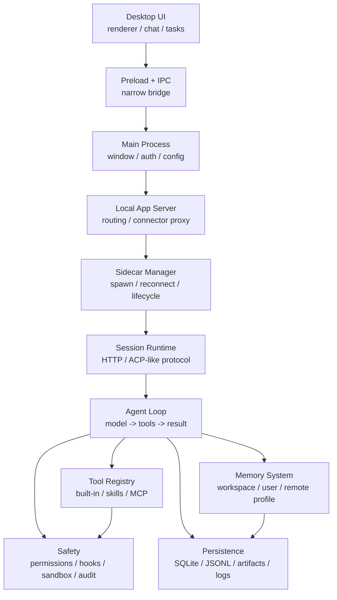

# 🔥 从0手搓桌面AI助手 · 24节课复刻WorkBuddy架构

**一份开源教学蓝图 — 不是产品源码，是可以跑的 Agent 工程课。**

> 模型是大脑，Harness 是操作系统。

<p align="center">
  <a href="./LICENSE"></a>
  <a href="./docs/legal/clean-room.md"></a>
  
  
  
</p>

<p align="center">
  <a href="https://github.com/adongwanai/learn-workbuddy" target="_blank">
    
  </a>
</p>

<table align="center">
  <tr>
    <td align="center"><b>📚 24章</b><br/><sub>从 agent loop 到审计沙盒</sub></td>
    <td align="center"><b>📐 27张图</b><br/><sub>每章一张架构图</sub></td>
    <td align="center"><b>⚡ 1条命令</b><br/><sub>离线跑完整链路</sub></td>
    <td align="center"><b>🔌 多Provider</b><br/><sub>DeepSeek/OpenAI/Anthropic</sub></td>
  </tr>
</table>

> ⭐ **如果这个项目对你有帮助，请给个 Star 支持我们继续出课！**


---

## 🤔 你是不是也被这些卡住了

你写过 CLI agent，能跑通 `while True` + tool calling，但一到桌面端就卡住了——**工程复杂度翻 10 倍**：

- 😫 会话常驻、恢复、重连 —— 不是"跑完就关"，是长期活着的进程
- 😫 工具太多时上下文窗口秒炸 —— 模型还没干活就 OOM 了
- 😫 工具输出几 MB —— 塞不进 context，模型直接摆烂
- 😫 长期记忆放哪里、什么时候注入 —— 隐私和成本两头失控
- 😫 Agent 能执行命令 —— 权限怎么设计才不变成后门
- 😫 前端、sidecar、runtime、模型、工具 —— 六层架构的每一层怎么解耦

**这个仓库把这些问题拆成 24 课。每一课只新增一个机制，每一课都有一份 `code.py` 和一张图。**

---

## 🗺️ 为什么选这个

| 维度 | learn-workbuddy | learn-claude-code | 直接看 WorkBuddy |
|---|---|---|---|
| 定位 | 桌面 Agent 工程系统 | CLI Agent 起点 | 产品使用 |
| 覆盖深度 | sidecar/记忆/审计/自动化 | 单进程/终端/MCP | 黑盒体验 |
| 代码可见 | 24章原创Python教学代码 | 有 | 闭源 |
| 多Provider | DeepSeek/OpenAI/Anthropic | Anthropic | 绑定 |
| 离线可跑 | ✅ 无key跑全部demo | 部分 | ❌ |
| 适合谁 | 想透彻理解桌面Agent架构 | 入门Agent编程 | 日常使用 |

两个项目合在一起，就是从 **CLI agent 到 desktop agent 的完整工程谱系**。

---

## 🧠 30 秒看懂

```sh
python3 -m venv .venv
source .venv/bin/activate
pip install -r requirements.txt
python3 examples/full_tour/code.py
```

这条命令会离线跑完整 harness tour：provider adapter、session、记忆、工具、权限、外部化、JSONL、HTTP、审计和 artifacts 全部走一遍。想按课程学，走 [Learning Guide](./docs/learning-guide.md)；想先看图，走 [Visual Tour](./docs/visual-tour.md)。

---

## 🏗️ Harness 总图



一句话版本：

```text
桌面 Agent = 用户界面外壳
             + Sidecar / 会话运行时
             + Agent 循环
             + 工具注册表
             + 上下文与记忆管理
             + 持久化存储
             + 权限与审计
```

模型只是"大脑"。Harness 是让大脑能够长期工作、使用工具、保持上下文、交付文件、接受治理的操作系统。

仓库里还放了一个标准库实现的最小 harness —— [Mini WorkBuddy](#mini-workbuddy)，便于你理解完整请求链路。

---

## 📐 六层架构

```text
Layer 1: 用户界面        目标: 功能丰富但不压垮用户
Layer 2: Agent 推理     目标: 自主决策但可被编排
Layer 3: 工具执行        目标: 能力强大但有安全边界
Layer 4: 扩展系统        目标: 开放生态但可治理
Layer 5: 记忆系统        目标: 长期记忆但控制隐私和成本
Layer 6: 安全治理        目标: 本地执行但可审批、可审计、可回滚
```

这六层不是"画得好看"的分层，而是产品工程里的责任边界：UI 不直接执行世界动作，Agent 不直接绕过权限，工具输出不直接淹没上下文，记忆不无脑塞进 prompt，扩展不天然可信，所有高风险动作都需要留下证据。

---

## 🤖 Agent 角色分工

不同产品会有不同的内部 Agent 数量和命名。教程不要求你死记数字，真正值得学的是分工方法：

| 类别 | 职责 | 典型模型槽位 | 工具权限 |
|---|---|---|---|
| 主 Agent | 面向用户，做最终决策和交付 | craft | 完整但受权限控制 |
| 通用子 Agent | 承接可隔离的探索、分析、规划任务 | default | 继承或受限 |
| 轻量辅助 Agent | 记忆筛选、Hook 评估、内容分析 | lite | 通常无工具 |
| 压缩/摘要 Agent | 上下文压缩、标题、会话总结 | default/lite | 通常无工具 |

设计原则是三句话：**最小权限**，不需要工具的 Agent 不给工具；**成本匹配**，轻任务交给便宜模型；**上下文隔离**，子 Agent 的完整推理不要直接污染主窗口。

---

## 🔄 SubAgent 通信

```text
模式 A: asTool 函数调用
主 Agent -> 子 Agent -> 返回高密度结果

模式 B: Team 黑板协作
多个 Agent -> 共享 TaskList / Plan / 状态摘要 -> 各自认领和回写
```

asTool 适合"帮我探索这个目录""分析这段代码""给一个计划"这类可封装任务；Team 更适合长任务，把多个 Agent 的状态写到共享黑板，而不是让它们互相发送无限消息。关键点是：主 Agent 最好只看到结果、状态和摘要，而不是每个子 Agent 的全部思考过程。

---

## ⚡ 三大根本矛盾

| 根本矛盾 | 直接后果 | 对应机制 |
|---|---|---|
| 上下文有限 vs 信息无限 | 工具输出、历史、记忆和 schema 会挤爆窗口 | 延迟加载、输出外部化、JSONL、压缩、记忆筛选 |
| 自主执行 vs 安全可控 | Agent 越有用，越像本地执行系统 | 权限 hooks、沙盒边界、请求头、审计 hash chain |
| 模型成本 vs 任务复杂度 | 全部用最强模型成本太高，全部用轻模型质量不稳 | lite/default/craft 路由、多 Agent 分工 |

24 章其实都在回答这三件事：怎么让有限上下文承载无限工作，怎么让自主 agent 不越界，怎么把不同模型和不同 Agent 放到正确的位置。

---

## 📚 学习路径

| 阶段 | 章节 | 你会搭出来什么 |
|---|---|---|
| Agent 基础 | [s01](./s01_agent_loop/) - [s04](./s04_permission_hooks/) | 循环、工具分发、延迟加载、权限 hook |
| 桌面运行时 | [s05](./s05_electron_shell/) - [s09](./s09_jsonl_transcript/) | Electron 分层、sidecar、session、模型路由、JSONL |
| 记忆系统 | [s10](./s10_workspace_memory/) - [s12](./s12_cloud_memory/) | 工作区记忆、用户记忆、远端 profile/search |
| 上下文管理 | [s13](./s13_output_externalization/) - [s15](./s15_prompt_assembly/) | 大输出外部化、压缩、prompt 组装 |
| 扩展生态 | [s16](./s16_skills_system/) - [s18](./s18_experts_system/) | Skills、MCP connectors、Experts |
| 产品化能力 | [s19](./s19_visualizer/) - [s24](./s24_comprehensive/) | 可视化、交付、SQLite、自动化、安全审计、综合版 |

更细的模块划分见 [Chapter Map](./docs/chapter-map.md)。每章代码如何继承上一章、只新增一个核心机制，见 [Progression Contract](./docs/progression-contract.md)。外部资料的推荐阅读路径见 [Further Reading Map](./docs/further-reading.md)。对标 learn-claude-code 后的代码质量取舍见 [Code Quality Review](./docs/code-quality-review.md)。

---

## 📖 章节目录

| 章节 | 主题 | 关键机制 |
|---|---|---|
| [s01 Agent Loop](./s01_agent_loop/) | 一个循环就是 agent 的心脏 | `while True` / `tool_use` / `tool_result` |
| [s02 Tool Dispatch](./s02_tool_dispatch/) | 工具注册和分发 | dispatch map / 并发工具 |
| [s03 Deferred Loading](./s03_deferred_loading/) | 工具按需展开 | `ToolSearch` / `DeferExecuteTool` |
| [s04 Permission Hooks](./s04_permission_hooks/) | 先划边界，再给自由 | permission rule / hook evaluator |
| [s05 Electron Shell](./s05_electron_shell/) | 一个进程不够，要分层 | main / renderer / preload |
| [s06 Sidecar Server](./s06_sidecar_server/) | 主进程不跑 agent | local RPC / sidecar lifecycle |
| [s07 Session Management](./s07_session_management/) | 每个会话独立管理 | session create/load/resume |
| [s08 Model Routing](./s08_model_routing/) | 用模型管理模型成本 | lite / default / craft |
| [s09 JSONL Transcript](./s09_jsonl_transcript/) | 追加写入，崩溃可恢复 | event log / replay |
| [s10 Workspace Memory](./s10_workspace_memory/) | 每天的工作要记下来 | append-only workspace log |
| [s11 User Memory](./s11_user_memory/) | 跨项目偏好放用户级 | user memory / preference distill |
| [s12 Cloud Memory](./s12_cloud_memory/) | 远端 profile 和历史召回 | profile injection / recall history |
| [s13 Output Externalization](./s13_output_externalization/) | 大输出写磁盘，上下文留指针 | tool-result swap |
| [s14 Context Compact](./s14_context_compact/) | 上下文总会满 | truncate / prune / summarize |
| [s15 Prompt Assembly](./s15_prompt_assembly/) | Prompt 是运行时组装出来的 | context blocks / budget |
| [s16 Skills System](./s16_skills_system/) | 技能先列目录，用到再展开 | `SKILL.md` / lazy load |
| [s17 MCP Connectors](./s17_mcp_connectors/) | 外接工具要有标准协议 | discovery / trust / call |
| [s18 Experts System](./s18_experts_system/) | 领域专家整包加载 | expert pack / routing |
| [s19 Visualizer](./s19_visualizer/) | 不只是文字，还能画图 | SVG / HTML widget |
| [s20 Result Presentation](./s20_result_presentation/) | 做完要交付 | artifacts / file cards |
| [s21 SQLite Database](./s21_sqlite_database/) | 会话、用量、任务要可查询 | WAL / schema / usage |
| [s22 Automation Scheduler](./s22_automation_scheduler/) | 到点自动跑 | recurring / once / queue |
| [s23 Audit Sandbox](./s23_audit_sandbox/) | 每步留痕，不可篡改 | hash chain / command policy |
| [s24 Comprehensive](./s24_comprehensive/) | 机制很多，循环一个 | integrated harness |

---

## 🚀 快速开始

```sh
git clone https://github.com/adongwanai/learn-workbuddy
cd learn-workbuddy

python3 -m venv .venv
source .venv/bin/activate
pip install -r requirements.txt
```

先跑完全离线的章节，不需要 API key：

```sh
python3 s01_agent_loop/code.py --demo
python3 s03_deferred_loading/code.py
python3 s08_model_routing/code.py
MINI_WORKBUDDY_HOME=.tmp/mini python3 examples/mini_workbuddy_demo/code.py --mode offline
# 一次跑遍所有 harness 层（provider/session/记忆/权限/外部化/JSONL/HTTP/审计），产出 artifacts：
python3 examples/full_tour/code.py
python3 scripts/verify.py
```

`scripts/verify.py` 会覆盖：

- 所有 Python 文件语法检查
- pytest 行为测试：mini harness、REST/ACP 协议、章节 smoke、文档资产
- 离线章节 demo：延迟加载、模型路由、JSONL、输出外部化、mini harness
- 24 个章节的 `--demo` 离线学习入口
- 离线交互模式：关键章节 `--interactive` 能正常进入和退出
- mini HTTP server smoke
- 24 章目录、每个 README 的代码架构图、27 张配图引用、clean-room 脱敏扫描

像 learn-claude-code 一样填 key 在线跑，推荐先用 DeepSeek。每个章节都有两种入口：

- `python3 sXX_xxx/code.py --provider deepseek`：进入章节自己的交互式教学 CLI。
- `python3 sXX_xxx/code.py --eval --provider deepseek`：跑统一的模型评测入口，写出 model/tool JSONL trace。

```sh
cp .env.example .env
# 编辑 .env，只填 DEEPSEEK_API_KEY 即可开始
python3 examples/mini_workbuddy_demo/code.py --mode real --provider deepseek
python3 scripts/run_real_smoke.py --provider deepseek --targets mini
python3 s01_agent_loop/code.py --provider deepseek
python3 s01_agent_loop/code.py --eval --provider deepseek
python3 s24_comprehensive/code.py --provider deepseek
python3 scripts/run_real_smoke.py --provider deepseek --targets all-lessons
```

教学章节的运行状态默认写入 `~/.learn_workbuddy/`，不会碰你本机真实 WorkBuddy 的 `~/.workbuddy/`。
需要指定目录时可以设置 `WORKBUDDY_HOME=/tmp/learn-workbuddy python3 s24_comprehensive/code.py --provider deepseek`。

也可以使用 Anthropic 或 OpenAI：

```sh
# Anthropic-compatible lessons
python3 s01_agent_loop/code.py --provider anthropic

# OpenAI Responses API provider adapter（mini harness / full tour / 章节 eval 路径）
python3 examples/mini_workbuddy_demo/code.py --mode real --provider openai
python3 examples/full_tour/code.py --provider openai
python3 s01_agent_loop/code.py --eval --provider openai

# OpenAI-compatible 网关，例如 Sub2API /v1/chat/completions
OPENAI_CHAT_BASE_URL=https://your-openai-compatible-gateway.example/v1 \
OPENAI_CHAT_MODEL=gpt-5.5 \
python3 examples/mini_workbuddy_demo/code.py --mode real --provider openai-chat

OPENAI_CHAT_BASE_URL=https://your-openai-compatible-gateway.example/v1 \
OPENAI_CHAT_MODEL=gpt-5.5 \
python3 scripts/run_real_smoke.py --provider openai-chat --targets mini full all-lessons
```

边界说明：章节自己的交互式 CLI 多数保留 Anthropic-compatible `tool_use/tool_result` 形状，便于对标 learn-claude-code；统一 `--eval` 路径则通过 `mini_workbuddy.providers` 归一化 DeepSeek/Anthropic/OpenAI/OpenAI-compatible gateway，所以 24 章都能进入模型评测并写出 trace。

---

## 🧪 Mini WorkBuddy

仓库里还放了一个标准库实现的最小 harness，便于你理解完整请求链路：

```sh
MINI_WORKBUDDY_HOME=.tmp/mini python3 -m mini_workbuddy.server --port 8765

curl --noproxy '*' \
  -H 'X-Mini-WorkBuddy-Request: 1' \
  -H 'Content-Type: application/json' \
  -d '{"cwd":".","prompt":"list files"}' \
  http://127.0.0.1:8765/api/v1/runs
```

它包含：

- `mini_workbuddy.agent`: deterministic agent loop
- `mini_workbuddy.tools`: bash/read/tool-search + permission guard
- `mini_workbuddy.storage`: JSONL transcript + memory + externalized tool results
- `mini_workbuddy.audit`: append-only hash chain audit log
- `mini_workbuddy.server`: REST + ACP-like JSON-RPC
- `mini_workbuddy.sidecar`: session runtime 启停管理示例
- `mini_workbuddy.providers`: 多 provider 适配层（DeepSeek / Anthropic / OpenAI / 离线 mock）

### 为什么教程同时支持 DeepSeek / OpenAI / Anthropic 多 provider

learn-claude-code 用 Anthropic SDK 很自然，因为 Claude 的 `tool_use/tool_result`
形状和 Claude Code 教程天然贴合。但本项目叫 **learn-workbuddy**，重点是
**桌面 agent harness**，不该绑定某一家模型。所以我们做了两层适配：

- 章节路径：`--provider deepseek` 会把 DeepSeek 的 Anthropic-compatible API 映射成章节已有的 `tool_use/tool_result` 运行环境。
- mini harness 路径：Provider Adapter 把 DeepSeek/Anthropic 的 `tool_use/tool_result`、OpenAI Responses API 的 `function_call/function_call_output`、以及 OpenAI-compatible Chat Completions 的 `tool_calls` 归一成同一个 `ToolCall`/`ModelTurn`。

这本身就是 harness 教学的一课：loop 稳定，provider 可换。

```sh
# 离线 mock（无需 key，确定性，CI 与无 key 读者用）
python3 examples/mini_workbuddy_demo/code.py --mode real --provider offline

# 真实 DeepSeek / Anthropic / OpenAI / OpenAI-compatible gateway
python3 examples/mini_workbuddy_demo/code.py --mode real --provider deepseek
python3 examples/mini_workbuddy_demo/code.py --mode real --provider anthropic
python3 examples/mini_workbuddy_demo/code.py --mode real --provider openai
python3 examples/mini_workbuddy_demo/code.py --mode real --provider openai-chat

# 一键真实 API 冒烟（可选，需 key）
python3 scripts/run_real_smoke.py --provider deepseek --targets mini full s01 s24
python3 scripts/run_real_smoke.py --provider openai-chat --targets mini full all-lessons
```

真实模型 benchmark 会批量跑 DeepSeek 和 OpenAI-compatible gateway，并把成绩单、stdout 证据、JSONL 轨迹、失败改进建议写到
`benchmark-runs/<name>/`。默认矩阵是每个 provider 跑 `mini + full + s01-s24 eval`，也就是两个 provider 共 52 个 case。这是给开源读者和维护者看的"考试"，不是 CI 默认项：

```sh
DEEPSEEK_MODEL=deepseek-v4-pro \
OPENAI_CHAT_BASE_URL=https://your-openai-compatible-gateway.example/v1 \
OPENAI_CHAT_MODEL=gpt-5.5 \
python3 scripts/model_benchmark.py --providers deepseek openai-chat

# 快速检查矩阵与 trace 文件，不调用模型
python3 scripts/model_benchmark.py --providers deepseek openai-chat --max-lessons 3 --dry-run
```

配置见 `.env.example`（`PROVIDER=deepseek|anthropic|openai|openai-chat|offline|auto`）。协议对照与设计
说明见 [docs/appendix/provider-adapter.md](./docs/appendix/provider-adapter.md)。

---

## 🧠 记忆系统重点

本项目把桌面 agent 的记忆拆成五层：

| 层 | 职责 | 教学章节 |
|---|---|---|
| Workspace memory | 当前项目的事实、决策、每日工作日志 | [s10](./s10_workspace_memory/) |
| User memory | 跨项目偏好、习惯、长期约束 | [s11](./s11_user_memory/) |
| Remote profile/search | 服务端 profile 和历史检索的抽象模型 | [s12](./s12_cloud_memory/) |
| Transcript | 会话事件追加写入，可恢复可回放 | [s09](./s09_jsonl_transcript/) |
| Tool-result swap | 大输出外部化，history 只保留摘要和指针 | [s13](./s13_output_externalization/) |

核心心法：**上下文窗口是 RAM，JSONL、SQLite、记忆文件和 tool-results 是磁盘。**

---

## 🛡️ Clean-room 边界

这个仓库只包含原创教学代码和架构解释，不包含 WorkBuddy 的闭源代码、包体资源、私有 prompt、私有协议密钥或用户数据。

允许的材料：

- 公开可观察的产品行为
- 本地运行时目录的结构性观察，已脱敏
- 通用协议和开源生态知识，例如 HTTP、JSON-RPC、MCP、SQLite、Electron
- 作者原创的教学实现、伪代码和图示

不接受的材料：

- 闭源代码片段或 decompiled material
- 私有密钥、token、用户路径、用户 ID、日志原文
- 可用于绕过授权、安全机制或商业限制的细节

更多说明见 [NOTICE.md](./NOTICE.md) 和 [docs/legal/clean-room.md](./docs/legal/clean-room.md)。

---

## 📁 项目结构

```text
learn-workbuddy/
  images/                  # README 总图
  mini_workbuddy/          # 标准库最小 harness
  s01_agent_loop/          # 24 章课程，每章 README + code.py + SVG
  ...
  s24_comprehensive/
  docs/architecture/       # clean-room 架构说明
  docs/appendix/           # 迁移后的本地观察笔记
  docs/evidence/           # 已脱敏的证据摘要
  docs/legal/              # 公开边界和贡献规则
  examples/                # 可独立运行的小型示例
  scripts/verify.py        # 本地/CI 验证入口
  skills/                  # 示例 skill
```

---

## 🔗 与 learn-claude-code 的关系

[learn-claude-code](https://github.com/shareAI-lab/learn-claude-code) 更像 CLI agent harness 的起点：单进程、终端、文件系统、MCP。

`learn-workbuddy` 继续往桌面产品化走：多进程、sidecar、长期记忆、自动化、审计、可视化交付。

两个项目合在一起，就是从 CLI agent 到 desktop agent 的完整工程谱系。

---

## 🌟 Star History

<p align="center">
  <a href="https://star-history.com/#adongwanai/learn-workbuddy&Date" target="_blank">
    
  </a>
</p>

---

## 👥 谁在学

> 这个板块正在收集中 — 如果你是早期读者，欢迎在 [Discussions](https://github.com/adongwanai/learn-workbuddy/discussions) 分享你的学习笔记，我们会把你的 GitHub 头像和心得贴在这里。

---

## 💬 社区

- 📮 **讨论 & 答疑**：[GitHub Discussions](https://github.com/adongwanai/learn-workbuddy/discussions)
- 🐛 **Bug & 建议**：[GitHub Issues](https://github.com/adongwanai/learn-workbuddy/issues)
- 💡 **贡献代码**：欢迎提交 PR，详见下方 [贡献](#贡献) 章节

---

## 🤝 贡献

欢迎提交 Issue 和 PR，尤其欢迎：

- 修正章节中不准确或过度具体的产品表述
- 增加不依赖 API key 的离线 demo
- 改进 SVG 图和章节导航
- 增加新的 clean-room harness 机制
- 翻译成英文、日文、韩文

提交前请运行：

```sh
python3 -m pytest -q
python3 scripts/verify.py
```

---

## 📄 License

[MIT](./LICENSE)

WorkBuddy is a trademark or product name of its respective owner. This project is an independent educational clean-room reimplementation and is not affiliated with or endorsed by WorkBuddy.

本教程基于 WorkBuddy 的架构设计与公开文档编写。代码为 Python 教学实现，非源码提取。

---

<p align="center">
  ⭐ <b>如果这个项目对你有帮助，请给个 Star 支持我们继续出课！</b> ⭐
</p>
