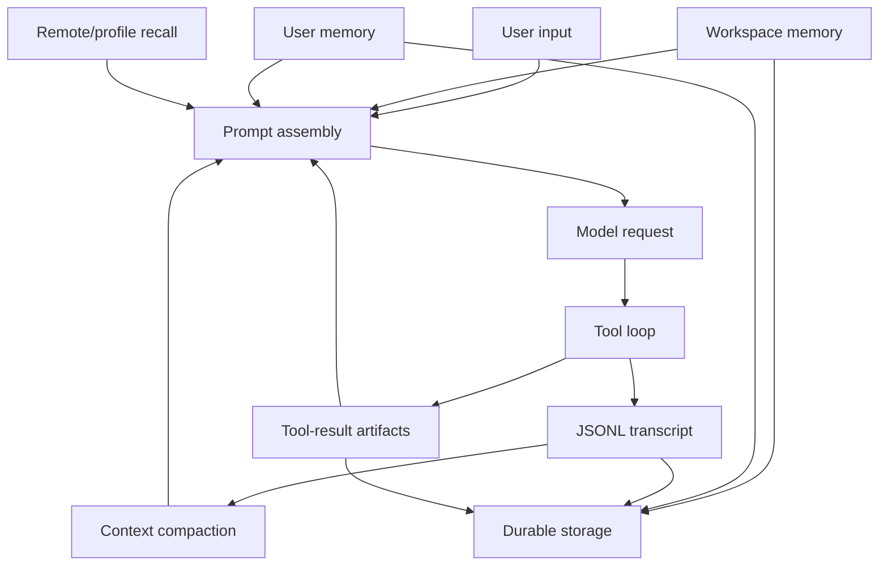

# Source And Memory System

This document explains the memory architecture used by the tutorial. It is a
clean-room architecture note, not a package analysis report. It avoids private
file names, local paths, raw logs, bundle excerpts, exact implementation
constants, and product-specific internals.

## Core Idea

Desktop agent memory is not one file. It is a set of stores with different
owners, lifetimes, trust levels, and prompt budgets.



The model context window is RAM. Transcripts, artifacts, SQLite records, and
memory files are disk. The harness decides what gets loaded into RAM each turn.

## Five Memory Layers

| Layer | Owner | What It Stores | Tutorial Chapter |
|---|---|---|---|
| Workspace memory | Current project | Decisions, project facts, recent work notes. | `s10_workspace_memory` |
| User memory | User profile | Cross-project preferences and stable constraints. | `s11_user_memory` |
| Remote/profile recall | Provider or service abstraction | Long-horizon recall and profile snippets. | `s12_cloud_memory` |
| Transcript | Session runtime | Append-only event stream for replay and evidence. | `s09_jsonl_transcript` |
| Tool-result artifacts | Storage layer | Full outputs that are too large for the prompt. | `s13_output_externalization` |

## Why Separate Them

Each layer answers a different question:

- Workspace memory: "What did we decide in this repo?"
- User memory: "How does this person like work to be done?"
- Remote/profile recall: "What long-horizon context might matter now?"
- Transcript: "What actually happened in this session?"
- Tool-result artifacts: "Where is the full output if the prompt only has a pointer?"

Collapsing these into one memory blob makes privacy, cost, and relevance worse.

## Prompt Assembly

Prompt assembly should be explicit and budgeted:

```text
PromptContext
  system identity
  task instructions
  selected workspace memory
  selected user memory
  selected recall snippets
  active tool schemas
  recent transcript summary
  artifact pointers
```

Good harnesses do not inject every possible memory. They select, summarize, and
defer. That is why this repository teaches memory together with deferred tools,
output externalization, and compaction.

## Selection Over Stuffing

A practical memory selector can start simple:

```python
def select_memories(query, manifest):
    scored = []
    for item in manifest:
        score = keyword_overlap(query, item.title + " " + item.summary)
        if score:
            scored.append((score, item))
    return [item for _, item in sorted(scored, reverse=True)[:5]]
```

The important teaching point is the manifest boundary:

```text
available memory manifest -> selector -> selected memory IDs -> prompt blocks
```

The model or selector should choose from a manifest; it should not receive every
private memory by default.

## Transcript Versus Memory

A transcript is evidence. Memory is curation.

| Store | Write Pattern | Read Pattern |
|---|---|---|
| Transcript | Append every event. | Replay or summarize. |
| Memory | Append or update selected facts. | Inject only if relevant. |
| Artifact | Write full output once. | Load by pointer when needed. |

This distinction prevents a common bug: treating old chat logs as if they were
reliable long-term memory. A good harness summarizes and validates before
promoting session history into memory.

## Compaction

Compaction is not deletion. It is a controlled representation change:

```text
long transcript span -> compact summary item -> keep artifact pointers
```

The summary should preserve:

- user goal
- decisions made
- files or artifacts touched
- unresolved questions
- tool outputs that were externalized

The full transcript can remain on disk; the prompt gets a shorter working set.

## How The Tutorial Implements This

- `mini_workbuddy.storage` writes sessions, transcripts, memory files, and
  externalized tool results.
- `s09_jsonl_transcript` teaches append-only replay.
- `s10_workspace_memory` teaches project-scoped facts.
- `s11_user_memory` teaches cross-project preferences and dedupe.
- `s12_cloud_memory` teaches remote/profile recall as an abstraction.
- `s13_output_externalization` teaches swap-file style tool output.
- `s14_context_compact` teaches summary-based pressure relief.
- `s15_prompt_assembly` teaches budgeted prompt composition.

The production lesson is transferable even though the implementation is small:
keep memory layered, keep prompt assembly explicit, and never let raw history
or large tool output flood the context window.
