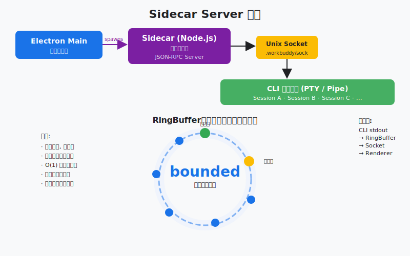

# Visual Tour

10 张图看懂 WorkBuddy-style desktop agent harness。所有图片都来自本仓库的原创教学图，不依赖产品截图或私有素材。

## 1. 总架构


桌面 agent 不是一个聊天框。它是 UI shell、sidecar、session runtime、agent loop、tool registry、memory、storage 和 safety layer 的组合。

## 2. Agent Loop


最小 agent harness 是一个反馈环：模型请求工具，harness 执行工具，再把结果喂回模型。

## 3. Deferred Loading


工具很多时，不要一开始把所有 schema 塞进 prompt。先让模型搜索工具，需要时再展开。

## 4. Permission Gates


Agent 越有用，越需要权限门。高风险动作应该在工具执行前被识别、拦截、记录。

## 5. Sidecar



UI 进程不应该承载长任务。sidecar/session runtime 是桌面 shell 和 agent work 之间的隔离层。

## 6. Session Lifecycle


会话要能创建、暂停、恢复、重连和结束。否则 agent 只是一次性脚本，不是桌面工作流。

## 7. Memory


记忆要分层：项目事实、用户偏好、远端/历史召回、transcript 和 artifact 指针不该混成一坨。

## 8. Context Compaction


长任务一定会撞上下文窗口。压缩不是删除历史，而是把旧事件换成可继续工作的摘要。

## 9. Skills And Connectors


Skills 给模型能力说明和脚本，Connectors 接外部服务。两者都需要发现、权限和信任边界。

## 10. Comprehensive Harness


最后所有机制回到同一个 loop：模型负责 agency，harness 负责落地、记忆、权限、审计和交付。

## 一句话复盘

```text
模型会思考，但 harness 决定它能不能长期、安全、可恢复地工作。
```
