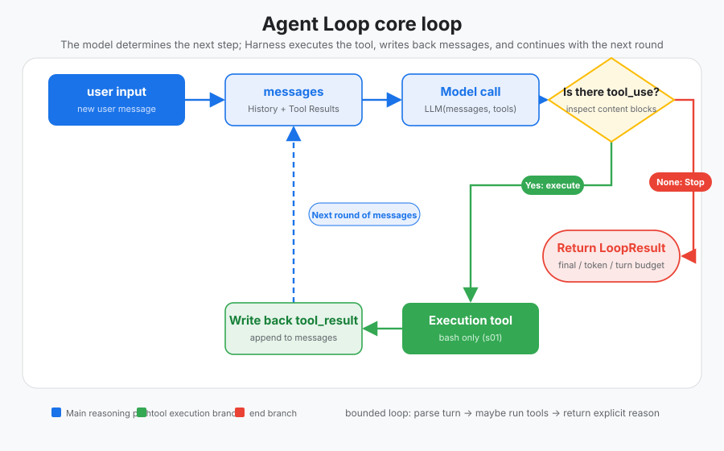
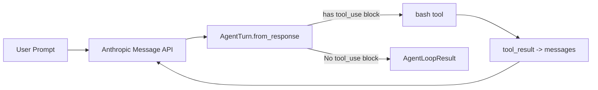

# s01: Agent Loop — One loop is enough
[中文](README.md) · [English](README.en.md)
> *"One loop + one tool = one Agent"* — tool_use driver continues, explicit result specification stops.
>
> **Harness layer**: Loop — the first connection between the model and the real world.

---



## Code architecture diagram


## Learn prerequisite knowledge

- An LLM response may contain plain text or tool_use.
- The core of the Agent loop is not "chatting", but the ability to feed model output, tool execution, and tool results back to the model.
- The ReAct idea can be understood as the cycle of Reasoning + Acting.

## The WorkBuddy-style mechanism captured in this chapter

- Simulate the heartbeat of a WorkBuddy-style harness with a minimal while loop.
- Use tool_use/tool_result to form observable and testable interaction boundaries.
- Use `AgentLoopResult` to explicitly differentiate between normal answers, token truncation and round budgeting.
- Accept the simplification of single process first, and then separate the UI, Sidecar, and Session in subsequent chapters.

## Common misunderstandings

-Writing the agent as a one-time prompt call will make it difficult to add tools, memory and recovery later.
- Trusting stop_reason directly can easily miss tool calls in streaming responses.
- With unbounded `while True`, the model cannot give the harness a definite stopping point when calling the tool continuously.
- If you use a complex framework from the beginning, you will not be able to see clearly the true boundaries of the harness.
## question

You asked a question to the big model: "Help me read the files in my directory and execute XXX.py".

The model can output a bash command, but stops after the output is complete. It will not run on its own, nor will it continue to reason after seeing the results.

You can run it manually, paste the output back into the dialog box, and let it continue its work. When the next command comes out, you run it again and paste it back. Every time you go back and forth, you're doing the middle layer.

Automating it is what this chapter does. The production-grade `agent bridge` core of WorkBuddy is also in this cycle when it is dismantled.

---

## Solution

The model will continue if it returns a tool call, and stop if there are no tool calls. The content block determines "whether to continue", and the provider's `stop_reason` is used to explain "why to stop"; harness itself also maintains the maximum round budget.

| Observation | Harness Interpretation | Cyclic Action |
|------|------|---------|
| With `tool_use` block | The model requests to perform real I/O | Execute → Feed the results back → Continue |
| No tool block, normal end | The model gives the final answer | Return `final_answer` |
| No tool block, `max_tokens` | Answer truncated by provider | Return `max_tokens`, retain partial text |
| `max_turns` reached | Harness budget exhausted | Return `max_turns` and no longer initiate new model calls |

---

## Working principle

**Step 1**: Make the user’s question the first message.
```python
messages = [{"role": "user", "content": query}]
```

**Step 2**: Send the message to LLM along with the tool definition.
```python
response = client.messages.create(
    model=MODEL, system=SYSTEM, messages=messages,
    tools=TOOLS, max_tokens=8000,
)
```

**Step 3**: Normalize the provider response into an `AgentTurn`. The parsing is only done once, and subsequent judgment and execution share the same data.
```python
turn = AgentTurn.from_response(response)
messages.append({"role": "assistant", "content": turn.content})
```

**Step 4**: First determine whether to stop. The tool content block takes priority in deciding whether the loop should continue, and `stop_reason` is responsible for distinguishing the termination type.
```python
stop_reason = stop_reason_for(turn)
if stop_reason is not None:
    return AgentLoopResult(
        stop_reason=stop_reason,
        turns=turn_number,
        tool_calls=tool_call_count,
        final_text=turn.text,
        provider_stop_reason=turn.provider_stop_reason,
    )
```

**Step 5**: Execute the tools required by the model and collect the results.
```python
results = [execute_bash_call(call) for call in turn.tool_calls]
```

**Step 6**: Append the tool results as a new message and return to step 2.
```python
messages.append({"role": "user", "content": results})
```

The core loop thus remains straightforward while returning a testable result contract:
```python
def agent_loop(messages, max_turns=8):
    tool_call_count = 0
    for turn_number in range(1, max_turns + 1):
        response = client.messages.create(
            model=MODEL, system=SYSTEM, messages=messages,
            tools=TOOLS, max_tokens=8000,
        )
        turn = AgentTurn.from_response(response)
        messages.append({"role": "assistant", "content": turn.content})

        stop_reason = stop_reason_for(turn)
        if stop_reason is not None:
            return AgentLoopResult(
                stop_reason, turn_number, tool_call_count,
                turn.text, turn.provider_stop_reason,
            )

        results = [execute_bash_call(call) for call in turn.tool_calls]
        tool_call_count += len(results)
        messages.append({"role": "user", "content": results})

    return AgentLoopResult(
        LoopStopReason.MAX_TURNS, max_turns, tool_call_count,
        turn.text, turn.provider_stop_reason,
    )
```

The body of the loop is still small; the new type is not a framework layer, but makes the turn, tool call and stop reasons explicit that were previously hidden in loose objects and `return`. The next 23 chapters will layer mechanics around this cycle.

---

## Try it

> **Teaching demo tips**: The code will execute the shell command generated by the model. It is recommended to run in a temporary test directory. s04 will talk about the real permission system.

**Preparation** (first run):
```sh
pip install -r requirements.txt
cp .env.example .env
# Edit .env and fill in ANTHROPIC_API_KEY and MODEL_ID
```

**run**:
```sh
python s01_agent_loop/code.py
```

Try these prompts:

1. `Create a file called hello.py that prints "Hello, World!"`
2. `List all Python files in this directory`
3. `What is the current git branch?`

Key points to observe: When does the model call the tool (the loop continues), and when does the final text appear? If the model calls the tool continuously, how does `max_turns` make the harness stop bounded?

---

## Next

Now the model only has bash as a tool. WorkBuddy-style desktop agents often have multiple sets of RPC realms, built-in tool pools, and MCP connector tools. How to manage so many tools?

s02 Tool Dispatch → Give it multiple tools and distribute them uniformly with a dispatch map.

<details>
<summary>Clean-room architecture comparison</summary>

> The following is a clean-room comparison of the observable behavior of the desktop agent harness in the educational version.

### Agent loop — the core of the harness

The teaching version compresses the agent core into a readable loop. Production-grade implementations typically also handle at the same layer:

-The core loop of Agent loop
- ACP (Agent Communication Protocol) HTTP endpoint definition
- Tool registration and distribution logic
- Streaming response processing
- Error recovery strategy

### Loop position in multiple processes

WorkBuddy's agent loop does not run in the main Electron process, but in the CLI session sub-process:
```
Electron Main Process
  └─ SidecarServer
       └─ JSON-RPC over Unix Socket
            └─ CLI Session Process (cli/)
                 └─ ACP HTTP Server
                      └─ Agent Loop
```

The main process manages session creation, destruction, and status query through Sidecar, but does not directly run the agent loop. This separation prevents the UI from being blocked by long-running agents.

### Handling of stop_reason

Streaming providers tend to have content chunks and final stopping metadata arrive in separate events. Therefore, the harness should not only use `stop_reason` to decide whether to execute the tool; it first checks the normalized `tool_use` content block, and then uses stop metadata to explain the final status, which is more compatible with synchronization and streaming implementations.

### RingBuffer — Bounded output buffer

The sidecar process uses a fixed-size RingBuffer to buffer the agent's streaming output. When the agent produces large amounts of output (such as reading a large file), RingBuffer ensures that no data is lost while avoiding infinite memory growth. Content that exceeds the buffer is discarded, but the agent can still continue to work.

### Simplification of the teaching version

- Production-grade agent bridge → a small bounded loop + explicit result contract
- Multi-process Sidecar → Single-process direct call
- Streaming response → Synchronous response
- RingBuffer → list
- ACP HTTP → function call

**One sentence**: The core of the production-grade agent bridge is still the bounded turn loop; explicit fields and exit paths allow it to be tested, observed, and safely stopped.

</details>

---

## Next lesson

The bounded loop sets up the skeleton of the agent. But there is only an explicit bash branch in the loop - how does the agent know what tools are available? How do I route function calls from model output to the correct tool? s02 talks about tool distribution - dispatch map, concurrent execution, streaming tool invocation.

s02 Tool Dispatch → Multiple tools, one dispatch map.
