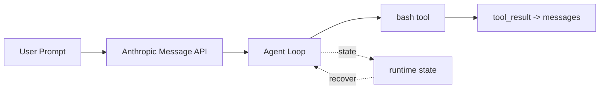

# s01: Agent Loop — 一个循环就够了

> *"一个循环 + 一个工具 = 一个 Agent"* — while True, stop_reason, tool_use。
>
> **Harness 层**: 循环 — 模型与真实世界的第一道连接。

---


## 代码架构图



## 学习前置知识

- LLM 一次响应可能包含普通文本, 也可能包含 tool_use。
- Agent loop 的核心不是“会聊天”, 而是能把模型输出、工具执行、工具结果重新喂回模型。
- ReAct 思路可以理解为 Reasoning + Acting 的循环。

## 本章抓住的 WorkBuddy-style 机制

- 用最小 while 循环模拟 WorkBuddy-style harness 的心跳。
- 用 tool_use/tool_result 形成可恢复、可记录的交互边界。
- 先接受单进程简化, 后续章节再把 UI、Sidecar、Session 拆开。

## 常见误区

- 把 agent 写成一次性 prompt 调用, 后面就很难加入工具、记忆和恢复。
- 直接信任 stop_reason 容易漏掉流式响应里的工具调用。
- 一开始就上复杂框架, 会看不清 harness 的真正边界。
## 问题

你提出了一个问题给大模型："帮我读取下我的目录下有哪些文件，并且执行XXX.py"。

模型能输出一条 bash 命令，但输出完了就停了。它不会自己跑，也不会看到结果后继续推理。

你可以手动跑一遍，把输出粘贴回对话框，让它接着干。下一个命令出来，你再跑一遍、再贴回去。每一个来回，你都在做中间层。

把它自动化，就是这一章做的事。WorkBuddy 的 生产级 `agent bridge` 核心，拆到底也是这一个循环。

---

## 解决方案

一个 `while True` 循环，模型调用工具就继续，不调用就停。整个过程只有两个信号：

| 信号 | 含义 | 循环动作 |
|------|------|---------|
| 有 `tool_use` block | 模型举手说"我要用工具" | 执行 → 结果喂回去 → 继续 |
| 没有 `tool_use` block | 模型说"我做完了" | 退出循环 |

---

## 工作原理

**第 1 步**：把用户的问题作为第一条消息。

```python
messages = [{"role": "user", "content": query}]
```

**第 2 步**：将消息和工具定义一起发给 LLM。

```python
response = client.messages.create(
    model=MODEL, system=SYSTEM, messages=messages,
    tools=TOOLS, max_tokens=8000,
)
```

**第 3 步**：追加模型回答，检查它是否调了工具。没调 → 结束。

```python
messages.append({"role": "assistant", "content": response.content})
if response.stop_reason != "tool_use":
    return
```

**第 4 步**：执行模型要求的工具，收集结果。

```python
results = []
for block in response.content:
    if block.type == "tool_use":
        output = run_bash(block.input["command"])
        results.append({
            "type": "tool_result",
            "tool_use_id": block.id,
            "content": output,
        })
```

**第 5 步**：把工具结果作为新消息追加，回到第 2 步。

```python
messages.append({"role": "user", "content": results})
```

组装为一个完整函数：

```python
def agent_loop(messages):
    while True:
        response = client.messages.create(
            model=MODEL, system=SYSTEM, messages=messages,
            tools=TOOLS, max_tokens=8000,
        )
        messages.append({"role": "assistant", "content": response.content})

        if response.stop_reason != "tool_use":
            return

        results = []
        for block in response.content:
            if block.type == "tool_use":
                output = run_bash(block.input["command"])
                results.append({
                    "type": "tool_result",
                    "tool_use_id": block.id,
                    "content": output,
                })
        messages.append({"role": "user", "content": results})
```

不到 30 行，这就是最小可运行的 agent harness 内核。后面 23 个章节都在这个循环上叠加机制，循环本身始终不变。

---

## 试一下

> **教学 demo 提示**：代码会执行模型生成的 shell 命令。建议在一个临时测试目录中运行。s04 会讲真正的权限系统。

**准备**（首次运行）：

```sh
pip install -r requirements.txt
cp .env.example .env
# 编辑 .env，填入 ANTHROPIC_API_KEY 和 MODEL_ID
```

**运行**：

```sh
python s01_agent_loop/code.py
```

试试这些 prompt：

1. `Create a file called hello.py that prints "Hello, World!"`
2. `List all Python files in this directory`
3. `What is the current git branch?`

观察重点：模型什么时候调用工具（循环继续），什么时候不调用（循环结束）？

---

## 接下来

现在模型手里只有 bash 一个工具。WorkBuddy-style 桌面 agent 往往有多组 RPC 领域、内置工具池、MCP 连接器工具。怎么管理这么多工具？

s02 Tool Dispatch → 给它多个工具，用一个 dispatch map 统一分发。

<details>
<summary>Clean-room 架构对照</summary>

> 以下是教学版对桌面 agent harness 可观察行为的 clean-room 对照。

### Agent loop — harness 的核心

教学版把 agent 核心压缩成一个可读循环。生产级实现通常还会在同一层处理：

- Agent loop 的核心循环
- ACP (Agent Communication Protocol) HTTP 端点定义
- 工具注册和分发逻辑
- 流式响应处理
- 错误恢复策略

### 多进程中的循环位置

WorkBuddy 的 agent loop 不在 Electron 主进程里跑，而在 CLI 会话子进程中运行：

```
Electron Main Process
  └─ SidecarServer
       └─ JSON-RPC over Unix Socket
            └─ CLI Session Process (cli/)
                 └─ ACP HTTP Server
                      └─ Agent Loop
```

主进程通过 Sidecar 管理会话的创建、销毁、状态查询，但不直接运行 agent loop。这种分离让 UI 不被 agent 的长时间运行阻塞。

### stop_reason 的处理

WorkBuddy 使用 Anthropic SDK 的流式响应。在流式模式下，`stop_reason` 可能在 `message_delta` 事件中才到达，而不是在第一个 `message_start` 中。WorkBuddy 的处理方式与 Claude Code 类似——不直接信任 `stop_reason`，而是检查内容中是否有 `tool_use` block。

### RingBuffer — 有界输出缓冲

Sidecar 进程使用 固定大小的 RingBuffer 来缓冲 agent 的流式输出。当 agent 产生大量输出（比如读取一个大文件），RingBuffer 确保不会丢失数据，同时避免无限内存增长。超出缓冲的内容会被丢弃，但 agent 仍然能继续工作。

### 教学版的简化

- 生产级 agent bridge → 30 行 `while True`
- 多进程 Sidecar → 单进程直接调用
- 流式响应 → 同步响应
- RingBuffer → 列表
- ACP HTTP → 函数调用

**一句话**：生产级 agent bridge 核心就是 30 行 `while True`。所有复杂字段和退出路径都是保护机制。

</details>

---

## 下一课

30 行 `while True` 搭好了 agent 的骨架。但循环里只有 `tool_use` 和 `tool_result`——agent 怎么知道有哪些工具可用？怎么从模型输出的函数调用路由到正确的工具？s02 讲工具分发——dispatch map、并发执行、流式工具调用。

s02 Tool Dispatch → 多个工具, 一个 dispatch map。
