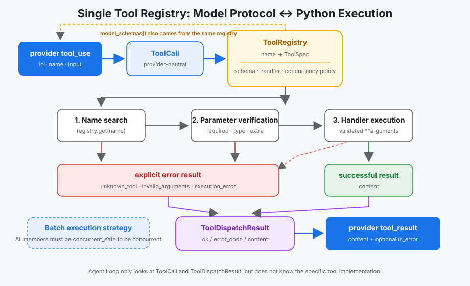
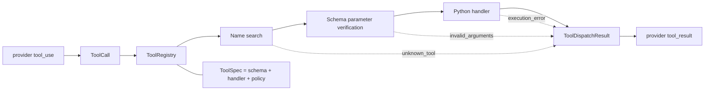

# s02: Tool Dispatch — A registry is the tool boundary

[中文](README.md) · [English](README.en.md)
> *"The model only proposes the calling intent, Harness determines whether and how it can become a local execution." *
>
> **Harness layer**: Tool distribution — crossing the boundary from model protocols into real Python code.

---



## Code architecture diagram

## Learn prerequisite knowledge

- s01 has normalized a round of model responses into `AgentTurn` and used the tool content block to decide whether the loop should continue.
- There are two directions for tool definition: describing available capabilities to the model, and executing Python callables locally.
- The model produces untrusted protocol input; even if the schema has been sent to the model, Harness still needs to verify it before execution.
- Concurrency is an execution strategy, not the default property for all tool invocations.

## The WorkBuddy-style mechanism captured in this chapter

- Use a `ToolRegistry` to manage registration, model schema, name lookup, parameter validation and execution.
- Use `ToolCall` to isolate provider block and `ToolDispatchResult` to isolate local execution results.
- Unknown tools, incorrect parameters and handler exceptions are converted into explicit error results to prevent Agent Loop from crashing.
- Only read-only tool batches marked `concurrent_safe` can be concurrent; writes and unknown calls are conservatively serialized.
- File tools continue to use `safe_path()` to limit work area boundaries.
- The bash handler reconstructs the minimum environment for the child process to avoid passing provider credentials directly out of Harness with tool calls.

## Common misunderstandings

- Maintain `TOOLS` and `TOOL_HANDLERS` separately: change the schema but forget to change the handler, or vice versa.
- Thinking that the model "has seen the schema" will not pass wrong parameters: the model output may still have missing fields, wrong types, or contain redundant fields.
- Execute `handler(**block.input)` directly: protocol errors and Python exceptions will penetrate to the loop layer.
- Make all tools in the same cycle concurrent: a race condition will occur when `write_file` is followed by `read_file`.
- Insert security policies into the Agent Loop: the loop will gradually learn the details of each tool, and the loop must be changed when new tools are added.
- Consider setting `cwd` to complete isolation: the working directory does not automatically remove the parent process's API key, SSH agent socket, or other environment variables.

## Question

s01 only has a bash tool, so the loop can be written directly:
```python
output = run_bash(call.arguments["command"])
```
When the tool is expanded to read, write, edit, and glob, the hard-coded branch will take on seven things at the same time:

1. Tell the model what tools it has;
2. Find the Python function according to its name;
3. Determine whether the parameters are complete;
4. Pass the parameters to the handler;
5. Decide whether concurrency is possible;
6. Encode success or failure back to the provider protocol.
7. Decide which host environment variables the tool child process can inherit.

If this information is scattered among schema lists, dispatch dictionaries, and loop branches, sooner or later they will become inconsistent. What really needs to be added is not more `if/elif`, but a clear **dispatch boundary**.

---

## Solution

Register each tool only once:
```python
ToolSpec(
    name="read_file",
    description="Read UTF-8 file contents from the workspace.",
    input_schema=object_schema(
        {
            "path": {"type": "string"},
            "limit": {"type": "integer", "minimum": 1},
        },
        ["path"],
    ),
    handler=run_read,
    concurrent_safe=True,
)
```
This object answers four questions simultaneously:

| Fields | Who to target | Role |
|------|--------|------|
| `name` | Model protocols and Harness | Stable lookup keys |
| `description + input_schema` | Model | Description calling method |
| `handler` | Local executor | Actual Python implementation |
| `concurrent_safe` | Harness | Batch execution strategy |

`ToolRegistry` then derives the model tool directories from these `ToolSpec` and uses the same batch of objects to complete the runtime lookup. There is no longer a separate `TOOLS` list and another `TOOL_HANDLERS` dictionary in the project.

---

## Working principle

### 1. Normalized provider input

Model SDK blocks are vendor objects. The dispatch layer first extracts only the required fields:
```python
@dataclass(frozen=True)
class ToolCall:
    tool_use_id: str
    name: str
    arguments: object
```
`arguments` is intentionally only declared as an untrusted `object`, since "whether it is a usable argument map" is itself a protocol condition that Harness verifies. After the verification is passed, dispatch narrows it to `Mapping` and expands it to the handler; here there is no pretense that the input is credible.

### 2. Generate model schema from registry
```python
def model_schemas(self):
    return [spec.model_schema() for spec in self._specs.values()]
```
`model_schema()` returns a deep copy. Even if the caller modifies the dictionary sent to the SDK, it will not pollute the execution contract in the registry.

### 3. Search first, then verify, and finally execute
```python
def dispatch(self, call):
    spec = self.get(call.name)
    if spec is None:
        return unknown_tool_result(call)

    error = validate(spec.input_schema, call.arguments)
    if error:
        return invalid_arguments_result(call, error)

    try:
        return success_result(call, spec.handler(**dict(call.arguments)))
    except Exception as exc:
        return execution_error_result(call, exc)
```
The order is important:

- **Search failed** indicates that the model calls unregistered capabilities;
- **Verification failure** indicates that the protocol parameters cannot be safely bound;
- **Execution failure** indicates that the handler has been entered, but local I/O or implementation error is reported.

The three have different meanings for troubleshooting problems, so use the stable `ToolErrorCode` to distinguish them instead of all returning vague `Error: ...`.

### 4. Parameter verification belongs to Harness

This chapter implements the subset of JSON Schema required for teaching:

- Input must be object;
- required field must exist;
- `additionalProperties: false` rejects misspelled or redundant parameters;
- Check string, integer, number, boolean, object, array;
- Support `minimum` used by `limit` in this chapter.

This is not about rewriting the entire JSON Schema standard, but rather demonstrating key responsibilities: the schema is not only used for hinting the model, but also for pre-execution validation. Production implementations can be replaced with full-fledged validators at the same boundaries without changing the Agent Loop.

### 5. Errors are also normal protocol results
```python
@dataclass(frozen=True)
class ToolDispatchResult:
    call: ToolCall
    content: str
    error_code: ToolErrorCode | None = None
```
On failure, the code is:
```python
{
    "type": "tool_result",
    "tool_use_id": "call_123",
    "content": "Error [invalid_arguments]: ...",
    "is_error": True,
}
```
The Agent Loop can therefore feed failures back to the model, allowing the model to modify parameters or select other tools, rather than exiting entirely with a `KeyError` or `TypeError`.

### 6. Concurrency is determined by tool metadata

The current strategies for the five tools are:

| Tools | `concurrent_safe` | Reason |
|------|-------------------|------|
| `read_file` | Yes | Read-only file |
| `glob` | Yes | Read-only directory matching |
| `bash` | No | Command semantics unknown |
| `write_file` | No | Modify file |
| `edit_file` | No | Read and then write |

Only enter the thread pool when the entire batch is clearly safe; as long as it contains an unknown, bash, or write tool, it is executed serially in the order given by the model. Concurrent results are still returned in the original calling order, ensuring `tool_use_id` alignment.

### 7. File boundaries are still guaranteed by the handler
```python
def safe_path(path_text: str) -> Path:
    path = (WORKDIR / path_text).resolve()
    if not path.is_relative_to(WORKDIR):
        raise ValueError(f"path escapes workspace: {path_text}")
    return path
```
The registry is responsible for common protocol boundaries, and the handler is still responsible for its own domain constraints. Path out-of-bounds exceptions will be caught by dispatch and converted into `execution_error`. s04 will upgrade more complete allow / ask / deny decisions to the permission level; s23 will talk about the system sandbox.

### 8. bash child process does not inherit provider credentials

Real model clients usually need to read the API key from the host environment, but the shell executing the tool should not automatically get the same credentials. `run_bash()` therefore explicitly passes in the reconstructed environment:
```python
completed = subprocess.run(
    command,
    cwd=WORKDIR,
    env=build_subprocess_env(WORKDIR),
    shell=True,
    # ...
)
```
`build_subprocess_env()` keeps only the variables required for command lookup, locale and temporary files; both `HOME` and `PWD` point to `WORKDIR`. `OPENAI_API_KEY`, `ANTHROPIC_API_KEY`, `SSH_AUTH_SOCK` and any host variables not included in the allow list will not enter the child process.

This is the default denial of direct inheritance of the environment by the child process, not a full sandbox. It is still possible for bash to read `.env` in the workspace, access other files that the current system user has permission to read, or connect to the network; these capabilities require the permission judgment of s04, the system isolation discussed in s23, and the network policy of the production environment.

---

## Why Agent Loop is almost unchanged?

s02 inherits the `AgentTurn`, stop reason and maximum rounds of s01, and only replaces the hard-coded execution with two sentences:
```python
tools = registry.model_schemas()
dispatch_results = registry.dispatch_many(list(turn.tool_calls))
```
Then unified encoding:
```python
messages.append({
    "role": "user",
    "content": [result.to_protocol_block() for result in dispatch_results],
})
```
This is the value of boundary design: when you add a tool, the loop doesn't need to know its schema, function signature, error type, or concurrency strategy.

---

## Changes relative to s01

| Components | s01 | s02 |
|------|-----|-----|
| Number of tools | 1 bash | 5 registered tools |
| Metadata Source | Single Tool Constants and Hardcoded Implementation | `ToolSpec` Single Source of Truth |
| Name lookup | None | `ToolRegistry.get()` |
| Parameter processing | Take `command` directly | Schema verification before execution |
| Error handling | bash text errors | Stable error codes + `is_error` |
| Concurrency | Serial | Only fully read-only safe batch concurrency |
| Path safety | bash's own semantics | File handler uses `safe_path()` |
| Child process environment | Inherit provider process environment | Allow list + workspace `HOME` / `PWD` |
| Loop contract | Explicit turn and stop reason | Remain unchanged, only delegate dispatch |

---

## Try it

Chapter demo without API key:
```sh
python3 s02_tool_dispatch/code.py --demo
```
Connect to the real provider:
```sh
python3 s02_tool_dispatch/code.py
```
You can try:

1. `Read README.md and s01_agent_loop/README.md, then compare them` to observe whether the two read-only calls can be concurrent.
2. `Create notes/demo.txt, then read it back` Observe why reading after writing is conservative.
3. `Find all Python files under s02_tool_dispatch` observe the glob tool.
4. Construct missing parameters or unknown tools in the test and observe how the `is_error` result is returned to the model.

The important thing to observe is not what each utility function does, but how each call traverses the same registration, verification, execution and return path.

---

<details>
<summary>Clean-room production design comparison</summary>

### Dynamic tool pools still need to unify registration boundaries

Tools for producing Harness may come from built-in tools, MCP connectors, or skills loaded on demand:
```text
assemble_tool_pool() = BUILTIN_TOOLS + MCP_TOOLS + SKILL_TOOLS
```
The source can change dynamically, but it should still be unified into a unified tool description before entering the Agent Loop: stable name, model schema, execution entry and policy metadata. S02 uses a static registry to clarify this boundary that does not change with the source; S03 only discusses "discover first, then load".

### What will continue to be added to the full production implementation

- Use a mature JSON Schema validator and output errors that can be located in the field path;
- Add a namespace to the tool name, such as `mcp__server__tool`;
- Added permission levels, timeouts, cancellations, output upper limits and audit labels;
- Determine whether concurrency is possible based on resource locks or read-write collections, instead of just using Boolean values;
- The convection tool parameters first assemble the complete JSON and then enter the same dispatch boundary;
- Record the call time, error code and number of retries for use by trace and eval.
- Override default deny environment filtering to sidecars, MCP servers, and other external processes, and combine with OS sandboxing and network egress control.

These mechanisms can extend `ToolSpec` or wrap `dispatch()` without having to stuff the tool details back into the Agent Loop.

</details>

---

## Next lesson

Now all tools can be described and executed through a registry, but they are still all visible on startup. As the number of tools continues to grow, the complete schema will take up context and reduce the probability of selecting the right tool for the model.

s03 Deferred Loading → ToolSearch + DeferExecuteTool: Discover first, then load.
