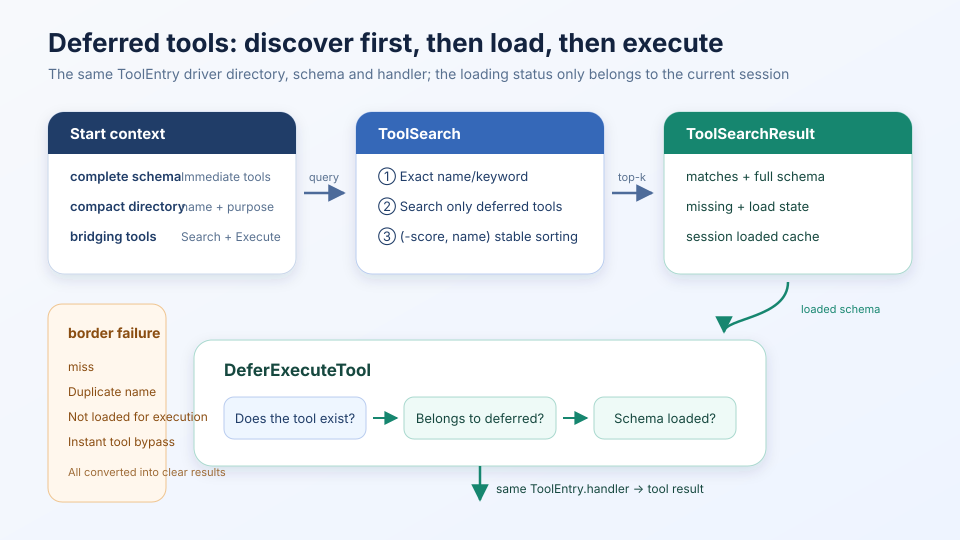
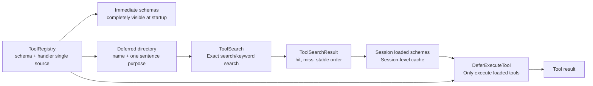

# s03: Deferred Tool Loading — Discover first, then load, then execute

[中文](README.md) · [English](README.en.md)
> "Tools list the directory first, and then expand the schema after it is used."
>
> **Harness layer**: Controls which tool contracts are exposed to the model at each round.

---



## Code architecture diagram

S02 solves the problem of "tool definition and execution cannot be separated": schema, handler and dispatch are managed by the same registry. S03 did not recreate a second set of registries, but added a **visibility policy** on top of the same tool definition:

- High frequency, short schema tools are fully visible from the first round;
- Low-frequency, long schema tools only appear in the compact directory when started;
- After `ToolSearch` hits, the complete schema enters this session;
- `DeferExecuteTool` only allows execution of defer tools that have been discovered and loaded.

This is a clean-room teaching implementation. It illustrates the necessary data flow for deferred tools and does not rely on a product's private fields, fixed number of tools, or internal index implementation.

## Why does the model not see all input_schema at the beginning?

Standard tool calling usually sends the `name`, `description`, and `input_schema` of each tool to the model. When there are few tools, this is the simplest and most reliable solution; when the tool directory becomes larger, the full schema will continue to occupy the context, and most tools will not be called at all in the current task.

Therefore, S03 separates "knowing that you have this ability" and "knowing how to call this ability":

| Stages | What the model sees | What it can do |
|---|---|---|
| Startup | Complete schema of instant tools; name and brief description of delayed tools | Determine what type of capabilities need to be searched |
| Discovery | The small number of complete schemas returned by `ToolSearch` | Understanding the parameter contract of hit tools |
| Execution | `DeferExecuteTool` general entrance | Submit parameters according to loaded contract |

Catalogs are not a replacement for schema. It is only responsible for recalling candidate tools; the model must still see the complete `input_schema` before actual execution.

## Design invariants

### 1. There is only one copy of the tool definition
```python
registry.register(
    "image_gen",
    schema=IMAGE_GEN_SCHEMA,
    handler=mock_image_gen,
    defer=True,
)
```
`ToolEntry` also holds the directory description, complete schema, handler and loading strategy. Search results and execution entries are parsed from this definition to avoid "the directory says there are tools, but the execution mapping does not" or "the schema has been updated, but the handler still runs according to the old parameters".

It will also reject when registering:

- empty name;
- Duplicate names;
- The registered name is inconsistent with the schema name;
- Input schema of type other than object.

These problems are exposed during the startup phase and are easier to locate than failing when the model is called.

### 2. The loaded state belongs to the session
```python
self._loaded_schemas: dict[str, dict[str, Any]] = {}
```
The registry describes "what tools the system has", and the loaded cache describes "what schema the current session has shown to the model". The two cannot be confused. The first search returns `load_state=loaded`, and a second search in the same session returns `load_state=cached`, but the second tool definition is not created.

### 3. Search results must be explainable and reproducible

`ToolSearchResult` also logs:

- `matches`: hit name, score, complete schema, loading status;
- `missing`: The exact name is not hit or the query has no results;
- Stable order: first by descending score, then by name in ascending order to break ties.

Explicit secondary ordering is important. If the bisection result depends on the dictionary or registration order, the same input may load different tools in different builds, and the regression trace will also produce meaningless jitter.

The keyword scorers for this chapter are deliberately kept short and readable: precise names are the highest, followed by name tokens and description tokens. Production systems can be switched to BM25, vector retrieval, or hybrid recall, but should still retain the same result contract and stable ordering.

### 4. It is found that it is a precondition for execution
```python
output = handle_defer_execute(
    registry,
    toolName="image_gen",
    params={"prompt": "a cat sitting on a desk"},
)
```
If `image_gen` has not yet entered the loaded cache, the executor returns an observable error and prompts to call `ToolSearch` first. It will also not accept real-time tools: real-time tools should use the direct dispatch of S02 and cannot bypass the original boundaries through universal delay entry.

Loading here only means "the schema has entered the session context" and does not mean downloading code, installing plug-ins, or bypassing permission checks.

## Main code process

### Path A: Discovered by exact name
```text
Model: ToolSearch(tool_names=["image_gen"])
  -> ToolRegistry.load_by_name()
  -> Confirm it is a deferred tool
  -> schema is written to session loaded cache
  -> ToolSearchResult(matches=[...], missing=[])
  -> Complete input_schema is returned to the model
```
The precise list will preserve the caller order while collapsing duplicate names in the same request to avoid duplicate schemas entering the same tool result.

### Path B: Search by purpose
```text
Model: ToolSearch(queries=["image generation"], top_k=3)
  -> Standardized query terms
  -> only rate deferred tools
  -> (-score, name) stable sorting
  -> Only load top_k hitting schema
  -> Return an interpretable ToolSearchResult
```
Misses do not throw an exception and do not change the loaded cache; the result will explicitly tell the model which name or query does not have a corresponding defer tool.

### Path C: Execute loaded tools
```text
Model: DeferExecuteTool(toolName="image_gen", params={...})
  -> Does the tool exist?
  -> Is it a deferred tool?
  -> Has the schema been loaded in this session?
  -> Get handler from the same ToolEntry
  -> Execute and write success/failure as tool result
```
Handler exceptions will be converted into observations visible to the model, preventing a tool from directly tearing down the agent loop if it fails. The complete JSON Schema validation of parameters has been explained in S02. This chapter focuses on visibility and loading status, without repeatedly expanding the validator implementation.

## Why keep the ToolSearch + DeferExecuteTool two steps?

There are two common progressive solutions for harness production:

1. After searching, directly add the hit tool to the provider’s `tools` list in the next round;
2. After searching, call the hit tool through a common execution entry.

This chapter chooses the second option because it enables direct observation of the complete state machine in an offline, single-file demo, and does not depend on whether a specific provider supports modifying the tool set on the fly. The two solutions share the core principle: **The accurate schema must be obtained before the model is executed, and harness only exposes a small amount of schema required for the current task. **

## Correct pronunciation of Token estimate

`code.py` uses `len(json) // 4` for teaching estimation, which will be output at the same time when running:

- The estimated cost of fully loading all schemas;
- Estimated cost of instant schema + deferred catalog at startup;
- The increment actually loaded by `ToolSearch` for this session;
- The estimated difference between the final load and the full load.

These numbers are only used to compare the two loading strategies in this demo. They are not actual tokenizer measurements and should not be extrapolated into fixed savings ratios for any real product. The actual benefit depends on the provider serialization method, the number of tools, the schema length, the caching strategy and the actual number of hits per session.

## Failure path

| Scenario | Harness Behavior | Design Reasons |
|---|---|---|
| The exact name does not exist | Writing `missing` activates no tools | Allows the model to rewrite the query |
| No keyword hits | Return a clear empty result | The empty result is data, not an exception |
| Duplicate registration name | Throw `ValueError` on startup | Prevent directory and execution ambiguity |
| Divide results | Stable sorting by name | Keep tests and traces reproducible |
| Execute directly without searching | Reject and prompt to search first | Ensure that the model looks at the parameter contract first |
| Delay entry to call instant tool | Reject and prompt direct call | Retain S02 dispatch boundary |
| handler throws exception | convert to tool error text | save agent loop |

## Run
```sh
python3 s03_deferred_loading/code.py
```
No API key is required. By default, the mock conversation will be executed in this order:

1. `ToolSearch(tool_names=["image_gen"])`;
2. Return and cache the complete schema of `image_gen`;
3. `DeferExecuteTool(toolName="image_gen", params=...)`;
4. Mock handler returns the image path;
5. Output the schema cost statistics of this session.

You can also enter interactive mode:
```sh
python3 s03_deferred_loading/code.py --interactive
```
```text
tools
search image
schema image_gen
run image_gen {"prompt":"a cat at a desk","size":"1024x1024"}
q
```
## Test coverage
```sh
python3 -m pytest -q tests/test_s03_deferred_loading.py
```
Behavioral testing anchors the five most important covenants of this chapter:

1. Duplicate names cannot be registered;
2. Misses will not pollute the loaded cache;
3. The order of bisection search results is stable;
4. Delay tools must be discovered first and then executed;
5. Immediate tools cannot be bypassed by delayed actuators.

## Practice

1. Add synonym mapping to scorer, but maintain stable sorting by name under the same score.
2. Add `query_id` to `ToolSearchResult` and observe how one discovery in multiple rounds of traces corresponds to subsequent execution.
3. Move the session loaded cache to an independent `ToolVisibility` object and compare the life cycle of "global registry + multi-session state".
4. Replace the keyword scorer with offline BM25 while allowing the existing five behavioral tests to continue to pass.

---

Previous lesson: [s02 Tool Dispatch](../s02_tool_dispatch/) — One registry unifies schema, validation and execution

Next lesson: [s04 Permission & Hooks](../s04_permission_hooks/) — After the tool can be called, first make permissions and life cycle boundaries
