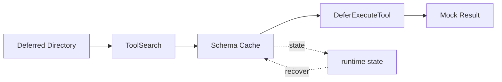

# s03: Deferred Tool Loading — 工具先列目录, schema 用到再展开

> *"工具先列目录, schema 用到再展开"* — ToolSearch → DeferExecuteTool 两步模式。
>
> **Harness 层**: 上下文管理 — 工具的懒加载。

---


## 代码架构图



## 学习前置知识

- 工具越多, schema 越长, 启动上下文越贵。
- 搜索工具和执行工具可以拆成两步: 先发现, 再展开完整 schema。
- 延迟加载是上下文工程, 不是性能小优化。

## 本章抓住的 WorkBuddy-style 机制

- 用 ToolSearch 暴露工具目录, 用 DeferExecuteTool 执行被选中的工具。
- 把低频、复杂、依赖外部状态的工具延迟加载。
- 用 fuzzy search 演示“模型先找工具再调用工具”。

## 常见误区

- 把所有 MCP、Skills、内置工具一次性塞进 prompt, 会让模型注意力变散。
- 只给工具名不给描述, 模型不知道什么时候该展开。
- 延迟加载工具缺少权限检查, 会把风险推迟而不是消除。
## 问题

s02 解决了"怎么管多个工具"——一个 dispatch map 搞定。但新问题来了：**工具太多，schema 太胖**。

WorkBuddy 有 数十个内置工具，加上 MCP 连接器动态发现的工具，轻松突破 60 个。每个工具的 JSON schema（name + description + input_schema）大约 500-2000 tokens。算一笔账：

```
40 个工具 × 平均 1000 tokens/schema = 40,000 tokens
```

40,000 tokens 只用来告诉模型"你有哪些工具"。200K 上下文窗口的 20%，还没开始干活就没了。这还没算 MCP 连接器工具——接入 5 个连接器，可能再加 30,000 tokens。

问题本质：**工具 schema 是静态膨胀的，但每次对话只用到其中 3-5 个**。就像把整本字典背到脑子里才能说一句话。

---

## 解决方案

```
                    ┌──────────────────────────────────┐
                    │        Context Window            │
                    │                                  │
   全量加载          │  [工具1 schema] [工具2 schema]    │
   (s02 方式)        │  [工具3 schema] ... [工具40]     │  ← 40,000 tokens
                    │  [用户对话...]                    │
                    └──────────────────────────────────┘

                    ┌──────────────────────────────────┐
                    │        Context Window            │
                    │                                  │
   延迟加载          │  [工具名+简介 ×40]  ← 2,000 tokens│
   (s04 方式)        │  [用户对话...]                    │
                    │  [ToolSearch 结果] ← 按需注入     │  ← 省了 38,000 tokens
                    │  [DeferExecuteTool 结果]         │
                    └──────────────────────────────────┘
```

两步模式：

| 步骤 | 工具 | 作用 | 何时调用 |
|------|------|------|---------|
| Step 1 | `ToolSearch` | 按名称/关键词搜索，返回完整 schema | 模型不确定工具参数时 |
| Step 2 | `DeferExecuteTool` | 用加载到的 schema 执行工具 | schema 到手后 |

模型先翻目录（ToolSearch），找到工具的完整说明，再动手（DeferExecuteTool）。没翻到的工具，模型只知道名字和一句话简介——足够判断"要不要翻"，不够直接调用。

---

## 工作原理

### ToolSearch: 工具发现

`ToolSearch` 本身是一个**即时加载工具**——它的 schema 始终在上下文里。模型随时可以调用它。

```python
# Model calls ToolSearch to get the full schema
ToolSearch(tool_names=["ImageGen"])
# Returns:
# {
#   "name": "ImageGen",
#   "description": "Generate images from text descriptions using AI models.",
#   "input_schema": {
#     "type": "object",
#     "properties": {
#       "prompt": {"type": "string", "description": "Image description"},
#       "size": {"type": "string", "enum": ["1024x1024", "1792x1024"]}
#     },
#     "required": ["prompt"]
#   }
# }
```

支持两种查找方式：

- **精确查找**：`tool_names=["ImageGen", "ImageEdit"]` — 知道名字，直接取
- **模糊搜索**：`queries=["image generation"]` — 只知道用途，按关键词搜

### DeferExecuteTool: 工具执行

拿到 schema 后，模型知道这个工具要什么参数，构造调用：

```python
# Model calls DeferExecuteTool with the now-known schema
DeferExecuteTool(toolName="ImageGen", params={"prompt": "a sunset over mountains"})
# Returns: tool execution result
```

`DeferExecuteTool` 是一个通用执行器——它不关心工具具体是什么，只负责把参数转发给对应的 handler。这和 s02 的 dispatch map 一样，只是多了一层间接。

### 延迟加载工具清单

下面是一组适合标记为 `deferLoading: true` 的低频或大 schema 工具，schema 不在启动时加载：

| 工具 | 用途 | 为什么延迟 |
|------|------|-----------|
| `NotebookEdit` | 编辑 Jupyter notebook | 低频使用，schema 含复杂 cell 结构 |
| `ListMcpResources` | 列出 MCP 资源 | 依赖连接器状态，非通用 |
| `ReadMcpResource` | 读取 MCP 资源 | 依赖连接器状态，非通用 |
| `EnterPlanMode` | 进入计划模式 | 低频，状态切换工具 |
| `ExitPlanMode` | 退出计划模式 | 低频，状态切换工具 |
| `TaskStop` | 停止后台任务 | 低频，仅在有后台任务时相关 |
| `LSP` | 语言服务器协议交互 | schema 庞大，含多种请求类型 |
| `ImageGen` | AI 文生图 | 参数多（prompt/size/style/seed...） |
| `ImageEdit` | AI 图片编辑 | 参数多，schema 复杂 |
| `ComputerUse` | 桌面操作（鼠标/键盘） | schema 极长，含多种 action 类型 |
| `EnterWorktree` | 进入 git worktree | 低频，开发流程工具 |
| `LeaveWorktree` | 离开 git worktree | 低频，开发流程工具 |
| `CronCreate` | 创建定时任务 | 参数多（rrule/schedule/prompt） |
| `CronDelete` | 删除定时任务 | 低频 |
| `CronList` | 列出定时任务 | 低频 |
| `connect_cloud_service` | 连接云服务 | 低频，仅在特定 skill 场景触发 |

共同特征：**低频 或 schema 膨胀**。高频小工具（Read/Write/Edit/Bash/Glob/Grep）始终即时加载。

### 与即时加载工具的对比

```
即时加载 (Immediate)              延迟加载 (Deferred)
─────────────────────             ──────────────────────
启动时: schema 注入上下文          启动时: 只有名字+一句话简介
模型: 直接调用                     模型: ToolSearch → DeferExecuteTool
延迟: 0 次额外往返                 延迟: 1 次额外往返
成本: 始终占用 token               成本: 用到才花 token
适合: 高频、小 schema              适合: 低频、大 schema
```

WorkBuddy 的默认配置：

```
即时加载 (始终在上下文):           延迟加载 (用到再展开):
  Read, Write, Edit, Bash           ImageGen, ImageEdit, ComputerUse
  Glob, Grep, TaskCreate            NotebookEdit, LSP
  TaskUpdate, TaskGet, TaskList     EnterPlanMode, ExitPlanMode
  ToolSearch, DeferExecuteTool      CronCreate, CronDelete, CronList
  WebSearch, WebFetch               EnterWorktree, LeaveWorktree
  Read (file), Bash, ...            ListMcpResources, ReadMcpResource
                                   TaskStop, connect_cloud_service
```

`ToolSearch` 和 `DeferExecuteTool` 本身是即时加载的——它们是通往延迟工具的桥梁。

---

## OS 类比: 动态链接

这个模式和操作系统的动态链接完全同构：

```
静态链接 (Static Linking)          动态链接 (Dynamic Linking)
─────────────────────────          ──────────────────────────
编译时: 所有库代码打包进二进制      编译时: 只记录符号表 (名字)
启动时: 全部加载到内存              启动时: 快，只加载主程序
内存: 始终占用，即使用不到          内存: 用到时 dlopen() 加载
优点: 无加载延迟                   优点: 启动快，内存省
缺点: 二进制大，启动慢             缺点: 首次调用有一次 dlopen 开销
```

| OS 概念 | WorkBuddy 对应 |
|---------|---------------|
| 二进制文件 | 发给模型的 tools 列表 |
| 库代码 | 工具 schema |
| 符号表 | 工具名 + 一句话简介 |
| `dlopen()` | `ToolSearch` |
| 函数调用 | `DeferExecuteTool` |
| 共享库 `.so`/`.dylib` | 延迟加载工具 |

工具 schema 就是"库代码"。s02 是静态链接——所有库打包进去。s04 是动态链接——只带符号表，`dlopen` 按需加载。

---

## WorkBuddy 架构对照

> 以下是教学版对桌面 agent harness 可观察行为的 clean-room 对照。

### deferLoading 标记

WorkBuddy 的工具定义中有一个 `deferLoading` 字段：

```javascript
// Simplified from agent bridge tool assembly
const toolDef = {
  name: "ImageGen",
  description: "Generate images from text descriptions using AI models.",
  deferLoading: true,   // ← this flag controls lazy loading
  input_schema: { /* ... large schema ... */ },
  handler: imageGenHandler,
}
```

工具池组装时，`deferLoading: true` 的工具被放入延迟列表，只有名字和简短描述进入初始 tools 数组：

```javascript
// Pseudocode from tool pool assembly
function assembleTools(allTools) {
  const immediate = allTools.filter(t => !t.deferLoading)
  const deferred  = allTools.filter(t =>  t.deferLoading)

  // Send full schemas for immediate tools
  const toolsForModel = immediate.map(t => ({
    name: t.name,
    description: t.description,
    input_schema: t.input_schema,
  }))

  // For deferred tools, only include a summary line
  // The model sees them via the system prompt's tool directory
  // and uses ToolSearch to get full schema on demand
  return { toolsForModel, deferredToolNames: deferred.map(t => t.name) }
}
```

### ToolSearch 的实现

`ToolSearch` 支持两种查找模式，返回匹配工具的完整 schema：

```javascript
// Pseudocode
function handleToolSearch(params) {
  const { tool_names, queries, top_k = 3 } = params

  if (tool_names) {
    // Exact lookup by name
    return tool_names.map(name => ({
      name,
      description: deferredTools[name].description,
      input_schema: deferredTools[name].input_schema,
    }))
  }

  if (queries) {
    // Fuzzy search using MiniSearch engine
    return miniSearch.search(queries).slice(0, top_k)
  }
}
```

### Token 节省（教学估算）

教学估算的 token 对比（按分析稿口径推算的近似值，非某个版本的实测）：

```
全量加载:  ~42,000 tokens (40 工具 × avg 1050 tokens)
延迟加载:  ~3,500 tokens  (24 即时工具 + 16 延迟工具名)
节省:      ~38,500 tokens (92% 减少)
```

一次 ToolSearch 往返大约消耗 800-1500 tokens（请求 + 返回 schema）。只要每次会话调用的延迟工具不超过 ~25 个，就比全量加载划算。实际场景中，单次会话通常只用到 1-3 个延迟工具。

---

## 代码 walkthrough

`code.py` 实现了一个完整的延迟加载 demo：

**1. ToolRegistry 类** — 统一管理即时和延迟工具：

```python
registry = ToolRegistry()
registry.register("read_file", schema, handler, defer=False)   # 即时
registry.register("image_gen", schema, handler, defer=True)    # 延迟
```

**2. 启动时只注入即时工具 schema + 延迟工具目录**：

```python
# What the model sees at startup:
tools_for_model = registry.get_immediate_schemas()
# → [read_file schema, write_file schema, bash schema, ...]

deferred_directory = registry.get_deferred_directory()
# → "image_gen: Generate images from text\nnotebook_edit: Edit Jupyter cells\n..."
```

**3. ToolSearch handler** — 按名查找，返回完整 schema：

```python
def handle_tool_search(tool_names=None, queries=None):
    if tool_names:
        return registry.load_deferred_schema(tool_names)
    # ... fuzzy search
```

**4. DeferExecuteTool handler** — 通用执行器：

```python
def handle_defer_execute(toolName, params):
    handler = registry.get_handler(toolName)
    return handler(**params)
```

**5. Token 估算** — 实时显示节省量：

```python
immediate_tokens = estimate_tokens(immediate_schemas)
deferred_tokens  = estimate_tokens(deferred_directory)
full_tokens      = estimate_tokens(all_schemas)
saved = full_tokens - immediate_tokens - deferred_tokens
```

**6. Mock LLM** — 预设响应模拟两步调用：

```python
mock_responses = [
  {"tool": "ToolSearch", "input": {"tool_names": ["image_gen"]}},
  {"tool": "DeferExecuteTool", "input": {"toolName": "image_gen", "params": {...}}},
  {"text": "图像已生成！"},
]
```

---

## 运行

```sh
python s03_deferred_loading/code.py
```

不需要 API key — 使用 mock LLM。你会看到：

1. **启动统计** — 即时工具 vs 延迟工具的 token 对比
2. **两步调用日志** — ToolSearch 加载 schema，DeferExecuteTool 执行
3. **节省汇总** — 本次会话省了多少 token

预期输出（摘要）：

```
=== Tool Registry Summary ===
Immediate tools (6): read_file, write_file, bash, glob, ToolSearch, DeferExecuteTool
Deferred tools (8): image_gen, image_edit, notebook_edit, lsp, computer_use, ...

Token estimation:
  Full loading:     ~12,400 tokens
  Deferred loading:  ~2,100 tokens (immediate + directory)
  Saved:            ~10,300 tokens (83% reduction)

=== Agent Loop (mock LLM) ===
[Turn 1] Model calls: ToolSearch(tool_names=["image_gen"])
  → Loading deferred schema for: image_gen
  → Schema loaded (320 tokens)

[Turn 2] Model calls: DeferExecuteTool(toolName="image_gen", params={...})
  → Executing: image_gen(prompt="a cat sitting on a desk")
  → Result: [MOCK] Generated image: a_cat_on_desk.png (512x512)

[Turn 3] Model responds with text:
  图像已生成！文件名: a_cat_on_desk.png

=== Session Summary ===
Total tool calls: 2 (1 ToolSearch + 1 DeferExecuteTool)
Extra tokens from deferred loading: ~420
Tokens saved vs full loading: ~9,880
```

---

## 练习

1. **添加延迟工具**：在 `code.py` 中注册一个新延迟工具 `cron_create`，包含完整 schema 和 mock handler。观察 token 变化。

2. **模糊搜索**：当前 `ToolSearch` 只支持 `tool_names` 精确查找。实现 `queries` 参数的模糊搜索（用简单的关键词匹配即可）。

3. **缓存机制**：同一个延迟工具在一次会话中可能被多次调用。给 `ToolRegistry` 加一个 schema 缓存，避免重复 `ToolSearch`。

4. **成本阈值**：如果延迟工具只有 2-3 个且 schema 很小，全量加载可能更划算（省掉了 ToolSearch 往返）。实现一个自动判断：schema 总量 < 2000 tokens 时不延迟。

5. **对比实验**：把所有工具改为即时加载，对比 mock LLM 的往返次数和 token 消耗。什么情况下延迟加载反而更贵？

---

## 下一课

工具能省着调了。但 `rm -rf /` 怎么拦？写工作区外的文件怎么防？谁来决定一个操作能不能做？

s04 Permission Hooks → PreToolUse / PostToolUse / UserPromptSubmit / Stop 四个钩子点。

<details>
<summary>Clean-room 架构对照</summary>

### 工具池的三级来源

WorkBuddy 的工具池不是静态列表，而是运行时动态组装：

```
assemble_tool_pool() = BUILTIN_TOOLS + MCP_TOOLS + SKILL_TOOLS
```

- **BUILTIN_TOOLS**：Read/Write/Edit/Bash/Glob/Grep 等核心工具，固定不变
- **MCP_TOOLS**：MCP 连接器动态发现的工具（`mcp__server__tool` 命名），随连接器状态变化
- **SKILL_TOOLS**：技能系统按需注入的工具，随当前激活的 skill 变化

三级来源的工具都可能有 `deferLoading: true`。MCP 工具尤其适合延迟加载——一个连接器可能注册 20+ 个工具，但大多数会话只用其中 1-2 个。

### MiniSearch 模糊搜索

`ToolSearch` 的 `queries` 模式使用 MiniSearch 全文搜索引擎：

```javascript
// Simplified from WorkBuddy's tool search
const miniSearch = new MiniSearch({
  fields: ['name', 'description'],
  storeFields: ['name', 'description', 'input_schema'],
  searchOptions: {
    prefix: true,      // 前缀匹配
    fuzzy: 0.2,        // 模糊度
    combineWith: 'AND',
  }
})

// Index all deferred tools
deferredTools.forEach(t => miniSearch.add(t))

// Search
const results = miniSearch.search("image generation")
```

这让模型可以用自然语言描述需求（"I need to generate an image"），而不必记住工具的确切名字。

### 教学版的简化

| WorkBuddy | 教学版 |
|-----------|--------|
| MiniSearch 全文搜索 | 简单关键词匹配 |
| 动态 MCP 工具发现 | 静态注册的延迟工具 |
| 流式 ToolSearch 响应 | 同步返回 |
| skill 感知的工具池 | 固定工具集 |
| 运行时 deferLoading 配置 | 编译时标记 |

**一句话**：WorkBuddy 的延迟加载 = 动态链接思想 + MiniSearch 搜索 + dispatch map 执行。教学版用 250 行 Python 还原核心机制。

</details>
