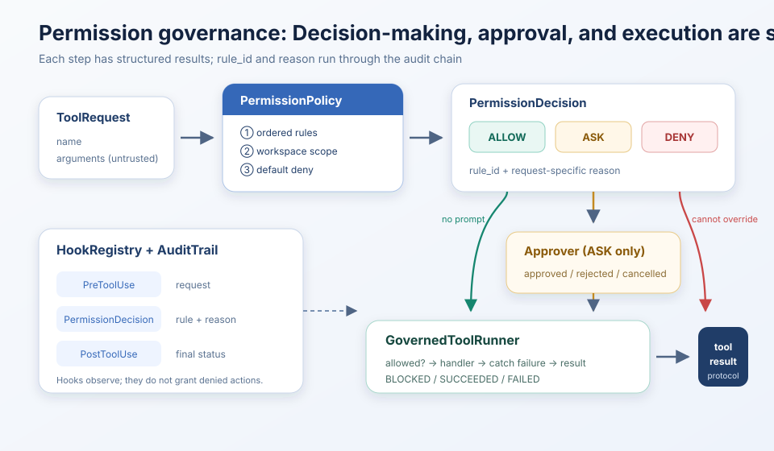
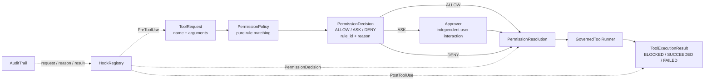

# s04: Permission & Hooks - Decide, Approve, Then Execute

[Chinese](README.md) · [English](README.en.md)
> "Set the boundary first, then grant freedom."
>
> **Harness layer**: turn a model-proposed action into an explainable, approvable, auditable execution result.

---



## Code Architecture Diagram



s03 answers "which tool schemas are visible to the model". s04 answers "after the model selects a tool, will the Harness allow it to cross into local execution?" The key is not to keep adding dangerous words to a list. It is to split governance into three testable stages:

1. `PermissionPolicy.decide()` performs only rule matching and outputs `ALLOW / ASK / DENY`.
2. `resolve_permission()` asks the user only for `ASK`; `ALLOW / DENY` do not trigger interaction.
3. `GovernedToolRunner.run()` decides whether to call the handler and returns a uniform execution result.

Every permission decision carries a stable `rule_id` and a human-facing `reason`. The audit record can therefore answer which rule applied, why it applied, whether the user approved it, and how the tool ended, instead of leaving only a vague "permission denied".

## Why the Three Stages Must Be Separate

Legacy implementations often place rule matching, `input()`, and handler execution in one pre-tool hook. It can run, but creates three problems:

- Rule unit tests must simulate interaction.
- `deny`, user rejection, and handler failure collapse into similar strings.
- The audit trail sees only the final result and cannot reconstruct the decision basis.

This chapter models the three concerns separately:

| Stage | Input | Output | Explicitly does not do |
|---|---|---|---|
| Policy | `ToolRequest` | `PermissionDecision` | Ask the user or execute a tool |
| Approval | `PermissionDecision` | `PermissionResolution` | Re-match rules or call a handler |
| Execution | `PermissionResolution` | `ToolExecutionResult` | Silently change the permission decision |

CLI prompts, desktop dialogs, and automated tests can all reuse the same policy by injecting different `Approver` callbacks.

## Core Data Contracts

### ToolRequest

```python
@dataclass(frozen=True)
class ToolRequest:
    tool_use_id: str
    name: str
    arguments: object
```

A provider tool-use block is normalized into `ToolRequest` before entering governance. `arguments` remains an `object` because model input cannot be assumed to be a dictionary before validation.

### PermissionDecision

```python
@dataclass(frozen=True)
class PermissionDecision:
    request: ToolRequest
    action: PermissionAction
    rule_id: str
    reason: str
```

`action` has only three values:

| Action | Meaning | Next step |
|---|---|---|
| `ALLOW` | An explicit safe rule matched | Allow execution without asking |
| `ASK` | The policy cannot prove that there is no side effect, or the operation requires informed consent | Enter the independent approval layer |
| `DENY` | Explicitly forbidden, out of scope, unsuitable for safe judgment, or not covered by any rule | The approval callback cannot override it |

`rule_id` is a stable machine identifier for metrics and regression assertions. `reason` preserves the explanation for this request and is suitable for UI and audit. Both are needed.

### PermissionResolution

`PermissionResolution` preserves the original decision and adds:

- `allowed`: whether the handler may finally be entered.
- `approval_status`: `not_required / approved / rejected / cancelled`.

Therefore a direct policy rejection and a user rejection after approval are not compressed into the same boolean.

### ToolExecutionResult

The execution stage returns one of these statuses:

| Status | Handler called? | Typical reason |
|---|---:|---|
| `BLOCKED` | No | Policy deny, user rejection, or cancellation |
| `SUCCEEDED` | Yes | Handler returned normally |
| `FAILED` | Maybe | Handler is missing or raised an exception |

`to_protocol_block()` encodes `BLOCKED / FAILED` as an error tool result that the provider can understand. A permission failure becomes agent-loop data instead of exception-based control flow that tears down the loop.

## Ordered Rules and Default Deny

`PermissionPolicy` uses ordered first-match-wins rules:

```text
1. bash.hard_deny                 -> DENY
2. path.outside_workspace        -> DENY
3. path.read_allow               -> ALLOW
4. path.write_requires_approval  -> ASK
5. bash.requires_approval        -> ASK
6. default.deny                  -> DENY (no rule matched)
```

The order is part of the security semantics. A hard deny must come before ordinary bash approval, otherwise `sudo` or recursive force deletion could be incorrectly downgraded to "ask the user". Path escape must also be checked before workspace read/write rules.

### Why Default Deny

```python
return PermissionDecision(
    request,
    PermissionAction.DENY,
    "default.deny",
    f"no permission rule matched tool {request.name!r}",
)
```

When a new handler is added without a permission rule, default allow would silently expand the agent's authority. Default deny exposes the missing rule in a test or at first use. Fail-closed does not mean "reject every action"; it means that every executable action must have an explicit governance path.

## Workspace Path Scope

File tools pass through `WorkspaceScope` before rule matching:

```text
User arguments
-> join the relative path with the workspace root
-> resolve(strict=False)
-> is it still under the workspace root?
-> inside: continue to read/write rule matching
-> outside / resolution error: DENY
```

This covers three common escapes:

- A path traversal such as `../outside/secret.txt`.
- An absolute external path such as `/etc/hosts`.
- A symlink such as `workspace/link/new.txt` whose `link` points outside the workspace.

`strict=False` permits checking a target file that does not yet exist while resolving already-existing parent symlinks. `glob` checks the static path prefix before the first wildcard, so `../outside/*.txt` is rejected before expansion.

This is still only preflight. The path may change between the check and handler use; production systems also need containers, OS sandboxes, restricted file descriptors, or other OS-level isolation to close TOCTOU and indirect-execution risks.

## Bash Allow / Ask / Deny

A command string is not a reliable sandbox language, so this chapter uses a deliberately conservative classification:

- `sudo`, recursive force deletion, formatting, shutdown/restart, and typical `dd` device writes: `DENY`.
- Every other shell request: `ASK`.
- For genuinely automatic reads, use `read_file / glob` protected by `WorkspaceScope`: `ALLOW`.

The first token cannot prove the path or side effects. `cat /etc/passwd` bypasses the file-tool workspace scope, `git diff --no-index` can read arbitrary paths, and a command that appears read-only can create side effects through redirection, pipes, aliases, or scripts. Instead of a misleading "safe shell list", this chapter puts automatic reads in structured file tools.

> String and regular-expression rules are a safety belt, not a sandbox. They cannot fully understand shell ASTs, indirect interpreter calls, races, or system calls. The complete boundary discussion is in [`docs/security-boundaries.md`](../docs/security-boundaries.md).

## Why User Approval Cannot Override DENY

```python
def resolve_permission(decision, approver):
    if decision.action is ALLOW:
        return allowed_without_prompt
    if decision.action is DENY:
        return blocked_without_prompt
    return approved_or_rejected(approver(decision))
```

`Approver` is called only for the `ASK` branch. Hard deny, path escape, invalid input, and default deny do not show a "continue?" prompt, because the prompt would imply that the user has authority to override a system boundary.

The CLI uses `console_approver()`, a desktop app can replace it with a modal dialog, and tests use a lambda. The policy knows none of these UI choices.

## Hook Lifecycle and Audit

Permission is an explicit pipeline; hooks are lifecycle extension points:

| Hook | Payload | Purpose |
|---|---|---|
| `PreToolUse` | `ToolRequest` | Record the original request and metrics |
| `PermissionDecision` | `PermissionResolution` | Record rule, reason, and approval result |
| `PostToolUse` | `ToolExecutionResult` | Record blocked/succeeded/failed and emit alerts |
| `UserPromptSubmit` | User text | Extend input observation or filtering |
| `Stop` | None | Session statistics and cleanup |

The hooks in this chapter do not turn a rejection into an allow. The authorization path stays explicit; extension hooks observe, audit, and perform post-processing so a third-party extension cannot become a hidden privilege-escalation path.

`AuditTrail` retains three types of records for every tool call:

```text
request     tool=write_file
permission tool=write_file rule=path.write_requires_approval
           reason="write_file mutates workspace content..." outcome=approved
result     tool=write_file rule=path.write_requires_approval outcome=succeeded
```

The teaching version uses in-memory records. s23 discusses persistent, tamper-resistant audit chains. s04 focuses on putting "why was this decision made?" into a stable contract.

## Main Flow in the Agent Loop

```python
request = ToolRequest.from_block(block)
result = RUNNER.run(request)
protocol_results.append(result.to_protocol_block())
```

The order inside `GovernedToolRunner` is fixed:

```text
emit PreToolUse
-> policy.decide
-> resolve_permission
-> emit PermissionDecision
-> blocked: do not call the handler
-> allowed: execute the handler and catch exceptions
-> emit PostToolUse
-> return ToolExecutionResult
```

The Agent Loop no longer assembles permission strings or reads approval input directly. It receives a structured result and continues the provider protocol.

## Failure Paths

| Scenario | Decision / Result | Audit value |
|---|---|---|
| Unknown tool | `DENY / BLOCKED`, `default.deny` | Exposes a missing policy rule |
| Arguments are not an object | `DENY / BLOCKED`, `request.invalid_arguments` | Fails closed when safe judgment is impossible |
| Path escape | `DENY / BLOCKED`, `path.outside_workspace` | Records target and scope |
| Workspace write approved | `ASK -> approved -> SUCCEEDED` | Distinguishes policy from user intent |
| Workspace write rejected | `ASK -> rejected -> BLOCKED` | Proves the handler did not run |
| Handler raises | `ALLOW/approved -> FAILED` | Counts separately from permission rejection |
| EOF / Ctrl-C during approval | `ASK -> cancelled -> BLOCKED` | Exits safely by default |

## Run

```sh
python3 s04_permission_hooks/code.py
```

Model configuration is required. The common no-API-key teaching entry point is still available:

```sh
python3 s04_permission_hooks/code.py --demo
```

Try asking the model to:

1. Read a workspace file and observe `path.read_allow`.
2. Write a workspace file and observe the independent approval.
3. Read `../outside.txt` and observe path-scope denial.
4. Run `ls` or `python3 script.py` and observe that bash enters approval by default.
5. Run recursive force deletion and observe a hard deny that cannot be overridden.

## Test Coverage

```sh
python3 -m pytest -q tests/test_permission_gates.py
```

The focused tests pin down these governance contracts:

- A hard deny is always a structured decision with a reason.
- An unmatched tool is denied by default.
- Relative traversal, absolute external paths, and symlink escapes are rejected.
- The policy is pure decision logic and does not secretly prompt the user.
- A shell does not gain automatic permission from its first token; automatic reads use scoped file tools.
- Approval callbacks cannot override deny.
- The audit retains rule, reason, approval outcome, and execution status.
- Blocked and handler-failed states are both encoded as tool results.
- Operating-system exceptions do not tear down the teaching script.

## Interview Questions

**Why not use one `is_allowed: bool`?** Because "allowed without approval", "requires user consent", and "system-level denial that cannot be overridden" are three different governance meanings. A boolean cannot distinguish user rejection from system rejection.

**Why save both `rule_id` and `reason`?** `rule_id` is stable for metrics and tests; `reason` carries request context for UI explanations and incident review.

**Why does a workspace write still require ASK?** Being within the allowed path only proves that the request did not escape. It does not prove that the user consents to the content changing. Scope and consent are separate dimensions.

**Why should a hook not control permission directly?** Hooks are good for observation and lifecycle extension. If any extension can change deny into allow, the source of authorization becomes untraceable. An explicit policy pipeline is easier to audit.

**Why is this not yet a production sandbox?** It lacks shell AST isolation, process/network/system-call isolation, complete argument-schema validation, persistent approval grants, TOCTOU protection, and tamper-resistant audit. It provides a Harness governance contract, not a replacement for OS security boundaries.

---

Previous lesson: [s03 Deferred Tool Loading](../s03_deferred_loading/) - control which tool schemas enter the session

Next lesson: [s05 Electron Shell](../s05_electron_shell/) - put agent capabilities inside an explicit desktop process boundary
