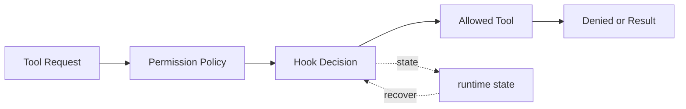

# s04: Permission & Hooks — 先划边界, 再给自由

> *"先划边界, 再给自由"* — 权限三道门 + hooks 扩展点。
>
> **Harness 层**: 权限 — agent 的安全边界。

---


## 代码架构图



## 学习前置知识

- Autonomy 和 control 是一组张力: 越自主越需要边界。
- 权限系统应该分层: 快速拒绝、用户审批、语义评估、审计记录。
- Hook 是扩展点, 不是单纯的 if/else。

## 本章抓住的 WorkBuddy-style 机制

- 把公开架构研究中的分级信任思想落成三道门和 Hook 链。
- 把读、写、危险命令拆成不同审批路径。
- 用 promptHookEvaluator-style 辅助判断解释为什么安全评估可以交给便宜模型。

## 常见误区

- 用危险词黑名单假装安全, 很容易被路径、shell 组合和间接命令绕过。
- 每一步都问用户会让 agent 失去价值。
- Hook 没有审计日志, 事后就无法解释为什么放行或拦截。

> ⚠️ 本章的字符串匹配是"安全带"，不是"沙盒"。它拦得住 `rm -rf`、`sudo` 这类直白写法，拦不住 `find -delete`、`xargs`、脚本间接执行等绕过手段。生产环境必须把隔离下沉到操作系统层（容器 / seccomp / 命名空间）。完整的边界说明见 [`docs/security-boundaries.md`](../docs/security-boundaries.md)，配套回归测试见 `tests/test_permission_gates.py`。
## 问题

s02 的 agent 能读写文件、执行命令。但如果模型决定 `rm -rf /` 呢？如果它想写工作区外的文件呢？如果它想执行一个需要用户确认的操作呢？

没有边界的 agent 是一颗定时炸弹。WorkBuddy 作为桌面应用，直接运行在用户的机器上——必须有一套权限系统来保护用户。

---

## 解决方案

三道门，依次检查：

| 门 | 检查内容 | 拦截方式 |
|----|---------|---------|
| Gate 1: 硬拒绝 | `rm -rf /`, `sudo`, `> /dev/` 等 | 直接阻断 |
| Gate 2: 规则匹配 | 写工作区外? 破坏性命令? | 根据规则决定允许/拒绝/询问 |
| Gate 3: 用户审批 | 不确定是否安全的操作 | 暂停，等用户确认 |

同时引入 hooks 机制——在工具执行前后留扩展点，不改主循环也能加逻辑：

| Hook | 时机 | 用途 |
|------|------|------|
| `PreToolUse` | 工具执行前 | 权限检查、日志、审计 |
| `PostToolUse` | 工具执行后 | 输出告警、后处理 |
| `UserPromptSubmit` | 用户输入时 | 输入过滤、注入 |
| `Stop` | 循环结束时 | 统计、清理 |

---

## 工作原理

### 权限检查函数

```python
def check_permission(tool_name: str, tool_input: dict) -> str:
    """Returns 'allow', 'deny', or 'ask'."""
    
    # Gate 1: Hard deny list
    if tool_name == "bash":
        cmd = tool_input.get("command", "")
        for pattern in HARD_DENY:
            if pattern in cmd:
                return f"deny: blocked pattern '{pattern}'"
    
    # Gate 2: Rule matching
    for rule in PERMISSION_RULES:
        result = rule.check(tool_name, tool_input)
        if result in ("deny", "ask"):
            return result
    
    # Gate 3: Ask user for uncertain operations
    if tool_name in DESTRUCTIVE_TOOLS:
        return "ask"
    
    return "allow"
```

### 规则系统

```python
class PermissionRule:
    def __init__(self, name, tool, pattern, action):
        self.name = name
        self.tool = tool
        self.pattern = pattern
        self.action = action  # "allow" | "deny" | "ask"
    
    def check(self, tool_name, tool_input):
        if tool_name != self.tool:
            return "allow"
        # Check if pattern matches tool input
        import re
        text = json.dumps(tool_input)
        if re.search(self.pattern, text):
            return self.action
        return "allow"

PERMISSION_RULES = [
    PermissionRule("no-rm-rf", "bash", r"rm\s+-rf", "deny"),
    PermissionRule("no-write-root", "write_file", r'"path"\s*:\s*"/', "deny"),
    PermissionRule("ask-large-write", "write_file", r'"content"\s*:\s*".{1000,}', "ask"),
]
```

### Hooks 系统

```python
HOOKS = {
    "PreToolUse": [permission_hook, audit_hook],
    "PostToolUse": [output_size_hook],
    "UserPromptSubmit": [input_log_hook],
    "Stop": [stats_hook],
}

def trigger_hooks(event: str, *args) -> str | None:
    """Run all hooks for an event. Return blocking message if any hook blocks."""
    for hook in HOOKS.get(event, []):
        result = hook(*args)
        if result and result.startswith("block:"):
            return result
    return None
```

### 在循环中的位置

循环只加两行——工具执行前后触发 hooks：

```python
# PreToolUse hook (includes permission check)
blocked = trigger_hooks("PreToolUse", block)
if blocked:
    results.append({"type": "tool_result", "tool_use_id": block.id, "content": blocked})
    continue

# Execute tool
output = handler(**block.input)

# PostToolUse hook
trigger_hooks("PostToolUse", block, output)
```

---

## 六层架构上下文

WorkBuddy 采用六层架构，安全治理是最底层也是最终的防线。每层解决一个核心矛盾：

```
六层架构 (层层递进，每层解决一个核心矛盾):

┌─────────────────────────────────────────┐
│  Layer 1: 用户界面 (User Interface)       │  矛盾: 功能丰富 vs 简单易用
├─────────────────────────────────────────┤
│  Layer 2: Agent 推理 (Agent Reasoning)    │  矛盾: 自主决策 vs 可控
├─────────────────────────────────────────┤
│  Layer 3: 工具执行 (Tool Execution)        │  矛盾: 能力强大 vs 安全边界
├─────────────────────────────────────────┤
│  Layer 4: 扩展系统 (Extension System)      │  矛盾: 开放生态 vs 信任管理
│  (Skills + MCP + Experts + Hooks)         │
├─────────────────────────────────────────┤
│  Layer 5: 记忆系统 (Memory System)         │  矛盾: 记住一切 vs 隐私保护
│  (三层记忆: 云端/用户级/工作区)              │
├─────────────────────────────────────────┤
│  Layer 6: 安全治理 (Security Governance)   │  矛盾: 自主执行 vs 危险操作
│  (沙盒 + 权限 + Hook + 文件安全)            │
└─────────────────────────────────────────┘
```

本课聚焦 Layer 6——安全治理层。前三层的矛盾在 s01-s02 已展开，这一层回答：**agent 有了能力之后，如何不被它伤害？**

---

## 分级信任模型 (Tiered Trust)

核心洞察：**不是"要么自动要么手动"，而是分级信任。**

```
信任层级:

  完全自动化 ◄─────────────────► 完全手动
  (失控风险)                      (失去Agent价值)

  WorkBuddy 的位置:
  ──────┬───────────┬───────────┬──────────
  读操作  写操作       危险操作      系统操作
  自动    审批         人工确认      禁止
  (safe) (caution)    (destructive) (blocked)
```

四个信任层级：

| 层级 | 操作类型 | 示例 | 处理方式 |
|------|---------|------|---------|
| SAFE | 读操作 | Read, Glob, Grep, WebSearch | 自动执行，无需确认 |
| CAUTION | 写操作 | Write, Edit | 需要权限检查，可能自动或审批 |
| DESTRUCTIVE | 危险操作 | rm, 格式化, 批量删除 | 必须人工确认，列出所有影响 |
| BLOCKED | 系统操作 | rm -rf /, 删系统文件 | 直接拒绝，不可覆盖 |

教学版的三道门（Gate 1/2/3）对应这四个层级的简化版：Gate 1 = BLOCKED，Gate 2 = CAUTION/DESTRUCTIVE 的规则匹配，Gate 3 = DESTRUCTIVE 的用户审批。SAFE 层在教学版中默认放行，WorkBuddy 则通过沙盒进一步约束。

---

## 四重安全防线

WorkBuddy 的 Layer 6 不是单一机制，而是四重防线协同：

```
┌─────────────────────────────────────────────┐
│          安全控制四重防线                      │
├─────────────────────────────────────────────┤
│                                              │
│  1. 沙盒隔离 (Sandbox Isolation)              │
│     ├─ macOS: FileProvider + NetworkExtension │
│     ├─ sandbox-exec (4处引用 in CLI bundle)  │
│     ├─ sandbox-config.json: 路径/网络/环境变量  │
│     └─ 创造"安全沙箱"，沙箱内完全自主            │
│                                              │
│  2. 权限审批 (Permission Approval)             │
│     ├─ mcp-approvals.json: MCP工具审批记录      │
│     ├─ 读操作: 自动通过                        │
│     ├─ 写操作: 需要审批                        │
│     └─ 跨边界操作: 必须许可                     │
│                                              │
│  3. Hook 评估 (Hook Evaluation)               │
│     ├─ promptHookEvaluator Agent (lite模型)    │
│     ├─ 在执行前评估操作安全性                    │
│     ├─ 可以阻止、修改或放行操作                  │
│     └─ 用户可自定义 Hook 规则                   │
│                                              │
│  4. 个人文件安全策略 (Personal File Safety)     │
│     ├─ Desktop/Downloads/Documents/Home = 高危  │
│     ├─ 扫描 = 只读 (生成报告，不操作)            │
│     ├─ 模糊请求 = 先问清楚                      │
│     ├─ 警告+列表+确认 三步法则                   │
│     ├─ 先备份再操作                            │
│     ├─ 用回收站，不用 rm                        │
│     └─ 每批最多10个文件                        │
│                                              │
└─────────────────────────────────────────────┘
```

**本质**：用沙盒创造"安全沙箱"，在沙箱内完全自主，跨边界时才需要许可。这不是"要么自动要么手动"——而是分级信任。

教学版只实现了第 2 重（权限审批）和第 3 重（Hook 评估）的简化版。第 1 重（沙盒）和第 4 重（文件安全策略）在 WorkBuddy 完整实现，本课的 `<details>` 部分有架构对照。

---

## promptHookEvaluator Agent

第 3 重防线中的 Hook 评估可以由一个专门的内置 Agent 完成——这里把它称为 `promptHookEvaluator`。它属于产品里的内部辅助 Agent：

| 属性 | 值 |
|------|-----|
| 名称 | `promptHookEvaluator` |
| 模型 | `lite`（廉价模型，适合安全评估） |
| 工具数 | 0（只评估，不执行） |
| 分类 | `INTERNAL_GENERATOR_AGENTS`（无 SendMessage） |
| 职责 | 在执行前评估操作安全性 |

关键设计：**用最便宜的模型做安全判断**。`lite` 模型成本低、速度快，足以判断"这个操作是否危险"。如果判断危险，再交给主模型或用户处理。这比用主模型做每次安全检查高效得多。

教学版的 `trigger_hooks` 函数是它的简化原型——在工具执行前运行检查，返回 `block:` 前缀则拦截。WorkBuddy 中，这个角色由 `promptHookEvaluator` Agent 承担，能力更强：不仅能阻止，还能修改或附加条件后放行。

完整的评估管线是一条两阶段流水线——先走本地正则快判，未决定的再交给 lite 模型做语义评估：

```
用户输入 / 工具调用
       │
       ▼
┌──────────────────────┐
│  hooks.json 规则匹配  │ ── 快速正则匹配
│  (本地, 即时)         │
└──────┬───────────────┘
       │ 未决定
       ▼
┌──────────────────────┐
│  promptHookEvaluator │ ── lite 模型语义评估
│  (lite, ~200ms)      │
└──────┬───────────────┘
       │
       ├── allow ──▶ 执行
       ├── deny  ──▶ 拦截, 返回原因
       ├── ask   ──▶ 暂停, 等用户确认
       └── modify──▶ 修改参数后执行
```

两阶段评估的核心优势是**成本效率**：绝大多数操作（读文件、搜索、常规写入）由 `hooks.json` 的正则规则在 <1ms 内决定，只有规则无法判定的模糊情况才调用 lite 模型（~200ms、~$0.0001/次）。这意味着 1000 次工具调用中，可能只有 50 次需要 lite 模型介入，其余 950 次在本地即时放行或拦截。

---

## user-prompt-submit-hook 机制

前文提到的四类 hook 中，`UserPromptSubmit` 比较特殊——它不在工具执行前后触发，而是在**用户提交 prompt、prompt 进入 agent 循环之前**触发。WorkBuddy 通过 `<user-prompt-submit-hook>` 标签机制实现这一流程。

工作原理：

1. 用户在输入框提交 prompt
2. `UserPromptSubmit` hooks 先于 agent 循环执行
3. Hook 可以 **modify**（修改输入）、**block**（拦截输入）、或 **augment**（附加上下文）
4. 处理后的 prompt 才进入 agent 循环

关键约定：**Hook 的反馈被视为来自用户**。系统提示中明确要求："Treat feedback from hooks, including `<user-prompt-submit-hook>`, as coming from the user"。这意味着如果 hook 拦截了某个操作，assistant 应先检查能否调整自身行为来合规；如果无法调整，则提示用户检查 hooks 配置。

典型用例：

| 用例 | 说明 |
|------|------|
| 输入净化 | 过滤 prompt 中的敏感信息（密码、密钥） |
| 自动注入上下文 | 检测到用户提到某个文件，自动注入文件内容 |
| 拦截特定话题 | 阻止用户讨论不安全或不合规的内容 |
| 附件预处理 | 用户粘贴图片/文件时，先提取文本再送入循环 |

教学版的实现——在 `trigger_hooks` 基础上增加 modify 语义：

```python
def trigger_user_prompt_hook(user_input: str) -> str | None:
    """Run UserPromptSubmit hooks. Return modified input or block message."""
    for hook in HOOKS.get("UserPromptSubmit", []):
        result = hook(user_input)
        if result and result.startswith("block:"):
            return result  # Block the prompt
        if result and result.startswith("modify:"):
            user_input = result[7:]  # Modify the prompt
    return user_input
```

返回值有三种情况：
- `None` 或原输入——hook 未修改，正常进入循环
- `modify:新内容`——用新内容替换原输入
- `block:原因`——拦截，不进入循环，返回原因给用户

---

## hooks.json 配置格式

教学版用 Python 列表硬编码规则（`PERMISSION_RULES`），WorkBuddy 则用声明式配置文件 `hooks.json` 定义 hook 规则——策略与实现分离，用户改规则不需要改代码。

配置结构：每条规则指定 `type`（hook 类型）、`matcher`（匹配条件）、`action`（执行动作）和 `message`（提示信息）。

```json
{
    "hooks": [
        {
            "type": "PreToolUse",
            "matcher": {
                "tool": "bash",
                "pattern": "rm\\s+-rf"
            },
            "action": "deny",
            "message": "Destructive command blocked"
        },
        {
            "type": "PreToolUse",
            "matcher": {
                "tool": "write_file",
                "path_pattern": "^/etc/"
            },
            "action": "deny",
            "message": "System directory protected"
        },
        {
            "type": "UserPromptSubmit",
            "matcher": {
                "pattern": "(?i)(password|secret|token)"
            },
            "action": "warn",
            "message": "Input contains sensitive keywords"
        },
        {
            "type": "PostToolUse",
            "matcher": {
                "tool": "bash",
                "output_size": 50000
            },
            "action": "externalize",
            "message": "Large output externalized"
        }
    ]
}
```

四条规则分别覆盖四个场景：

| 规则 | 类型 | 匹配 | 动作 | 说明 |
|------|------|------|------|------|
| 危险命令 | PreToolUse | bash + `rm -rf` | deny | Gate 1 的配置化版本 |
| 系统目录保护 | PreToolUse | write_file + `/etc/` | deny | 防止写系统路径 |
| 敏感词警告 | UserPromptSubmit | 正则匹配密码/密钥/token | warn | 输入侧防护 |
| 大输出外化 | PostToolUse | bash + >50KB | externalize | 避免撑爆上下文窗口 |

配置驱动的好处：**策略与实现分离**。安全团队可以独立更新 `hooks.json` 而不动代码；不同项目可以有不同的规则集（如生产环境比开发环境更严格）；规则可以版本化管理、代码评审、甚至自动生成。

---

## 插件级 Hooks

Hooks 不仅仅由 WorkBuddy 内核定义。Skills（s16）和 MCP 连接器（s17）都可以在各自的 manifest 中声明 hooks，加载时自动注册到全局 hook 注册表。

这意味着 hook 系统是**可扩展的**——第三方插件可以为特定场景添加安全规则，无需修改 WorkBuddy 内核。例如：一个数据库迁移 skill 可以注册一个 PreToolUse hook，阻止在迁移过程中执行 `DROP TABLE`；一个金融数据 MCP 连接器可以注册 UserPromptSubmit hook，检测用户输入中的内幕交易关键词。

插件 hook 的注册流程：

```python
def register_plugin_hooks(plugin_manifest: dict):
    """Register hooks from a skill or MCP connector manifest."""
    for hook_def in plugin_manifest.get("hooks", []):
        hook_type = hook_def["type"]
        handler = create_hook_handler(hook_def)
        HOOKS.setdefault(hook_type, []).append(handler)

    # Sort by priority (plugin hooks after built-in hooks)
    for hook_type in HOOKS:
        HOOKS[hook_type].sort(key=lambda h: getattr(h, 'priority', 100))
```

关键设计——**优先级排序**：内置 hook 的 `priority` 默认为 0（最高优先级），插件 hook 默认为 100。这保证内核安全规则始终先于插件规则执行——即使插件 hook 有 bug 或被绕过，内置的安全门仍然有效。

插件 hook 注册后的执行顺序：

```
PreToolUse 链:
  [0] 内置 permission_hook     ── Gate 1 硬拒绝
  [0] 内置 audit_hook          ── 审计日志
  [100] 插件 A: migration_guard ── skill 注册
  [100] 插件 B: db_safety       ── MCP connector 注册
```

任何一层返回 `block:`，后续 hook 不再执行，操作被拦截。这种"短路"设计确保了安全检查的效率——最危险的检查（硬拒绝）最先执行，通过后才轮到插件检查。

---

## 相对 s02 的变更

| 组件 | 之前 (s02) | 之后 (s04) |
|------|-----------|-----------|
| 权限 | 硬编码危险词列表 | 三道门 + 规则系统 |
| 扩展性 | 无 | hooks (PreToolUse/PostToolUse/Stop) |
| 用户交互 | 无 | 审批暂停 (ask) |
| 审计 | 无 | PreToolUse hook 记录 |
| 循环改动 | — | 加两行 hook 触发 |

---

## 试一下

```sh
python s04_permission_hooks/code.py
```

试试这些 prompt：

1. `Delete all files in this directory`（观察权限拦截）
2. `Write a file to /etc/test.txt`（观察路径越界拦截）
3. `Create a file called test.py`（正常操作，观察是否需要审批）

观察重点：危险命令是否被 Gate 1 拦截？越界路径是否被 Gate 2 拦截？不确定的操作是否弹出审批？

---

## 接下来

现在 agent 有了工具和权限。但它是单进程的——所有东西跑在一个 Python 进程里。WorkBuddy 是 Electron 应用，有多个进程：主进程、渲染器、Sidecar、CLI 会话。为什么要分进程？怎么通信？

s05 Electron Shell → 多进程架构 + IPC 桥接。

<details>
<summary>Clean-room 架构对照</summary>

### 沙盒执行

WorkBuddy 有完整的命令沙盒系统（`sandbox-config.json` + `sandbox/` RPC 领域）。不是简单的危险词列表，而是：

1. **命令解析** — 解析 shell 命令为 AST
2. **路径白名单** — 只允许特定目录的读写
3. **网络限制** — 可配置是否允许网络访问
4. **资源限制** — CPU、内存、时间限制
5. **逃逸检测** — 检测路径穿越、符号链接攻击

`sandbox-config.json` 定义了默认的沙盒策略，包括允许的路径、环境变量、系统调用限制。

### 审计日志 — SHA256 哈希链

WorkBuddy 的审计不是普通日志，而是 SHA256 哈希链：

```jsonl
{"seq": 1, "timestamp": "...", "event": "tool_call", "tool": "bash", "input": {...}, "prev_hash": "000...0", "hash": "a1b2c3..."}
{"seq": 2, "timestamp": "...", "event": "tool_result", "output": "...", "prev_hash": "a1b2c3...", "hash": "d4e5f6..."}
```

每条记录的 `hash` = SHA256(prev_hash + current_record)。篡改任何一条记录都会导致后续所有 hash 不匹配。s23 会完整实现这个机制。

### Hooks 在 WorkBuddy 中的对应

WorkBuddy 的 hooks 机制分布在多个 RPC 领域：

| 教学 Hook | WorkBuddy 对应 | 位置 |
|-----------|---------------|------|
| PreToolUse | `sandbox/check` + permission | Sidecar → CLI |
| PostToolUse | `audit/log` | Sidecar |
| UserPromptSubmit | `session/send` 前置处理 | Sidecar → CLI |
| Stop | `session/destroy` + stats | Sidecar |

### 连接器信任模型

WorkBuddy 的 MCP 连接器有信任模型——用户需要手动 "Trust" 一个新连接器才能启用。这比教学版的 "ask" 更严格：

1. 连接器配置写入 `mcp.json`
2. 用户在 UI 上点击 "Trust"
3. 信任状态持久化
4. 未信任的连接器工具不出现在工具池中

</details>

---

## 下一课

钩子划好了边界，工具执行有了护栏。但整个应用跑在哪？WorkBuddy 是 Electron 应用——主进程管窗口、渲染器跑 UI、Sidecar 管 agent。s05 讲 Electron 外壳——三进程架构、IPC 通信、多组 RPC 领域。

s05 Electron Shell → 三进程架构, IPC, 多组 RPC 领域。
