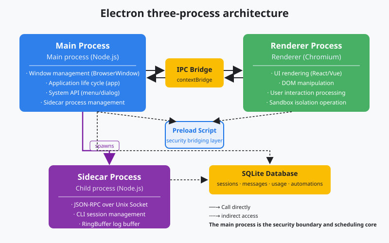
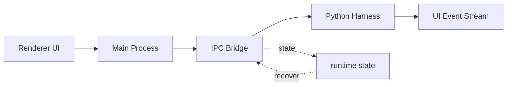
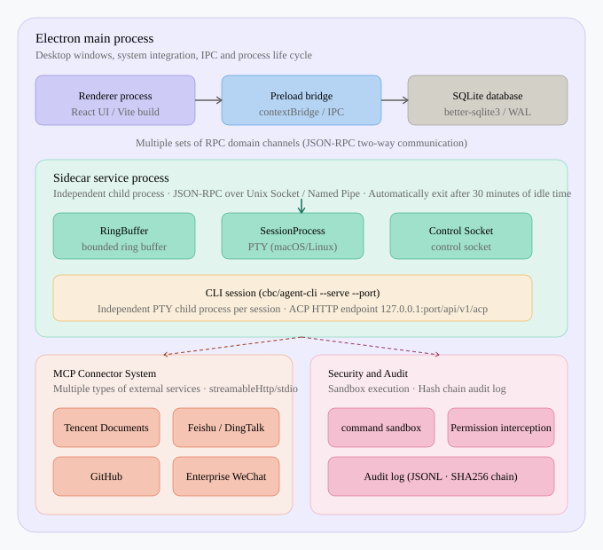

# s05: Electron Shell - One Process Is Not Enough

[Chinese](README.md) · [English](README.en.md)
> *One process is not enough: main, renderer, preload, and a narrow IPC bridge.*
>
> **Harness layer**: process architecture, the foundation of a desktop application.

---



## Code Architecture Diagram



## Prerequisites

- Electron has at least three boundaries: main, renderer, and preload.
- The Renderer owns the UI and should not receive direct filesystem or process
  privileges.
- IPC exposes capabilities through a narrow, explicit interface.

## WorkBuddy-Style Mechanisms in This Chapter

- Use Python processes to simulate the isolation boundary of a desktop shell.
- Show why the UI remains responsive while the agent runs a long task.
- Treat Main as the lifecycle and routing layer rather than the agent loop.

## Common Mistakes

- Putting every capability in the Renderer hands the security boundary to a
  web page.
- Binding the desktop process directly to the agent makes crash recovery hard.
- A broad IPC API becomes a disguised remote-execution interface.

## The Problem

The lessons in s01-s04 run the agent in one Python process. That is enough for
a CLI tool, but not for a desktop assistant:

1. **The UI must not freeze** while an agent runs a 30-second command.
2. **Security needs isolation** so a web renderer cannot access the filesystem
   directly.
3. **Lifecycles must be independent**: closing a window should not kill the
   agent, and an agent crash should not kill the UI.

WorkBuddy is an Electron application. Electron's multi-process model provides
these boundaries naturally.

## The Solution

Electron has three process roles:

| Process | Responsibility | Capability |
|------|------|------|
| **Main** | Window management, system APIs, and Sidecar management | Full Node.js and native APIs |
| **Renderer** | UI rendering with HTML/CSS/JS | Restricted browser environment |
| **Preload** | Bridge between Main and Renderer | Controlled Node.js API exposure |

```text
┌──────────────────────────────────────────────────┐
│                  Electron App                     │
│                                                   │
│  ┌─────────────┐     IPC      ┌──────────────┐  │
│  │ Main Process │◄───────────►│ Renderer      │  │
│  │ (Node.js)    │             │ (Browser)     │  │
│  │              │             │               │  │
│  │ • Window Mgmt│             │ • HTML/CSS/JS │  │
│  │ • Sidecar    │      Preload│ • React/Vue   │  │
│  │ • System API │◄───────────►│ • User Input  │  │
│  │ • Tray/Menu  │   (bridge)  │               │  │
│  └──────┬───────┘             └──────────────┘  │
│         │                                         │
│         │ spawn                                   │
│         ▼                                         │
│  ┌─────────────┐                                 │
│  │ Sidecar     │  (s06)                          │
│  │ (child proc)│                                 │
│  └─────────────┘                                 │
└──────────────────────────────────────────────────┘
```

The complete WorkBuddy-style topology goes beyond these three Electron
roles. The second diagram connects Main, Sidecar, CLI sessions, MCP
connectors, and security auditing; later lessons unpack those subsystems.



## How It Works

### IPC Channels

Main and Renderer communicate through IPC (Inter-Process Communication).
Preload injects a deliberately small API into the Renderer:

```javascript
// preload.js - runs in the Renderer isolated world
const { contextBridge, ipcRenderer } = require('electron')

contextBridge.exposeInMainWorld('workbuddy', {
    sendMessage: (text) => ipcRenderer.invoke('agent/send', text),
    onResponse: (callback) => ipcRenderer.on('agent/response', callback),
    listSessions: () => ipcRenderer.invoke('session/list'),
})
```

The React component in the Renderer can call
`window.workbuddy.sendMessage("hello")`. IPC forwards that request to Main,
Main routes it to the Sidecar, and the Sidecar routes it to the CLI session.

### Teaching-Model Process Simulation

The teaching version uses Python child processes to simulate the three roles:

```python
import multiprocessing as mp

def main_process(task_queue, result_queue):
    """Simulate Electron Main Process: manage the window and Sidecar."""
    while True:
        task = task_queue.get()
        if task == "quit":
            break
        # Route to the Sidecar.
        result = route_to_sidecar(task)
        result_queue.put(result)

def renderer_process(task_queue, result_queue):
    """Simulate Electron Renderer: UI and user input."""
    while True:
        user_input = get_user_input()
        task_queue.put(user_input)
        result = result_queue.get()
        display_result(result)
```

The queues stand in for IPC while keeping the ownership boundaries visible
without requiring Electron.

### Why Processes Instead of Threads

Threads share memory, so a failure in one thread can take down the whole
process. Process isolation gives the desktop shell clearer recovery
boundaries:

- A Renderer crash does not have to take down Main; the window can be
  recreated.
- A long-running agent task does not block the UI event loop.
- A compromised Renderer cannot directly access the filesystem when Node APIs
  are not exposed.

The process boundary is therefore also a security boundary.

### Main Process Responsibilities

The Main Process in a WorkBuddy-style desktop agent owns:

1. **Window management**: create, destroy, and restore windows.
2. **Sidecar lifecycle**: start, monitor, and restart the Sidecar.
3. **System integration**: tray icons, global shortcuts, and file associations.
4. **RPC routing**: route domain-specific JSON-RPC methods.
5. **MCP connector management**: start, trust, and monitor connector processes.
6. **Automation scheduling**: trigger scheduled tasks.

## Changes from s04

| Component | Before (s04) | After (s05) |
|------|-----------|-----------|
| Process model | Single process | Three processes (main/renderer/preload) |
| Communication | Function calls | IPC messages |
| UI blocking | The UI can block while the agent runs | The UI runs independently |
| Security isolation | None | Renderer cannot directly access the filesystem |
| Crash recovery | The whole application can fail together | Recovery can happen per process |

## Try It

```sh
python s05_electron_shell/code.py
```

Observe:

- Whether Main Process and Renderer run as separate processes.
- Whether Main keeps working while the UI receives input.
- Whether the other process continues when one simulated process crashes.

## Next

Main manages the window but does not run the agent directly. The agent runs in
a Sidecar: an independent child process that communicates with Main through
JSON-RPC.

**Clean-Room Architecture Comparison**

### Main Process Entry Points

A production desktop agent's Main entry point commonly defines:

- Domain-specific RPC handler registration.
- Window creation and lifecycle management.
- Sidecar startup and monitoring.
- MCP connector process-pool management.
- Global shortcuts and system-tray integration.
- Protocol handlers such as a custom URL scheme.

### Preload Security Model

The preload script exposes only a whitelist of APIs:

```javascript
// APIs exposed to the Renderer
window.workbuddy = {
    sendMessage,       // send a message to the agent
    onResponse,        // receive an agent response
    listSessions,      // list sessions
    createSession,     // create a session
    // ... but no fs, child_process, or require
}
```

Even if the Renderer is compromised by XSS, it cannot directly access the
filesystem or execute commands. Sensitive operations must cross IPC to Main,
where permission checks can run.

### Windows versus Sessions

WorkBuddy can have multiple windows, and each window can contain multiple
session tabs. A session is an agent runtime instance with its own messages,
working directory, and tool pool. A window is only a UI container.

```text
Window 1
  ├── Session A (cwd: ~/project1)
  └── Session B (cwd: ~/project2)
Window 2
  └── Session C (cwd: ~/project3)
```

Each Session corresponds to a CLI child process; s07 explains its lifecycle.

### Multiple RPC Domains

RPC methods are grouped by domain:

```javascript
var SESSION_RPC_CHANNELS = { "session/create": ..., "session/destroy": ... }
var TOOL_RPC_CHANNELS = { "tool/execute": ..., "tool/list": ... }
var MEMORY_RPC_CHANNELS = { "memory/getProfile": ..., "memory/saveSettings": ... }
var MCP_RPC_CHANNELS = { "mcp/connect": ..., "mcp/disconnect": ... }
var SKILL_RPC_CHANNELS = { "skill/load": ..., "skill/list": ... }
var AUTOMATION_RPC_CHANNELS = { "automation/create": ..., ... }
// ... more domains
```

Each domain is registered with `ipcMain.handle()`, while the Renderer calls
it through `ipcRenderer.invoke()`. Keeping channels narrow makes preload an
explicit capability boundary rather than a generic remote-execution API.

## Next Lesson

Electron provides the outer shell, but the agent's real runtime still needs
its own process. s06 introduces the Sidecar server: JSON-RPC routing, a
bounded RingBuffer, and multi-session lifecycle management.

Local references:

- [Reference](README.md)
- [Reference](README.en.md)
- [Reference](./images/electron-arch-en.svg)
- [Reference](./images/process-architecture-en.svg)
