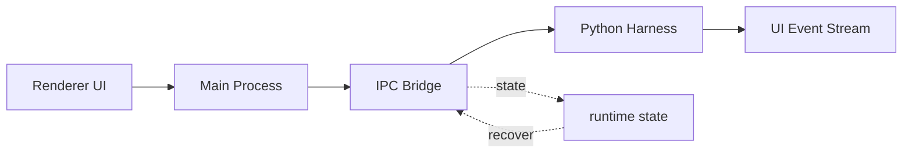

# s05: Electron Shell — 一个进程不够, 要三个

> *"一个进程不够, 要三个"* — main/renderer/preload, IPC 桥接。
>
> **Harness 层**: 进程架构 — 桌面应用的基础骨架。

---


## 代码架构图



## 学习前置知识

- Electron 至少有 main、renderer、preload 三类边界。
- Renderer 负责 UI, 不应该直接拿文件系统和进程权限。
- IPC 的价值是把能力暴露成窄接口。

## 本章抓住的 WorkBuddy-style 机制

- 用 Python 多进程模拟桌面 shell 的隔离边界。
- 展示 UI 不被 agent 长任务阻塞的原因。
- 把主进程定位成 lifecycle/router, 而不是 agent loop 本体。

## 常见误区

- 把所有能力塞进 renderer, 等于把安全边界交给前端页面。
- 把桌面进程和 agent 进程绑死, 崩溃恢复会很困难。
- IPC API 太宽, 会变成变相远程执行接口。
## 问题

s01-s04 的 agent 跑在单个 Python 进程里。这对 CLI 工具够用，但桌面 AI 助手不行：

1. **UI 不能卡** — agent 跑一个 30 秒的命令时，UI 必须保持响应
2. **安全隔离** — 渲染器（网页）不能直接访问文件系统
3. **生命周期** — 关窗口不能杀 agent，agent 崩了不能杀 UI

WorkBuddy 是 Electron 应用。Electron 的多进程模型天然解决这些问题。

---

## 解决方案

Electron 有三个进程角色：

| 进程 | 职责 | 能力 |
|------|------|------|
| **Main** | 窗口管理、系统 API、Sidecar 管理 | 完整 Node.js + 原生 API |
| **Renderer** | UI 渲染（HTML/CSS/JS） | 受限的浏览器环境 |
| **Preload** | 桥接 Main 和 Renderer | 受控的 Node.js API 暴露 |

```
┌──────────────────────────────────────────────────┐
│                  Electron App                     │
│                                                   │
│  ┌─────────────┐     IPC      ┌──────────────┐  │
│  │ Main Process │◄───────────►│ Renderer      │  │
│  │ (Node.js)    │             │ (Browser)     │  │
│  │              │             │               │  │
│  │ • Window Mgmt│             │ • HTML/CSS/JS │  │
│  │ • Sidecar    │      Preload│ • React/Vue   │  │
│  │ • System API │◄───────────►│ • User Input  │  │
│  │ • Tray/Menu  │   (bridge)  │               │  │
│  └──────┬───────┘             └──────────────┘  │
│         │                                         │
│         │ spawn                                   │
│         ▼                                         │
│  ┌─────────────┐                                 │
│  │ Sidecar     │  (s06)                          │
│  │ (child proc)│                                 │
│  └─────────────┘                                 │
└──────────────────────────────────────────────────┘
```

上图是 s05 的核心——三个 Electron 进程。但 WorkBuddy 的完整进程拓扑远不止于此。下面的图展示了从 Main Process 到 Sidecar、CLI 会话、MCP 连接器、安全审计的**完整进程架构**，后续 s06-s07-s17-s23 会逐一拆解每个子系统：


---

## 工作原理

### IPC 通道

Main 和 Renderer 通过 IPC（Inter-Process Communication）通信。Preload 脚本在 Renderer 中注入一个安全的 API：

```javascript
// preload.js — 运行在 Renderer 的隔离世界
const { contextBridge, ipcRenderer } = require('electron')

contextBridge.exposeInMainWorld('workbuddy', {
    sendMessage: (text) => ipcRenderer.invoke('agent/send', text),
    onResponse: (callback) => ipcRenderer.on('agent/response', callback),
    listSessions: () => ipcRenderer.invoke('session/list'),
})
```

Renderer 里的 React 组件调用 `window.workbuddy.sendMessage("hello")`，IPC 把请求传到 Main，Main 路由到 Sidecar，Sidecar 路由到 CLI 会话。

### 教学版模拟

教学版用 Python 子进程模拟三个角色：

```python
import multiprocessing as mp

def main_process(task_queue, result_queue):
    """模拟 Electron Main Process — 管理窗口和 Sidecar"""
    while True:
        task = task_queue.get()
        if task == "quit": break
        # Route to sidecar
        result = route_to_sidecar(task)
        result_queue.put(result)

def renderer_process(task_queue, result_queue):
    """模拟 Electron Renderer — UI 和用户输入"""
    while True:
        user_input = get_user_input()
        task_queue.put(user_input)
        result = result_queue.get()
        display_result(result)
```

### 为什么不用线程

线程共享内存——一个线程崩溃会带掉整个进程。进程隔离意味着：

- Renderer 崩溃 → Main 不受影响，可以重新创建窗口
- Agent 长时间运行 → UI 线程不被阻塞
- 渲染器被攻击 → 无法直接访问文件系统（没有 Node.js API）

WorkBuddy 的进程边界就是安全边界。

### Main Process 的职责

WorkBuddy-style 桌面 agent 的 Main Process 承担：

1. **窗口管理** — 创建、销毁、恢复窗口
2. **Sidecar 生命周期** — 启动、监控、重启 Sidecar 进程
3. **系统集成** — 托盘图标、全局快捷键、文件关联
4. **RPC 路由** — 多组领域化 JSON-RPC 方法路由
5. **MCP 连接器管理** — 启动、信任、监控连接器进程
6. **自动化调度** — 定时任务触发

---

## 相对 s04 的变更

| 组件 | 之前 (s04) | 之后 (s05) |
|------|-----------|-----------|
| 进程模型 | 单进程 | 三进程 (main/renderer/preload) |
| 通信方式 | 函数调用 | IPC (消息队列) |
| UI 阻塞 | agent 运行时 UI 卡住 | UI 独立运行 |
| 安全隔离 | 无 | Renderer 无法直接访问文件系统 |
| 崩溃恢复 | 整体崩溃 | 进程级隔离 |

---

## 试一下

```sh
python s05_electron_shell/code.py
```

观察重点：
- Main Process 和 Renderer 是否在独立进程？
- 输入消息时，Main Process 是否在等待？UI 是否可以同时操作？
- 模拟崩溃时，另一个进程是否继续运行？

---

## 接下来

Main Process 管窗口，但不直接跑 agent。agent 在哪里跑？在 Sidecar 里——一个独立的子进程，通过 JSON-RPC 和 Main 通信。

s06 Sidecar Server → JSON-RPC over Unix Socket + RingBuffer。

<details>
<summary>Clean-room 架构对照</summary>

### 主进程入口

生产级 Electron agent 的主进程入口通常定义：

- 多组 RPC 领域的 handler 注册
- 窗口创建和生命周期管理
- Sidecar 进程的启动和监控
- MCP 连接器进程池管理
- 全局快捷键和系统托盘
- 协议处理器（`protocol.js` 定义了 URL scheme）

### Preload 安全模型

WorkBuddy 的 preload 脚本使用 `contextBridge.exposeInMainWorld`，只暴露白名单 API 给渲染器：

```javascript
// 渲染器能访问的 API
window.workbuddy = {
    sendMessage,       // 发消息给 agent
    onResponse,        // 接收 agent 响应
    listSessions,      // 列出会话
    createSession,     // 创建会话
    // ... 但没有 fs, child_process, require 等
}
```

渲染器即使被 XSS 攻击，也无法直接访问文件系统或执行命令——所有敏感操作都必须通过 IPC 到 Main Process，经过权限检查。

### 多窗口 vs 多会话

WorkBuddy 支持多窗口，每个窗口可以有多个会话标签页。会话是 agent 的运行实例——每个会话有独立的 `messages[]`、工作目录、工具池。窗口是 UI 容器。

```
Window 1
  ├── Session A (cwd: ~/project1)
  └── Session B (cwd: ~/project2)
Window 2
  └── Session C (cwd: ~/project3)
```

每个 Session 对应一个 CLI 子进程（s07 会讲）。

### 多组 RPC 领域

`index.js` 中的 RPC 领域是分模块组织的：

```javascript
var SESSION_RPC_CHANNELS = { "session/create": ..., "session/destroy": ... }
var TOOL_RPC_CHANNELS = { "tool/execute": ..., "tool/list": ... }
var MEMORY_RPC_CHANNELS = { "memory/getProfile": ..., "memory/saveSettings": ... }
var MCP_RPC_CHANNELS = { "mcp/connect": ..., "mcp/disconnect": ... }
var SKILL_RPC_CHANNELS = { "skill/load": ..., "skill/list": ... }
var AUTOMATION_RPC_CHANNELS = { "automation/create": ..., ... }
// ... more domains
```

每个领域是一组方法，通过 `ipcMain.handle()` 注册。渲染器通过 `ipcRenderer.invoke()` 调用。

</details>

---

## 下一课

Electron 外壳搭好了，渲染器和主进程通过 IPC 通信。但 agent 的真正大脑——CLI 进程——怎么管理？s06 讲 Sidecar 服务器——JSON-RPC 路由、bounded RingBuffer、多会话生命周期。

s06 Sidecar Server → JSON-RPC, RingBuffer, 多会话管理。
