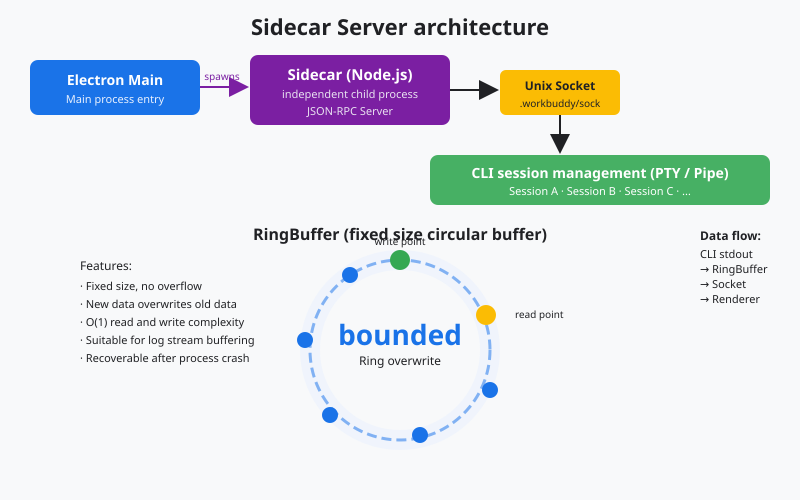
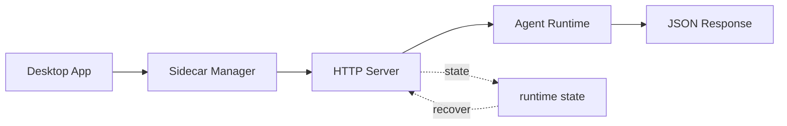

# s06: Sidecar Server - Let the Sidecar Run the Agent

[中文](README.md) · [English](README.en.md)
> *The main process manages the application; the Sidecar owns the agent runtime.*
>
> **Harness layer: process architecture and the agent's host process.**

This lesson uses local JSON-RPC, a bounded RingBuffer, and explicit lifecycle operations to isolate the agent from the desktop shell.



## Code Architecture Diagram



## Prerequisites

No Electron installation is required for the Python simulation; focus on process ownership, sidecar transport, and lifecycle contracts.

## WorkBuddy-Style Mechanisms in This Chapter

The lesson isolates the agent runtime behind sidecar RPC, bounded streaming, and explicit lifecycle state.

## Common Mistakes

Unbounded buffers, hidden reconnect behavior, and mixed UI/runtime responsibilities make sidecar failures difficult to recover from.

## The Problem

The desktop shell must communicate with a long-running agent without owning its execution state or allowing one request to block every client.

## The Solution

```
┌─────────────────────────────────────────────────────────┐
│                    Electron App                          │
│                                                          │
│  ┌──────────────┐    Unix Socket    ┌───────────────┐  │
│  │ Main Process  │◄────JSON-RPC─────►│ Sidecar       │  │
│  │ (index.js)    │    /tmp/wb.sock   │ (sidecar-     │  │
│  │               │                   │  entry.js)    │  │
│  │ • Window Mgmt │                   │               │  │
│  │ • System API  │                   │ • RPC Server  │  │
│  │ • Tray/Menu   │                   │ • RingBuffer  │  │
│  │               │                   │ • Session Mgr │  │
│  └──────────────┘                   │ • Tool Exec   │  │
│                                      │ • MCP Pool    │  │
│                                      └───────┬───────┘  │
│                                              │ spawn     │
│                                              ▼          │
│                                      ┌───────────────┐  │
│                                      │ Session Proc  │  │
│                                      │ (CLI, s07)    │  │
│                                      └───────────────┘  │
└─────────────────────────────────────────────────────────┘
```

## How It Works

```javascript
// Sidecar 入口模块 — Sidecar 启动
const net = require('net');
const server = net.createServer((socket) => {
    // 每个连接独立处理
    handleConnection(socket);
});
server.listen(socketPath);
```

### Unix Domain Socket

```
{"jsonrpc":"2.0","method":"session/create","params":{"cwd":"/proj"},"id":1}\n
{"jsonrpc":"2.0","method":"tool/execute","params":{"name":"bash","input":{...}},"id":2}\n
```

```
{"jsonrpc":"2.0","result":{"sessionId":"abc123"},"id":1}\n
{"jsonrpc":"2.0","result":{"output":"..."},"id":2}\n
```

### JSON-RPC Message Format

### RPC Domains

**RPC Domains**

```
RingBuffer (固定大小)
┌──────────────────────────────────┐
│ [old] ████████████░░░░░░ [new]  │  ← 写头追着读头跑
└──────────────────────────────────┘
     ↑ 被覆盖          ↑ 正在写
```

```javascript
class RingBuffer {
    constructor(size = fixedLimit) {
        this.buffer = Buffer.alloc(size);
        this.size = size;
        this.writePos = 0;
        this.totalWritten = 0;
    }
    write(data) {
        for (let i = 0; i < data.length; i++) {
            this.buffer[(this.writePos + i) % this.size] = data[i];
        }
        this.writePos = (this.writePos + data.length) % this.size;
        this.totalWritten += data.length;
    }
    read() {
        // 从 writePos 开始读一圈
        return this.buffer.slice(this.writePos).toString() +
               this.buffer.slice(0, this.writePos).toString();
    }
}
```

### RingBuffer: Bounded Circular Buffer

### PTY and Pipe

## WorkBuddy Architecture Comparison

This comparison maps sidecar RPC, bounded streaming, and process communication to the corresponding WorkBuddy-style harness boundary.

### Sidecar Responsibilities

| Component | Responsibility | Communication |
|------|------|---------|
| **Main Process** | Window, system integration, and Sidecar lifecycle | Unix Socket -> Sidecar |
| **Sidecar** | Agent host, RPC routing, and log capture | Unix Socket -> Main; spawn -> Session |
| **RingBuffer** | Bounded circular buffer for stdout/stderr | Inside the Sidecar |
| **Session Process** | Agent loop for one logical session | ACP-like HTTP (s07) |

```javascript
// 简化版结构
class SidecarServer {
    constructor() {
        this.ringBuffer = new RingBuffer(fixedLimit); // 固定大小
        this.sessions = new Map();  // sessionId → SessionProcess
        this.rpcHandlers = new Map(); // method → handler
        this.registerChannels();
    }

    registerChannels() {
        // 多组领域化 handler 注册
        this.rpcHandlers.set('session/create', this.handleSessionCreate);
        this.rpcHandlers.set('session/destroy', this.handleSessionDestroy);
        this.rpcHandlers.set('sidecar/ping', () => ({ status: 'ok' }));
        this.rpcHandlers.set('tool/execute', this.handleToolExecute);
        this.rpcHandlers.set('memory/getProfile', this.handleMemoryGet);
        // ... 更多
    }

    start(socketPath) {
        this.server = net.createServer((socket) => {
            this.handleConnection(socket);
        });
        this.server.listen(socketPath);
    }

    handleConnection(socket) {
        let buffer = '';
        socket.on('data', (data) => {
            buffer += data.toString();
            // 按换行符分割消息（newline-delimited JSON）
            while (buffer.includes('\n')) {
                const line = buffer.slice(0, buffer.indexOf('\n'));
                buffer = buffer.slice(buffer.indexOf('\n') + 1);
                this.handleRPC(JSON.parse(line), socket);
            }
        });
    }
}
```

### Main Process and Sidecar

```javascript
// Main Process 启动 Sidecar
const { spawn } = require('child_process');
const sidecarEntry = resolveSidecarRuntime();

const socketPath = `/tmp/workbuddy-sidecar-${process.pid}.sock`;
const sidecarProc = spawn(process.execPath, [sidecarEntry, '--socket', socketPath], {
    stdio: ['pipe', 'pipe', 'pipe']
});

// 捕获 sidecar stdout/stderr
sidecarProc.stdout.on('data', (data) => { /* 日志 */ });
sidecarProc.stderr.on('data', (data) => { /* 日志 */ });

// 连接 Unix Socket
const client = net.createConnection(socketPath);
```

### Communication and Routing

```
用户输入 → Renderer → IPC → Main → Unix Socket → Sidecar → spawn → Session
                                                                    ↓
用户看到 ← Renderer ← IPC ← Main ← Unix Socket ← Sidecar ← ACP HTTP ← Session
```

**RPC Domains**

| Domain | Example methods | Purpose |
|------|---------|------|
| `session/*` | create, destroy, list, send | Session lifecycle |
| `sidecar/*` | ping, status, shutdown | Sidecar management |
| `tool/*` | execute, list, permission | Tool calls |
| `memory/*` | getProfile, saveSettings | Memory system |
| `mcp/*` | connect, disconnect, list | MCP connectors |
| `skill/*` | load, list, execute | Skills |
| `automation/*` | create, update, list | Scheduled tasks |

**PTY and Pipe**

| Backend | Use | Characteristics |
|------|------|------|
| **PTY** | Interactive commands | Preserves colors, cursor behavior, and terminal features |
| **Pipe** | Non-interactive commands | Simple, with no terminal overhead |

## Code Walkthrough

Trace one request from the desktop process through the sidecar, bounded buffer, session runtime, and structured response.

## Run

```bash
python s06_sidecar_server/code.py
```

## Exercises

Use these exercises to change one part of sidecar RPC, bounded streaming, and process communication at a time and explain the resulting contract.

## Next Lesson

- This lesson uses local JSON-RPC, a bounded RingBuffer, and explicit lifecycle operations to isolate the agent from the desktop shell.

The original Chinese README remains the primary-language reference. This English companion keeps the same code, diagrams, local paths, and chapter structure so readers can switch languages without losing runnable details.

Local references:

- [Reference](README.md)
- [Reference](README.en.md)
- [Reference](./images/sidecar-arch-en.svg)
