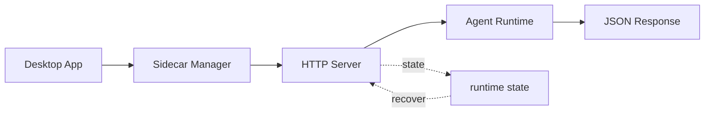

# s06: Sidecar Server — 主进程不跑 agent, Sidecar 来跑

> *"主进程不跑 agent, Sidecar 来跑"* — JSON-RPC over Unix Socket, 有界 RingBuffer。
>
> **Harness 层**: 进程架构 — agent 的宿主进程。

---


## 代码架构图



## 学习前置知识

- Sidecar 是控制面, Session Runtime 是执行面。
- Unix socket / named pipe 适合本机进程间通信。
- RingBuffer 解决重连和近期输出捕获, 不是永久日志。

## 本章抓住的 WorkBuddy-style 机制

- 用 JSON-RPC over local socket 模拟主进程和 Sidecar 通信。
- 用 ring buffer 保存最近输出, 支持 reconnect/capture 思路。
- 把 spawn、shutdown、status 放到统一控制面。

## 常见误区

- 让 Electron main 直接跑 agent, UI 生命周期会和任务生命周期纠缠。
- 只用 stdout 管理会话, 很难做 resize、kill、capture、reconnect。
- 把 ring buffer 当数据库, 会丢失长期审计能力。
## 问题

s05 解决了 UI 阻塞——三个进程各干各的。但有一个问题没解决：**agent 跑在哪？**

如果 agent 跑在 Main Process 里，会带来三个麻烦：

1. **崩溃连带** — agent 执行工具时如果抛异常，整个 Main Process 挂掉，窗口全没了
2. **资源争抢** — agent 跑一个大任务吃满 CPU/内存，窗口管理卡顿
3. **更新困难** — agent 逻辑更新需要重启整个应用，用户窗口全关

WorkBuddy 的解法：把 agent 拆到独立子进程里，叫 **Sidecar**。Main Process 管窗口和系统集成，Sidecar 管 agent 生命周期。两者通过 Unix Socket 上的 JSON-RPC 通信。

---

## 解决方案

```
┌─────────────────────────────────────────────────────────┐
│                    Electron App                          │
│                                                          │
│  ┌──────────────┐    Unix Socket    ┌───────────────┐  │
│  │ Main Process  │◄────JSON-RPC─────►│ Sidecar       │  │
│  │ (index.js)    │    /tmp/wb.sock   │ (sidecar-     │  │
│  │               │                   │  entry.js)    │  │
│  │ • Window Mgmt │                   │               │  │
│  │ • System API  │                   │ • RPC Server  │  │
│  │ • Tray/Menu   │                   │ • RingBuffer  │  │
│  │               │                   │ • Session Mgr │  │
│  └──────────────┘                   │ • Tool Exec   │  │
│                                      │ • MCP Pool    │  │
│                                      └───────┬───────┘  │
│                                              │ spawn     │
│                                              ▼          │
│                                      ┌───────────────┐  │
│                                      │ Session Proc  │  │
│                                      │ (CLI, s07)    │  │
│                                      └───────────────┘  │
└─────────────────────────────────────────────────────────┘
```

| 组件 | 职责 | 通信方式 |
|------|------|---------|
| **Main Process** | 窗口、系统集成、Sidecar 生命周期 | Unix Socket → Sidecar |
| **Sidecar** | agent 宿主、RPC 路由、日志捕获 | Unix Socket → Main; spawn → Session |
| **RingBuffer** | 有界环形缓冲区，捕获 stdout/stderr | Sidecar 内部 |
| **Session Process** | 单个会话的 agent loop | ACP HTTP (s07) |

---

## 工作原理

### Unix Domain Socket

Sidecar 启动时创建一个 Unix Socket 文件（如 `/tmp/workbuddy-sidecar.sock`）。Main Process 连接这个 socket，通过 JSON-RPC 协议通信。

```javascript
// Sidecar 入口模块 — Sidecar 启动
const net = require('net');
const server = net.createServer((socket) => {
    // 每个连接独立处理
    handleConnection(socket);
});
server.listen(socketPath);
```

Unix Socket 比 TCP 快——不走网络栈，直接内核内存拷贝。比 pipe 灵活——支持多连接、双向通信。

### JSON-RPC 消息格式

每条消息是一个 JSON 对象，用换行符分隔：

```
{"jsonrpc":"2.0","method":"session/create","params":{"cwd":"/proj"},"id":1}\n
{"jsonrpc":"2.0","method":"tool/execute","params":{"name":"bash","input":{...}},"id":2}\n
```

响应：

```
{"jsonrpc":"2.0","result":{"sessionId":"abc123"},"id":1}\n
{"jsonrpc":"2.0","result":{"output":"..."},"id":2}\n
```

### RPC 领域

Sidecar 的 RPC 方法按领域组织：

| 领域 | 示例方法 | 用途 |
|------|---------|------|
| `session/*` | create, destroy, list, send | 会话生命周期 |
| `sidecar/*` | ping, status, shutdown | Sidecar 自身管理 |
| `tool/*` | execute, list, permission | 工具调用 |
| `memory/*` | getProfile, saveSettings | 记忆系统 |
| `mcp/*` | connect, disconnect, list | MCP 连接器 |
| `skill/*` | load, list, execute | Skills 系统 |
| `automation/*` | create, update, list | 定时任务 |

### RingBuffer — 有界环形缓冲区

Sidecar 捕获所有子进程的 stdout/stderr，存入一个 固定大小 的环形缓冲区。满了就覆盖最旧的数据——保留最近的日志，不无限增长。

```
RingBuffer (固定大小)
┌──────────────────────────────────┐
│ [old] ████████████░░░░░░ [new]  │  ← 写头追着读头跑
└──────────────────────────────────┘
     ↑ 被覆盖          ↑ 正在写
```

```javascript
class RingBuffer {
    constructor(size = fixedLimit) {
        this.buffer = Buffer.alloc(size);
        this.size = size;
        this.writePos = 0;
        this.totalWritten = 0;
    }
    write(data) {
        for (let i = 0; i < data.length; i++) {
            this.buffer[(this.writePos + i) % this.size] = data[i];
        }
        this.writePos = (this.writePos + data.length) % this.size;
        this.totalWritten += data.length;
    }
    read() {
        // 从 writePos 开始读一圈
        return this.buffer.slice(this.writePos).toString() +
               this.buffer.slice(0, this.writePos).toString();
    }
}
```

### PTY vs Pipe 后端

Sidecar 创建子进程时有两种后端：

| 后端 | 用途 | 特点 |
|------|------|------|
| **PTY** | 交互式命令 | 保留颜色、光标、终端特性 |
| **Pipe** | 非交互式命令 | 简单、无终端开销 |

PTY 模式下，子进程以为自己在跟真终端通信——ANSI 颜色码、信号处理都正常。Pipe 模式更轻量，适合 agent 内部调用的工具。

---

## WorkBuddy 架构对照

生产级桌面 agent 的 Sidecar 实现：

### Sidecar 入口模块

```javascript
// 简化版结构
class SidecarServer {
    constructor() {
        this.ringBuffer = new RingBuffer(fixedLimit); // 固定大小
        this.sessions = new Map();  // sessionId → SessionProcess
        this.rpcHandlers = new Map(); // method → handler
        this.registerChannels();
    }

    registerChannels() {
        // 多组领域化 handler 注册
        this.rpcHandlers.set('session/create', this.handleSessionCreate);
        this.rpcHandlers.set('session/destroy', this.handleSessionDestroy);
        this.rpcHandlers.set('sidecar/ping', () => ({ status: 'ok' }));
        this.rpcHandlers.set('tool/execute', this.handleToolExecute);
        this.rpcHandlers.set('memory/getProfile', this.handleMemoryGet);
        // ... 更多
    }

    start(socketPath) {
        this.server = net.createServer((socket) => {
            this.handleConnection(socket);
        });
        this.server.listen(socketPath);
    }

    handleConnection(socket) {
        let buffer = '';
        socket.on('data', (data) => {
            buffer += data.toString();
            // 按换行符分割消息（newline-delimited JSON）
            while (buffer.includes('\n')) {
                const line = buffer.slice(0, buffer.indexOf('\n'));
                buffer = buffer.slice(buffer.indexOf('\n') + 1);
                this.handleRPC(JSON.parse(line), socket);
            }
        });
    }
}
```

### Main Process 启动 Sidecar

```javascript
// Main Process 启动 Sidecar
const { spawn } = require('child_process');
const sidecarEntry = resolveSidecarRuntime();

const socketPath = `/tmp/workbuddy-sidecar-${process.pid}.sock`;
const sidecarProc = spawn(process.execPath, [sidecarEntry, '--socket', socketPath], {
    stdio: ['pipe', 'pipe', 'pipe']
});

// 捕获 sidecar stdout/stderr
sidecarProc.stdout.on('data', (data) => { /* 日志 */ });
sidecarProc.stderr.on('data', (data) => { /* 日志 */ });

// 连接 Unix Socket
const client = net.createConnection(socketPath);
```

### 通信链路完整路径

```
用户输入 → Renderer → IPC → Main → Unix Socket → Sidecar → spawn → Session
                                                                    ↓
用户看到 ← Renderer ← IPC ← Main ← Unix Socket ← Sidecar ← ACP HTTP ← Session
```

---

## 代码 walkthrough

`code.py` 模拟 Sidecar 架构：

1. **SidecarServer 类** — 管理 Unix Socket、RPC handler、RingBuffer
2. **JSON-RPC 协议** — newline-delimited JSON，请求/响应配对
3. **RingBuffer** — 有界环形缓冲区，模拟日志捕获
4. **RPC 路由** — 多组领域化 handler 注册和分发
5. **Agent 执行** — Sidecar 接收 RPC 调用后执行 agent loop

教学版用 Python socket 模拟 Unix Socket，用内存队列模拟进程间通信。

---

## 运行

```bash
python s06_sidecar_server/code.py
```

观察重点：
- Sidecar 是否在独立"进程"（线程模拟）中运行？
- JSON-RPC 消息是否正确配对（请求 id → 响应 id）？
- RingBuffer 满了之后是否覆盖旧数据？

---

## 练习

1. 给 RingBuffer 添加 `read(since_timestamp)` 方法，只返回指定时间之后的日志
2. 添加 `sidecar/status` RPC 方法，返回当前会话数、内存使用、RingBuffer 使用率
3. 模拟 Sidecar 崩溃后 Main Process 的重连逻辑（重启 Sidecar、恢复会话）

---

## 下一课

Sidecar 管着所有会话进程。每个会话是什么？一个独立的 CLI 子进程，通过 ACP HTTP 端点通信。s07 讲会话管理——PTY 后端、管道后端、会话生命周期。

s07 Session Management → PTY/管道、ACP HTTP、会话状态机。
