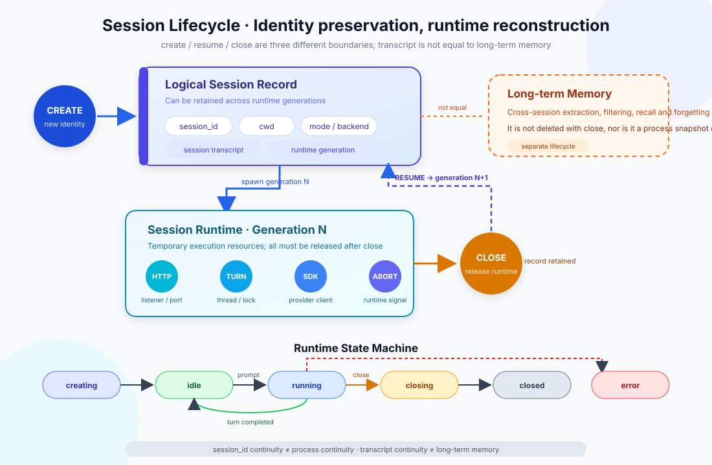
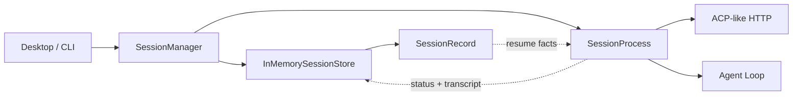

# s07: Session Management - Restore the Logical Session, Rebuild the Runtime

[中文](README.md) · [English](README.en.md)
> *A session identity can survive a runtime; processes, ports, locks, and clients cannot.*
>
> **Harness layer: session lifecycle, runtime isolation, and recovery boundaries.**

Create, close, resume, and forget are separate operations. Resume reconstructs runtime resources from durable session facts.



## Code Architecture Diagram



## Learning Goals

By the end of the lesson, you should be able to model session ownership, lifecycle transitions, transcript scope, and clean shutdown.

## Four Lifecycle Operations

Create, attach, close, and abort are explicit session transitions with predictable ownership and cleanup behavior.

## Create: Identity and First Runtime

`SessionRecord` is the durable identity. `SessionProcess` is a runtime
generation that can be rebuilt later.

| Object | Lifetime | Contains | Must not contain |
|---|---|---|---|
| `SessionRecord` | Can survive across runtimes | Session ID, cwd, mode, backend, transcript, generation | Threads, ports, HTTP server, locks, provider client |
| `SessionProcess` | One runtime generation | HTTP listener, threads, abort signal, turn lock, execution entry point | Cross-session memory or permanent identity |

### Close: Release Runtime, Keep History

```text
validate request
      ↓
allocate session_id
      ↓
store SessionRecord(status=creating, generation=1)
      ↓
start SessionProcess
      ↓
publish idle
```

### Resume: Rebuild Runtime

| Operation | Keeps session ID | Keeps transcript | Keeps runtime | Can resume |
|---|---:|---:|---:|---:|
| create | Yes | Creates an empty record | Yes | Not applicable |
| close | Yes | Yes | No | Yes |
| resume | Yes | Yes | Creates a new runtime | Yes |
| forget | No | No | No | No |

### Forget: Explicit Deletion

```text
SessionRecord(session_id=sess_0001, generation=1, closed)
                           │
                           │ resume
                           ▼
SessionProcess(session_id=sess_0001, generation=2, new runtime)
```

### State Machine

| State | Meaning | Main allowed next states |
|---|---|---|
| `creating` | Runtime resources are being allocated | `idle`, `error`, `closing` |
| `idle` | Runtime is ready for input | `running`, `closing`, `error` |
| `running` | One turn is executing | `idle`, `closing`, `error` |
| `closing` | Runtime is being interrupted and released | `closed`, `error` |
| `closed` | No live runtime; the record remains | Manager resumes it as a new `creating` generation |
| `error` | Current generation failed and recorded a reason | `closing`, then resume |

## Transcript Is Not Long-Term Memory

A session transcript preserves what happened in one interaction; it does not automatically become a durable user or workspace fact.

| Dimension | Session transcript | Long-term memory |
|---|---|---|
| Scope | One session ID | User, workspace, or organization |
| Main use | Continue protocol context | Recall useful information in a new task |
| Write path | Append messages and tool results by turn | Extract, filter, deduplicate, merge, or forget |
| Read path | Sequential read or recent window | Query, filter, rank, RAG, or policy selection |
| Lifetime | May remain after close; deleted by forget | Should not disappear when one session closes |
| Main risk | Context growth and protocol integrity | Relevance, staleness, contamination, scope leakage |

| Feature | PTY | Pipe |
|---|---|---|
| Terminal semantics | Has a TTY; supports colors, cursor, and window size | Ordinary stdin/stdout/stderr |
| Signal behavior | Closer to an interactive terminal | Needs explicit process signals and protocol control |
| Suitable for | REPLs, interactive CLIs, and terminal UIs | Non-interactive tools and structured output |
| Recovery | Create a new PTY and worker | Create new pipes and a worker |

## Why InMemorySessionStore Is Enough for the Lesson

An in-memory store keeps the lifecycle contract easy to inspect while later chapters introduce durable persistence separately.

## ACP-Like HTTP Boundary

```python
store = InMemorySessionStore()

manager_v1 = SessionManager(store)
sid = manager_v1.create_session("/workspace")
manager_v1.shutdown_all()       # close the runtime only

manager_v2 = SessionManager(store)
manager_v2.resume_session(sid)  # same ID, new generation
```

## PTY and Pipe at Runtime

```text
POST /agent/send      send a non-empty user message
GET  /agent/status    inspect current generation status and summary
POST /agent/abort     request cooperative interruption
GET  /agent/messages  read a JSON-safe transcript view
```

## Close and Abort

Close represents normal cleanup, while abort records an interrupted run and releases the same process and transport resources.

## Code Walkthrough

Follow a session from creation through attachment, request handling, close, and abort, then inspect the state left behind.

## Code Walkthrough

### `InMemorySessionStore`

### `SessionProcess`

### `SessionManager`

### Design Questions

## Run

Run the local session example to observe lifecycle events and the boundary between a live session and its transcript.

## Run

```bash
python3 s07_session_management/code.py --demo
```

```bash
python3 s07_session_management/code.py
```

```text
/sessions
/close sess_0001
/sessions
/resume sess_0001
/sessions
/forget sess_0001   # live state is rejected; close it first
```

## Common Mistakes

Keep session ownership explicit, reject unknown session IDs, and make close and abort idempotent enough for retry paths.

## Exercises

Use these exercises to change one part of session identity, lifecycle operations, and runtime recovery at a time and explain the resulting contract.

## Next Lesson

- Create, close, resume, and forget are separate operations. Resume reconstructs runtime resources from durable session facts.

The original Chinese README remains the primary-language reference. This English companion keeps the same code, diagrams, local paths, and chapter structure so readers can switch languages without losing runnable details.

Local references:

- [Reference](README.md)
- [Reference](README.en.md)
- [Reference](./images/session-lifecycle-en.svg)
