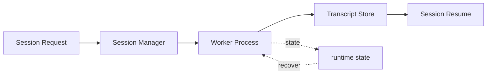

# s07: Session Management — 每个会话一个子进程, PTY 或管道

> *"每个会话一个子进程, PTY 或管道"* — ACP HTTP 端点, 会话生命周期。
>
> **Harness 层**: 进程架构 — agent 的隔离单元。

---


## 代码架构图



## 学习前置知识

- 会话是 agent 的运行实例, 不等于窗口也不等于聊天 tab。
- PTY 更像真实终端, pipe 更轻量。
- SubAgent 最重要的收益是上下文隔离, 不是“人越多越聪明”。

## 本章抓住的 WorkBuddy-style 机制

- 吸收公开架构研究中的两类通信模式: asTool 函数调用语义和团队协作语义。
- 用 TaskList/blackboard 解释松耦合协作。
- 把 session 状态、端口、cwd、模型路由和关闭流程持久化。

## 常见误区

- 所有 agent 共享同一个上下文窗口, 很快会注意力稀释。
- SubAgent 中间过程全部回灌主 Agent, 会造成上下文膨胀。
- 把黑板模式说成消息队列, 会误解它的协调目标。
## 问题

s06 讲了 Sidecar——它管着所有 agent。但 Sidecar 自己不跑 agent loop，它只做路由和管理。

为什么不让 Sidecar 直接跑 agent？

1. **隔离** — 一个 agent 跑死循环，不能影响其他会话
2. **资源回收** — 会话结束，子进程退出，内存立刻归还
3. **独立工作目录** — 每个会话可以跑在不同项目目录
4. **独立上下文** — 每个会话有独立的 messages[]，互不干扰

WorkBuddy 的做法：每个会话（conversation）对应一个独立的 CLI 子进程。Sidecar 负责 spawn 和管理这些进程。

---

## 解决方案

```
┌──────────────────────────────────────────────────────────────┐
│                        Sidecar                                │
│                                                               │
│   ┌─────────────┐  ┌─────────────┐  ┌─────────────┐         │
│   │ Session A    │  │ Session B    │  │ Session C    │        │
│   │ (PTY)        │  │ (Pipe)       │  │ (PTY)        │        │
│   │ cwd: ~/proj1 │  │ cwd: ~/proj2 │  │ cwd: ~/proj3 │        │
│   │ model: GLM   │  │ model: Claude│  │ model: GPT   │        │
│   │ mode: craft  │  │ mode: plan   │  │ mode: ask    │        │
│   └──────┬──────┘  └──────┬──────┘  └──────┬──────┘         │
│          │                │                │                  │
│          │  ACP HTTP      │  ACP HTTP      │  ACP HTTP       │
│          ▼                ▼                ▼                  │
│   :13001            :13002            :13003                  │
│                                                               │
│   Sessions Table (SQLite):                                    │
│   ┌────┬───────┬────────┬────────┬───────┬────────┐         │
│   │ id │ cwd   │ title  │ status │ mode  │ model  │         │
│   ├────┼───────┼────────┼────────┼───────┼────────┤         │
│   │ 1  │~/proj1│Fix bug │ running│ craft │ GLM    │         │
│   │ 2  │~/proj2│Refactor│ idle   │ plan  │ Claude │         │
│   │ 3  │~/proj3│Discuss │ term.  │ ask   │ GPT    │         │
│   └────┴───────┴────────┴────────┴───────┴────────┘         │
└──────────────────────────────────────────────────────────────┘
```

| 组件 | 职责 |
|------|------|
| **Session Process** | 独立 CLI 进程，跑 agent loop |
| **ACP HTTP** | Agent Communication Protocol，Sidecar ↔ Session 通信 |
| **PTY 后端** | 伪终端，保留颜色/光标/信号，用于交互式命令 |
| **Pipe 后端** | 管道，轻量，用于非交互式工具调用 |
| **Sessions 表** | SQLite 持久化会话元数据 |

---

## 工作原理

### 会话生命周期

```
         spawn                first message
create ──────────► running ─────────────────► idle
  │                   │                         │
  │                   │                         │ user sends
  │                   │                         ▼ message
  │                   │                     running
  │                   │                         │
  │                   │  kill / crash           │
  │                   ▼                         │
  │               terminated ◄─────────────────┘
  │
  └──► (spawn fails)
         error
```

| 状态 | 含义 | 触发条件 |
|------|------|---------|
| `creating` | 进程正在 spawn | create RPC 调用 |
| `running` | agent 正在执行 | 收到用户消息 |
| `idle` | 等待输入 | agent 回复完毕 |
| `terminated` | 进程已退出 | 用户关闭 / 崩溃 |
| `error` | spawn 失败 | 进程启动错误 |

### PTY vs Pipe

```python
# PTY 后端 — 伪终端
import pty, os
master_fd, slave_fd = pty.openpty()
proc = subprocess.Popen(
    ["node", "cli-entry.js", "--port", str(port)],
    stdin=slave_fd, stdout=slave_fd, stderr=slave_fd,
    cwd=session_cwd
)
# 子进程以为自己在跟真终端通信
# ANSI 颜色码、信号处理、窗口大小都正常

# Pipe 后端 — 管道
proc = subprocess.Popen(
    ["node", "cli-entry.js", "--port", str(port)],
    stdin=subprocess.PIPE,
    stdout=subprocess.PIPE,
    stderr=subprocess.PIPE,
    cwd=session_cwd
)
# 轻量，无终端特性
# 适合 agent 内部工具调用
```

| 特性 | PTY | Pipe |
|------|-----|------|
| ANSI 颜色 | ✅ | ❌ |
| 信号 (Ctrl+C) | ✅ | ❌ |
| 终端大小 | ✅ | ❌ |
| 性能开销 | 略高 | 低 |
| 适用场景 | 交互式命令 | 工具调用 |

### ACP HTTP 端点

每个 Session Process 启动后监听一个 HTTP 端口。Sidecar 通过 HTTP 请求与 Session 通信：

```
POST /agent/send     → 发送用户消息
GET  /agent/status   → 查询 agent 状态
POST /agent/abort    → 中断当前执行
GET  /agent/messages → 获取对话历史
```

```javascript
// 简化版 ACP HTTP server (在 CLI 进程内)
const http = require('http');
const server = http.createServer((req, res) => {
    if (req.method === 'POST' && req.url === '/agent/send') {
        let body = '';
        req.on('data', chunk => body += chunk);
        req.on('end', () => {
            const { message } = JSON.parse(body);
            // Run agent loop with this message
            runAgentLoop(message).then(result => {
                res.end(JSON.stringify({ response: result }));
            });
        });
    }
});
server.listen(assignedPort);
```

### 会话模式

| 模式 | 行为 | 适用场景 |
|------|------|---------|
| `craft` | 立即行动，先做再说 | 写代码、跑命令 |
| `plan` | 先思考方案，再执行 | 复杂任务、架构设计 |
| `ask` | 只对话，不执行工具 | 咨询、讨论 |

## WorkBuddy 的 多类内置 Agent

会话进程跑的是 CLI 主 Agent，但 WorkBuddy-style 产品内部远不止一个 Agent。从可观察行为可以抽象出 **多类内置 Agent 类型**：它们各司其职，按模型能力、工具权限和通信能力分层。

### Agent 清单

下面是教学版用于讲解的 agent 分类表。具体数量、名称和工具权限会随产品版本和配置变化：

| Agent | 职责 | 模型 | 工具数 | 通信能力 |
|-------|------|------|--------|---------|
| CLI (主Agent) | 用户直接交互，完整 agent loop | craft | 多种 | SendMessage |
| general-purpose | 通用子任务 | default | 继承 | SendMessage + asTool |
| Explore | 代码库探索 | lite | 继承 | asTool |
| Plan | 规划与分析 | default | 继承 | asTool |
| compact | 上下文压缩 | default | 0 | 无 (内部触发) |
| contextSummary | 紧急上下文摘要 | default | 0 | 无 (内部触发) |
| memorySelector | 记忆预筛选 | lite | 0 | 无 (内部触发) |
| promptHookEvaluator | Hook 安全评估 | lite | 0 | 无 (内部触发) |
| contentAnalyzer | 内容分析 | lite | 0 | 无 (内部触发) |
| terminalTitleGenerator | 终端标题生成 | lite | 0 | 无 (内部触发) |
| summaryGenerator | 会话摘要 | lite | 0 | 无 (内部触发) |
| insightsAnalyzer | 洞察分析 | lite | 0 | 无 (内部触发) |
| agentInstructions | Agent 指令处理 | default | 0 | 无 (内部触发) |
| fork | 分叉子进程 | default | 继承 | SendMessage |
| statusline-setup | 状态栏配置 | default | 有限 | 无 |
| Bash | Bash 命令执行 | default | 有限 | 无 |

### 两种通信模式

SubAgent 与主 Agent 之间有两种协作方式：

```
模式 A: 函数调用 (asTool)
┌──────────┐    call(args)     ┌──────────┐
│ 主 Agent  │ ──────────────► │ SubAgent  │
│          │ ◄────────────── │ (Explore) │
└──────────┘    return(result) └──────────┘
  上下文: 只看到结果，看不到过程

模式 B: 团队协作 (Team)
┌──────────┐   SendMessage    ┌──────────┐
│ team-lead │ ◄─────────────► │ teammate  │
│          │   TaskList       │ (fe-dev)  │
└──────────┘   (shared)       └──────────┘
  上下文: 通过消息协调，共享任务状态
```

clean-room 对照中的关键规则可以写成这样的伪代码：

```javascript
// 这 9 个 Agent 是内部生成器，只能被函数调用，不配 SendMessage
INTERNAL_GENERATOR_AGENTS = new Set([
    COMPACT, CONTEXT_SUMMARY, CONTENT_ANALYZER,
    TERMINAL_TITLE_GENERATOR, SUMMARY_GENERATOR,
    PROMPT_HOOK_EVALUATOR, INSIGHTS_ANALYZER,
    MEMORY_SELECTOR, AGENT_INSTRUCTIONS
]);

// 只有这 2 个子 Agent 能使用 MCP connector 工具
AGENTS_WITH_MCP_ACCESS = new Set([GENERAL_PURPOSE, EXPLORE]);

// 动态注入：非内部 Agent 才获得 SendMessage
function maybeInjectSendMessage(agentName, tools) {
    if (!INTERNAL_GENERATOR_AGENTS.has(agentName)) {
        tools.push(SEND_MESSAGE);
    }
    return tools;
}
```

### 黑板模式 (TaskList)

WorkBuddy 的团队协作不靠 Agent 之间互相发消息，而是靠 **TaskList 共享黑板**。这是经典的黑板模式（Blackboard Pattern）：

```
传统消息队列:
  Agent A ──msg──► Agent B ──msg──► Agent C
  (紧耦合：必须知道谁接收)

WorkBuddy 黑板模式:
  ┌─────────────────────────────┐
  │       TaskList (共享)        │
  │  ┌─────┐ ┌─────┐ ┌─────┐  │
  │  │Task1│ │Task2│ │Task3│  │
  │  │done │ │ wip │ │pend │  │
  │  └─────┘ └─────┘ └─────┘  │
  └─────────────────────────────┘
       ▲          ▲          ▲
       │claim     │claim     │claim
  ┌────┴───┐ ┌───┴────┐ ┌──┴─────┐
  │Agent A  │ │Agent B  │ │Agent C  │
  └────────┘ └────────┘ └────────┘
  (松耦合：各自认领任务，不需互调)
```

核心要点：

- **黑板模式**：Agent 不需要互相调用，只需知道"谁在做什么"和"还能做什么"
- TaskList 支持 `TaskCreate`、`TaskGet`、`TaskUpdate`、`TaskList` 四个操作，全团队共享
- `TeamCreate` 创建团队上下文，teammate 通过 `name` 和 `team_name` 参数 spawn
- teammate 之间虽然可以用 SendMessage 通信，但协调主要发生在 TaskList 层面
- 这是 AI 架构中的经典 Blackboard Pattern——知识源各自独立，通过共享黑板协作

### 三条设计原则

**1. 最小权限原则**

`compact`、`contextSummary`、`memorySelector` 等内部 Agent 拿到 **0 个工具**。它们只需要"读对话 → 输出摘要"，不需要文件系统访问权限。给它们 Bash 就像用锤子拧灯泡——能拧进去，但没必要。

**2. 通信能力分级**

只有 asTool 类型的 Agent 才配 SendMessage，因为它们可能被用于团队协作。内部触发的 Agent（compact 等）不需要通信——它们是被系统调用的函数，不是团队成员。`maybeInjectSendMessage()` 函数正是这条原则的实现：不在 `INTERNAL_GENERATOR_AGENTS` 集合中的 Agent 才注入 SendMessage。

**3. 模型成本匹配**

不是所有 Agent 都用最贵的模型：

| 模型层级 | 使用者 | 理由 |
|---------|--------|------|
| lite (便宜) | Explore、memorySelector、promptHookEvaluator 等 | 工作是"搜索和过滤"，不需要深度推理 |
| default (中等) | Plan、general-purpose、compact | 需要规划和执行，需要一定能力 |
| craft (贵) | CLI 主 Agent | 直接面对用户，需要最强能力 |

这种分级确保系统整体成本可控——大量后台任务用 lite 模型跑，只有用户直接交互的环节才用最贵的模型。

### Sessions 表结构

```sql
CREATE TABLE sessions (
    id          TEXT PRIMARY KEY,
    cwd         TEXT NOT NULL,
    title       TEXT,
    status      TEXT DEFAULT 'creating',
    mode        TEXT DEFAULT 'craft',
    model       TEXT,
    expert_id   TEXT,
    created_at  INTEGER,
    updated_at  INTEGER
);
```

---

## WorkBuddy 架构对照

### CLI Sidecar 包

WorkBuddy 的 CLI 代码在 `CLI runtime resources/` 目录。每个会话启动一个 CLI 进程：

```javascript
// Sidecar 入口模块 — 创建会话进程
function createSession(cwd, mode, model) {
    const cliEntry = require.resolve(
        'workbuddy-cli/cli-entry.js',
        { paths: [appPath + '/CLI runtime resources'] }
    );

    const usePTY = (mode === 'craft'); // 交互模式用 PTY
    let proc;

    if (usePTY) {
        const master = pty.open();
        proc = spawn(process.execPath, [cliEntry, '--mode', mode], {
            cwd: cwd,
            stdio: ['pipe', 'pipe', 'pipe'],
            // PTY 处理在 Sidecar 层
        });
    } else {
        proc = spawn(process.execPath, [cliEntry, '--mode', mode], {
            cwd: cwd,
            stdio: ['pipe', 'pipe', 'pipe'],
        });
    }

    // 等待 CLI 进程报告 ACP 端口
    proc.stdout.on('data', (data) => {
        const match = data.toString().match(/ACP_PORT:(\d+)/);
        if (match) {
            const port = parseInt(match[1]);
            sessions.set(sessionId, { proc, port, status: 'running' });
        }
    });

    return sessionId;
}
```

### agent bridge — Agent 通信协议

CLI 进程内部的 ACP HTTP server（生产级 agent bridge 包含 agent loop + HTTP server）：

```javascript
// agent bridge (simplified)
class ACPServer {
    constructor(session) {
        this.session = session;
        this.app = http.createServer(this.handleRequest.bind(this));
    }

    async handleRequest(req, res) {
        // Route: POST /agent/send
        // Route: GET /agent/status
        // Route: POST /agent/abort
        // Route: GET /agent/messages
    }

    async handleSend(message) {
        // Add to messages[]
        this.session.messages.push({role: 'user', content: message});
        // Run agent loop
        const result = await this.session.runAgentLoop();
        return result;
    }
}
```

### 优雅关闭

```javascript
// Sidecar 入口模块 — 优雅关闭所有会话
async function shutdownAll() {
    for (const [id, session] of sessions) {
        // 1. 先通过 ACP HTTP 通知
        try {
            await fetch(`http://localhost:${session.port}/agent/abort`, {method: 'POST'});
        } catch (e) { /* ignore */ }

        // 2. 给 2 秒优雅退出
        session.proc.kill('SIGTERM');
        await sleep(2000);

        // 3. 强制杀
        if (!session.proc.killed) {
            session.proc.kill('SIGKILL');
        }
    }
}
```

---

## 代码 walkthrough

`code.py` 模拟会话管理系统：

1. **SessionProcess 类** — 模拟 CLI 子进程，包含 ACP HTTP server
2. **PTY/Pipe 后端** — 用 subprocess 模拟两种后端的差异
3. **会话状态机** — creating → running → idle → terminated
4. **ACP HTTP 端点** — 用 Python http.server 模拟 ACP 协议
5. **SessionManager 类** — 管理所有会话的创建、查找、销毁
6. **Agent loop** — 每个会话独立运行 agent loop

---

## 运行

```bash
python s07_session_management/code.py
```

观察重点：
- 每个会话是否在独立线程/进程中运行？
- 会话状态是否正确转换（creating → running → idle）？
- `/sessions` 命令是否列出所有活跃会话？

---

## 练习

1. 实现 `/abort` 命令，中断指定会话的当前执行（模拟 SIGINT）
2. 添加会话崩溃检测——如果 Session Process 意外退出，自动标记为 `terminated` 并通知用户
3. 实现会话恢复——Sidecar 重启后从 SQLite 恢复会话列表（但不恢复进程）

---

## 下一课

会话有了，每个会话是一个独立的 CLI 子进程。但 多类 Agent 不是都用同一个模型——有的用 lite 跑后台任务，有的用 craft 面对用户。s08 讲模型路由——三级路由、成本分层、"用 AI 管理 AI"。

s08 Model Routing → lite/default/craft 三级, 12+ 模型矩阵。
