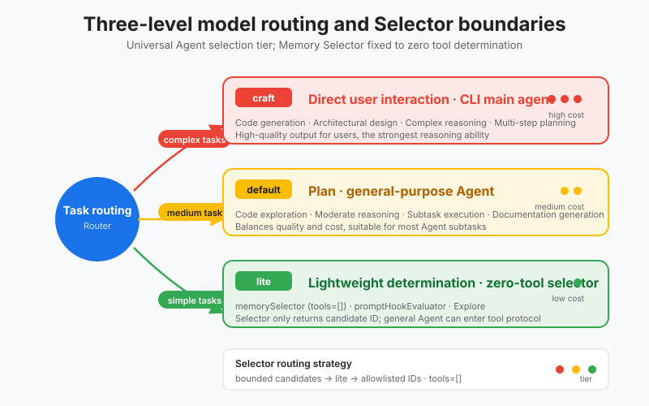
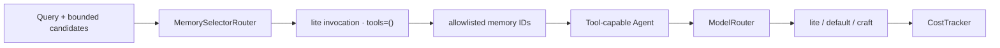

# s08: Model Routing - Use AI to Manage AI

[中文](README.md) · [English](README.en.md)
> *Let inexpensive models filter; reserve expensive models for reasoning and user-facing decisions.*
>
> **Harness layer: cost and latency control. A model is the agent's CPU.**

A small routing contract maps task roles to lite, default, or craft model tiers and keeps the Memory Selector tool-free.



## Code Architecture Diagram



## Prerequisites

The examples use named model tiers and deterministic cost metadata, so routing can be tested without a provider key.

## WorkBuddy-Style Mechanisms in This Chapter

The lesson maps task roles and effort levels to model tiers while keeping routing decisions inspectable and measurable.

## Common Mistakes

Do not route every task to the most expensive model or let model selection leak into each individual tool and memory call.

## How It Works

```python
request = MemorySelectionRequest(
    query="previous login decision",
    candidates=candidates,
    limit=3,
)
result = MemorySelectorRouter(router).select(request)

assert result.route.model.tier is ModelTier.LITE
assert result.route.tools == ()
```

## The Problem

The harness needs to balance quality, latency, and cost while choosing a model appropriate to the work being performed.

## The Solution

```
┌──────────────────────────────────────────────────────────────┐
│                     ModelRouter                               │
│                                                              │
│   任务来了 → 判断难度 → 路由到对应层级                         │
│                                                              │
│   ┌──────────┐  ┌──────────────┐  ┌──────────────┐          │
│   │  lite    │  │   default    │  │   craft      │          │
│   │  (便宜)   │  │   (中等)     │  │   (贵)       │          │
│   │          │  │              │  │              │          │
│   │ $0.25/M  │  │  $3/M        │  │  $15/M       │          │
│   │ 粗筛/分类 │  │  规划/执行    │  │  用户交互     │          │
│   └──────────┘  └──────────────┘  └──────────────┘          │
│      ▲               ▲                 ▲                     │
│      │               │                 │                     │
│  memorySelector    Plan             CLI 主 Agent              │
│  promptHookEval    general-purpose   (直接面对用户)            │
│  Explore           compact                                    │
│                                                              │
└──────────────────────────────────────────────────────────────┘
```

## The AI-Manages-AI Pattern

A lightweight selector can narrow candidates or choose an effort level before the main agent spends the budget needed for deeper reasoning.

## How It Works

### The `auto` Mode

```
能力/成本轴:

低成本 ──────────────────────────────────────────── 高成本
  │                                                    │
  │   lite              default             craft      │
  │   $0.25/M           $3/M                $15/M      │
  │   粗筛/分类          规划/执行            推理/交互   │
  │                                                    │
  │   ◄── 能力弱                          能力强 ──►   │
  │   ◄── 延迟低                          延迟高 ──►   │
  │   ◄── 并发多                          并发少 ──►   │
```

### Cost Estimate

### All-Craft Baseline

```
用户: "上次修那个 bug 的方案是什么？"
         │
         ▼
┌─────────────────────────────┐
│     主 Agent (craft)         │
│                             │
│  上下文:                     │
│  - 50 条记忆 (全量)          │  ← 90% 无关
│  - 35 个工具定义             │  ← 大部分用不到
│  - 10 个文件内容             │  ← 大部分不相关
│  - 用户问题                  │
│                             │
│  → 在垃圾堆里找东西          │
│  → 贵模型做低价值的事        │
└─────────────────────────────┘
成本: 50K tokens × $15/M = $0.75
```

```
用户: "上次修那个 bug 的方案是什么？"
         │
         ▼
┌─────────────────────────────┐
│  memorySelector (lite)       │  ← 第 1 步: 粗筛
│                             │
│  输入: 50 条记忆 + 用户问题   │
│  输出: 3 条相关记忆 ID        │  ← 只选 3 条
│                             │
│  成本: 5K tokens × $0.25/M  │
│       = $0.00125            │
└──────────┬──────────────────┘
           │ 3 条记忆
           ▼
┌─────────────────────────────┐
│     主 Agent (craft)         │  ← 第 2 步: 推理
│                             │
│  上下文:                     │
│  - 3 条相关记忆              │  ← 全部相关
│  - 用户问题                  │
│                             │
│  → 在精选内容上深度推理       │
└─────────────────────────────┘
成本: 5K tokens × $15/M = $0.075

总成本: $0.00125 + $0.075 = $0.076
对比全量: $0.75 → 节省 90%
```

### Tiered Routing

```python
# 同一个模型，不同 effort
response = client.messages.create(
    model="deepseek-v4-pro",
    effort="high",        # ← 推理深度
    summary="auto",       # ← 自动摘要思维链
    messages=messages,
)
```

### WorkBuddy Architecture Comparison

This comparison maps model selection, effort levels, and cost-aware routing to the corresponding WorkBuddy-style harness boundary.

```
auto 路由逻辑 (简化):

任务复杂度评估
    │
    ├── 简单 (分类/搜索/过滤) ──► lite
    ├── 中等 (规划/执行/压缩) ──► default
    └── 复杂 (推理/用户交互)   ──► craft
```

## `product.json`: Model Registry

### Model Tag Resolution

### `effort` and `summary`

## WorkBuddy Architecture Comparison

This comparison maps model selection, effort levels, and cost-aware routing to the corresponding WorkBuddy-style harness boundary.

### Run

```json
{
  "models": [
    {
      "id": "default",
      "name": "Default",
      "contextWindow": 200000,
      "maxOutput": 24000,
      "features": ["tool_calling"]
    },
    {
      "id": "default-1.2",
      "name": "Claude-4.0-Sonnet",
      "contextWindow": 200000,
      "maxOutput": 24000,
      "features": ["reasoning", "vision"]
    },
    {
      "id": "lite",
      "name": "Lightweight",
      "features": ["cost_optimization"]
    }
  ]
}
```

### Exercises

Use these exercises to change one part of model selection, effort levels, and cost-aware routing at a time and explain the resulting contract.

```javascript
// Agent 定义中指定模型标签，而非具体 model ID
const AgentDefinitions = {
    CLI:              { model: "craft"   },  // 标签
    GENERAL_PURPOSE:  { model: "default" },
    EXPLORE:          { model: "lite"    },
    PLAN:             { model: "default" },
    COMPACT:          { model: "default" },
    MEMORY_SELECTOR:  { model: "lite"    },
    PROMPT_HOOK_EVAL: { model: "lite"    },
    // ...
};

// 运行时根据标签解析为具体 model ID
function resolveModel(tag) {
    // "craft"   → 用户配置的 craft 模型 (如 Claude-4.0-Sonnet)
    // "default" → 用户配置的 default 模型
    // "lite"    → 用户配置的 lite 模型
    return userConfig.modelMapping[tag];
}
```

### Next Lesson

```javascript
// 推理模型的参数注入
function buildModelParams(model, agentConfig) {
    const params = { model: resolveModel(agentConfig.model) };

    if (model.features.includes("reasoning")) {
        params.reasoning = {
            effort: agentConfig.effort || "medium",
            summary: agentConfig.summary || "auto",
        };
    }

    return params;
}
```

## Code Walkthrough

```python
# 路由表：Agent → 模型层级
AGENT_MODEL_MAP = {
    "CLI":                   ModelTier.CRAFT,
    "general-purpose":       ModelTier.DEFAULT,
    "Explore":               ModelTier.LITE,
    "Plan":                  ModelTier.DEFAULT,
    "compact":               ModelTier.DEFAULT,
    "memorySelector":        ModelTier.LITE,
    "promptHookEvaluator":   ModelTier.LITE,
}

def route_request(self, agent_name: str) -> ModelInfo:
    tier = AGENT_MODEL_MAP.get(agent_name, ModelTier.DEFAULT)
    return self.models[tier]
```

## Run

```bash
python s08_model_routing/code.py
```

## Exercises

Use these exercises to change one part of model selection, effort levels, and cost-aware routing at a time and explain the resulting contract.

## Next Lesson

- A small routing contract maps task roles to lite, default, or craft model tiers and keeps the Memory Selector tool-free.

**Reference tables**

| Comparison | Memory Selector | General Tool Agent |
|---|---|---|
| Input | Query plus bounded retrieved candidates | User goal, context, and tool catalog |
| Output | Stable IDs from the candidate set | Text or a tool call |
| Tools | `tools=()`; schemas are rejected | Can discover, select, and execute tools |
| Side effects | None; produces one derived selection | May read files or call external systems |
| Failure handling | Drop unknown IDs, deduplicate, and cap the result | Handled by the tool protocol and permission layer |

| Tier | Role | Cost | Typical use |
|------|------|------|---------|
| **lite** | Filtering, classification, and screening | ~$0.25/M | Memory selection, hook evaluation, search |
| **default** | Planning, execution, and compaction | ~$3/M | General tasks, planning, context compaction |
| **craft** | Reasoning and user interaction | ~$15/M | Main CLI agent and complex reasoning |

| Model ID | Name | Context window | Max output | Features | Typical use |
|----------|------|-----------|---------|---------|---------|
| `default` | Default | 200K | 24K | Tool calling | Main Agent default |
| `deepseek-v4-pro` | Deepseek-V4-Pro | 1M | 50K | Reasoning + vision | Long-context reasoning |
| `glm-5.0-turbo` | GLM-5.0-Turbo | 200K | 48K | Agent optimized | Agent tasks |
| `glm-5v-turbo` | GLM-5v-Turbo | 200K | 38K | Native multimodal | Vision tasks |
| `hunyuan-2.0` | Hunyuan-2.0 | 128K | 16K | Reasoning + vision | Tencent model |
| `default-1.2` | Claude-4.0-Sonnet | 200K | 24K | Reasoning + vision | High-quality reasoning |
| `codewise-*` | Code family | - | 256 | Code completion | IDE completion |
| **`lite`** | Lightweight tier | - | - | Cost optimization | **Pre-screening** |

| Tier | Selection rule | Latency | Concurrency |
|------|---------|------|------|
| lite | Simple task, short output, no reasoning chain | Low | High |
| default | Context understanding and multi-step execution | Medium | Moderate |
| craft | Deep reasoning and direct user interaction | High | Low |

| Agent | Model tier | Reason |
|-------|------------|--------|
| CLI (main) | craft | Direct user interaction needs the strongest capability |
| general-purpose | default | General subtasks need tools and multiple steps |
| Explore | lite | Repository search and filtering need little deep reasoning |
| Plan | default | Architecture planning needs code understanding |
| compact | default | Context compaction must understand the conversation |
| contextSummary | default | Emergency summaries need understanding |
| memorySelector | lite | Select relevant records from memory |
| promptHookEvaluator | lite | Short safety decision |
| contentAnalyzer | lite | Classification |
| terminalTitleGenerator | lite | Very short output |
| summaryGenerator | lite | Compression task |
| insightsAnalyzer | lite | Lightweight analysis |
| agentInstructions | default | Agent instruction handling |
| fork | default | Child process with tool calls |
| statusline-setup | default | Status configuration |
| Bash | default | Bash execution with tools |

| Scenario | What lite does | What craft/default does |
|---|---|---|
| Memory retrieval | Select 3 records from 50 | Answer using the selected records |
| Hook evaluation | Decide whether output is safe | Show the result when safe |
| Code exploration | Search for relevant files | Read and understand file contents |
| Context compaction | Mark important passages | Generate the compact summary |

| Effort | Behavior | Typical use |
|--------|------|---------|
| `low` | Fast answer with little reasoning | Simple questions and status checks |
| `medium` | Balanced reasoning and speed | General tasks |
| `high` | Deep reasoning | Complex architecture and difficult bugs |

| Step | Agent | Tokens | Model | Cost |
|------|-------|--------|-------|------|
| 1 | Explore (file search) | 8K | craft | $0.12 |
| 2 | Plan (architecture analysis) | 15K | craft | $0.225 |
| 3 | memorySelector (memory search) | 5K | craft | $0.075 |
| 4 | promptHookEvaluator (hook) | 2K | craft | $0.03 |
| 5 | CLI (bug fix) | 20K | craft | $0.30 |
| **Total** | | **50K** | | **$0.75** |

| Step | Agent | Tokens | Model | Cost |
|------|-------|--------|-------|------|
| 1 | Explore (file search) | 8K | lite | $0.002 |
| 2 | Plan (architecture analysis) | 15K | default | $0.045 |
| 3 | memorySelector (memory search) | 5K | lite | $0.00125 |
| 4 | promptHookEvaluator (hook) | 2K | lite | $0.0005 |
| 5 | CLI (bug fix) | 20K | craft | $0.30 |
| **Total** | | **50K** | | **$0.349** |

The all-craft baseline costs about $0.75 for this example, while tiered
routing costs about $0.349, a reduction of roughly 53%.

The original Chinese README remains the primary-language reference. This English companion keeps the same code, diagrams, local paths, and chapter structure so readers can switch languages without losing runnable details.

Local references:

- [Reference](README.md)
- [Reference](README.en.md)
- [Reference](./images/model-routing-en.svg)
