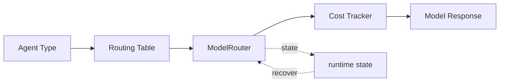

# s08: Model Routing — 用 AI 管理 AI, 便宜的做粗筛, 贵的做推理

> *"用 AI 管理 AI — 便宜的做粗筛, 贵的做推理"* — 模型分级路由。
>
> **Harness 层**: 成本优化 — 模型是 agent 的 CPU。

---


## 代码架构图



## 学习前置知识

- 模型路由是成本、延迟、质量的权衡。
- 分类、筛选、格式化适合轻模型; 深推理、最终决策适合强模型。
- 路由本身也要可观测, 否则省钱会变成随机降智。

## 本章抓住的 WorkBuddy-style 机制

- 把公开架构研究中的“用 AI 管理 AI”抽象为 lite/default/craft 三类槽位。
- 让辅助任务和主推理任务走不同模型预算。
- 记录路由原因, 便于调试和评估。

## 常见误区

- 所有任务都用最强模型, 成本会失控。
- 所有任务都用便宜模型, 关键步骤质量会不稳。
- 只按关键词路由, 容易被复杂任务误导。
## 问题

s10 讲了 多类 Agent：CLI 主 Agent、Explore、Plan、compact、memorySelector、promptHookEvaluator……每个 Agent 各司其职。

但这里有个问题：**它们都该用同一个模型吗？**

假设你用最贵的 Claude-4.0-Sonnet（约 $15/M tokens）跑所有任务：

- memorySelector 需要从 50 条记忆中选 3 条相关——这是简单分类，用 $15/M 的模型？
- promptHookEvaluator 判断一条 hook 输出是否安全——这是 yes/no 判断，用 $15/M 的模型？
- Explore 在代码库里搜索文件——这是 grep + 总结，用 $15/M 的模型？
- CLI 主 Agent 和用户直接对话——这个确实需要最强的。

一次对话中，后台可能跑 5-10 个子 Agent。如果全用最贵的模型，一次对话成本 $0.5+，一天 100 次对话就是 $50+。更重要的是，**大量低难度任务塞进高能力模型，上下文质量反而下降**——模型被无聊的分类任务淹没，推理深度被稀释。

---

## 解决方案

**模型分级路由**：不是所有任务都用同一个模型，而是按任务难度路由到不同成本层级。

```
┌──────────────────────────────────────────────────────────────┐
│                     ModelRouter                               │
│                                                              │
│   任务来了 → 判断难度 → 路由到对应层级                         │
│                                                              │
│   ┌──────────┐  ┌──────────────┐  ┌──────────────┐          │
│   │  lite    │  │   default    │  │   craft      │          │
│   │  (便宜)   │  │   (中等)     │  │   (贵)       │          │
│   │          │  │              │  │              │          │
│   │ $0.25/M  │  │  $3/M        │  │  $15/M       │          │
│   │ 粗筛/分类 │  │  规划/执行    │  │  用户交互     │          │
│   └──────────┘  └──────────────┘  └──────────────┘          │
│      ▲               ▲                 ▲                     │
│      │               │                 │                     │
│  memorySelector    Plan             CLI 主 Agent              │
│  promptHookEval    general-purpose   (直接面对用户)            │
│  Explore           compact                                    │
│                                                              │
└──────────────────────────────────────────────────────────────┘
```

| 层级 | 角色 | 成本 | 适用场景 |
|------|------|------|---------|
| **lite** | 粗筛、分类、过滤 | ~$0.25/M | 记忆筛选、hook 评估、搜索 |
| **default** | 规划、执行、压缩 | ~$3/M | 通用任务、规划、上下文压缩 |
| **craft** | 推理、用户交互 | ~$15/M | CLI 主 Agent、复杂推理 |

核心原则：**便宜的做粗筛，贵的做推理**。

---

## 模型矩阵

WorkBuddy 的 `product.json` 定义了 12+ 个可用模型，覆盖不同厂商、不同能力、不同价位：

| Model ID | 名称 | 上下文窗口 | 最大输出 | 特性 | 典型用途 |
|----------|------|-----------|---------|------|---------|
| `default` | Default | 200K | 24K | Tool calling | 主 Agent 默认 |
| `deepseek-v4-pro` | Deepseek-V4-Pro | 1M | 50K | Reasoning + Vision | 超长上下文推理 |
| `glm-5.0-turbo` | GLM-5.0-Turbo | 200K | 48K | Agent 优化 | Agent 场景 |
| `glm-5v-turbo` | GLM-5v-Turbo | 200K | 38K | 原生多模态 | 视觉任务 |
| `hunyuan-2.0` | Hunyuan-2.0 | 128K | 16K | Reasoning + Vision | 腾讯自研 |
| `default-1.2` | Claude-4.0-Sonnet | 200K | 24K | Reasoning + Vision | 高质量推理 |
| `codewise-*` | Code 系列 | - | 256 | 代码补全 | IDE 补全 |
| **`lite`** | 轻量模型 | - | - | 成本优化 | **预筛选** |

几个关键细节：

- **`lite`** 不是一个具体模型，而是一个**成本标签**——告诉路由层"用最便宜的"
- **`default`** 是主 Agent 的默认选择，平衡能力和成本
- **`craft`** 是 CLI 主 Agent 的标签，面向用户交互，需要最强能力
- 推理类模型支持 `effort`（low/medium/high）和 `summary`（auto）参数

---

## 工作原理

### 模型分级: lite / default / craft

```
能力/成本轴:

低成本 ──────────────────────────────────────────── 高成本
  │                                                    │
  │   lite              default             craft      │
  │   $0.25/M           $3/M                $15/M      │
  │   粗筛/分类          规划/执行            推理/交互   │
  │                                                    │
  │   ◄── 能力弱                          能力强 ──►   │
  │   ◄── 延迟低                          延迟高 ──►   │
  │   ◄── 并发多                          并发少 ──►   │
```

三级的划分逻辑：

| 层级 | 选择依据 | 延迟 | 并发 |
|------|---------|------|------|
| lite | 任务简单，输出短，不需要推理链 | 低 | 可以大量并发 |
| default | 需要理解上下文，多步执行 | 中 | 适中 |
| craft | 需要深度推理，直接面对用户 | 高 | 少 |

### Agent-Model 映射

s10 的 多类 Agent，每个都绑定了模型层级：

| Agent | 模型层级 | 为什么 |
|-------|---------|--------|
| CLI (主) | craft | 直接和用户对话，需要最强能力 |
| general-purpose | default | 通用子任务，需要工具调用和多步执行 |
| Explore | lite | 代码库搜索/过滤，不需要深度推理 |
| Plan | default | 架构规划，需要理解代码但不需要最高质量 |
| compact | default | 上下文压缩，需要理解对话内容 |
| contextSummary | default | 紧急摘要，需要理解能力 |
| memorySelector | lite | 从记忆库中选相关条目，简单分类 |
| promptHookEvaluator | lite | 评估 hook 输出是否安全，yes/no 判断 |
| contentAnalyzer | lite | 内容分析，分类任务 |
| terminalTitleGenerator | lite | 生成终端标题，极短输出 |
| summaryGenerator | lite | 会话摘要，压缩任务 |
| insightsAnalyzer | lite | 洞察分析，轻量级 |
| agentInstructions | default | 处理 Agent 指令，需要理解 |
| fork | default | 分叉子进程，需要工具调用 |
| statusline-setup | default | 状态栏配置，需要理解 |
| Bash | default | Bash 命令执行，需要工具调用 |

规律：**后台跑的内部 Agent 多用 lite，面向用户的用 craft，中间的用 default**。

### "用 AI 管理 AI" 哲学

这是 WorkBuddy 最核心的成本优化思路。

**传统做法**：把所有记忆、所有工具、所有代码塞进主 Agent 的上下文。

```
用户: "上次修那个 bug 的方案是什么？"
         │
         ▼
┌─────────────────────────────┐
│     主 Agent (craft)         │
│                             │
│  上下文:                     │
│  - 50 条记忆 (全量)          │  ← 90% 无关
│  - 35 个工具定义             │  ← 大部分用不到
│  - 10 个文件内容             │  ← 大部分不相关
│  - 用户问题                  │
│                             │
│  → 在垃圾堆里找东西          │
│  → 贵模型做低价值的事        │
└─────────────────────────────┘
成本: 50K tokens × $15/M = $0.75
```

**WorkBuddy 做法**：先用便宜的 lite 模型粗筛，再用贵的模型处理过滤后的结果。

```
用户: "上次修那个 bug 的方案是什么？"
         │
         ▼
┌─────────────────────────────┐
│  memorySelector (lite)       │  ← 第 1 步: 粗筛
│                             │
│  输入: 50 条记忆 + 用户问题   │
│  输出: 3 条相关记忆 ID        │  ← 只选 3 条
│                             │
│  成本: 5K tokens × $0.25/M  │
│       = $0.00125            │
└──────────┬──────────────────┘
           │ 3 条记忆
           ▼
┌─────────────────────────────┐
│     主 Agent (craft)         │  ← 第 2 步: 推理
│                             │
│  上下文:                     │
│  - 3 条相关记忆              │  ← 全部相关
│  - 用户问题                  │
│                             │
│  → 在精选内容上深度推理       │
└─────────────────────────────┘
成本: 5K tokens × $15/M = $0.075

总成本: $0.00125 + $0.075 = $0.076
对比全量: $0.75 → 节省 90%
```

**核心洞察**：不是把所有信息塞给贵模型，而是让便宜模型先做粗筛，贵模型只看筛选后的结果。成本下降一个数量级，上下文质量反而更好。

这个模式在 WorkBuddy 中反复出现：

| 场景 | lite 做什么 | craft/default 做什么 |
|------|------------|---------------------|
| 记忆检索 | 从 50 条选 3 条 | 基于 3 条回答用户 |
| Hook 评估 | 判断输出是否安全 | 安全则展示给用户 |
| 代码探索 | 搜索相关文件 | 阅读并理解文件内容 |
| 上下文压缩 | 标记重要段落 | 生成压缩摘要 |

### effort 参数 (low/medium/high)

推理类模型（如 deepseek-v4-pro、hunyuan-2.0）支持 `effort` 参数，控制推理深度：

| effort | 行为 | 适用场景 |
|--------|------|---------|
| `low` | 快速回答，不深入推理 | 简单问题、状态查询 |
| `medium` | 平衡推理和速度 | 通用任务 |
| `high` | 深度推理，思维链完整 | 复杂架构、疑难 bug |

```python
# 同一个模型，不同 effort
response = client.messages.create(
    model="deepseek-v4-pro",
    effort="high",        # ← 推理深度
    summary="auto",       # ← 自动摘要思维链
    messages=messages,
)
```

这相当于在模型层级内部再分一档：同一个 craft 模型，low effort 可以接近 default 的成本，high effort 才是真正的"全力以赴"。

### auto 模式: 自动选择

除了手动指定 `lite`/`default`/`craft`，WorkBuddy 还支持 `auto` 模式——让系统自动选择最佳模型。

```
auto 路由逻辑 (简化):

任务复杂度评估
    │
    ├── 简单 (分类/搜索/过滤) ──► lite
    ├── 中等 (规划/执行/压缩) ──► default
    └── 复杂 (推理/用户交互)   ──► craft
```

实际实现中，`auto` 会根据任务类型、上下文长度、历史调用模式来决定。但 WorkBuddy 的默认策略更保守——大部分 Agent 显式绑定模型层级，不依赖 auto。

---

## 成本估算

以一次典型对话为例，用户问"帮我看看这个项目的架构，然后修复 src/auth.py 里的登录 bug"：

### 全 craft 方案（不分级）

| 步骤 | Agent | tokens | 模型 | 成本 |
|------|-------|--------|------|------|
| 1 | Explore (搜索文件) | 8K | craft | $0.12 |
| 2 | Plan (分析架构) | 15K | craft | $0.225 |
| 3 | memorySelector (找记忆) | 5K | craft | $0.075 |
| 4 | promptHookEvaluator (hook) | 2K | craft | $0.03 |
| 5 | CLI (修复 bug) | 20K | craft | $0.30 |
| **合计** | | **50K** | | **$0.75** |

### 分级路由方案

| 步骤 | Agent | tokens | 模型 | 成本 |
|------|-------|--------|------|------|
| 1 | Explore (搜索文件) | 8K | lite | $0.002 |
| 2 | Plan (分析架构) | 15K | default | $0.045 |
| 3 | memorySelector (找记忆) | 5K | lite | $0.00125 |
| 4 | promptHookEvaluator (hook) | 2K | lite | $0.0005 |
| 5 | CLI (修复 bug) | 20K | craft | $0.30 |
| **合计** | | **50K** | | **$0.349** |

**节省：53%**。而且 lite 模型延迟更低，用户等待时间也更短。

如果一天 100 次对话：
- 全 craft：$75/天 → $2,250/月
- 分级路由：$35/天 → $1,050/月
- **月省 $1,200**

---

## WorkBuddy 架构对照

### product.json — 模型注册表

WorkBuddy 的模型定义在 `product.json` 中，每个模型包含上下文窗口、输出限制、特性标签：

```json
{
  "models": [
    {
      "id": "default",
      "name": "Default",
      "contextWindow": 200000,
      "maxOutput": 24000,
      "features": ["tool_calling"]
    },
    {
      "id": "default-1.2",
      "name": "Claude-4.0-Sonnet",
      "contextWindow": 200000,
      "maxOutput": 24000,
      "features": ["reasoning", "vision"]
    },
    {
      "id": "lite",
      "name": "Lightweight",
      "features": ["cost_optimization"]
    }
  ]
}
```

### 模型标签路由

WorkBuddy 不直接用 model ID 路由，而是用**标签**（tag）：

```javascript
// Agent 定义中指定模型标签，而非具体 model ID
const AgentDefinitions = {
    CLI:              { model: "craft"   },  // 标签
    GENERAL_PURPOSE:  { model: "default" },
    EXPLORE:          { model: "lite"    },
    PLAN:             { model: "default" },
    COMPACT:          { model: "default" },
    MEMORY_SELECTOR:  { model: "lite"    },
    PROMPT_HOOK_EVAL: { model: "lite"    },
    // ...
};

// 运行时根据标签解析为具体 model ID
function resolveModel(tag) {
    // "craft"   → 用户配置的 craft 模型 (如 Claude-4.0-Sonnet)
    // "default" → 用户配置的 default 模型
    // "lite"    → 用户配置的 lite 模型
    return userConfig.modelMapping[tag];
}
```

这种标签机制让用户可以灵活更换底层模型——把 craft 从 Claude 换成 GLM，只需改配置，不用改代码。

### effort 与 summary 参数

推理模型在 API 调用时注入 `effort` 和 `summary`：

```javascript
// 推理模型的参数注入
function buildModelParams(model, agentConfig) {
    const params = { model: resolveModel(agentConfig.model) };

    if (model.features.includes("reasoning")) {
        params.reasoning = {
            effort: agentConfig.effort || "medium",
            summary: agentConfig.summary || "auto",
        };
    }

    return params;
}
```

---

## 代码 walkthrough

`code.py` 实现一个完整的模型路由 demo：

1. **ModelTier 枚举** — 定义 LITE / DEFAULT / CRAFT 三级
2. **ModelInfo 数据类** — 每个模型的成本、延迟、能力参数
3. **ModelRouter 类** — 核心：根据 Agent 名称路由到对应层级
   - `route_request(agent_name)` → 返回 ModelInfo
   - `call_model(model, prompt)` → 模拟 LLM 调用，返回 mock 响应
   - `track_cost(tier, tokens)` → 累计成本
4. **"用 AI 管理 AI" demo** — lite 模型先从 10 条记忆中选 3 条，craft 模型基于 3 条生成回答
5. **成本对比** — all-craft 方案 vs 分级路由方案，打印对比表
6. **Agent 循环** — 模拟一次完整对话，展示不同 Agent 使用不同模型

关键代码：

```python
# 路由表：Agent → 模型层级
AGENT_MODEL_MAP = {
    "CLI":                   ModelTier.CRAFT,
    "general-purpose":       ModelTier.DEFAULT,
    "Explore":               ModelTier.LITE,
    "Plan":                  ModelTier.DEFAULT,
    "compact":               ModelTier.DEFAULT,
    "memorySelector":        ModelTier.LITE,
    "promptHookEvaluator":   ModelTier.LITE,
}

def route_request(self, agent_name: str) -> ModelInfo:
    tier = AGENT_MODEL_MAP.get(agent_name, ModelTier.DEFAULT)
    return self.models[tier]
```

---

## 运行

```bash
python s08_model_routing/code.py
```

不需要 API key——所有 LLM 响应都是 mock 的。观察重点：

1. **路由表**：不同 Agent 是否被路由到正确的模型层级？
2. **"用 AI 管理 AI" demo**：lite 模型是否正确筛选了记忆？craft 模型是否只看到筛选后的结果？
3. **成本对比**：分级路由比 all-craft 节省了多少？
4. **Agent 循环**：一次对话中，多少次用 lite、多少次用 default、多少次用 craft？

---

## 练习

1. 添加 `auto` 模式——根据任务类型（如 "code_search" vs "user_chat"）自动选择层级，而不是硬编码 Agent 映射
2. 实现 `effort` 参数——对推理类模型，同一层级内再分 low/medium/high 三档，影响成本和输出质量
3. 添加延迟模拟——lite 模型 200ms、default 800ms、craft 2000ms，计算分级路由 vs all-craft 的总延迟差异
4. 实现动态降级——当某层级模型不可用时（如 API 限流），自动降级到更便宜的层级

---

## 下一课

模型路由好了，多类 Agent 各自用对应的模型层级。但对话做完了就没了——下次打开同一个项目，之前聊了什么全忘了。s09 讲对话持久化——JSONL 追加日志、6 种事件类型、崩溃恢复。

s09 JSONL Transcript → 追加写入, 事件回放, 崩溃恢复。
