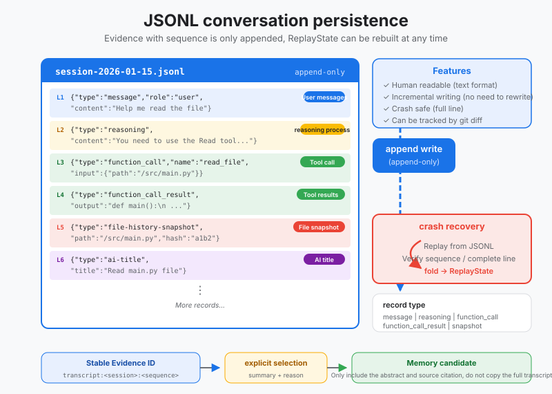
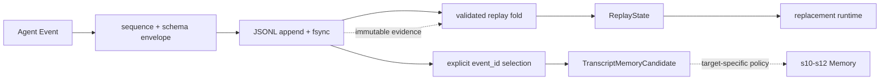

# s09: JSONL Transcript - Append Evidence and Rebuild Runtime State

[Chinese](README.md) · [English](README.en.md)
> *The transcript is evidence; replay state is derived from that evidence.*
>
> **Harness layer: persistence and crash recovery.**

Append-only JSONL records every session event, supports bounded replay, and keeps transcript evidence separate from long-term memory.



## Code Architecture Diagram



## Prerequisites

The lesson assumes a session can emit structured events and focuses on append-only persistence, tail recovery, and replay.

## WorkBuddy-Style Mechanisms in This Chapter

The lesson treats the transcript as an append-only event record that can be inspected and recovered after interruption.

## Common Mistakes

A transcript should not silently become long-term memory, and partial writes must not be mistaken for complete events.

## The Problem

The harness needs durable conversation history without coupling event recovery to the semantics of user or workspace memory.

## The Solution

```
┌──────────────────────────────────────────────────────────────────┐
│                      Session Process                              │
│                                                                  │
│   messages[] (in-memory)                                         │
│       │                                                          │
│       │ every event → append                                     │
│       ▼                                                          │
│   ~/.workbuddy/projects/<workspace>/<session>.jsonl              │
│   ┌────────────────────────────────────────────────┐            │
│   │ {"type":"message","role":"user","content":"..."}│  line 1   │
│   │ {"type":"reasoning","content":"Let me analyze"} │  line 2   │
│   │ {"type":"function_call","name":"read_file",...} │  line 3   │
│   │ {"type":"function_call_result","callId":"...",..}│  line 4   │
│   │ {"type":"file-history-snapshot","path":"main.py"}│  line 5   │
│   │ {"type":"message","role":"assistant","content":.}│  line 6   │
│   │ {"type":"ai-title","title":"Fix login bug"}     │  line 7   │
│   │ ...                                             │  (grows)  │
│   └────────────────────────────────────────────────┘            │
│       │                                                          │
│       │ crash? just read the file                                │
│       ▼                                                          │
│   replay(max_items=1000) → messages[] restored                   │
└──────────────────────────────────────────────────────────────────┘
```

## How It Works

### Six Event Types

```
~/.workbuddy/projects/
  ├── myproject/
  │   ├── session_abc123.jsonl    ← this conversation
  │   ├── session_def456.jsonl    ← the previous conversation
  │   └── session_ghi789.jsonl
  └── another-project/
      └── session_xyz000.jsonl
```

### Append-Only Writes

```jsonl
{"schema_version":1,"sequence":1,"session_id":"abc123","event_id":"transcript:abc123:1","recorded_at":"...","type":"message","role":"user","content":"fix the bug"}
{"schema_version":1,"sequence":2,"session_id":"abc123","event_id":"transcript:abc123:2","recorded_at":"...","type":"reasoning","content":"Let me analyze the error..."}
{"schema_version":1,"sequence":3,"session_id":"abc123","event_id":"transcript:abc123:3","recorded_at":"...","type":"function_call","name":"read_file","arguments":{"path":"main.py"},"callId":"call_001"}
{"schema_version":1,"sequence":4,"session_id":"abc123","event_id":"transcript:abc123:4","recorded_at":"...","type":"function_call_result","callId":"call_001","output":{"content":"..."}}
```

### Session Replay (replay <= 1000)

```python
def append(self, event: dict) -> None:
    envelope = {
        "schema_version": 1,
        "sequence": self.next_sequence(),
        "recorded_at": utc_now(),
        **deepcopy(event),
    }
    os.write(fd, (json.dumps(envelope) + "\n").encode())
    os.fsync(fd)
```

### Crash Recovery

```
CODEBUDDY_SESSION_MAX_ITEMS = 1000
```

```
                    JSONL File (may be very long)
    ┌──────────────────────────────────────────────────────┐
    │ line 1   {"type":"message",...}                     │
    │ line 2   {"type":"reasoning",...}                   │
    │ ...                                                 │
    │ line 995  {"type":"message",...}                    │
    │ line 996  {"type":"function_call",...}   ──┐        │
    │ line 997  {"type":"function_call_result".. │        │
    │ line 998  {"type":"message",...}           │ read   │
    │ line 999  {"type":"reasoning",...}         │ last   │
    │ line 1000 {"type":"message",...}           │ 1000   │
    │ line 1001 {"type":"ai-title",...}   ──────┘        │
    │ ...                                                 │
    └──────────────────────────────────────────────────────┘
                            │
                            ▼
              replay(max_items=1000)
                            │
                            ▼
                reconstructed messages[]
                 (last 1000 events)
```

```python
def replay(self, max_items=1000):
    events = self._read_all_events()
    recent = events[-max_items:]  # Take last N events

    messages = []
    for event in recent:
        msg = self._event_to_message(event)
        if msg:
            messages.append(msg)
    return messages
```

### Why Corruption Keeps Only a Partial Tail

```
1. Session process crashes
       │
       ▼
2. On restart: open <session>.jsonl
       │
       ▼
3. Read backwards (last N items)
       │
       ▼
4. Reconstruct messages[] from events
       │
       ▼
5. Resume agent loop
```

```python
def recover(self):
    events = self._read_all_events()
    messages = self.replay()

    # Also recover metadata
    title = None
    file_snapshots = []
    for event in events:
        if event.get("type") == "ai-title":
            title = event.get("title")
        elif event.get("type") == "file-history-snapshot":
            file_snapshots.append(...)

    return {
        "messages": messages,
        "title": title,
        "file_snapshots": file_snapshots,
        "total_events": len(events),
    }
```

### Transcript Is Not Memory

### Transcript to Memory Requires Explicit Selection

### JSONL vs SQLite

```python
candidate = transcript.select_memory_candidate(
    "transcript:session_abc123:17",
    summary="The project will use SQLite WAL.",
    reason="A persistence architecture decision explicitly confirmed by the user.",
)

# candidate.source_metadata() can be passed to the later Memory layer; it is not written to Memory here.
```

## Why JSONL

```
         Conversation content                          Metadata
         ────────                          ──────
    ┌──────────────┐              ┌──────────────────┐
    │ session.jsonl│              │   workbuddy.db   │
    │              │              │                  │
    │ message      │              │ sessions table   │
    │ reasoning    │              │  (id, title,     │
    │ function_call│              │   cwd, status)   │
    │ result       │              │                  │
    │ snapshot     │              │ usage_stats      │
    │ ai-title     │              │  (tokens, cost)  │
    │              │              │                  │
    │ (source of   │              │ automations      │
    │  truth)      │              │  (schedule, rrule│
    └──────────────┘              │   prompt)        │
                                  └──────────────────┘
```

## Append

### Crash Recovery

### Portability

### Sequential Scan

### Schema Evolution

### WorkBuddy Architecture Comparison

This comparison maps append-only event transcripts, replay, and crash recovery to the corresponding WorkBuddy-style harness boundary.

## WorkBuddy Architecture Comparison

This comparison maps append-only event transcripts, replay, and crash recovery to the corresponding WorkBuddy-style harness boundary.

### Event Format

```
~/.workbuddy/projects/<workspace>/<session_id>.jsonl
```

### Replay Rules

```jsonl
{"type":"message","role":"user","content":"fix the bug","uuid":"a1b2c3","timestamp":1709123456}
{"type":"reasoning","content":"Let me analyze...","uuid":"d4e5f6","timestamp":1709123457}
{"type":"function_call","name":"read_file","arguments":{"path":"main.py"},"callId":"call_001","uuid":"g7h8i9"}
```

### Write-Time Guarantees

```javascript
const CODEBUDDY_SESSION_MAX_ITEMS = 1000;
```

### Code Walkthrough

```
User sends a message     → append message event
Model starts reasoning     → append reasoning event
Model calls a tool     → append function_call event
Tool returns a result     → append function_call_result event
File is modified       → append file-history-snapshot event
Session title is generated     → append ai-title event
```

## Code Walkthrough

Read the writer, tail validator, replay path, and event projection together to see how a partial append is handled.

## Run

```bash
python s09_jsonl_transcript/code.py
```

## Exercises

Use these exercises to change one part of append-only event transcripts, replay, and crash recovery at a time and explain the resulting contract.

## Next Lesson

- Append-only JSONL records every session event, supports bounded replay, and keeps transcript evidence separate from long-term memory.

**Reference tables**

| JSONL `type` | Purpose | Corresponding LLM `messages[]` |
|--------------|------|---------------------|
| `message` | User or assistant message | `{"role": "user/assistant", "content": "..."}` |
| `reasoning` | Reasoning metadata | No direct mapping |
| `function_call` | Tool invocation | `tool_use` block in an assistant message |
| `function_call_result` | Tool result | `tool_result` block in a user message |
| `file-history-snapshot` | File-state snapshot | No mapping; used for file tracking |
| `ai-title` | Generated session title | No mapping; session metadata |

| Condition | Reason |
|------|------|
| Must reference a fully persisted `event_id` | Memory can trace it to one session and sequence |
| Must include a summary and selection reason | Retention is an explainable decision, not a history copy |
| Only `message` and `file-history-snapshot` may be promoted | Reasoning, tool calls, tool bodies, and titles do not promote directly |
| Candidate carries no source event body | Large results remain owned by transcript/artifact storage |
| s10-s12 apply their own target-domain policy | Workspace, user, and remote memory have different scopes |

| Dimension | JSONL | SQLite |
|------|-------|--------|
| **Use** | Conversation content and source truth | Metadata and indexes |
| **Write mode** | Append-only | CRUD |
| **Recovery** | Replay the file | Backup and restore |
| **Query** | Sequential scan | SQL |
| **Content** | Messages, tool calls, and reasoning | Sessions, usage, and automations |
| **File** | One `.jsonl` per session | One `.db` file |
| **Concurrency** | One independent file per session | Connection pool and locks |
| **Schema** | Each line is independently parsed | Tables and migrations |

The original Chinese README remains the primary-language reference. This English companion keeps the same code, diagrams, local paths, and chapter structure so readers can switch languages without losing runnable details.

Local references:

- [Reference](README.md)
- [Reference](README.en.md)
- [Reference](./images/jsonl-transcript-en.svg)
