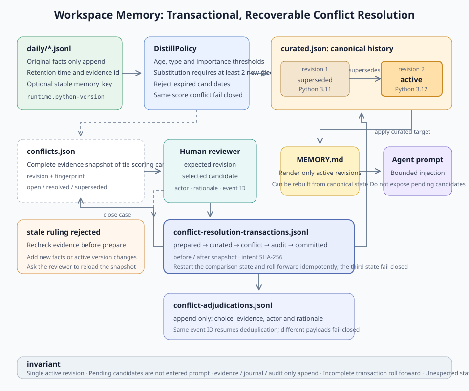
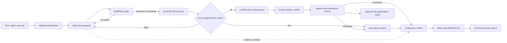

# s10: Workspace Memory - Turn Work Logs into Durable Project Facts

[Chinese](README.md) · [English](README.en.md)
> *Workspace memory records facts that belong to a project, not to a person or a single turn.*
>
> **Harness layer: scoped memory and durable project context.**

The lesson shows how to record, normalize, deduplicate, and recover project facts without treating every conversation sentence as memory.



## Code Architecture Diagram



## Storage and Authority

Daily facts are evidence, curated history is the adjudicated record, and the rendered memory file contains only active context.

## How a Fact Enters Long-Term Memory

```text
project/
└── .learn_workbuddy/
    └── memory/
        ├── daily/
        │   ├── 2026-08-07.jsonl
        │   └── 2026-08-08.jsonl
        ├── curated.json
        ├── conflicts.json
        ├── conflict-adjudications.jsonl
        ├── conflict-resolution-transactions.jsonl
        └── MEMORY.md
```

## Record the Fact

### Normalize and Deduplicate

```python
memory.append_daily_log(
    "SQLite must run in WAL mode.",
    kind=FactKind.DECISION,
    importance=5,
    memory_key="storage.sqlite.journal-mode",
    source="agent",
    evidence={"file": "storage.py"},
)
```

### Resolve Same-Key Conflicts

```text
age reaches 30 days
AND type is one of decision / convention / pitfall
AND (importance >= 4 OR reappears after normalization >= 2 times)
```

### Append-Only Decisions

### Preserve Source Evidence

```python
case = memory.list_conflicts()[0]
choice = next(c for c in case.candidates if c.content == "Use Postgres.")

event = memory.resolve_conflict(
    case.conflict_id,
    choice.candidate_id,
    expected_revision=case.revision,
    actor="reviewer@example.com",
    rationale="Production requires PostgreSQL extensions.",
    event_id="review:storage-database:42",
)
```

### Atomic Updates, Locks, and Recovery

```text
daily fact log ──select──> curated.json ──render──> MEMORY.md
       │                    │
       └──── retained ──────┘  evidence_ids
```

### Prompt Injection Boundary

```text
prepared
  -> curated_applied
  -> conflict_closed
  -> audit_appended
  -> committed
```

## Main Code Paths

The main paths are append, distill, resolve, recover, and render; each path preserves provenance and workspace scope.

## Failure and Recovery Tests

```text
append_daily_log
  -> validate kind / importance / content / optional memory_key
  -> attach workspace_id + fact_id + UTC timestamp
  -> append one JSONL record + fsync

distill
  -> load facts older than cutoff
  -> reject unstable kinds
  -> preserve legacy content groups; group keyed facts by conflict domain
  -> apply importance/repetition gate
  -> reject stale challengers; persist tied candidates as a conflict case
  -> merge evidence or append a linked revision
  -> atomically replace curated.json / conflicts.json / MEMORY.md

human review
  -> list open conflict snapshot
  -> submit expected revision + selected candidate + source event
  -> reject changed evidence or reused event IDs
  -> append prepared intent with before/after snapshots
  -> apply curated state -> close conflict -> append audit
  -> append committed phase; retry each boundary idempotently

restart
  -> resolve the same project scope
  -> validate workspace_id and schema
  -> replay every non-committed resolution transaction
  -> reload daily facts + curated state + conflict queue + adjudication audit
  -> rebuild bounded prompt context
```

## Where It Sits in the Loop

```bash
python3 s10_workspace_memory/code.py --demo
```

```bash
python3 -m pytest -q tests/test_workspace_memory.py
```

```bash
python3 s10_workspace_memory/code.py
```

```text
/resolve <conflict_id> <revision> <candidate_id> <event_id> <rationale>
```

## Run


## Common Mistakes

Do not promote every sentence to memory, overwrite history during deduplication, or resolve a conflict without recording the decision and evidence.

## Exercises

Use these exercises to change one part of workspace-owned durable facts, provenance, and atomic recovery at a time and explain the resulting contract.

## Next Lesson

- The lesson shows how to record, normalize, deduplicate, and recover project facts without treating every conversation sentence as memory.

**Reference tables**

| File | Identity | Write method | Can serve as evidence |
|---|---|---|---|
| `daily/*.jsonl` | Raw fact log | One-record `O_APPEND` | Yes |
| `curated.json` | Machine truth for curated state | Temporary file + `os.replace` | Traceable to evidence IDs |
| `conflicts.json` | Pending and historical conflict snapshots | Temporary file + `os.replace` | Yes; keeps candidates and revisions |
| `conflict-adjudications.jsonl` | Human adjudication audit stream | One-event `O_APPEND` | Yes; actor, rationale, and selected evidence |
| `conflict-resolution-transactions.jsonl` | Multi-file recovery log | Append-only phase events | Yes; intent hash and commit phase |
| `MEMORY.md` | Derived human/prompt view | Rebuilt atomically from curated state | No; always rebuildable |

| Type | Example | Distilled by default? |
|---|---|---|
| `decision` | Choose SQLite WAL | Yes |
| `convention` | Paths must be relative to the workspace | Yes |
| `pitfall` | Never write tokens into memory | Yes |
| `outcome` | This test passed | No; keep it in the recent log |

The original Chinese README remains the primary-language reference. This English companion keeps the same code, diagrams, local paths, and chapter structure so readers can switch languages without losing runnable details.

Local references:

- [Reference](README.md)
- [Reference](README.en.md)
- [Reference](./images/workspace-memory-en.svg)
- [Reference](./images/three-layer-memory-en.svg)
