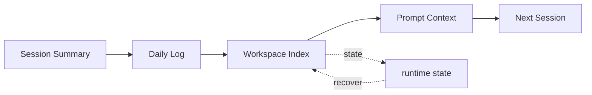

# s10: Workspace Memory — 每天的工作要记下来, 只追加不覆盖

> *"每天的工作要记下来, 只追加不覆盖"* — 日志追加, 主题蒸馏, 30 天保留。
>
> **Harness 层**: 记忆 — 三层记忆的最内层。

---


## 代码架构图



## 学习前置知识

- 工作区记忆是项目局部知识, 不应该污染全局用户记忆。
- Append-only 日志适合事实记录, MEMORY.md 适合策展结论。
- 记忆写入需要节制, 不是所有对话都值得保存。

## 本章抓住的 WorkBuddy-style 机制

- 每日日志记录实质工作, 长期规则蒸馏到项目 MEMORY.md。
- 把公开架构研究中的三层记忆中“工作区层”做成本地实现。
- 演示记忆注入 prompt 的时机和字数预算。

## 常见误区

- 把临时输出都写入长期记忆, 会让记忆腐烂。
- 跨项目规则写进工作区, 会导致迁移困难。
- 没有蒸馏策略, 每日日志会越来越难检索。
## 问题

s01-s07 的 agent 有能力，但没记性。每次打开同一个项目，之前做了什么全忘了：

- 上次修了哪个 bug？
- 为什么这么改的？
- 项目里哪些文件是核心？

你会说：不是有 git log 吗？git 记录了"改了什么"，但不记录"为什么"和"想了什么"。而且 agent 的对话历史在关闭会话后就没了。

WorkBuddy 的三层记忆系统解决这个问题。工作区记忆是第三层——最局部、最项目相关的记忆。

---

## 解决方案

```
项目根目录/
├── .workbuddy/
│   └── memory/
│       ├── 2026-07-01.md    ← 每日日志 (追加, 不覆盖)
│       ├── 2026-07-02.md
│       ├── 2026-07-03.md
│       ├── ...
│       └── MEMORY.md        ← 长期策展笔记 (≤3,000 字符/会话)
```

| 文件 | 用途 | 写入时机 | 限制 |
|------|------|---------|------|
| `YYYY-MM-DD.md` | 当日工作日志 | 完成实质工作后 | 追加, 不覆盖 |
| `MEMORY.md` | 长期笔记 | 蒸馏旧日志时更新 | ≤3,000 字符/会话 |

---

## 工作原理

### 每日日志 — 追加模式

每天一个文件，命名 `YYYY-MM-DD.md`。完成实质工作后追加一条记录，**永远不覆盖已有内容**。

```markdown
## 2026-07-08 14:30 — Fixed auth bug

- Problem: Login failed on Safari due to cookie SameSite=None
- Root cause: Cookie set without Secure flag in auth.js:42
- Fix: Added `secure: true` to cookie options
- Files: src/auth.js, src/middleware/cookie.js
```

追加而非覆盖的原因：

1. **审计轨迹** — 可以追溯什么时间做了什么
2. **冲突避免** — 多个会话写同一文件不会互相覆盖
3. **简洁** — 当天的事在当天文件里，不用翻多个文件

### 什么算"实质工作"

| 记 | 不记 |
|---|------|
| 写了代码 | 打招呼 |
| 修了 bug | 简单查询（"这个函数叫什么"） |
| 写了报告 | 格式化文本 |
| 做了架构决策 | 查看文件内容 |
| 调试了问题 | 列出目录 |

规则：**如果做了会产生文件变化或决策的事，就记。否则不记。**

### MEMORY.md — 长期策展

每日日志是原始记录。但 30 天前的日志太旧了，翻起来费劲。WorkBuddy 的做法：

```
每日日志 (>30天) ──蒸馏──► MEMORY.md ──然后──► 删除原始日志
```

蒸馏 = 按主题归纳，保留精华，丢弃细节：

```
# 原始日志 (2026-06-01.md, 已删除)
## 10:00 — Set up ESLint
- Installed eslint, eslint-config-prettier
- Created .eslintrc.json with airbnb config
- Fixed 23 lint errors in src/
- Added pre-commit hook with husky

# 蒸馏后进入 MEMORY.md
- ESLint: airbnb config, husky pre-commit hook (2026-06)
```

### 3,000 字符限制

每次会话中，向 MEMORY.md 追加的内容**不超过 3,000 字符**。这不是文件总大小限制，是单次写入限制。原因：

- 防止 agent 过度写作，偏离"记忆"本质
- 保持 MEMORY.md 精炼——这是快速参考，不是长篇报告
- 如果一次有太多要记的，说明应该分成多次会话

### 记忆 vs 交付物

```
用户: "帮我修复 login bug"
                    │
                    ▼
         ┌──── agent 工作 ────┐
         │                     │
         ▼                     ▼
    交付物 (回复)          记忆 (日志)
    "已修复，改了 auth.js"   追加到 2026-07-08.md
    ↑ 用户看到的             ↑ agent 下次看到的
```

记忆是**补充**，不替代正常回复。用户先看到交付物，agent 同时在后台更新记忆。

### 写入时机

记忆更新发生在 **tool-call 阶段**，在最终文本回复之前：

```
agent loop:
  1. 用户消息进来
  2. 模型决定调用工具 (bash, read_file, ...)
  3. 执行工具 → 得到结果
  4. 模型继续推理...
  5. ┌── 工具阶段结束 ──┐
     │  ★ 更新记忆 ★   │  ← 在这里写日志
     └──────────────────┘
  6. 模型生成最终文本回复
  7. 回复展示给用户
```

---

## WorkBuddy 架构对照

### 记忆目录结构

```
WorkBuddy 的工作区记忆:
    {project_root}/.workbuddy/memory/
    ├── 2026-07-01.md    每日日志
    ├── 2026-07-02.md
    ├── ...
    └── MEMORY.md        长期策展笔记
```

### 写入逻辑

WorkBuddy 的记忆写入在 agent loop 的 tool-call 阶段触发：

```javascript
// agent bridge (simplified) — 记忆更新发生在 tool 阶段
async function runAgentLoop(session) {
    while (true) {
        const response = await callLLM(session.messages);

        if (response.stop_reason !== 'tool_use') {
            // 工具阶段结束 → 更新记忆
            if (session.didSubstantiveWork) {
                await updateWorkspaceMemory(session);
            }
            // 然后返回最终文本
            return response;
        }

        // 执行工具调用
        for (const block of response.content) {
            if (block.type === 'tool_use') {
                const result = await executeTool(block);
                if (isSubstantive(block.name, result)) {
                    session.didSubstantiveWork = true;
                }
            }
        }
    }
}

async function updateWorkspaceMemory(session) {
    const memoryDir = path.join(session.cwd, '.workbuddy', 'memory');
    const today = new Date().toISOString().slice(0, 10); // YYYY-MM-DD
    const logFile = path.join(memoryDir, `${today}.md`);

    // 追加模式 — 'a' flag, never 'w'
    const entry = formatMemoryEntry(session.workDone);
    await fs.appendFile(logFile, entry + '\n');
}
```

### 蒸馏逻辑

```javascript
// 定期蒸馏 — 30天前的日志
async function distillOldLogs(cwd) {
    const memoryDir = path.join(cwd, '.workbuddy', 'memory');
    const files = await fs.readdir(memoryDir);
    const cutoff = Date.now() - 30 * 24 * 60 * 60 * 1000;

    for (const file of files) {
        if (!file.match(/^\d{4}-\d{2}-\d{2}\.md$/)) continue;

        const fileDate = new Date(file.slice(0, 10));
        if (fileDate.getTime() < cutoff) {
            // 读取旧日志
            const content = await fs.readFile(path.join(memoryDir, file), 'utf-8');

            // 按主题蒸馏
            const distilled = await distillByTopic(content);

            // 追加到 MEMORY.md (不超过 3000 字符)
            await fs.appendFile(
                path.join(memoryDir, 'MEMORY.md'),
                distilled.slice(0, 3000) + '\n'
            );

            // 删除原始日志
            await fs.unlink(path.join(memoryDir, file));
        }
    }
}
```

### 三层记忆全景

工作区记忆是最局部的——只属于当前项目。换一个项目，这些记忆就不相关了。下图展示完整的三层记忆架构及其数据流：


```
Layer 1 (最远): 云端 Profile      ~/.workbuddy/cloud/profile  (s12)
Layer 2 (中):   用户级 MEMORY.md  ~/.workbuddy/MEMORY.md       (s11)
Layer 3 (最近): 工作区记忆          {project}/.workbuddy/memory/ (本课)
```

---

## 代码 walkthrough

`code.py` 模拟工作区记忆系统：

1. **WorkspaceMemory 类** — 管理每日日志和 MEMORY.md
2. **追加写入** — 使用 `'a'` 模式，永不覆盖
3. **实质工作判断** — 根据工具调用类型决定是否记录
4. **蒸馏模拟** — 30 天前的日志按主题归纳到 MEMORY.md
5. **3,000 字符限制** — 单次写入不超过限制
6. **Agent 集成** — 在 tool-call 阶段后、最终回复前更新记忆

---

## 运行

```bash
python s10_workspace_memory/code.py
```

观察重点：
- 完成实质工作后，`.workbuddy/memory/YYYY-MM-DD.md` 是否有追加记录？
- 同一天多次操作，日志是否追加而非覆盖？
- `/memory` 命令是否显示 MEMORY.md 内容？
- `/distill` 命令是否将旧日志蒸馏到 MEMORY.md？

---

## 练习

1. 修改蒸馏逻辑，按"文件路径"而非"主题"组织 MEMORY.md（如 `## src/auth.js` 下汇总所有相关记录）
2. 添加"记忆搜索"功能——agent 可以搜索历史日志中的关键词
3. 实现多项目记忆隔离——不同 cwd 的会话写入不同 `.workbuddy/memory/` 目录

---

## 下一课

工作区记忆解决了"项目内"的记忆。但有些偏好是跨项目的——"我喜欢用 tabs"、"别写注释"、"用中文回复"。这些放哪？s11 讲用户级记忆和身份系统。

s11 User Memory → MEMORY.md + SOUL/IDENTITY/USER/BOOTSTRAP。
