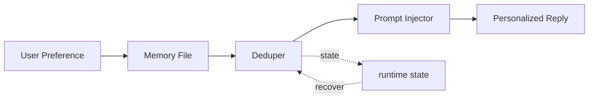

# s11: User Memory — 跨项目的偏好, 放用户级

> *"跨项目的偏好, 放用户级"* — MEMORY.md + SOUL/IDENTITY/USER/BOOTSTRAP。
>
> **Harness 层**: 记忆 — 三层记忆的中层。

---


## 代码架构图



## 学习前置知识

- 用户级记忆服务于跨项目偏好和身份, 生命周期比工作区更长。
- 身份、偏好、规则要分开, 否则更新和覆盖都困难。
- 本地用户记忆不同于服务端画像。

## 本章抓住的 WorkBuddy-style 机制

- 用 persona、identity、user、bootstrap 和 MEMORY.md 演示用户级上下文。
- 把用户偏好注入多个项目, 同时保留工作区覆盖能力。
- 为 s12 的云端 profile 做对照。

## 常见误区

- 把用户所有历史都塞进用户记忆, 会让 prompt 变脏。
- 没有冲突检测, 新旧偏好会互相打架。
- 把本地可编辑记忆和服务端自动画像混为一谈。
## 问题

s10 的工作区记忆解决了"项目内"的记忆。但有些偏好是跨项目的：

- "用 tabs 不用 spaces"
- "回复用中文"
- "我叫老王"
- "我在深圳，时区 UTC+8"

这些信息放在工作区记忆里不对——换个项目就没了。放在云端 Profile 里也不够——云端是隐式学习的，不够精确。有些规则是**必须严格遵守**的，不能靠概率推断。

WorkBuddy 的解法：用户级记忆。一个目录 `~/.workbuddy/`，跨所有项目共享，显式写入，强制执行。

---

## 解决方案

```
~/.workbuddy/
├── MEMORY.md       ← 跨项目记忆 (≤4,000 字符/会话)
├── persona/core.md         ← 核心性格、价值观、边界
├── persona/identity.md     ← 名字、物种、风格、emoji
├── persona/user.md         ← 用户信息: 名字、称呼、城市、备注
└── persona/bootstrap.md    ← 一次性引导文件 (用完即删)
```

| 文件 | 用途 | 写入方式 | 限制 |
|------|------|---------|------|
| `MEMORY.md` | 跨项目偏好和规则 | 显式写入 | ≤4,000 字符/会话 |
| `persona/core.md` | 核心性格 | 身份建立时写入 | 很少修改 |
| `persona/identity.md` | 名字/物种/emoji | 身份建立时写入 | 偶尔修改 |
| `persona/user.md` | 用户信息 | 对话中发现后写入 | 按需更新 |
| `persona/bootstrap.md` | 引导提示 | 首次启动创建 | 用完删除 |

---

## 工作原理

### persona/core.md — 核心性格

定义 agent 的"灵魂"——价值观、行为准则、边界。这是最底层的性格设定，很少修改。

```markdown
# Soul

Be genuinely helpful, not performatively helpful.

## Values
- Honesty over comfort. Don't sugarcoat problems.
- Action over explanation. Do the thing, don't just describe it.
- Concise by default. Long answers need justification.

## Boundaries
- Never guess at URLs or API endpoints.
- Never modify files without understanding them first.
- Ask before destructive operations.

## Vibe
- Direct, warm, slightly dry humor.
- Treat the user as a competent adult.
```

### persona/identity.md — 身份卡片

```markdown
# Identity

Name: WorkBuddy
Type: Desktop AI companion
Emoji: 🐝
Vibe: Reliable, sharp, doesn't waste your time.
```

### persona/user.md — 用户信息

```markdown
# User

Name: 老王
Call them: 老王
Pronouns: he/him
City: 深圳
Timezone: UTC+8

## Notes
- Prefers tabs over spaces
- Likes concise responses in Chinese
- Works primarily with Python and TypeScript
```

### persona/bootstrap.md — 一次性引导

首次启动时存在。引导 agent 通过对话了解用户，建立身份，然后**删除自己**。

```
~/.workbuddy/persona/bootstrap.md 存在?
  │
  ├── YES → 进入引导对话
  │         │
  │         ├── 了解用户名字、偏好
  │         ├── 确定 agent 性格和名字
  │         ├── 写入 persona/core.md, persona/identity.md, persona/user.md
  │         └── 删除 persona/bootstrap.md
  │
  └── NO → 正常启动 (身份已建立)
```

引导对话示例：

```
Agent: 嗨，我是你的 AI 助手。第一次见面，先认识一下？
       你希望我怎么称呼你？
User:  老王
Agent: 老王，好的。你在哪个城市？这样我能知道你的时区。
User:  深圳
Agent: 你希望我平时说话风格怎样？直接还是委婉？
User:  直接点
Agent: 明白了。你想给我起个名字吗？
User:  就叫你小蜂吧
Agent: [写入 persona/user.md, persona/identity.md, persona/core.md]
Agent: [删除 persona/bootstrap.md]
Agent: 好了老王，我是小蜂 🐝。以后有什么事直接说。
```

### MEMORY.md vs 云端 Profile

| 特性 | MEMORY.md (用户级) | 云端 Profile |
|------|-------------------|-------------|
| 写入方式 | 显式 | 隐式学习 |
| 精确度 | 精确规则 | 概率推断 |
| 执行力度 | 必须遵守 | 尽量参考 |
| 跨项目 | ✅ | ✅ |
| 示例 | "用 tabs" | "用户似乎喜欢简洁回复" |

MEMORY.md 是**显式合同**。云端 Profile 是**模糊印象**。两者互补，不矛盾。

### 4,000 字符限制

每次会话向 MEMORY.md 追加的内容不超过 4,000 字符（比工作区的 3,000 多 1,000，因为跨项目信息更多）。

```javascript
// WorkBuddy 中的限制检查
const MAX_USER_MEMORY_WRITE = 4000;
if (newContent.length > MAX_USER_MEMORY_WRITE) {
    newContent = newContent.slice(0, MAX_USER_MEMORY_WRITE);
    log.warn('User memory write truncated to 4000 chars');
}
```

### 三层记忆全景

```
Layer 1 (最远): 云端 Profile       服务端 (s12)
Layer 2 (中):   用户级 ← 本课      ~/.workbuddy/
Layer 3 (最近): 工作区记忆          {project}/.workbuddy/memory/ (s10)
```

用户级记忆是中间层——比云端更精确，比工作区更通用。

---

## WorkBuddy 架构对照

### 文件位置

```
~/.workbuddy/
├── MEMORY.md       (跨项目记忆, ≤4,000 chars/session)
├── persona/core.md         (核心性格)
├── persona/identity.md     (身份卡片)
├── persona/user.md         (用户信息)
└── persona/bootstrap.md    (一次性引导, 用完即删)
```

### 启动时加载身份

```javascript
// agent bridge (simplified) — 启动时加载身份文件
async function loadIdentity() {
    const wbDir = path.join(os.homedir(), '.workbuddy');

    // 检查是否需要 bootstrap
    const bootstrapPath = path.join(wbDir, 'persona/bootstrap.md');
    if (await fileExists(bootstrapPath)) {
        // 首次启动 — 进入引导对话
        return { needsBootstrap: true, prompt: await fs.readFile(bootstrapPath, 'utf-8') };
    }

    // 加载身份文件
    const [soul, identity, user, memory] = await Promise.all([
        fs.readFile(path.join(wbDir, 'persona/core.md')).catch(() => ''),
        fs.readFile(path.join(wbDir, 'persona/identity.md')).catch(() => ''),
        fs.readFile(path.join(wbDir, 'persona/user.md')).catch(() => ''),
        fs.readFile(path.join(wbDir, 'MEMORY.md')).catch(() => ''),
    ]);

    return { soul, identity, user, memory, needsBootstrap: false };
}
```

### Bootstrap 流程

```javascript
// 引导对话完成后
async function completeBootstrap(userInfo) {
    const wbDir = path.join(os.homedir(), '.workbuddy');

    // 写入身份文件
    await fs.writeFile(path.join(wbDir, 'persona/core.md'), formatSoul(userInfo));
    await fs.writeFile(path.join(wbDir, 'persona/identity.md'), formatIdentity(userInfo));
    await fs.writeFile(path.join(wbDir, 'persona/user.md'), formatUser(userInfo));

    // 删除 persona/bootstrap.md — 用完即删
    await fs.unlink(path.join(wbDir, 'persona/bootstrap.md'));

    // 下次启动时不再引导
}
```

### 身份注入系统提示

```javascript
// 系统提示组装 (s15 会详细讲)
function buildSystemPrompt(identity, workspaceMemory) {
    return `
${identity.soul}

# Identity
${identity.identity}

# User
${identity.user}

# User-level Memory (mandatory rules)
${identity.memory}

# Workspace Memory (project context)
${workspaceMemory}
`;
}
```

用户级 MEMORY.md 标注为 "mandatory rules"——与工作区记忆的 "project context" 形成对比。前者必须遵守，后者是参考。

---

## 代码 walkthrough

`code.py` 模拟用户级记忆和身份系统：

1. **UserMemory 类** — 教学版默认管理 `~/.learn_workbuddy/user-memory/` 下的文件；真实产品路径用 `~/.workbuddy/` 解释概念
2. **Bootstrap 流程** — 检测 persona/bootstrap.md，引导对话，写入身份，删除引导文件
3. **身份加载** — 读取 SOUL/IDENTITY/USER/MEMORY 注入系统提示
4. **4,000 字符限制** — 写入 MEMORY.md 时截断
5. **Agent 对话** — 身份感知的 agent，遵守用户级规则

---

## 运行

```bash
python s11_user_memory/code.py
```

教学运行时不会写真实 `~/.workbuddy/`。默认目录是 `~/.learn_workbuddy/user-memory/`，也可以用
`WORKBUDDY_HOME=/tmp/learn-workbuddy python s11_user_memory/code.py` 指定临时目录。

首次运行会进入引导对话。观察重点：
- persona/bootstrap.md 是否在引导完成后被删除？
- persona/core.md / persona/identity.md / persona/user.md 是否正确写入？
- 第二次运行是否跳过引导，直接用已建立的身份数据？
- `/memory` 命令是否显示 MEMORY.md 内容？

---

## 练习

1. 添加"身份更新"功能——用户可以说"以后叫我大王"来更新 persona/user.md
2. 实现 MEMORY.md 的冲突检测——新规则与旧规则矛盾时提醒用户
3. 添加 `--reset-identity` 命令行参数，重新创建 persona/bootstrap.md 重启引导流程

---

## 下一课

用户级记忆和工作区记忆都是本地文件。但有些跨设备的偏好——你在公司电脑设的规则，回家电脑上也想要——需要云端同步。s12 讲云端记忆和 `recall_history` 服务端检索。

s12 Cloud Memory → 服务端 Profile + recall_history。
