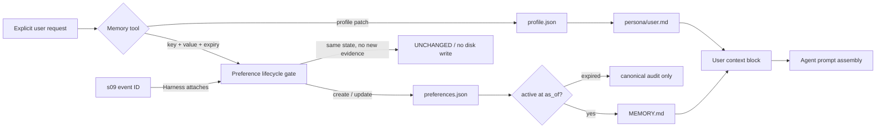

# s11: User Memory — Profile 与 Preference 的用户级边界

[中文](README.md) · [English](README.en.md)
> 工作区记忆回答“这个项目长期有效的事实是什么”；用户记忆回答“这个人跨项目仍然有效的稳定信息与明确偏好是什么”。
>
> **Harness 层**：Memory ownership、显式状态变更、有效期、证据来源与 Prompt context。

---


## 本章解决什么问题

s10 已经能把项目决策、约定和踩坑经验蒸馏成工作区记忆，但以下信息不属于任何项目：

- 用户希望被如何称呼；
- 用户所在时区；
- 所有项目都使用中文回复；
- 默认采用简洁说明；
- 编辑器统一使用 tabs。

如果把这些内容写进每个项目，会产生复制、漂移和跨用户污染。如果把对话中出现过的所有描述直接追加到一个 `MEMORY.md`，同一个偏好更新后又会同时存在新旧版本。

本章把用户记忆设计成两个不同的契约：

| 类型 | 回答的问题 | 更新方式 | 例子 |
|---|---|---|---|
| Profile | “这个用户是谁？” | 显式字段 patch | `name`、`call_them`、`timezone` |
| Preference | “跨项目默认怎样做？” | 按稳定 key 创建、替换或删除 | `response.language=Chinese` |

两者都属于用户作用域，但不能混成任意 Markdown：Profile 需要字段级更新，Preference 需要冲突替换和幂等重试。

## 设计目标

本章的核心不是“多存一个文件”，而是让 Harness 能回答五个问题：

1. **Owner 是谁？** 每份状态都带稳定 `user_scope`，同一根目录可安全承载多个用户。
2. **写入是否明确？** 只有 `update_user_profile` 和 `save_user_preference` 等显式工具能改变状态。
3. **重复调用会怎样？** value、source、expiry 和 source event 全部相同才是 no-op，不增长文件、不增加 revision。
4. **偏好变化会怎样？** 相同 key 的新状态替换旧状态，旧时间戳不能回滚较新的 canonical evidence。
5. **临时偏好何时失效？** `expires_at` 到达后记录仍可审计，但不再进入 `MEMORY.md` 或 Prompt。
6. **偏好从哪里来？** Harness 可保存 s09 transcript event ID；该字段不开放给模型自行编造。
7. **进程重启后信谁？** JSON 是 canonical state，Markdown 只是 active、Prompt-facing projection，可从 JSON 修复。

## 代码架构图


```mermaid
flowchart LR
    U["Explicit user request"] --> T{"Memory tool"}
    T -->|"profile patch"| P["profile.json"]
    T -->|"key + value + expiry"| D["Preference lifecycle gate"]
    E["s09 event ID"] -->|"Harness attaches"| D
    D -->|"create / update"| J["preferences.json"]
    D -->|"same state, no new evidence"| N["UNCHANGED / no disk write"]
    J --> G{"active at as_of?"}
    G -->|"yes"| MP["MEMORY.md"]
    G -->|"expired"| H["canonical audit only"]
    P --> UP["persona/user.md"]
    UP --> C["User context block"]
    MP --> C
    C --> A["Agent prompt assembly"]
```

这里有一条重要边界：`UserMemory` 不接收 workspace path，也不读取 s10 的日志。用户上下文和工作区上下文可以在 s15 组装 Prompt 时合并，但存储、更新策略和所有权仍然分开。

## 存储结构

教学实现默认写入 `~/.learn_workbuddy/user-memory/`，不会碰真实产品目录：

```text
~/.learn_workbuddy/user-memory/
└── users/
    └── <scope-id>/
        ├── profile.json
        ├── preferences.json
        ├── MEMORY.md
        └── persona/
            ├── core.md
            ├── identity.md
            ├── user.md
            └── bootstrap.md
```

`scope-id` 是规范化用户标识的稳定摘要。它有两个作用：

- 任意账号标识不会直接成为路径，避免 `/`、空格或邮箱出现在目录结构中；
- canonical JSON 再保存同一个 `user_scope`，即使文件被错误复制到另一个用户目录，也会在读取时拒绝，而不是静默注入错误用户的 Prompt。

### Canonical state 与 projection

| 文件 | 角色 | 是否作为真相来源 |
|---|---|---|
| `profile.json` | 结构化用户资料 | 是 |
| `preferences.json` | 带 key、revision、expiry、source event 的完整偏好集合 | 是，包括已过期记录 |
| `persona/user.md` | 便于人阅读的 Profile 投影 | 否，可重建 |
| `MEMORY.md` | 便于检查和注入 Prompt 的 Preference 投影 | 否，可重建 |
| `persona/core.md` | 助手价值与边界 | 独立的 assistant identity |
| `persona/identity.md` | 助手名字、类型、emoji | 独立的 assistant identity |
| `persona/bootstrap.md` | 一次性引导说明 | 完成后删除 |

这种设计避免了 Markdown 同时承担数据库、编辑协议和 Prompt 三种职责。人可以查看 Markdown，代码用 JSON 完成确定性更新；投影损坏时，由 canonical state 恢复。

## 主要代码流程

### 1. Profile：显式 partial update

```python
result = memory.update_profile({
    "name": "老王",
    "call_them": "王哥",
    "timezone": "UTC+8",
})
```

更新规则：

- 只修改请求中出现的字段，未出现字段保持不变；
- `None` 表示明确删除某字段；
- 不在 schema 中的字段直接报错，避免模型每轮发明新字段；
- 相同值计入 `unchanged`，不重写 canonical JSON；若 Markdown 投影过期，仍修复投影；
- 改动发生时原子替换 `profile.json`，再刷新 `persona/user.md`。

字段值必须是字符串，经空白归一化后非空且不超过 1,000 字符；字典、列表、数字和布尔值不会被隐式转成文本。`None` 只在更新请求中表示删除，不是可保存的字段值。局部更新中任一字段非法，整个请求报错，不写入前面已校验的字段。

读取已有 `profile.json` 时也检查字段名、类型和文本约束；例如磁盘中的 `{"name": null}` 会报 `UserMemoryValidationError`，而不是变成 `Name: None` 注入 Prompt。校验在生成 Markdown 投影之前完成，失败时不覆盖原 JSON 或投影；正常读取不改写 JSON，v1/v2 的合法记录仍可读取。原始类型已经被旧版本转成字符串的数据无法据此自动识别，需要核对原始事实后处理。

Profile 不是从聊天内容自动抽取的“画像”。只有用户明确提供或明确要求保存的信息才进入这一层。

### 2. Preference：按语义 key 去重

```python
created = memory.set_preference("response.language", "Chinese")
unchanged = memory.set_preference("response.language", "Chinese")
updated = memory.set_preference("response.language", "English")
```

三次调用分别返回：

```text
CREATED   revision=1  previous=None     current=Chinese
UNCHANGED revision=1  previous=Chinese  current=Chinese
UPDATED   revision=2  previous=Chinese  current=English
```

去重不能只比较整段文本。例如“回复使用中文”和“以后回复使用英文”不是两条并存的长期事实，而是同一个 `response.language` 偏好的两个版本。稳定 key 提供冲突域，value 表示当前状态。

完整幂等身份还包含 `source`、`expires_at` 和 `source_event_id`。相同 value 但延长期限或补充新的来源证据属于可观察更新，会增加 revision。同一个非空事件 ID、相同完整状态的重试仍是 `UNCHANGED`，即使重试传入的时间更晚，也不推进证据时间。

没有事件 ID 时，显式传入比 canonical `updated_at` 更晚的时间表示新确认，即使 value 不变，也更新 `updated_at` 并增加 revision。没有 ID 的重放应保留原始证据时间；相同状态、相同或更早时间仍不写盘。不传时间和事件 ID 的简便调用沿用状态去重，程序自动取得的当前时间不能证明用户再次确认。需要记录确认顺序的调用方应提供稳定事件 ID 或明确的证据时间，不能用重试到达时间冒充证据时间。

例如 09:00 写入“中文”，11:00 用户再次确认“中文”，没有事件 ID 但显式携带 11:00 的新确认会将记录推进到 11:00；之后延迟到达的 10:00“英文”会被拒绝。不同状态的写入时间必须晚于 canonical `updated_at`，避免重放旧 transcript 时回滚新偏好。这里保护的是单次顺序写入的时间边界，不提供跨进程并发写入控制或完整事件历史去重。

### 3. 临时偏好与 active projection

```python
memory.set_preference(
    "response.detail",
    "verbose during onboarding",
    source="transcript",
    source_event_id="session-7:event-42",
    updated_at="2026-08-01T01:00:00Z",
    expires_at="2026-08-02T01:00:00Z",
)
```

时间戳必须包含时区并统一保存为 UTC。偏好在 `as_of < expires_at` 时 active；到达 `expires_at` 的瞬间即 expired。`list_preferences()` 返回全部 canonical records，`list_active_preferences(as_of=...)` 才返回可注入集合。

过期不是删除：记录继续留在 `preferences.json`，以便解释它曾经为何生效；`MEMORY.md` 和 `get_context_for_agent()` 只投影 active records。显式历史 `as_of` 查询是纯读取，不会把历史视图写回当前 `MEMORY.md`。

`source_event_id` 是 Harness provenance，不是模型生成内容。程序化调用方可以把 s09 的稳定 event ID 附在写入上；`save_user_preference` 模型工具只接受 value 和可选 expiry，不能提交或伪造 event ID。

### 4. 显式删除

```python
memory.delete_preference("response.language")
```

删除按 key 精确执行，不对自然语言做模糊匹配。Harness 因此可以向用户展示将删除的具体偏好，也能在审计日志中记录明确目标。

### 5. 多用户隔离

```python
alice = UserMemory(root, user_id="alice")
bob = UserMemory(root, user_id="bob")

alice.set_preference("editor.indent", "tabs")
bob.set_preference("editor.indent", "spaces")
```

两者共享状态根目录，但落入不同 `scope-id`。读取时还会校验 JSON 内部的 `user_scope`：路径隔离负责正常路由，scope marker 负责发现错误复制或调用方传错用户。

### 6. Prompt context

```text
## Assistant values
...

## Assistant identity
...

## User profile
Name: 老王
Timezone: UTC+8

## Explicit user preferences (cross-project)
- `response.language`: Chinese
```

这一块只包含用户所有的上下文。项目决策不会被写入这里；s15 可以根据当前会话分别加载 user context 和 workspace context，再决定顺序、预算和覆盖策略。

## 为什么不能自动记住每句话

长期记忆会进入未来 Prompt。自动把聊天内容提升为用户事实会带来三个问题：

- **误归因**：用户引用别人的观点，不代表那是用户偏好；
- **时效不明**：一次性要求可能被错误升级为永久规则；
- **不可解释**：调用方无法说明某条记忆为何产生，也难以提供撤销入口。

因此本章采用保守策略：模型可以建议调用记忆工具，但系统提示要求只有在用户明确表达长期意图时才能写入。真正的生产 Harness 还可以在工具执行前增加 ASK 权限、审计和可视化确认。

## 与 s10、s12 的边界

| 层 | Owner | 内容 | 典型读取时机 |
|---|---|---|---|
| s10 Workspace Memory | workspace | 项目决策、约定、踩坑 | 进入对应项目时 |
| s11 User Memory | user | 稳定 Profile、明确跨项目偏好 | 用户会话启动时 |
| s12 Remote Recall | remote account/service | 长期历史候选与远端 Profile | 当前 query 需要时 |

它们可以在最终 Prompt 中同时出现，但不能共用一个无作用域的 `MEMORY.md`。存储层先保证所有权正确，检索与 Prompt assembly 再决定本轮使用哪些内容。

## 原子写与重启恢复

Profile 与 Preference 都会经历：

```text
validate -> serialize -> write temp file -> fsync -> os.replace
```

如果写临时文件时进程失败，旧 canonical file 仍然存在；成功替换后，不会留下“写了一半的 JSON”。新进程重新创建 `UserMemory(root, user_id=...)` 即可恢复状态，不依赖内存缓存。

临时文件创建后立即记录路径；`write`、`flush`、`fsync` 或 `os.replace` 抛出异常时，`finally` 会尝试删除临时文件，并向调用方报告失败。回归测试分别覆盖这四个阶段，检查旧文件不变（首次写入则目标仍不存在）、临时文件清除，以及故障解除后可重试成功。原子替换保护目标文件，异常清理避免遗留包含用户资料的临时副本，两者不是同一件事；这里不保证进程被强制终止、断电或删除操作本身失败时仍能完成清理，也不提供多文件事务。

`MEMORY.md` 被人工改坏、过期或处于旧版本时，`read_memory()` 会根据 canonical records 和当前时间重新生成 active projection。这体现了 Harness 中常见的原则：可读视图可以修复，canonical state 必须有清晰边界。

Profile 同样以 `profile.json` 为准。`load_identity()` 不仅检查 `persona/user.md` 是否存在，还比较其内容与当前 Profile 生成的预期文本；不一致时原子替换投影，已一致则不写盘。`update_profile()` 的无变化重试也会执行这项检查，因此 JSON 已保存、Markdown 写入失败后，重试或重启后的身份加载都能恢复视图，不需要再修改一次业务字段。清空 Profile 或删除字段后，旧 Markdown 中对应的值不会继续进入身份加载结果。

例如城市从 Shanghai 改为 Beijing，若只完成 JSON 写入，加载身份时会先修复旧 Markdown，再组装北京的新上下文。修复写入仍失败时异常上抛，不把旧资料当作成功加载的 Prompt。两份文件并非同一个事务：JSON 成功后投影失败仍可能让原写入报错；恢复以 JSON 为准，不回滚事实记录。`read_profile()` 本身保持纯读取，`as_of` 只影响 Preference 的时间投影，不是 Profile 的历史查询。

当前 schema 为 v2，读取器仍接受 v1 profile 与 preferences。v1 Preference 缺少的 `expires_at` 和 `source_event_id` 按 `None` 恢复，下一次发生可观察写入时统一保存为 v2；读取本身不会为了迁移而修改 canonical state。

## 离线验证

本章测试覆盖：

- Profile partial update、删除和跨重启读取；
- Preference create/update/unchanged revision 语义；
- expiry 的时区校验、到期边界和 active/expired 投影；
- source event provenance、跨重启恢复与模型不可伪造边界；
- stale timestamp 防回滚与 lifecycle/provenance revision；
- schema v1 兼容读取和下一次可观察更新迁移；
- 同 key 只保留当前值；
- 两个用户共享 root 时仍然隔离；
- 错误复制的跨 scope JSON 被拒绝；
- Prompt context 不包含 workspace state；
- `MEMORY.md` 可从 canonical preferences 修复。

运行：

```bash
python3 -m pytest -q tests/test_user_memory.py
python3 scripts/verify.py
```

## 运行教学示例

离线查看本章在学习路径中新增的契约：

```bash
python s11_user_memory/code.py --demo
```

运行交互式模型示例：

```bash
MODEL_ID=<model> ANTHROPIC_API_KEY=<key> python s11_user_memory/code.py
```

可通过环境变量切换本地教学用户和状态根目录：

```bash
WORKBUDDY_USER_ID=alice \
WORKBUDDY_HOME=/tmp/learn-workbuddy \
python s11_user_memory/code.py
```

## 练习

1. 把单个 `source_event_id` 扩展为有界 evidence set，同时保持同一证据重试幂等。
2. 为即将过期的偏好增加显式续期确认流程，比较“自动续期”和“用户确认”的权限边界。
3. 对照 s15 的显式优先级，设计可信 adapter 把 User Default 投影为候选，并证明模型不能自行声明 `current_turn` 或 `workspace_override`。

## 下一课

s11 已经定义“存下来的用户状态是什么”。s12 将继续区分 stored memory 与 recalled context：远端长期历史不是全部注入 Prompt，而是按当前 query 返回带 source 和 score 的候选视图。
