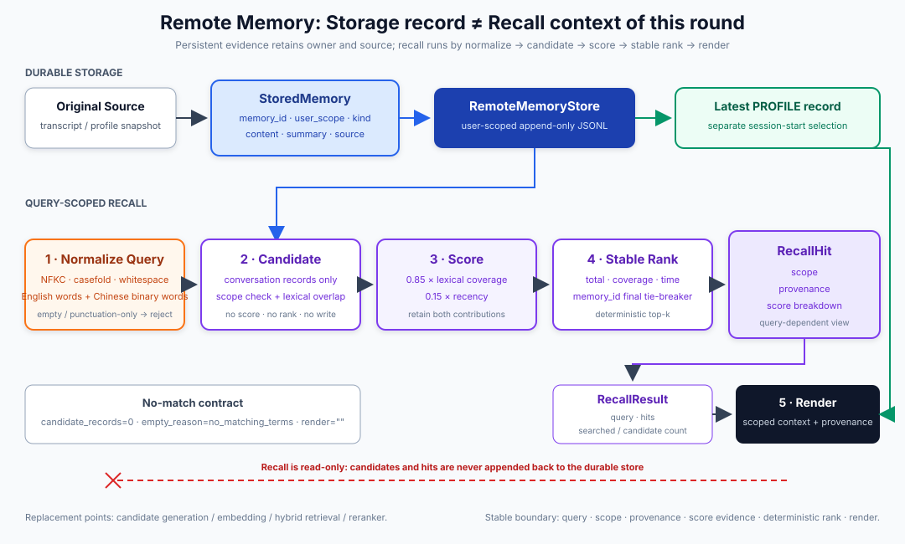
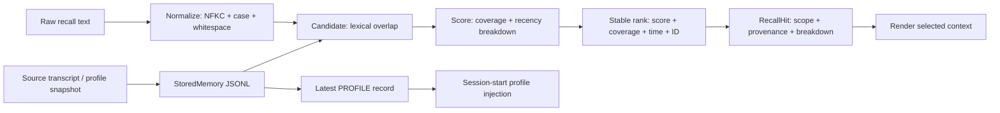

# s12: Remote Memory - Store Records, Recall Context

[Chinese](README.md) · [English](README.en.md)
> *Remote memory stores durable records; recall returns scoped, scored, source-bearing candidates.*
>
> **Harness layer: remote memory and query-scoped retrieval.**

The retrieval path is explicit: normalize a query, build candidates, score them, apply a stable rank, and render only selected hits.



## What This Lesson Adds

```text
normalize -> candidate -> score -> stable rank -> render
```

## Code Architecture Diagram



## Core Contracts

### StoredMemory: Durable Record

```python
@dataclass(frozen=True)
class StoredMemory:
    memory_id: str
    user_scope: str
    kind: MemoryKind
    content: str
    summary: str
    source: MemorySource
    stored_at: str
```

### MemorySource: Provenance

```python
@dataclass(frozen=True)
class MemorySource:
    source_id: str
    source_type: str
    title: str
    captured_at: str
```

### RecallQuery: This Search Request

```python
@dataclass(frozen=True)
class RecallQuery:
    query_id: str
    text: str
    normalized_text: str
    terms: tuple[str, ...]
    user_scope: str
    limit: int
    issued_at: str
```

### RecallCandidate: Unscored Candidate

```python
@dataclass(frozen=True)
class RecallCandidate:
    query_id: str
    record: StoredMemory
    searchable_terms: tuple[str, ...]
    matched_terms: tuple[str, ...]
    captured_at: datetime
```

### RecallScoreBreakdown: Explainable Score

```python
@dataclass(frozen=True)
class RecallScoreBreakdown:
    matched_terms: tuple[str, ...]
    query_term_count: int
    lexical_coverage: float
    recency: float
    lexical_contribution: float
    recency_contribution: float
    total: float
```

### RecallHit: Query View

```python
@dataclass(frozen=True)
class RecallHit:
    query_id: str
    memory_id: str
    rank: int
    snippet: str
    scope: RecallScope
    provenance: MemorySource
    score_breakdown: RecallScoreBreakdown
```

## Main Code Paths

### Store: Append a Source-Bearing Record

```python
store.append(
    kind=MemoryKind.CONVERSATION,
    memory_id="memory-42",
    content="Selected SQLite WAL for local persistence.",
    summary="Selected SQLite WAL.",
    source=MemorySource(
        source_id="transcript-42",
        source_type="conversation_transcript",
        title="Persistence decision",
        captured_at="2026-08-01T12:00:00Z",
    ),
)
```

### Normalize: Build a Canonical Query

```python
result = RecallEngine(store).recall(
    "  LAYERED   Memory  ",
    limit=5,
)
```

### Candidate: Require Lexical Overlap

### Score and Stable Rank

```text
lexical_contribution = 0.85 * query-term coverage
recency_contribution = 0.15 * recency
total = lexical_contribution + recency_contribution
```

```text
total DESC
-> lexical_coverage DESC
-> source.captured_at DESC
-> memory_id ASC
```

### Result: Structured Tool Output

```json
{
  "query": {
    "query_id": "...",
    "text": "LAYERED Memory",
    "normalized_text": "layered memory",
    "terms": ["layered", "memory"],
    "user_scope": "...",
    "limit": 5
  },
  "hits": [
    {
      "memory_id": "conversation-003",
      "rank": 1,
      "scope": {
        "user_scope": "...",
        "memory_kind": "conversation"
      },
      "provenance": {
        "source_id": "transcript-conversation-003",
        "source_type": "conversation_transcript",
        "title": "layered memory design",
        "captured_at": "..."
      },
      "source": {
        "source_id": "transcript-conversation-003",
        "source_type": "conversation_transcript",
        "title": "layered memory design",
        "captured_at": "..."
      },
      "score": 0.995161,
      "score_breakdown": {
        "matched_terms": ["layered", "memory"],
        "query_term_count": 2,
        "lexical_coverage": 1.0,
        "recency": 0.967742,
        "weights": {
          "lexical": 0.85,
          "recency": 0.15
        },
        "contributions": {
          "lexical": 0.85,
          "recency": 0.145161
        },
        "total": 0.995161
      }
    }
  ],
  "searched_records": 6,
  "candidate_records": 1,
  "empty_reason": null
}
```

### Render: Only Selected Candidates

```xml
<recalled_context query_id="query-1"
                   normalized_query="layered memory"
                   user_scope="...">
  <hit rank="1" memory_id="conversation-003"
       user_scope="..." memory_kind="conversation">
    <score total="0.995161"
           lexical_coverage="1.000000"
           recency="0.967742"
           lexical_contribution="0.850000"
           recency_contribution="0.145161"/>
    <provenance source_id="transcript-conversation-003"
                source_type="conversation_transcript"
                captured_at="..."/>
    <snippet>Separated workspace, user and remote memory boundaries.</snippet>
  </hit>
</recalled_context>
```

## Why Profile Loads Separately

```xml
<remote_profile memory_id="profile-001"
                source_id="profile-snapshot-001"
                captured_at="...">
  ...profile content...
</remote_profile>
```

## Why There Is No Reranker Yet

```text
normalized query
-> source-bearing candidates
-> score breakdown
-> stable rank
-> scoped/provenanced hits
-> rendered context
```

## Boundaries among s09, s10, and s11

The transcript records events, workspace memory records project facts, and user memory records cross-project preferences; remote recall must keep those scopes distinct.

## Failure and Boundary Behavior

No match, invalid scope, provider failure, and malformed records remain explicit outcomes instead of silently becoming prompt context.

## No-Key Composition Boundary

```text
default_runtime()  -> create the teaching store on the first interactive CLI run or recall_history call
runtime_client()   -> validate MODEL_ID only when the online agent_loop actually requests a model
```

## Offline Verification

```bash
python3 -m pytest -q tests/test_remote_memory.py
python3 scripts/verify.py
```

```bash
python s12_cloud_memory/code.py --demo
```

```bash
MODEL_ID=<model> ANTHROPIC_API_KEY=<key> python s12_cloud_memory/code.py
```

## Interview Summary

The key design lesson is to keep stored records, recall hits, provenance, and prompt admission as separate contracts.

## Next Lesson

- The retrieval path is explicit: normalize a query, build candidates, score them, apply a stable rank, and render only selected hits.

**Reference table**

| Module | Owner | Core object | Question answered |
|---|---|---|---|
| s09 Transcript | Session | Event evidence | What really happened in this turn? |
| s10 Workspace Memory | Workspace | Durable project facts | What remains valid for this project? |
| s11 User Memory | User | Profile and explicit preferences | What is this user's cross-project default? |
| s12 Remote Memory | Remote user/service | Stored records and recall hits | Which long-term history is needed now? |

The original Chinese README remains the primary-language reference. This English companion keeps the same code, diagrams, local paths, and chapter structure so readers can switch languages without losing runnable details.

Local references:

- [Reference](README.md)
- [Reference](README.en.md)
- [Reference](./images/cloud-memory-en.svg)
- [Reference](../examples/layered_memory_walkthrough/)
