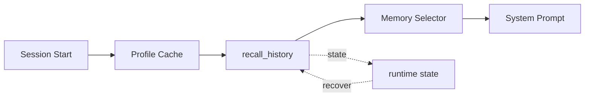

# s12: Cloud Memory — 有些记忆在云端, 服务端检索

> *"有些记忆在云端, 服务端检索"* — Profile 自动注入 + recall_history 跨会话检索。
>
> **Harness 层**: 记忆 — 三层记忆的最上层（全局层）。

---


## 代码架构图



## 学习前置知识

- 云端记忆解决跨设备、跨项目、长时间跨度的问题。
- Profile 是自动摘要, 历史召回是按需检索, 二者不是一回事。
- 检索工具必须查询自包含, 因为服务端不应依赖当前隐式上下文。

## 本章抓住的 WorkBuddy-style 机制

- 吸收公开架构研究中的三层记忆思想, 用 Profile 注入 + recall_history 教学工具表达。
- 用 memorySelector 解释“先筛再注入”的上下文策略。
- 把未复核的固定接口名降级为通用历史召回模式。

## 常见误区

- 把云端画像写成用户可手动编辑文件, 会误解所有权。
- 历史检索查询太短, 会召回无关内容。
- 把更多记忆等同于更好回答, 会造成 Context Rot。
## 问题

s10 解决了工作区记忆——每天一个日志文件，只在当前项目里有用。s11 解决了用户级记忆——`MEMORY.md` 手动维护偏好和身份。但有些记忆既不属于工作区也不属于手动维护：

- 上周和 AI 讨论了一种架构方案，今天想回顾——但那不在当前工作区日志里，你也没写进 `MEMORY.md`。
- 服务器从你无数对话中慢慢学到：你喜欢简洁的回答、你用 zsh、你偏好函数式风格。这些不该让用户手动维护。
- 跨项目、跨时间的知识——"我们之前讨论过这个吗？"——需要一个能搜索所有历史对话的机制。

这就是第三层记忆：**云端记忆**。它不在本地文件里，而在服务端，由服务器管理和检索。

---

## 解决方案

两个独立机制，各管各的事：

| 机制 | 来源 | 注入方式 | 可写? |
|------|------|---------|------|
| (A) Profile 注入 | 服务端自动生成 | 系统提示中的 `<memory>` 块 | 否（只读，服务端覆盖） |
| (B) recall_history | 用户历史对话 | 模型调用工具按需检索 | 否（只读搜索） |

```
三层记忆对比:

  云端 Profile      ← 服务端生成, 自动注入, 只读
  ┌─────────────────────────────────────┐
  │ <memory>                            │
  │ 用户偏好: 喜欢简洁回答, 用 zsh...      │
  │ 项目历史: 做过 learn-workbuddy...      │
  │ </memory>                           │
  └─────────────────────────────────────┘
        ↕ (session start 时注入 system prompt)

  recall_history  ← 模型按需调用, 搜索全部历史
  ┌─────────────────────────────────────┐
  │ query: "之前讨论的 React 状态管理方案"  │
  │   → 搜索服务端所有对话 → 返回相关片段    │
  └─────────────────────────────────────┘
        ↕ (模型判断需要时调用)

  用户级 MEMORY.md    ← 手动维护 (s11)
  工作区日志          ← 每日追加 (s10)
```

关键区分：

| 问题类型 | 用什么 |
|---------|-------|
| "用户偏好什么？" | Profile（已自动注入，无需搜索） |
| "我们之前讨论过 XX 吗？" | recall_history |
| "今天做了什么？" | 工作区日志（s10） |
| "这个项目的约定是什么？" | MEMORY.md（s11） |

---

## 工作原理

### (A) Profile 自动注入

服务端在用户使用过程中，**隐式地**从对话里提取模式，生成一份用户画像。这份画像在每次会话开始时注入系统提示：

```python
def build_system_prompt(base_instructions: str) -> str:
    """组装系统提示，注入云端 Profile。"""
    profile = load_cloud_profile()  # 从 ~/.workbuddy/memory/ 读缓存

    if profile:
        memory_block = f"<memory>\n{profile}\n</memory>\n\n"
    else:
        memory_block = ""

    return memory_block + base_instructions
```

Profile 缓存在本地 `~/.workbuddy/memory/`，但**只读**。服务端在下次会话时会覆盖本地缓存——你改了也白改。

```
Session Start
     │
     ▼
┌──────────────┐     ┌─────────────────────┐
│ 检查本地缓存  │────▶│ ~/.workbuddy/memory/ │
│ (Profile)    │     │ profile.md (只读)    │
└──────────────┘     └─────────────────────┘
     │
     ▼
┌──────────────────────────────┐
│ 注入 system prompt:           │
│ <memory>                     │
│   ...profile content...       │
│ </memory>                     │
│                              │
│ {base_instructions}          │
└──────────────────────────────┘
```

### (B) recall_history 工具

当模型需要回顾历史对话时，调用 `recall_history` 工具。这个工具的**关键约束**：

> **该工具对当前对话零访问。** 查询必须自包含——重述当前需求，说明要找什么历史上下文，以及为什么需要。

```python
def recall_history(query: str, limit: int = 5) -> str:
    """搜索历史对话。

    关键: 这个工具看不到当前对话!
    query 必须自包含——把要找的东西写清楚,
    假设搜索系统对当前对话一无所知。
    """
    # 模拟服务端检索: 对所有历史对话做相关性排序
    results = server_side_search(query, limit=limit)

    formatted = []
    for r in results:
        formatted.append(
            f"## 对话 ({r['date']})\n"
            f"{r['summary']}\n"
        )
    return "\n---\n".join(formatted) if formatted else "(无匹配结果)"
```

### 触发判断

模型什么时候该调 `recall_history`？当用户说出这类话：

| 触发模式 | 示例 |
|---------|------|
| 回顾之前讨论 | "我们之前讨论的 XX 方案是什么？" |
| 继续之前工作 | "继续上次的任务" / "用之前的决策" |
| 查找偏好历史 | "我之前的代码风格偏好是什么？" → 但这应该在 Profile 里，先看 Profile |
| 跨项目参考 | "上次做类似项目时我们怎么处理的？" |

**不该触发的场景**：
- 通用偏好（在 Profile 里）→ 直接用，不搜索
- 今天的工作（在工作区日志里）→ 读日志文件
- 项目约定（在 MEMORY.md 里）→ 读 MEMORY.md

### 服务端排序模拟

服务端对历史对话做相关性排序。教学版用关键词匹配 + 时间衰减来模拟：

```python
def server_side_search(query: str, limit: int = 5) -> list[dict]:
    """模拟服务端检索: 关键词匹配 + 时间衰减排序。"""
    scored = []
    query_terms = set(query.lower().split())

    for conv in CONVERSATION_DB:
        # 关键词重叠度
        conv_terms = set(conv["content"].lower().split())
        overlap = len(query_terms & conv_terms)

        # 时间衰减: 越近的对话权重越高
        days_ago = (datetime.now() - conv["date"]).days
        time_weight = 1.0 / (1 + days_ago * 0.01)

        score = overlap * time_weight
        if score > 0:
            scored.append((score, conv))

    scored.sort(key=lambda x: -x[0])
    return [c for _, c in scored[:limit]]
```

---

## memorySelector: AI 管理 AI 的记忆

前面的 Profile 注入和 recall_history 都是**模型自己决定**要不要用记忆。但还有一个更底层的机制：在主 Agent 看到记忆之前，先用一个**专门的 Agent 预筛选**。

### memorySelector Agent

基于公开行为抽象出的设计要点：

```
设计要点:
  AgentNames.MEMORY_SELECTOR = "memorySelector"
  INTERNAL_GENERATOR_AGENTS 包含 MEMORY_SELECTOR
    → 内部 Agent, 没有 SendMessage, 不可对话
  models: ["lite"]       → 最便宜的模型变体
  tools: 0                → 不调用任何工具
  调用方式: AgentService.runOneTime(MEMORY_SELECTOR, ...)
    → 一次性执行, 有 abort controller 可取消
```

### 工作流程

1. **每次用户查询时**，memorySelector 接收：
   - 用户的查询文本
   - 所有可用记忆文件的列表（**只有文件名 + 描述，不含内容**）
2. 它返回一个 JSON 数组，**最多 5 个**相关记忆文件名
3. 只有被选中的记忆文件才会被加载进主 Agent 的上下文
4. 已经用过的工具参考文档会被排除（避免重复）

```
用户查询 ──► memorySelector (lite模型, 0工具)
                │
                ├─ 输入: 用户查询 + 记忆文件列表(文件名+描述)
                │
                ├─ 处理: 判断哪些记忆与查询相关
                │
                └─ 输出: 最多5个相关记忆文件名 (JSON)
                         │
                         ▼
              只有被选中的记忆 → 注入主Agent上下文
              未选中的记忆 → 不加载 (节省token)
```

### 为什么用 lite 模型？

| 维度 | 说明 |
|------|------|
| **任务简单度** | 只需读文件名和描述，判断相关性——这是分类任务，不是深度推理 |
| **调用频率高** | 每次用户查询都触发——用贵模型，成本指数级增长 |
| **错误成本低** | 选多了最多浪费上下文窗口（有 5 条上限），选少了主 Agent 还能自己搜索 |
| **负反馈机制** | 明确指令"如果不确定就不要选"——宁缺毋滥 |

### 设计哲学: "记忆越准越好，不是越多越好"

```
传统做法 (reactive):
  全部记忆 → 注入上下文 → 上下文膨胀 → 压缩/摘要

memorySelector 做法 (preventive):
  全部记忆 → 预筛选(≤5条) → 只有相关的进入上下文
                                    ↑
                          从源头控制 ContextRot
```

lite 模型做**粗筛选** → 昂贵模型只处理筛选后的记忆。这是**预防性**的 ContextRot 管理——不让无关内容进入上下文，而不是等上下文腐烂了再去压缩。

### 三层压缩管线

memorySelector 不是孤立的，它嵌入在更大的上下文管理体系中：

```
信息从产生到被主Agent使用, 经过三层压缩:

第一层: memorySelector 预筛选 (5条上限)
  ├─ 输入: 所有记忆文件
  └─ 输出: ≤5条相关记忆 → 注入主Agent

第二层: SubAgent 只返回摘要 (SendMessage/Notification)
  ├─ 输入: SubAgent完整推理过程
  └─ 输出: 压缩后的结构化摘要 → 注入主Agent

第三层: compact Agent 全局压缩
  ├─ 输入: 整个对话历史
  └─ 输出: 结构化摘要 (Primary Request, Key Concepts, Files, Errors...)
```

### 上下文隔离

主 Agent 的上下文只接收**三类信息**：

```
主Agent上下文只接收:
  1. 用户原始输入
  2. memorySelector筛选后的记忆 (≤5条)
  3. AgentNotification (被压缩过的结果)

不进入主Agent上下文的:
  ✗ SubAgent的完整推理过程
  ✗ Explore的搜索细节
  ✗ Workers之间的SendMessage对话
```

**为什么要隔离？** 如果 SubAgent 的推理过程直接进入主上下文：

- **上下文膨胀** — 每个 SubAgent 的完整推理链会迅速耗尽上下文窗口
- **注意力稀释** — 主 Agent 被无关的中间步骤分散注意力
- **耦合失控** — SubAgent 的推理风格会影响主 Agent 判断（回声室效应）

memorySelector 正是这个隔离体系的第一道门：在记忆进入主 Agent 之前，先由一个廉价的 lite 模型把关，只放行真正相关的内容。

---

## WorkBuddy 架构对照

生产级桌面 agent 的三层记忆系统中，云端层由两个独立机制实现：

### Profile 注入

系统提示在会话启动时被组装，其中包含一个 `<memory>` 块：

```
// agent bridge 中的系统提示组装 (简化)
const systemPrompt = [
  `<memory>`,
  cloudProfile,        // 从 ~/.workbuddy/memory/ 读取的缓存
  `</memory>`,
  ``,
  baseInstructions,    // agent loop 规则、工具使用指南
  identityContent,     // SOUL/IDENTITY/USER (s11)
  projectContext,      // 文件结构、工作目录
].join('\n');
```

Profile 缓存目录 `~/.workbuddy/memory/` 是**只读的**。服务端在每次会话启动时会检查并更新这个缓存。本地修改会被下次会话覆盖。

Profile 是服务端**隐式学习**的结果——不是用户显式写的。服务器从用户的对话模式中提取：
- 常用语言和工具链
- 回答风格偏好
- 项目历史和领域
- 常见工作流模式

### recall_history 工具

`recall_history` 是 WorkBuddy 的内置工具之一，定义在 agent bridge 的工具注册表中：

```javascript
// 工具定义 (简化)
{
  name: "recall_history",
  description: "Search through past user conversations to find relevant context...",
  input_schema: {
    type: "object",
    properties: {
      query: {
        type: "string",
        description: "A self-contained search query..."
      },
      limit: { type: "number", default: 5 }
    },
    required: ["query"]
  }
}
```

工具描述中明确标注了关键约束：
> "This tool has ZERO access to the current conversation. Your query MUST be self-contained."

服务端实现使用向量检索 + 关键词匹配的混合排序，对全部历史对话做相关性打分。结果按相关性返回摘要片段，不返回完整对话。

---

## 代码 walkthrough

`code.py` 演示了云端记忆的两个机制：

1. **Profile 注入** — 模拟服务端生成的用户画像，在会话启动时注入 `<memory>` 块到系统提示。本地缓存只读，尝试修改时给出警告。

2. **recall_history 工具** — 注册为 agent 可调用的工具。内部用关键词匹配 + 时间衰减模拟服务端排序。预设了几条"历史对话"作为搜索语料。

3. **触发判断** — 系统提示中包含指导，告诉模型什么时候该调 `recall_history`，什么时候该用 Profile 或其他记忆层。

运行后，试试这些 prompt：
- "我们之前讨论过什么架构方案？"（触发 recall_history）
- "你还记得我的代码风格偏好吗？"（应该从 Profile 回答，不搜索）
- "继续上次的工作"（触发 recall_history）

---

## 运行

```bash
python s12_cloud_memory/code.py
```

---

## 练习

1. 给 `recall_history` 加一个 `date_range` 参数，支持按日期范围过滤历史对话。思考：服务端为什么要支持时间范围？
2. Profile 的本地缓存是只读的——但如果用户离线了，Profile 还能用吗？实现一个离线回退逻辑：检查本地缓存是否存在，不存在时用一个最小化的默认 Profile。
3. recall_history 的查询必须自包含。写一个 lint 函数：检查查询长度是否过短（<10 字符）或缺少上下文，如果不符合要求就返回提示让模型重写。

---

## 下一课

三层记忆系统（s10-s12）完成了。agent 能记住工作区的今天、用户级的偏好、云端的历史。但工具输出可能很大——一个 `ls -laR` 可能几万行。大输出怎么不撑爆上下文？s13 讲输出外部化——写磁盘留指针、缺页中断读取。

s13 Output Externalization → 大输出写磁盘, 上下文留指针, 按需读取。
