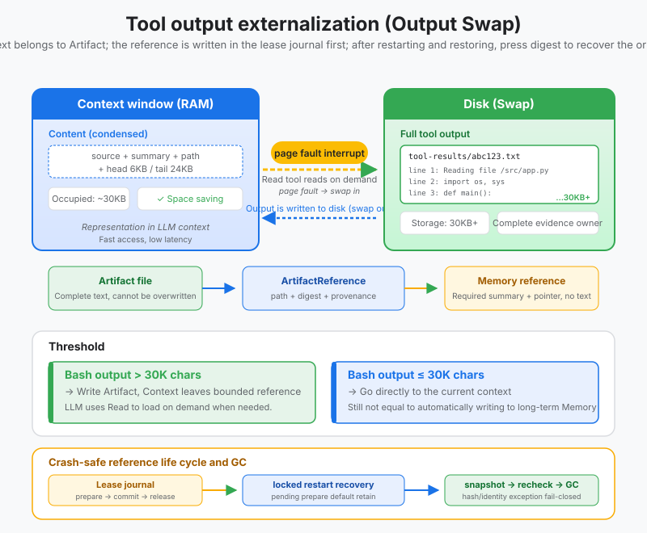
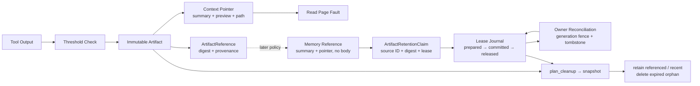

# s13: Tool Output Externalization - Move Large Results to Disk

[中文](README.md) · [English](README.en.md)
> *Context is memory; durable tool output belongs in an artifact with a pointer.*
>
> **Harness layer: context management and artifact lifecycle.**

Large tool results become immutable artifacts. The prompt keeps a bounded preview, digest, provenance, and a readable pointer.



## Code Architecture Diagram



## Prerequisites

The lesson assumes tool results can be represented as text and focuses on thresholds, artifact references, and safe retrieval.

## WorkBuddy-Style Mechanisms in This Chapter

The lesson moves large tool results to durable artifacts while keeping bounded pointers in the active context.

## Common Mistakes

Do not truncate evidence without retaining a path and digest, and do not let artifact cleanup invalidate active references.

## The Problem

The harness must control context growth without losing the complete output needed for inspection or later recovery.

## The Solution

```
工具执行
    │
    ▼
┌──────────────────────┐
│ 输出 > 阈值?          │
└──────────┬───────────┘
      No   │   Yes
      │    │    │
      ▼    │    ▼
  直接放    │  ┌─────────────────────────┐
  进上下文  │  │ 写入磁盘:                │
            │  │   tool-results/         │
            │  │     tool_result_001.txt │
            │  │     (完整输出)           │
            │  └──────────┬──────────────┘
            │             │
            │             ▼
            │  ┌─────────────────────────┐
            │  │ 上下文中放指针:          │
            │  │   head 6KB              │
            │  │   ... (省略) ...         │
            │  │   tail 24KB             │
            │  │   [full output at: path]│
            │  └──────────┬──────────────┘
            │             │
            ▼             ▼
       上下文只增长 ~原始大小    上下文只增长 ~30KB
```

## How It Works

### Write to Disk

```python
BASH_MAX_OUTPUT_LENGTH = 30000        # chars — Bash 输出超过此值 → 外部化
CODEBUDDY_TOOL_RESULT_THRESHOLD_KB = 50  # KB — 非 Bash 工具超过此值 → 外部化
```

```python
def should_externalize(self, output: str, tool_name: str) -> bool:
    if tool_name == "bash":
        return len(output) > BASH_MAX_OUTPUT_LENGTH
    else:
        return len(output.encode("utf-8")) > CODEBUDDY_TOOL_RESULT_THRESHOLD_KB * 1024
```

### Replace Context with a Pointer and Preview

```
~/.workbuddy/projects/<workspace>/<session>/
└── tool-results/
    ├── tool_result_001.txt    # 第 1 次外部化的完整输出
    ├── tool_result_002.txt    # 第 2 次外部化的完整输出
    ├── tool_result_003.txt
    └── ...
```

```python
def _next_artifact_path(self) -> Path:
    while True:
        self._counter += 1
        path = self.tool_results_dir / f"tool_result_{self._counter:03d}.txt"
        try:
            path.touch(mode=0o600, exist_ok=False)  # 旧证据不能被覆盖
        except FileExistsError:
            continue
        return path
```

### Artifact to Memory: Reference Only

```python
def make_pointer(self, output: str, artifact: ArtifactReference) -> str:
    head = output[:6 * 1024]       # First 6KB
    tail = output[-24 * 1024:]     # Last 24KB

    return (
        f"[Artifact: {artifact.source.source_id}]\n"
        f"Summary: {artifact.summary}\n"
        f"Source: {artifact.source_tool}; SHA-256: {artifact.content_sha256}\n"
        f"Full output: {artifact.path}\n\n"
        f"{head}\n"
        f"\n... [full output at: {artifact.path}] ...\n"
        f"\n{tail}"
    )
```

### Reference-Aware Lifecycle and GC

```python
memory_reference = result.artifact.for_memory()

# 只有 summary、artifact_path、content_sha256、source_tool 和 source。
# 没有 content，也没有 context pointer 中的 head/tail 预览。
payload = memory_reference.to_dict()
```

### Crash-Recoverable Lease Journal

```text
ArtifactMemoryReference
    └─ ArtifactRetentionClaim
         ├─ source_id              # path-free owner identity
         ├─ content_sha256         # full digest
         ├─ reference_count        # Memory adapter 聚合的活跃引用数
         └─ retain_until?          # 可选租约截止时间
```

#### Generation-Fenced Owner Reconciliation

```text
1. PREPARED  ── append + fsync ──▶ lease intent 已持久化
2. Memory adapter 发布引用
3. COMMITTED ── append + fsync ──▶ 引用确认可见
```

```python
journal = ArtifactRetentionJournal(session_dir)
claim = ArtifactRetentionClaim.from_memory_reference(memory_reference)

transaction, stored_record = journal.publish_reference(
    claim,
    lambda: memory_adapter.append(memory_reference),
    transaction_id="workspace-artifact-reference-1",
)

# Memory 删除成功后才释放；异常时 lease 保持 committed。
journal.remove_reference(
    transaction.transaction_id,
    lambda: memory_adapter.remove(memory_reference.source.source_id),
)
```

```python
def publish_validated_reference():
    if not memory_adapter.accepts(memory_reference):
        # 仅本地校验，尚未发起任何写入。
        raise ArtifactPublicationRejected("reference rejected before write")
    # 不把这里的普通异常转换成明确拒绝：写入结果可能已经不确定。
    return memory_adapter.append(memory_reference)
```

#### Read: A Page-Fault-Like Operation

```python
# adapter 自己负责把数据库行版本、ETag 或对象 generation 映射为 fence。
reports = journal.reconcile_pending(memory_owner_adapter)
for report in reports:
    audit_sink.append(report.to_dict())
```

```python
claim = ArtifactRetentionClaim.from_memory_reference(
    memory_reference,
    reference_count=2,
    retain_until="2026-09-01T00:00:00+00:00",
)
policy = ArtifactCleanupPolicy(
    orphan_ttl_seconds=24 * 60 * 60,
    max_deletions=100,
    dry_run=False,
)
journal = ArtifactRetentionJournal(session_dir)
plan = externalizer.plan_cleanup_from_journal(journal, policy=policy)
report = externalizer.apply_cleanup_from_journal(plan, journal)
```

### The OS Analogy: Virtual Memory

```
Agent 上下文                           磁盘
┌─────────────────────┐               ┌──────────────────────┐
│ tool_result:         │               │ tool_result_001.txt  │
│   head 6KB ...       │               │ (50MB 完整输出)       │
│   [full at: path]    │── Read ──▶    │                      │
│   ... tail 24KB      │               │                      │
│                      │◀──content──   │                      │
│ Read result:         │               │                      │
│   line 40000: ERROR  │               │                      │
└─────────────────────┘               └──────────────────────┘
       ~30KB                              不进上下文
```

```python
def read_artifact(self, artifact: ArtifactReference, offset: int = 0, limit: int = 2000) -> str:
    """Read owned evidence on demand and verify its digest first."""
    owned_path = self._owned_path(artifact.path)
    encoded = owned_path.read_bytes()
    if hashlib.sha256(encoded).hexdigest() != artifact.content_sha256:
        raise ArtifactIntegrityError("artifact digest mismatch")
    content = encoded.decode("utf-8")
    lines = content.split("\n")
    selected = lines[offset:offset + limit]
    return "\n".join(selected)
```

## WorkBuddy Architecture Comparison

This comparison maps large-output artifacts, context pointers, and retention to the corresponding WorkBuddy-style harness boundary.

## Output Thresholds

```
┌─────────────────────────────────────────────────────────┐
│ Layer 1: 入口控制 (本章 s17)                              │
│   ├─ 工具输出外部化 (大输出 → 磁盘, 上下文只留指针)        │
│   ├─ 延迟工具加载 (schema 按需加载, s04)                  │
│   ├─ 后台任务隔离 (长任务转后台, 不占上下文)              │
│   └─ SubAgent 上下文隔离 (子 Agent 独立上下文)            │
│                                                         │
│   策略: 从一开始就不让大东西进入上下文 (预防式)            │
├─────────────────────────────────────────────────────────┤
│ Layer 2: 主动压缩 (s18)                                   │
│   ├─ pre-message compact (10% 阈值, 消息前压缩)          │
│   └─ auto compact (70-92% 阈值, 自动压缩)                │
│                                                         │
│   策略: 上下文太大了就压缩 (治疗式)                        │
├─────────────────────────────────────────────────────────┤
│ Layer 3: 持久化扩展 (s14-s16)                             │
│   ├─ 云端记忆 (用户画像, 服务端检索)                      │
│   ├─ 用户级记忆 (MEMORY.md, 手动偏好)                     │
│   └─ 工作区记忆 (每日日志, 只追加)                        │
│                                                         │
│   策略: 不需要的上下文放到外部存储, 按需取回               │
└─────────────────────────────────────────────────────────┘
```

## Artifact Directory Layout

```
没有输出外部化:
  Turn 1: grep → 50MB → 上下文爆 → 💥 API 报错 → 任务终止

有输出外部化:
  Turn 1: grep → 50MB → 外部化 → 上下文 +30KB → 继续跑
  Turn 2: pytest → 20MB → 外部化 → 上下文 +30KB → 继续跑
  Turn 3: cat → 100MB → 外部化 → 上下文 +30KB → 继续跑
  ...
  Turn 50: 上下文还没满 → 任务完成 ✅
```

## WorkBuddy Architecture Comparison

This comparison maps large-output artifacts, context pointers, and retention to the corresponding WorkBuddy-style harness boundary.

### Artifact Pointer Protocol

```bash
# Bash 输出超过此长度 → 写磁盘, 上下文留 head+tail
BASH_MAX_OUTPUT_LENGTH=30000

# 非 Bash 工具结果超过此大小 → 写磁盘, 上下文留占位符
CODEBUDDY_TOOL_RESULT_THRESHOLD_KB=50
```

### Desktop Delivery Contract

```
~/.workbuddy/projects/<workspace-hash>/<session-id>/
└── tool-results/
    ├── tool_result_001.txt
    ├── tool_result_002.txt
    └── ...
```

### Code Walkthrough

```javascript
// agent bridge 中的 Bash 输出处理 (简化)
if (output.length > BASH_MAX_OUTPUT_LENGTH) {
    const head = output.slice(0, 6 * 1024);
    const tail = output.slice(-24 * 1024);
    const filePath = writeToolResultToDisk(output, sessionDir);

    // Replace context with pointer
    toolResult.content = (
        head + "\n" +
        `[... omitted, full output at: ${filePath} ...]\n" +
        tail
    );
}
```

### Run

```javascript
// 非 Bash 工具结果处理 (简化)
if (resultSize > CODEBUDDY_TOOL_RESULT_THRESHOLD_KB * 1024) {
    const filePath = writeToolResultToDisk(result, sessionDir);
    toolResult.content = (
        `[Output externalized to: ${filePath}]\n` +
        `Preview: ${result.slice(0, 2048)}...\n` +
        `Use Read tool to access full content.`
    );
}
```

### Exercises

Use these exercises to change one part of large-output artifacts, context pointers, and retention at a time and explain the resulting contract.

## Code Walkthrough

```
[externalize] tool_result_001.txt written, 1.3MB → 2KB in context (saved 99.8%)
[page-fault]  agent requested full output, reading tool_result_001.txt from disk
```

## Run

```bash
python s13_output_externalization/code.py
```

## Exercises

Use these exercises to change one part of large-output artifacts, context pointers, and retention at a time and explain the resulting contract.

## Next Lesson

- Large tool results become immutable artifacts. The prompt keeps a bounded preview, digest, provenance, and a readable pointer.

**Reference tables**

| Representation | Contains | Consumer | Owns the full body? |
|------|----------|----------|------------------|
| Artifact file | Complete tool output | Audit, on-demand reads, full recovery | Yes; the sole body owner |
| Context pointer | Source ID, summary, SHA-256, path, head/tail preview | Current Agent turn | No; bounded representation |
| Memory reference | Required summary, path, digest, and source fields | Later Memory policy | No; it intentionally has no `content` |

| Concept | Operating system | WorkBuddy |
|------|---------|-----------|
| Memory | RAM | Context window |
| External storage | Disk swap | `tool-results/*.txt` |
| Memory entry | Page-table entry | Pointer plus preview |
| Read-back | Page fault | Read tool |

| Owner observation | Harness behavior | Lease result |
|---|---|---|
| `PUBLISHED`, source ID and full digest match | Append `COMMITTED` inside the fence | Protect the reference by its lease |
| `PUBLISHED`, identity mismatch | Record `pending_conflict` | Keep `PREPARED` and protect indefinitely |
| `UNKNOWN` | Record `pending_unknown` | Keep `PREPARED` and retry later |
| Unsealed `ABSENT` | Owner writes a tombstone with CAS and advances generation | Append `ABORTED` after sealing |
| Generation changed before sealing | Record `pending_stale` | Keep `PREPARED` and observe again |
| Sealed `ABSENT` | Do not seal again; complete the journal transition | Append `ABORTED` |

| Status | Meaning | Delete? |
|---|---|---|
| `retained_referenced` | Active claim and full digest match | No |
| `retained_recent` | Orphan TTL has not elapsed | No |
| `retained_limit` | Maximum deletion count reached | No |
| `retained_unknown` / `denied` | Outside the S13 file, directory, or symlink boundary | No |
| `retained_corrupt` | Claim conflicts with file digest or snapshot | No |
| `missing_referenced` | Active claim points to a missing artifact | No file to delete; report the dangling reference |
| `planned_delete` | TTL elapsed and no active claim exists | Dry-run only reports |
| `deleted` | Revalidation succeeded during apply | Yes |
| `already_missing` / `race_detected` | Repeated run or file changed after planning | No |

| OS concept | WorkBuddy equivalent | Explanation |
|---------|---------------------|------|
| Physical memory (RAM) | Context window | Limited, fast, and expensive |
| Disk swap | `tool-results/*.txt` | Large, slower, and cheap |
| Page-table entry | Pointer plus preview | Small reference to the actual data |
| Page fault | Read tool reads a disk file | Bring data back on demand |
| Demand paging | Externalize output and Read on demand | Do not load data until needed |
| Process isolation | Independent SubAgent context | Prevent child context pollution |
| Asynchronous I/O | Background task mechanism | Long work does not block context |
| Memory reclamation / GC | Compact and auto-compact | Compact when context fills |
| Filesystem | Three-layer memory system | Remote -> user -> workspace |
| Replay limit | Replay at most 1000 events | Prevent history from exhausting memory |

The original Chinese README remains the primary-language reference. This English companion keeps the same code, diagrams, local paths, and chapter structure so readers can switch languages without losing runnable details.

Local references:

- [Reference](README.md)
- [Reference](README.en.md)
- [Reference](./images/output-externalization-en.svg)
