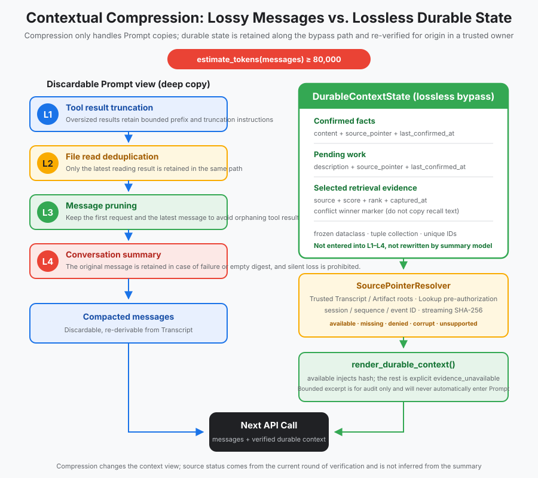
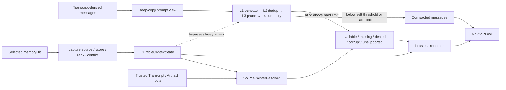

# s14: Context Compact - Context Always Fills Up

[中文](README.md) · [English](README.en.md)
> *When the context window fills, compact disposable messages while preserving durable evidence.*
>
> **Harness layer: bounded context and durable-state bypass.**

Four compaction layers reduce the message view without rewriting durable facts, retrieval proof, or audit evidence.



## Code Architecture Diagram



## Prerequisites

The lesson assumes the harness already has messages, tool results, and durable evidence that can be separated during compaction.

## WorkBuddy-Style Mechanisms in This Chapter

The lesson compacts disposable conversation state while preserving durable facts, selected evidence, and recovery boundaries.

## Common Mistakes

Never treat a compacted message as permission to rewrite durable state or discard the proof behind a retrieval decision.

## The Problem

The harness needs to reduce prompt size without changing what has already been confirmed or what can be recovered later.

## The Solution

```
每次 API 调用前检查上下文大小:

  messages token count
        │
        ▼
  ┌─────────────┐
  │ < 阈值?     │── Yes ──▶ 正常调用 API
  └─────────────┘
        │ No
        ▼
  ┌─────────────────────────────────────┐
  │ Layer 1: 截断超大工具结果             │
  │ (单条 tool_result > 5000 tokens?)    │
  └─────────────────────────────────────┘
        │ 还超?
        ▼
  ┌─────────────────────────────────────┐
  │ Layer 2: 文件内容去重                 │
  │ (同一文件被读多次? 只留最新一次)       │
  └─────────────────────────────────────┘
        │ 还超?
        ▼
  ┌─────────────────────────────────────┐
  │ Layer 3: 修剪旧消息                   │
  │ (保留最近 N 轮, 旧的删除)             │
  └─────────────────────────────────────┘
        │ 还超?
        ▼
  ┌─────────────────────────────────────┐
  │ Layer 4: 生成摘要替换历史              │
  │ (调用模型总结, 替换全部旧消息)          │
  └─────────────────────────────────────┘
```

### Messages Are Disposable; Durable State Is Not

```python
@dataclass(frozen=True)
class DurableFact:
    fact_id: str
    content: str
    source_pointer: str
    last_confirmed_at: str

@dataclass(frozen=True)
class PendingItem:
    item_id: str
    description: str
    source_pointer: str
    last_confirmed_at: str

@dataclass(frozen=True)
class RetrievalEvidence:
    memory_id: str
    source_id: str
    source_type: str
    source_title: str
    captured_at: str
    score: float
    source_rank: int
    conflict_key: str | None = None

@dataclass(frozen=True)
class DurableContextState:
    facts: tuple[DurableFact, ...] = ()
    pending_items: tuple[PendingItem, ...] = ()
    retrieval_evidence: tuple[RetrievalEvidence, ...] = ()
```

```text
可压缩 messages                     不可有损 durable state
----------------                    -----------------------
旧对话细节                          已确认事实
重复文件读取                        未决事项
大工具结果的上下文副本              source pointer
探索过程                            last_confirmed_at
已召回正文的重复表述                retrieval source / score / rank / conflict
```

### Source Pointers Preserve Evidence

```text
transcript:<session_id>:<positive_sequence>
artifact:<session_id>:<filename>:<12-or-64-char-sha256>
```

```python
resolver = SourcePointerResolver(
    transcript_root=state_home / "transcripts",
    artifact_root=state_home,
    authorize=source_policy,
)
resolutions = resolve_durable_sources(result.durable_state, resolver)
durable_context = render_durable_context(
    result.durable_state,
    source_resolutions=resolutions,
)
```

## How It Works

### Layer 1: Trim Tool Results

```python
TOKEN_THRESHOLD = 100_000  # 触发压缩的阈值

def estimate_tokens(messages: list) -> int:
    """粗略估算 messages 的 token 数。

    生产级 harness 常用 tiktoken 精确计数。
    教学版用 4 字符 ≈ 1 token 的粗略估算。
    """
    total = 0
    for msg in messages:
        content = msg.get("content", "")
        if isinstance(content, str):
            total += len(content) // 4
        elif isinstance(content, list):
            for block in content:
                if isinstance(block, dict):
                    total += len(json.dumps(block)) // 4
                else:
                    total += len(str(block)) // 4
    return total
```

### Layer 2: Remove Duplicate Files

```python
MAX_TOOL_RESULT_TOKENS = 5000

def truncate_tool_results(messages: list) -> list:
    """Layer 1: 截断超过 5000 token 的工具结果。"""
    for msg in messages:
        if msg["role"] != "user":
            continue
        content = msg.get("content")
        if not isinstance(content, list):
            continue
        for block in content:
            if isinstance(block, dict) and block.get("type") == "tool_result":
                result = block.get("content", "")
                tokens = len(str(result)) // 4
                if tokens > MAX_TOOL_RESULT_TOKENS:
                    # 这里只做有界截断；真正摘要属于 Layer 4
                    truncated = str(result)[:MAX_TOOL_RESULT_TOKENS * 4]
                    block["content"] = (
                        truncated +
                        f"\n\n[... 已截断, 原始长度 {len(str(result))} 字符 ...]"
                    )
    return messages
```

### Layer 3: Prune Message History

```python
def dedup_file_reads(messages: list) -> tuple[list, int]:
    validate_tool_protocol(messages)
    tool_results = [
        block
        for message in messages
        if isinstance(message.get("content"), list)
        for block in message["content"]
        if isinstance(block, dict) and block.get("type") == "tool_result"
    ]
    latest_reads = {}  # path -> tool_use_id
    for block in tool_results:
        if block.get("_read_path"):
            latest_reads[block["_read_path"]] = block["tool_use_id"]

    obsolete_ids = {
        block["tool_use_id"]
        for block in tool_results
        if block.get("_read_path")
        and latest_reads[block["_read_path"]] != block["tool_use_id"]
    }
    # 按 ID 同时删除旧 tool_use 与旧 tool_result；同一消息中的
    # 其他并行调用、结果和文本 block 不受影响。
    old_count = estimate_tokens(messages)
    deduplicated = _without_tool_interactions(messages, obsolete_ids)
    return deduplicated, old_count - estimate_tokens(deduplicated)
```

### Layer 4: Summarize the Conversation

```python
KEEP_RECENT_TURNS = 6  # 保留最近 6 轮

def prune_old_messages(messages: list) -> tuple[list, int]:
    interactions = validate_tool_protocol(messages)
    selected = {0, *range(len(messages) - KEEP_RECENT_TURNS, len(messages))}
    crossing_ids = {
        tool_id
        for tool_id, pair in interactions.items()
        if ((pair.tool_use_message in selected)
            != (pair.tool_result_message in selected))
    }
    kept = [msg for index, msg in enumerate(messages) if index in selected]
    # 跨越裁剪边界的一侧也被移除；混合消息中的普通文本仍保留。
    old_count = estimate_tokens(messages)
    pruned = _without_tool_interactions(kept, crossing_ids)
    return pruned, old_count - estimate_tokens(pruned)
```

### Where It Sits in the Loop

```python
def generate_summary(messages: list, summarizer) -> tuple[list, int]:
    interactions = validate_tool_protocol(messages)
    recent_start = len(messages) - 4
    # 若固定边界切在 tool_use 与 result 之间，向前扩展到 tool_use。
    while any(
        pair.tool_use_message < recent_start <= pair.tool_result_message
        for pair in interactions.values()
    ):
        recent_start = min(
            pair.tool_use_message
            for pair in interactions.values()
            if pair.tool_use_message < recent_start <= pair.tool_result_message
        )

    old_messages = messages[:recent_start]
    recent = messages[recent_start:]

    try:
        summary = summarizer(json.dumps(old_messages)).strip()
    except Exception:
        return messages, 0
    if not summary:
        return messages, 0

    summarized = [
        {"role": "user", "content": f"[对话摘要]\n{summary}"},
        {"role": "assistant", "content": "好的, 我已了解之前的对话内容。"},
    ] + recent
    return summarized, estimate_tokens(messages) - estimate_tokens(summarized)
```

### Stop Conditions in the Teaching Implementation

```python
def agent_loop(messages: list, durable_state: DurableContextState, resolver):
    while True:
        result = compact_context(messages, durable_state)
        messages = result.messages
        source_resolutions = resolve_durable_sources(result.durable_state, resolver)
        durable_context = render_durable_context(
            result.durable_state,
            source_resolutions=source_resolutions,
        )

        response = client.messages.create(
            system=SYSTEM + "\n\n" + durable_context,
            messages=messages,
            ...,
        )
        # ... 正常循环 ...
```

## Memory Writes after Compaction

```text
低于 80,000 tokens ──> 不压缩，返回深拷贝
达到 80,000 tokens ──> L1 → 检查 → L2 → 检查 → L3 → 检查 → L4
                         └──────── 任一层达标即停止 ────────┘
L4 后仍达到 120,000 ──> 抛出类型化错误，不请求 provider
```

## Select Memory Hits, Compress Messages, Preserve Selection Proof

```text
Transcript events ──派生──> messages ──有损压缩──> compacted messages
Memory records ───────────> DurableContextState ──无损渲染──> system context
```

### What Must Remain Visible

```text
Recall candidates
      │  scope → confidence → dedupe → conflict → top-k / budget
      ▼
selected hits ──capture_retrieval_evidence()──> immutable RetrievalEvidence
      │                                              │
      └── recalled text 进入 Prompt                  └── 绕过 L1–L4
```

## Harness Boundary

### Code Walkthrough

## Code Walkthrough

Trace the four compaction layers and verify that selected evidence and durable state survive each reduction step.

## Run

```bash
python s14_context_compact/code.py
```

## Exercises

Use these exercises to change one part of context compaction while preserving durable state and evidence at a time and explain the resulting contract.

## Next Lesson

- Four compaction layers reduce the message view without rewriting durable facts, retrieval proof, or audit evidence.

**Reference tables**

| Layer | Strategy | What it does | Cost |
|------|------|-------|------|
| Layer 1 | Truncate tool results | Reduce large output to a bounded summary | Low; messages remain |
| Layer 2 | Deduplicate file content | Keep only the latest read of the same file | Low; removes redundant interaction |
| Layer 3 | Prune message history | Remove old non-critical messages | Medium; details may be lost |
| Layer 4 | Summarize the conversation | Replace history with a model-generated summary | High; one API call |

| Status | Meaning | Prompt representation |
|---|---|---|
| `available` | Owner file exists and structure, ownership, and summary pass validation | `source_status=available` plus full evidence SHA-256 |
| `missing` | File or Transcript event is missing, including cleanup races | `evidence_unavailable=true` |
| `denied` | Authorization, file permission, or owner boundary rejects access | `evidence_unavailable=true` |
| `corrupt` | Pointer, envelope, UTF-8, or artifact digest is invalid | `evidence_unavailable=true` |
| `unsupported` | Scheme is not supported by this owner | `evidence_unavailable=true` |

| Concern | This lesson | Production direction |
|--------|----------|------------|
| Token count | Approximate four characters per token | Use the target model tokenizer, including system and tools |
| Tool result | Keep a bounded prefix | Keep head/tail by content type or externalize to an Artifact |
| Protocol integrity | Validate all IDs and prune call groups atomically | Add provider-specific role and batch-result constraints |
| Summary failure | Keep original messages unchanged | Add timeout, retry budget, and observable failure reasons |
| Long-term facts | Bypass lossy message layers | Use versioned, conflict-aware, source-validated Memory |
| Source validation | Trusted roots, authorization, structure, and digest checks | Add object-store adapters, signed manifests, tenant policy, and audit traces |
| Retrieval evidence | Immutable metadata for selected hits | Persist query/decision traces and source validation results |

The original Chinese README remains the primary-language reference. This English companion keeps the same code, diagrams, local paths, and chapter structure so readers can switch languages without losing runnable details.

Local references:

- [Reference](README.md)
- [Reference](README.en.md)
- [Reference](./images/context-compact-en.svg)
