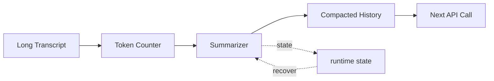

# s14: Context Compact — 上下文总会满, 要有办法腾地方

> *"上下文总会满, 要有办法腾地方"* — 四层压缩管线，保最新、弃最旧、留摘要。
>
> **Harness 层**: 上下文管理 — agent 的记忆预算。

---


## 代码架构图



## 学习前置知识

- 压缩不是截断, 而是结构化重建上下文。
- 不同角色需要不同压缩策略: 主会话、子任务、摘要恢复。
- 触发阈值应该在溢出前, 不是报错后。

## 本章抓住的 WorkBuddy-style 机制

- 吸收公开架构研究中的 compact/contextSummary 思路。
- 保留意图、关键文件、错误修复、当前工作、下一步。
- 展示 snip/micro/budget/auto 多级策略。

## 常见误区

- 简单删除早期消息, 会丢掉用户原始意图。
- 摘要不保留 pending tasks, 长任务会断线。
- 压缩后不标注来源, 后续很难验证。
## 问题

agent 跑得越久，消息历史越长。一次对话可能产生几十条消息——每次工具调用的输入输出都堆在 `messages` 列表里。模型的上下文窗口是有限的（128K、200K，无论多大终归有限），一旦超限，API 直接报错。

这不是边缘情况。一个真正干活的 agent——读文件、跑命令、改代码——几轮工具调用就能吃掉几万 token。长对话必须有一种机制：**在不丢失关键信息的前提下，压缩上下文。**

你不能简单地删掉旧消息——那会让 agent 失忆，重复之前做过的事。也不能不删——那会让 API 调用失败。你需要一个**分层压缩策略**：先做最廉价的压缩，不够再做更激进的，层层递进。

---

## 解决方案

四层压缩管线，从轻到重依次触发：

| 层级 | 策略 | 做什么 | 代价 |
|------|------|-------|------|
| Layer 1 | 工具结果截断 | 大输出截断为摘要 | 低（不丢消息） |
| Layer 2 | 文件内容去重 | 同一文件多次读取 → 只留最新 | 低（不丢消息） |
| Layer 3 | 消息历史修剪 | 删除旧的非关键消息 | 中（可能丢细节） |
| Layer 4 | 全对话摘要 | 用模型生成摘要替换历史 | 高（一次 API 调用） |

```
每次 API 调用前检查上下文大小:

  messages token count
        │
        ▼
  ┌─────────────┐
  │ < 阈值?     │── Yes ──▶ 正常调用 API
  └─────────────┘
        │ No
        ▼
  ┌─────────────────────────────────────┐
  │ Layer 1: 截断超大工具结果             │
  │ (单条 tool_result > 5000 tokens?)    │
  └─────────────────────────────────────┘
        │ 还超?
        ▼
  ┌─────────────────────────────────────┐
  │ Layer 2: 文件内容去重                 │
  │ (同一文件被读多次? 只留最新一次)       │
  └─────────────────────────────────────┘
        │ 还超?
        ▼
  ┌─────────────────────────────────────┐
  │ Layer 3: 修剪旧消息                   │
  │ (保留最近 N 轮, 旧的删除)             │
  └─────────────────────────────────────┘
        │ 还超?
        ▼
  ┌─────────────────────────────────────┐
  │ Layer 4: 生成摘要替换历史              │
  │ (调用模型总结, 替换全部旧消息)          │
  └─────────────────────────────────────┘
```

**关键原则**：系统提示和工具定义**永远不压缩**——它们每轮都要用。

---

## 工作原理

### Token 计数与阈值检查

每次 API 调用前，先估算当前 `messages` 的 token 数量。超过阈值就触发压缩：

```python
TOKEN_THRESHOLD = 100_000  # 触发压缩的阈值

def estimate_tokens(messages: list) -> int:
    """粗略估算 messages 的 token 数。

    生产级 harness 常用 tiktoken 精确计数。
    教学版用 4 字符 ≈ 1 token 的粗略估算。
    """
    total = 0
    for msg in messages:
        content = msg.get("content", "")
        if isinstance(content, str):
            total += len(content) // 4
        elif isinstance(content, list):
            for block in content:
                if isinstance(block, dict):
                    total += len(json.dumps(block)) // 4
                else:
                    total += len(str(block)) // 4
    return total
```

### Layer 1: 工具结果截断

工具返回大块输出（比如读了一个 5000 行的文件）是上下文膨胀的主要原因。第一层策略：截断超大工具结果。

```python
MAX_TOOL_RESULT_TOKENS = 5000

def truncate_tool_results(messages: list) -> list:
    """Layer 1: 截断超过 5000 token 的工具结果。"""
    for msg in messages:
        if msg["role"] != "user":
            continue
        content = msg.get("content")
        if not isinstance(content, list):
            continue
        for block in content:
            if isinstance(block, dict) and block.get("type") == "tool_result":
                result = block.get("content", "")
                tokens = len(str(result)) // 4
                if tokens > MAX_TOOL_RESULT_TOKENS:
                    # 截断为摘要
                    truncated = str(result)[:MAX_TOOL_RESULT_TOKENS * 4]
                    block["content"] = (
                        truncated +
                        f"\n\n[... 已截断, 原始长度 {len(str(result))} 字符 ...]"
                    )
    return messages
```

### Layer 2: 文件内容去重

同一个文件被读多次（agent 先读了全文，改了几行后又读了一次确认）——旧的读取结果是冗余的，只留最新的。

```python
def dedup_file_reads(messages: list) -> list:
    """Layer 2: 同一文件多次读取, 只保留最新一次。"""
    # 找到每个文件路径最后一次读取的位置
    last_read = {}  # path -> (msg_index, block_index)
    for mi, msg in enumerate(messages):
        content = msg.get("content")
        if not isinstance(content, list):
            continue
        for bi, block in enumerate(content):
            if (isinstance(block, dict)
                and block.get("type") == "tool_result"
                and block.get("_tool_name") == "read_file"):
                path = block.get("_tool_input", {}).get("path", "")
                last_read[path] = (mi, bi)

    # 删除非最新的文件读取结果
    to_remove = set()
    for path, (mi, bi) in last_read.items():
        # 找所有更早的同文件读取
        for mi2, msg in enumerate(messages[:mi]):
            content = msg.get("content")
            if not isinstance(content, list):
                continue
            for bi2, block in enumerate(content):
                if (isinstance(block, dict)
                    and block.get("type") == "tool_result"
                    and block.get("_tool_name") == "read_file"
                    and block.get("_tool_input", {}).get("path") == path):
                    to_remove.add((mi2, bi2))

    # 执行删除
    for mi, bi in sorted(to_remove, reverse=True):
        del messages[mi]["content"][bi]

    return messages
```

### Layer 3: 消息历史修剪

前两层不够时，开始删除旧消息。保留最近 N 轮对话，旧消息直接删除：

```python
KEEP_RECENT_TURNS = 6  # 保留最近 6 轮

def prune_old_messages(messages: list) -> list:
    """Layer 3: 保留最近 N 轮, 删除旧消息。

    注意: 不能删除中间的 tool_result 而留下 tool_use —
    那会导致 API 报错。必须成对删除。
    """
    if len(messages) <= KEEP_RECENT_TURNS:
        return messages

    # 保留最近 N 条消息
    kept = messages[-KEEP_RECENT_TURNS:]

    # 确保不以孤立的 tool_result 开头
    while kept and isinstance(kept[0].get("content"), list):
        first = kept[0]["content"][0] if kept[0]["content"] else None
        if isinstance(first, dict) and first.get("type") == "tool_result":
            kept = kept[1:]
        else:
            break

    return messages[:1] + kept  # 保留第一条用户消息作为上下文
```

### Layer 4: 全对话摘要

最激进的策略——用模型生成整个对话的摘要，替换掉所有旧消息：

```python
def generate_summary(messages: list, client) -> list:
    """Layer 4: 生成对话摘要替换历史。

    调用模型总结到目前为止的对话,
    用摘要替换旧消息, 保留最近几轮。
    """
    summary_prompt = """请总结以下对话的关键信息:
- 讨论了什么问题
- 做了哪些操作 (工具调用)
- 得到了什么结论
- 当前任务进度

只保留关键信息, 省略细节。"""

    old_messages = messages[:-4]  # 保留最近 4 条
    recent = messages[-4:]

    response = client.messages.create(
        model=MODEL,
        system=summary_prompt,
        messages=[{"role": "user", "content": json.dumps(old_messages)}],
        max_tokens=2000,
    )

    summary = response.content[0].text

    return [
        {"role": "user", "content": f"[对话摘要]\n{summary}"},
        {"role": "assistant", "content": "好的, 我已了解之前的对话内容。"},
    ] + recent
```

### 在循环中的位置

```python
def agent_loop(messages: list):
    while True:
        # 压缩检查 — 每次 API 调用前
        messages = compact_if_needed(messages)

        response = client.messages.create(...)
        # ... 正常循环 ...
```

---

## 压缩触发阈值层级

WorkBuddy 不是只有一个阈值——它有一组层级化的阈值，在不同压力下触发不同策略。

```
压缩触发阈值层级 (tokenUsageThresholds):

  0%  ──────────────────────────────────────── 100%
       │         │        │        │      │
       0%       50%      70%      80%    92%
       │         │        │        │      │
    安全      preMessage  auto    preMessage emergency
              Compact    Compact           Compact
              (eC=0.5)  (eE=0.7)  (0.8)  (0.92)
```

**教学常量 (clean-room reference):**

| 常量 | 值 | 含义 |
|------|----|------|
| `eE` | `0.7` | DEFAULT\_TOKEN\_THRESHOLD — autocompact 自动压缩触发 |
| `eC` | `0.5` | pre-message compact 阈值 (50%) |
| `preMessage` | `0.8` | tokenUsageThresholds.inputTokens.preMessage |
| `emergency` | `0.92` | tokenUsageThresholds.inputTokens.emergency |
| `subAgentEmergency` | emergency 或 0.92 | 子 Agent 紧急压缩阈值 |

**环境变量覆盖:**

```bash
CODEBUDDY_AUTOCOMPACT_PCT_OVERRIDE=0.6      # 覆盖 autocompact 阈值
CODEBUDDY_PRE_MESSAGE_COMPACT_PCT=0.45        # 覆盖 pre-message 阈值
CODEBUDDY_ENGINEERING_COMPACT_SUFFICIENCY_RATIO=0.3  # 压缩充分率
# autoCompactEnabled setting — 可关闭自动压缩
```

---

## compact vs contextSummary — 两个不同的 Agent

这是**两个不同的 Agent**，用途不同，保留内容不同：

| 特性 | compact Agent | contextSummary Agent |
|------|--------------|---------------------|
| AgentNames | `COMPACT = "compact"` | `CONTEXT_SUMMARY = "contextSummary"` |
| 模型 | default | default |
| 工具数 | 0 | 0 |
| 触发时机 | 70% 阈值 (autocompact) | 92% 阈值 (emergency) |
| 保留内容 | 技术骨架 (意图、概念、文件、错误、方案) | 全部用户消息 + 技术骨架 |
| 用户消息 | 可能不保留所有 | 保留所有用户消息 |
| 适用场景 | 常规压缩，保留技术上下文 | 紧急压缩，保留完整对话线索 |
| 通信能力 | 无 (INTERNAL\_GENERATOR\_AGENTS) | 无 (INTERNAL\_GENERATOR\_AGENTS) |

**compact Agent 压缩后的结构:**

```
压缩后的上下文包含:
  - Primary Request and Intent — 用户原始意图
  - Key Technical Concepts — 涉及的技术概念
  - Files and Code Sections — 关键文件和代码片段
  - Errors and fixes — 遇到的错误和修复方式
  - Problem Solving — 已解决和待解决的问题
  - Pending Tasks — 未完成的任务
  - Current Work — 当前正在进行的工作
  - Optional Next Step — 可选的下一步
```

**contextSummary Agent 额外保留:**

```
  - All user messages — 所有用户消息 (仅 contextSummary 模式)
  (其他结构与 compact 相同)
```

---

## 压缩不是截断，是结构化重建

关键认知：压缩 ≠ 截断。压缩是提取骨架、重建结构。

```python
# 错误理解: 截断 = 砍掉后面的内容
messages = messages[:100]  # 丢失上下文，agent 失忆

# 正确理解: 压缩 = 提取骨架，重建结构
compressed = compact_agent.run(messages)
# compressed 包含: 意图 + 技术概念 + 文件 + 错误 + 进度
# 丢掉的是: 中间推理过程、冗余的 tool_result、重复的确认消息
```

丢掉的是"过程噪声"，留下的是"技术骨架"——agent 不会因此失忆，只是忘记了"怎么走到这里"，但记得"走到了哪里"。

---

## 三层压缩管线 (跨课交叉引用)

信息从产生到被主 Agent 使用，经过三层压缩：

```
第一层: memorySelector 预筛选记忆 (≤5条, lite模型)
  └─ 防止无关记忆进入上下文

第二层: SubAgent 只返回摘要 (SendMessage/Notification)
  └─ SubAgent 完整推理不进入主 Agent

第三层: compact/contextSummary 全局压缩
  └─ 对话过长时，结构化重建整个上下文
```

每一层都是有损压缩，但都保留"骨架"信息。核心哲学：

- **不是等上下文腐烂了再压缩** (reactive 被动式)
- **而是从一开始就不让无关内容进入** (preventive 预防式)

第一层和第二层是"预防"——在内容进入之前就过滤。第三层是"治疗"——内容已经太多了，做结构化重建。

---

## maxConsecutiveTokenLimitSummary — 安全阀

还有一个防护机制：`maxConsecutiveTokenLimitSummary` — 限制连续压缩操作的次数，防止无限压缩循环。

如果压缩后仍然腾不出足够 token，系统不会无限次重试压缩。这避免了"压缩 → 仍然超 → 再压缩 → 仍然超"的死循环。当连续压缩达到上限仍不满足时，系统会选择其他策略（如更激进地修剪消息，或直接报错让用户介入）。

---

## WorkBuddy 架构对照

生产级桌面 agent 的上下文管理是 `agent bridge` 中的核心子系统之一。它的压缩策略比教学版更精细：

### 四层压缩对应

| 教学版 | WorkBuddy 实现 | 触发条件 |
|--------|---------------|---------|
| Layer 1: 工具结果截断 | `truncateToolResult()` — 大输出按 token 预算截断 | 单条 tool_result > 阈值 |
| Layer 2: 文件去重 | `deduplicateFileContent()` — 同文件多次读取去重 | 检测到重复 read |
| Layer 3: 消息修剪 | `pruneMessages()` — 旧消息按优先级删除 | token 超过 80% 阈值 |
| Layer 4: 对话摘要 | `summarizeConversation()` — 调模型生成摘要 | token 超过 95% 阈值 |

### Token 追踪

生产级 harness 通常会分别追踪各组件的 token 消耗：

```javascript
// agent bridge 中的 token 追踪 (简化)
const tokenUsage = {
  system: estimateTokens(systemPrompt),
  tools: estimateTokens(JSON.stringify(tools)),
  messages: estimateTokens(messages),
  total: 0,  // = system + tools + messages
};
```

每次 API 调用前检查 `tokenUsage.total` 是否超过阈值。系统提示和工具定义**永远不压缩**——它们每轮都需要。

### 保留策略

WorkBuddy 的修剪不是简单删除——它有优先级：

1. **永远保留**: 系统提示、工具定义、当前用户请求
2. **高优先级保留**: 最近的工具调用结果、最近 N 轮对话
3. **中优先级**: 中间过程的工具调用（可截断或摘要）
4. **低优先级**: 早期的探索性对话（最先被删）

---

## 代码 walkthrough

`code.py` 实现了完整的四层压缩管线：

1. **`estimate_tokens()`** — 粗略估算 messages 的 token 数（4 字符 ≈ 1 token）
2. **`truncate_tool_results()`** — Layer 1: 截断超过 5000 token 的工具结果
3. **`dedup_file_reads()`** — Layer 2: 同一文件多次读取，只留最新
4. **`prune_old_messages()`** — Layer 3: 保留最近 N 轮，删除旧消息
5. **`generate_summary()`** — Layer 4: 用模型生成摘要替换历史
6. **`compact_if_needed()`** — 总调度：依次尝试四层，直到 token 数达标
7. **agent 循环** — 每次 API 调用前检查并压缩

运行后会看到压缩日志——每层触发时打印 `[compact]` 消息，可以看到哪些层在什么时候被触发。

---

## 运行

```bash
python s14_context_compact/code.py
```

试试持续对话，观察 token 计数增长和压缩触发。可以输入 `stats` 查看当前上下文使用情况。

---

## 练习

1. 给 Layer 3（消息修剪）加一个"保护列表"——某些关键消息（如包含用户核心需求的）永远不被删除。提示：给消息加一个 `_protected` 标记。
2. 当前 Layer 4 的摘要是一次性生成。实现增量摘要：每次只摘要新增的消息，与之前的摘要合并。思考：增量摘要有什么风险？
3. `estimate_tokens` 用 4 字符 ≈ 1 token 估算。安装 `tiktoken`，用精确计数替换。对比两种方法的差异——在什么场景下粗略估算会严重偏差？

---

## 下一课

上下文满了能压缩。但系统提示本身也可能很大——WorkBuddy 的系统提示是运行时从十几个片段组装出来的。怎么组装？什么时候重新组装？

s15 Prompt Assembly → 运行时分段拼接 + 身份注入。
