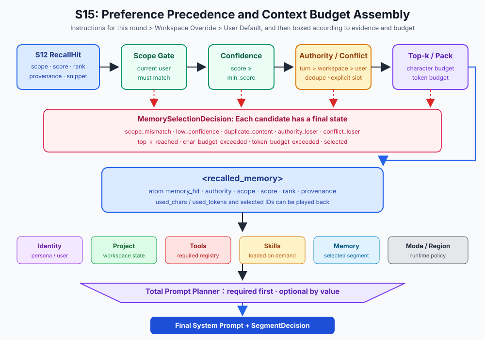
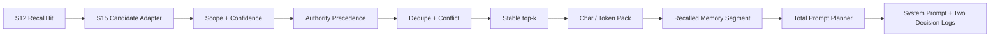

# s15: Prompt Assembly - Select First, Assemble at Runtime

[中文](README.md) · [English](README.en.md)
> *A prompt is assembled from governed blocks; it is not one unstructured string.*
>
> **Harness layer: context selection, budget, authority, and system prompt assembly.**

This lesson gives memory selection an explicit contract for scope, confidence, authority, conflicts, deduplication, and token budget.



## What This Lesson Adds

```text
query → candidate → score → stable rank → RecallResult
```

```text
RecallResult
  → scope gate
  → confidence gate
  → authority precedence
  → exact dedupe
  → explicit conflict resolution
  → stable top-k / budget packing
  → <recalled_memory>
  → total prompt segment planner
```

## Code Architecture Diagram



## s12 and s15 Responsibilities

s12 produces scoped recall candidates; s15 decides which candidates are authoritative, deduplicated, and affordable to place in the prompt.

## Memory Selection Contract

### `MemoryContextCandidate`

### `MemorySelectionPolicy`

```python
policy = MemorySelectionPolicy(
    min_score=0.35,
    top_k=5,
    max_chars=3_000,
    max_tokens=800,
)
```

```python
plan = select_memory_context(
    candidates,
    user_scope=current_scope,
    policy=policy,
    token_counter=target_model_tokenizer,
)
```

### `MemoryContextPlan`

## Authority Beats Recency

```text
current_turn > workspace_override > user_default
```

```text
authority desc → score desc → source_rank asc → captured_at desc → memory_id asc
```

### Authority Is a Harness Requirement

## Why Selection Order Matters

### 1. Scope Gate

### 2. Confidence Gate

### 3. Authority Precedence

### 4. Exact Deduplication

### 5. Explicit Conflict Resolution

```text
score desc → source_rank asc → captured_at desc → memory_id asc
```

### 6. Top-k and Budget

## Budgeting Without Asking a Model to Count

```text
Memory candidates
  └─ MemorySelectionPolicy
       └─ <recalled_memory> segment
            └─ plan_prompt(total prompt budget)
                 └─ final system prompt
```

## System Prompt Sections

### Display Order and Budget Values

```text
Build fragments and record provenance
  → reserve required fragments first
  → fail closed when required fragments exceed the budget
  → try to add optional fragments by budget_priority
  → render selected fragments by priority
  → PromptPlan + SegmentDecision
```

## Runtime Assembly

Runtime assembly orders governed blocks, records the selected evidence, and fails closed when required context cannot fit the budget.

## No-Key Prompt Boundary

```bash
python s15_prompt_assembly/code.py
```

```text
memory
```

```text
memory clear
```

```bash
PROMPT_BUDGET_CHARS=2000 python s15_prompt_assembly/code.py
```

## Common Mistakes

Do not select by recency alone, mix scopes, spend the entire budget on optional context, or hide why a candidate was excluded.

## Interview Answers

Use these exercises to change one part of memory selection, authority, conflict resolution, and prompt budgets at a time and explain the resulting contract.

## Exercises

Use these exercises to change one part of memory selection, authority, conflict resolution, and prompt budgets at a time and explain the resulting contract.

## Next Lesson

- This lesson gives memory selection an explicit contract for scope, confidence, authority, conflicts, deduplication, and token budget.

**Reference tables**

| Chapter | Owns | Does not own |
|---|---|---|
| S12 Remote Memory | Query normalization, candidate generation, score breakdown, stable ranking, scope, and provenance | The final decision about which hits enter the prompt |
| S15 Prompt Assembly | Scope/confidence gates, authority, deduplication, conflicts, top-k, budgets, and prompt assembly | Retrieval scoring or long-term memory writes |

| Authority | Meaning | Example |
|---|---|---|
| `current_turn` | Explicit requirement for the current task | "Use Go for this implementation" |
| `workspace_override` | Local convention of the current project | "This repository uses TypeScript for automation" |
| `user_default` | Cross-project personal default | "I usually prefer Python" |

| # | Segment | Source | Condition | Total-budget policy |
|---|---|---|---|---|
| 1 | Base instructions | Harness rules | Always | required |
| 2 | Identity | SOUL / IDENTITY / USER | File exists or teaching default | Optional, high value |
| 3 | Recalled memory | S12 -> S15 selection plan | The query selected hits | Optional, medium value |
| 4 | Project context | Workspace structure | Always built | Optional, high value |
| 5 | Tool descriptions | Tool registry | Tools exist | required |
| 6 | Expert instructions | Active expert | When active | Optional, high value |
| 7 | Skill instructions | Loaded `SKILL.md` | When loaded | Optional, high value |
| 8 | Connector status | MCP connectors | When connectors exist | Optional, lower value |
| 9 | Regional conventions | Current region | Region-specific | Optional, low value |
| 10 | Working mode | craft / plan / ask | Always | required |

| Event | Affected segment |
|---|---|
| New S12 recall candidates | Memory selection and memory segment |
| Query ends or user scope changes | Clear the memory segment to prevent leakage |
| Skill loads | Skill instructions |
| Expert switches | Expert instructions |
| Working mode changes | Working mode |
| Connector starts/stops | Connector status |
| Identity file changes | Identity |

The original Chinese README remains the primary-language reference. This English companion keeps the same code, diagrams, local paths, and chapter structure so readers can switch languages without losing runnable details.

Local references:

- [Reference](README.md)
- [Reference](README.en.md)
- [Reference](./images/prompt-assembly-en.svg)
