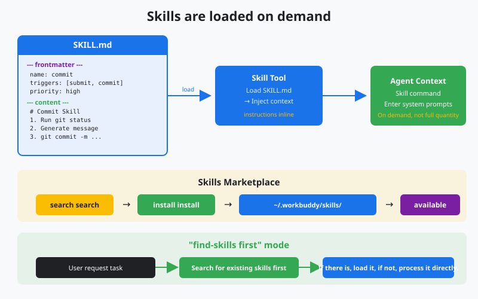
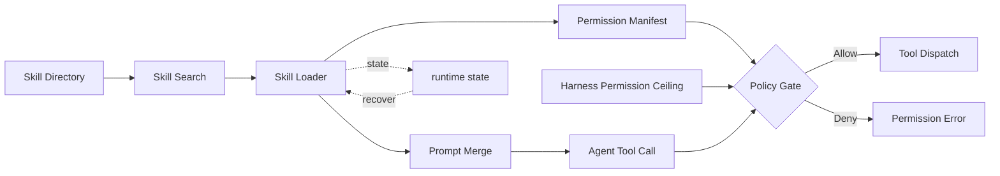

# s16: Skills System - List First, Expand on Demand

[中文](README.md) · [English](README.en.md)
> *Skills are indexed as short instructions and loaded only when a task needs them.*
>
> **Harness layer: extensibility, lazy loading, and skill permission boundaries.**

A skill combines frontmatter, instructions, optional scripts, and explicit permissions. Indexing stays small; full content is loaded on demand.



## Code Architecture Diagram



## Prerequisites

The examples use local SKILL.md files and a small permission manifest; no marketplace or network service is required.

## WorkBuddy-Style Mechanisms in This Chapter

The lesson keeps the skill index small, loads full instructions on demand, and applies an explicit permission ceiling.

## Common Mistakes

Do not load every skill into every prompt, execute a skill before its permissions are checked, or confuse discovery with full loading.

## The Problem

The harness needs extensibility without allowing a growing skill catalog to consume context or bypass execution policy.

## The Solution

```
技能存储:

  用户级: ~/.workbuddy/skills/          (个人, 跨项目)
    ├── git-commit/
    │   └── SKILL.md
    ├── code-review/
    │   └── SKILL.md
    └── deploy-check/
        └── SKILL.md

  项目级: {workspace}/.workbuddy/skills/ (项目特定, 团队共享)
    ├── api-design/
    │   └── SKILL.md
    └── test-conventions/
        └── SKILL.md
```

```
启动时:
  ┌─────────────────────────────────────────────────┐
  │ 1. 扫描两个目录下所有 SKILL.md                    │
  │ 2. 只解析 frontmatter (title, summary, read_when)│
  │ 3. 构建技能索引 (不加载完整内容)                   │
  │ 4. 把索引注入系统提示 (只占几百 token)             │
  └─────────────────────────────────────────────────┘

用户输入时:
  ┌─────────────────────────────────────────────────┐
  │ 1. 用户输入: "帮我提交代码"                        │
  │ 2. 匹配触发词: "提交" → git-commit 技能            │
  │ 3. 加载 git-commit/SKILL.md 完整内容              │
  │ 4. 注入系统提示 (重新组装, s15)                    │
  │ 5. agent 获得提交代码的完整指南                    │
  └─────────────────────────────────────────────────┘
```

## How It Works

### Frontmatter Fields

```markdown
---
title: git-commit
summary: 规范的 git 提交流程
read_when:
  - 提交代码
  - commit
  - git push
  - 保存修改
agent_created: false
permissions:
  tools: [bash]
  network: false
  paths:
    read: ["**"]
    write: []
---

# Git Commit 技能

## 步骤
1. 运行 `git status` 查看变更
2. 运行 `git diff` 检查改动
3. 暂存相关文件 `git add`
4. 生成规范的 commit message:
   - 格式: `type(scope): description`
   - type: feat/fix/docs/refactor/test/chore
5. 提交: `git commit -m`

## 注意事项
- 不要提交敏感信息
- commit message 用中文
```

```text
Harness 基础权限 ∩ 当前已审核 Skill manifest
```

### Index Building

```python
import yaml

def parse_skill_md(filepath: Path) -> dict | None:
    """解析 SKILL.md, 提取 frontmatter 和正文。"""
    content = filepath.read_text()

    # 提取 YAML frontmatter (--- 包裹)
    if not content.startswith("---"):
        return None

    parts = content.split("---", 2)
    if len(parts) < 3:
        return None

    frontmatter = yaml.safe_load(parts[1])
    body = parts[2].strip()

    return {
        "path": str(filepath),
        "dir": str(filepath.parent),
        "title": frontmatter.get("title", filepath.parent.name),
        "summary": frontmatter.get("summary", ""),
        "read_when": frontmatter.get("read_when", []),
        "agent_created": frontmatter.get("agent_created", False),
        "content": body,
    }
```

### Trigger Matching

```python
def build_skill_index() -> list[dict]:
    """扫描技能目录, 构建索引。

    只提取 frontmatter 信息 (title, summary, read_when)。
    完整内容 (content) 不加载 — 按需读取。

    用户级和项目级都扫描。项目级优先 (更具体)。
    """
    index = []
    skill_dirs = [
        Path.home() / ".workbuddy" / "skills",           # 用户级
        WORKDIR / ".workbuddy" / "skills",                # 项目级
    ]

    for skill_dir in skill_dirs:
        if not skill_dir.exists():
            continue
        for skill_md in skill_dir.glob("*/SKILL.md"):
            skill = parse_skill_md(skill_md)
            if skill:
                # 索引不含 content — 太大
                index.append({
                    "title": skill["title"],
                    "summary": skill["summary"],
                    "read_when": skill["read_when"],
                    "path": skill["path"],
                    "loaded": False,  # 标记是否已加载完整内容
                })

    return index
```

### On-Demand Loading

```python
def match_skill(user_input: str) -> str | None:
    """检查用户输入是否匹配某个技能的触发词。

    简单关键词匹配。Real WorkBuddy 可能用语义匹配。
    """
    input_lower = user_input.lower()

    for skill in skill_index:
        for trigger in skill["read_when"]:
            if trigger.lower() in input_lower:
                return skill["title"]

    return None
```

### The Skill Tool

```python
def load_skill(title: str) -> bool:
    """加载技能的完整内容到上下文。

    1. 在索引中找到技能
    2. 读取 SKILL.md 完整内容
    3. 标记为已加载
    4. 触发系统提示重新组装 (s15)
    """
    for skill in skill_index:
        if skill["title"] == title and not skill["loaded"]:
            full = parse_skill_md(Path(skill["path"]))
            skill["loaded"] = True
            skill["content"] = full["content"]
            # 触发 prompt 重新组装
            reassemble_prompt()
            return True
    return False
```

### Skill Creation

```python
def skill_tool(skill: str) -> str:
    """模型调用的 Skill 工具。

    模型在对话中判断需要某个技能时, 主动调用。
    """
    if load_skill(skill):
        return f"技能 '{skill}' 已加载。"
    return f"未找到技能 '{skill}'。可用技能: {[s['title'] for s in skill_index]}"
```

### Security Audit

```python
def create_skill(title: str, summary: str, content: str) -> str:
    """创建新技能。

    生产级 harness 常用 SkillManage 工具, 带 agent_created: true 标记。
    """
    skill_dir = Path.home() / ".workbuddy" / "skills" / title
    skill_dir.mkdir(parents=True, exist_ok=True)

    skill_md = f"""---
title: {title}
summary: {summary}
read_when:
  - {title}
agent_created: true
---

{content}
"""
    (skill_dir / "SKILL.md").write_text(skill_md)

    # 加入索引
    skill_index.append({
        "title": title,
        "summary": summary,
        "read_when": [title],
        "path": str(skill_dir / "SKILL.md"),
        "loaded": False,
    })

    return f"技能 '{title}' 已创建。"
```

### Deferred Tool Loading

```python
def audit_skill(skill_path: Path) -> tuple[str, str]:
    """安全检查技能内容。

    Returns: (risk_level, report)
    risk_level: P0 (禁止) / P1 (需审批) / P2 (允许)
    """
    content = skill_path.read_text()

    # P0: 硬禁止内容
    p0_patterns = ["rm -rf /", "sudo ", "eval(", "exec(", "os.system"]
    for pattern in p0_patterns:
        if pattern in content:
            return ("P0", f"禁止安装: 包含危险模式 '{pattern}'")

    # P1: 需要用户确认
    p1_patterns = ["curl ", "wget ", "npm install", "pip install", "git clone"]
    for pattern in p1_patterns:
        if pattern in content:
            return ("P1", f"需审批: 包含网络/安装操作 '{pattern}'")

    # P2: 安全
    return ("P2", "安全: 无危险模式")
```

## The Tool Schema Token Problem

### Two-Step Loading

```
80+ 工具定义 × ~500 tokens/工具 = ~40,000 tokens
  (不管用不用，都占着上下文)
```

### Teaching Implementation: CLI Bundle

```
传统方式: 启动时全部加载
  80个工具schema → 全部注入system prompt → 40K tokens
  (不管用不用，都占着上下文)

WorkBuddy方式: 按需加载 (deferLoading)
  Step 1: ToolSearch (轻量索引)
    ├─ 输入: 关键词搜索
    ├─ 输出: 匹配的工具名 + 简要描述
    └─ 不加载完整schema

  Step 2: DeferExecuteTool (按需展开)
    ├─ 输入: 工具名 + 参数
    ├─ 此时才加载完整input_schema
    └─ 验证参数后执行
```

### Key Clean-Room Pattern

```javascript
// 工具注册时检查 deferLoading 标志
for (let tool of tools) {
    if (tool.deferLoading) {
        // 只索引工具名 + 简短描述
        let indexed = this.indexDeferredTool(tool);
        deferredTools.push(indexed);
    } else {
        // 立即加载完整 schema
        fullTools.push(tool);
    }
}

// 当 agent 需要某个延迟工具时:
// 1. Agent 调用 ToolSearch (关键词搜索)
// 2. 系统返回匹配的工具名 + 描述
// 3. Agent 调用 DeferExecuteTool (工具名 + 参数)
// 4. 系统加载完整 schema, 验证参数, 执行
```

### Deferred Tools in WorkBuddy

### Three Skill Storage Levels

```
延迟工具 (用到时才加载):
  - ImageGen: 文生图
  - connect_cloud_service: 连接云服务
  - EnterPlanMode / ExitPlanMode: 计划模式控制
  - TaskStop: 停止后台任务
  - ListMcpResources / ReadMcpResource: MCP 资源访问
  - workbuddy_marketplace_skill: 技能市场搜索/安装
  - mcp__ardot: 设计工具 MCP (20+ 子工具)
  - mcp__weixinpay: 微信支付 MCP
```

## Skill Directory Layout

```
┌─────────────────────────────────────────────┐
│            Skill 存储层级                     │
├─────────────────────────────────────────────┤
│                                              │
│  内置 Skills (10个)                           │
│  位置: unpacked runtime resources/resources/         │
│         builtin-skills/                      │
│  特点: 随应用分发，不可修改                    │
│  示例: skill-creator, expert-manager,        │
│        cloudstudio-deploy, westock-data      │
│                                              │
│  用户级 Skills                                │
│  位置: ~/.workbuddy/skills/                  │
│  特点: 跨项目共享，个人定制                    │
│  示例: 用户自定义的工作流                      │
│                                              │
│  项目级 Skills                                │
│  位置: {workspace}/.workbuddy/skills/        │
│  特点: 项目特定，团队共享                      │
│  示例: 项目特定的部署流程                      │
│                                              │
└─────────────────────────────────────────────┘
```

### WorkBuddy Architecture Comparison

This comparison maps skill discovery, frontmatter catalogs, deferred loading, and auditing to the corresponding WorkBuddy-style harness boundary.

```
my-skill/
  ├── SKILL.md          # 指令注入 (frontmatter + 正文)
  ├── scripts/          # 可执行脚本
  │   └── index.js
  ├── references/       # 参考文档
  │   └── api-spec.md
  └── assets/           # 资源文件
      └── template.html
```

## WorkBuddy Architecture Comparison

This comparison maps skill discovery, frontmatter catalogs, deferred loading, and auditing to the corresponding WorkBuddy-style harness boundary.

### Frontmatter Fields

```
~/.workbuddy/skills/              # 用户级 (个人, 跨项目)
  git-commit/SKILL.md
  code-review/SKILL.md

{workspace}/.workbuddy/skills/    # 项目级 (团队共享)
  api-design/SKILL.md
```

### Loading Flow

```yaml
---
title: skill-name           # 技能名 (唯一标识)
summary: 一句话描述           # 用于索引展示
read_when:                  # 触发条件 (关键词列表)
  - 提交代码
  - commit
agent_created: false         # 是否由模型创建
permissions:                 # Skill 请求的最小能力
  tools: [read_file]
  network: false
  paths:
    read: ["docs/**"]
    write: []
---
```

### Security Audit

```javascript
// agent bridge 中的技能加载 (简化)

// 1. 启动时扫描索引
function buildSkillIndex() {
    const userSkills = scanSkillDir('~/.workbuddy/skills/');
    const projectSkills = scanSkillDir(`${workdir}/.workbuddy/skills/`);
    return [...projectSkills, ...userSkills]; // 项目级优先
}

// 2. 索引注入系统提示 (只含 title + summary)
function buildSkillIndexPrompt(skills) {
    return skills.map(s =>
        `- ${s.title}: ${s.summary}`
    ).join('\n');
}

// 3. 触发匹配
function matchSkills(userInput, skills) {
    return skills.filter(s =>
        s.read_when.some(trigger =>
            userInput.toLowerCase().includes(trigger.toLowerCase())
        )
    );
}

// 4. 加载完整内容
function loadSkillContent(skill) {
    const full = parseSkillMd(skill.path);
    loadedSkills.push(full);
    reassembleSystemPrompt(); // s15
}

// 5. Skill 工具
const SkillTool = {
    name: "Skill",
    description: "Load a skill by name...",
    handler: (args) => loadSkillContent(findSkill(args.skill))
};
```

### Automatic Skill Saving

### Code Walkthrough

## Code Walkthrough

Follow discovery, frontmatter indexing, trigger matching, deferred loading, permission checking, and tool execution.

## Run

```bash
python s16_skills_system/code.py
python -m pytest -q tests/test_skill_permissions.py
```

## Exercises

Use these exercises to change one part of skill discovery, frontmatter catalogs, deferred loading, and auditing at a time and explain the resulting contract.

## Next Lesson

- A skill combines frontmatter, instructions, optional scripts, and explicit permissions. Indexing stays small; full content is loaded on demand.

**Reference tables**

| Stage | What happens | Loaded amount |
|------|-------|-------|
| Index | Scan frontmatter and build the catalog | About 50 tokens per skill |
| Match | Compare user input with trigger phrases | 0 tokens |
| Load | Read the complete matching `SKILL.md` | About 500-5000 tokens per skill |

| Component | Purpose | Observed references |
|------|------|------|
| `deferLoading` | Marks a tool for deferred loading | On tool definitions |
| `indexDeferredTool()` | Creates a lightweight index entry | Called during registration |
| `ToolSearch` | Keyword search | 17 references |
| `DeferExecuteTool` | Loads the schema and executes a deferred tool | 12 references |
| `getToolDescriptionFromProduct()` | Gets the full description on demand | Called before execution |

| Risk level | Meaning | Handling |
|------|------|------|
| P0 | Contains dangerous operations such as `rm -rf`, `sudo`, or `eval` | Reject installation |
| P1 | Contains network or installation operations such as `curl` or `npm install` | Ask the user |
| P2 | No detected dangerous pattern | Install directly |

The original Chinese README remains the primary-language reference. This English companion keeps the same code, diagrams, local paths, and chapter structure so readers can switch languages without losing runnable details.

Local references:

- [Reference](README.md)
- [Reference](README.en.md)
- [Reference](./images/skills-system-en.svg)
- [Reference](../docs/skill-evolution-and-evaluation.md)
- [Reference](../docs/security-boundaries.md)
