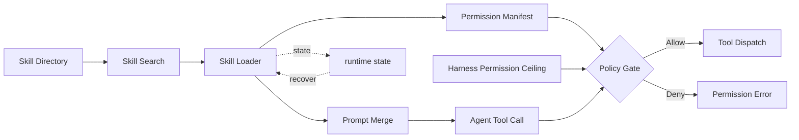

# s16: Skills System - List First, Expand on Demand

[中文](README.md) · [English](README.en.md)
> *Skills are indexed as short instructions and loaded only when a task needs them.*
>
> **Harness layer: extensibility, lazy loading, and skill permission boundaries.**

A skill combines frontmatter, instructions, optional scripts, and explicit permissions. Indexing stays small; full content is loaded on demand.


## Code Architecture Diagram



## Prerequisites

The examples use local SKILL.md files and a small permission manifest; no marketplace or network service is required.

## WorkBuddy-Style Mechanisms in This Chapter

The lesson keeps the skill index small, loads full instructions on demand, and applies an explicit permission ceiling.

## Common Mistakes

Do not load every skill into every prompt, execute a skill before its permissions are checked, or confuse discovery with full loading.

## The Problem

The harness needs extensibility without allowing a growing skill catalog to consume context or bypass execution policy.

## The Solution

```
Skill storage:

  user-level: ~/.workbuddy/skills/          (personal, shared across projects)
    ├── git-commit/
    │   └── SKILL.md
    ├── code-review/
    │   └── SKILL.md
    └── deploy-check/
        └── SKILL.md

  project-level: {workspace}/.workbuddy/skills/ (project-specific, shared with the team)
    ├── api-design/
    │   └── SKILL.md
    └── test-conventions/
        └── SKILL.md
```

```
At startup:
  ┌─────────────────────────────────────────────────┐
  │ 1. scan all SKILL.md files in both directories                    │
  │ 2. parse only frontmatter (title, summary, read_when)│
  │ 3. build the skill index (do not load full content)                   │
  │ 4. inject the index into the system prompt (use only a few hundred tokens)             │
  └─────────────────────────────────────────────────┘

When the user enters a request:
  ┌─────────────────────────────────────────────────┐
  │ 1. User input: "Help me commit code"                        │
  │ 2. match trigger words: "commit" → git-commit Skill            │
  │ 3. load the complete git-commit/SKILL.md              │
  │ 4. inject into the system prompt (reassemble, s15)                    │
   │ 5. agent receives the complete guide to committing code                   │
  └─────────────────────────────────────────────────┘
```

## How It Works

### Frontmatter Fields

```markdown
---
title: git-commit
summary: Standard Git commit workflow
read_when:
  - commit code
  - commit
  - git push
  - preserve changes
agent_created: false
permissions:
  tools: [bash]
  network: false
  paths:
    read: ["**"]
    write: []
---

# Git Commit Skill

## Steps
1. Run `git status` to inspect changes
2. Run `git diff` to inspect changes
3. Stage relevant files `git add`
4. generate a conventional commit message:
   - format: `type(scope): description`
   - type: feat/fix/docs/refactor/test/chore
5. commit: `git commit -m`

## Notes
- Do not commit sensitive information
- Use Chinese for the commit message
```

```text
Harness Base permissions ∩ currently approved Skill manifest
```

### Index Building

```python
import yaml

def parse_skill_md(filepath: Path) -> dict | None:
    """parse SKILL.md and extract its frontmatter and body."""
    content = filepath.read_text()

    # Extract YAML frontmatter (--- wrapped)
    if not content.startswith("---"):
        return None

    parts = content.split("---", 2)
    if len(parts) < 3:
        return None

    frontmatter = yaml.safe_load(parts[1])
    body = parts[2].strip()

    return {
        "path": str(filepath),
        "dir": str(filepath.parent),
        "title": frontmatter.get("title", filepath.parent.name),
        "summary": frontmatter.get("summary", ""),
        "read_when": frontmatter.get("read_when", []),
        "agent_created": frontmatter.get("agent_created", False),
        "content": body,
    }
```

### Trigger Matching

```python
def build_skill_index() -> list[dict]:
    """Scan skill directories and build an index.

    Extract only frontmatter fields (title, summary, read_when).
    full content (content) not loaded — read on demand.

    scan both user-level and project-level directories. project-level first (more specific).
    """
    index = []
    skill_dirs = [
        Path.home() / ".workbuddy" / "skills",           # user-level
        WORKDIR / ".workbuddy" / "skills",                # project-level
    ]

    for skill_dir in skill_dirs:
        if not skill_dir.exists():
            continue
        for skill_md in skill_dir.glob("*/SKILL.md"):
            skill = parse_skill_md(skill_md)
            if skill:
                # the index excludes content — it is too large
                index.append({
                    "title": skill["title"],
                    "summary": skill["summary"],
                    "read_when": skill["read_when"],
                    "path": skill["path"],
                    "loaded": False,  # mark whether full content is loaded
                })

    return index
```

### On-Demand Loading

```python
def match_skill(user_input: str) -> str | None:
    """Check whether user input matches a skill's trigger words.

    simple keyword matching.Real WorkBuddy may use semantic matching.
    """
    input_lower = user_input.lower()

    for skill in skill_index:
        for trigger in skill["read_when"]:
            if trigger.lower() in input_lower:
                return skill["title"]

    return None
```

### The Skill Tool

```python
def load_skill(title: str) -> bool:
    """Load a skill's full content into context.

    1. Find the skill in the index
    2. Read SKILL.md full content
    3. Mark as loaded
    4. Trigger system prompt reassembly (s15)
    """
    for skill in skill_index:
        if skill["title"] == title and not skill["loaded"]:
            full = parse_skill_md(Path(skill["path"]))
            skill["loaded"] = True
            skill["content"] = full["content"]
            # trigger prompt reassembly
            reassemble_prompt()
            return True
    return False
```

### Skill Creation

```python
def skill_tool(skill: str) -> str:
    """Skill tool called by the model.

    The model calls this tool when it determines that a skill is needed during a conversation.
    """
    if load_skill(skill):
        return f"Skill '{skill}' loaded."
    return f"Skill not found '{skill}'.Available skills: {[s['title'] for s in skill_index]}"
```

### Security Audit

```python
def create_skill(title: str, summary: str, content: str) -> str:
    """Create a new skill.

    Production harnesses commonly use a SkillManage tool with the agent_created: true marker.
    """
    skill_dir = Path.home() / ".workbuddy" / "skills" / title
    skill_dir.mkdir(parents=True, exist_ok=True)

    skill_md = f"""---
title: {title}
summary: {summary}
read_when:
  - {title}
agent_created: true
---

{content}
"""
    (skill_dir / "SKILL.md").write_text(skill_md)

    # Add to the index
    skill_index.append({
        "title": title,
        "summary": summary,
        "read_when": [title],
        "path": str(skill_dir / "SKILL.md"),
        "loaded": False,
    })

    return f"Skill '{title}' created."
```

### Deferred Tool Loading

```python
def audit_skill(skill_path: Path) -> tuple[str, str]:
    """Check skill content for safety.

    Returns: (risk_level, report)
    risk_level: P0 (forbidden) / P1 (approval required) / P2 (allowed)
    """
    content = skill_path.read_text()

    # P0: hard-blocked content
    p0_patterns = ["rm -rf /", "sudo ", "eval(", "exec(", "os.system"]
    for pattern in p0_patterns:
        if pattern in content:
            return ("P0", f"forbidden installation: contains dangerous pattern '{pattern}'")

    # P1: requires user confirmation
    p1_patterns = ["curl ", "wget ", "npm install", "pip install", "git clone"]
    for pattern in p1_patterns:
        if pattern in content:
            return ("P1", f"approval required: contains network/install operations '{pattern}'")

    # P2: Safe
    return ("P2", "Safe: no dangerous patterns")
```

## The Tool Schema Token Problem

### Two-Step Loading

```
80+ tool definitions × ~500 tokens/tools = ~40,000 tokens
  (consume context whether or not they are used)
```

### Teaching Implementation: CLI Bundle

```
Traditional approach: load everything at startup
  80 tool schemas → inject all into the system prompt → 40K tokens
  (consume context whether or not they are used)

WorkBuddy approach: load on demand (deferLoading)
  Step 1: ToolSearch (lightweight index)
    ├─ Input: keyword search
    ├─ Output: matching tool names + brief descriptions
    └─ do not load the full schema

  Step 2: DeferExecuteTool (expand on demand)
    ├─ Input: tool name + parameters
    ├─ load the full input_schema only at this point
    └─ validate parameters, then execute
```

### Key Clean-Room Pattern

```javascript
// Check the deferLoading flag when registering a tool
for (let tool of tools) {
    if (tool.deferLoading) {
        // index only the tool name + short description
        let indexed = this.indexDeferredTool(tool);
        deferredTools.push(indexed);
    } else {
        // load the full schema immediately
        fullTools.push(tool);
    }
}

// When the agent needs a deferred tool:
// 1. Agent calls ToolSearch (keyword search)
// 2. system returns matching tool names + descriptions
// 3. Agent calls DeferExecuteTool (tool name + parameters)
// 4. system loads the full schema, validates parameters, and executes
```

### Deferred Tools in WorkBuddy

### Three Skill Storage Levels

```
Deferred tools (loaded only when used):
  - ImageGen: text-to-image generation
  - connect_cloud_service: connect to cloud services
  - EnterPlanMode / ExitPlanMode: plan-mode control
  - TaskStop: stop background tasks
  - ListMcpResources / ReadMcpResource: MCP resource access
  - workbuddy_marketplace_skill: skill marketplace search/installation
  - mcp__ardot: design-tool MCP (20+ sub-tools)
  - mcp__weixinpay: WeChat Pay MCP
```

## Skill Directory Layout

```
┌─────────────────────────────────────────────┐
│            Skill storage hierarchy                     │
├─────────────────────────────────────────────┤
│                                              │
│  Built-in Skills (10)                           │
│  Location: unpacked runtime resources/resources/         │
│         builtin-skills/                      │
│  Characteristics: distributed with the application and cannot be modified                    │
│  Examples: skill-creator, expert-manager,        │
│        cloudstudio-deploy, westock-data      │
│                                              │
│  User-level Skills                                │
│  Location: ~/.workbuddy/skills/                  │
│  Characteristics: shared across projects and personally customized                    │
│  Examples: user-defined workflows                      │
│                                              │
│  Project-level Skills                                │
│  Location: {workspace}/.workbuddy/skills/        │
│  Characteristics: project-specific and shared with the team                      │
│  Examples: project-specific deployment flows                      │
│                                              │
└─────────────────────────────────────────────┘
```

### WorkBuddy Architecture Comparison

This comparison maps skill discovery, frontmatter catalogs, deferred loading, and auditing to the corresponding WorkBuddy-style harness boundary.

```
my-skill/
  ├── SKILL.md          # instruction injection (frontmatter + body)
  ├── scripts/          # executable scripts
  │   └── index.js
  ├── references/       # reference documents
  │   └── api-spec.md
  └── assets/           # resource files
      └── template.html
```

## WorkBuddy Architecture Comparison

This comparison maps skill discovery, frontmatter catalogs, deferred loading, and auditing to the corresponding WorkBuddy-style harness boundary.

### Frontmatter Fields

```
~/.workbuddy/skills/              # user-level (personal, shared across projects)
  git-commit/SKILL.md
  code-review/SKILL.md

{workspace}/.workbuddy/skills/    # project-level (shared with the team)
  api-design/SKILL.md
```

### Loading Flow

```yaml
---
title: skill-name           # skill name (unique identifier)
summary: one-line description           # shown in the index
read_when:                  # trigger conditions (keyword list)
  - commit code
  - commit
agent_created: false         # whether created by the model
permissions:                 # minimum capabilities requested by the Skill
  tools: [read_file]
  network: false
  paths:
    read: ["docs/**"]
    write: []
---
```

### Security Audit

```javascript
// skill loading in the agent bridge (simplified)

// 1. scan the index at startup
function buildSkillIndex() {
    const userSkills = scanSkillDir('~/.workbuddy/skills/');
    const projectSkills = scanSkillDir(`${workdir}/.workbuddy/skills/`);
    return [...projectSkills, ...userSkills]; // project-level first
}

// 2. inject the index into the system prompt (title + summary only)
function buildSkillIndexPrompt(skills) {
    return skills.map(s =>
        `- ${s.title}: ${s.summary}`
    ).join('\n');
}

// 3. trigger matching
function matchSkills(userInput, skills) {
    return skills.filter(s =>
        s.read_when.some(trigger =>
            userInput.toLowerCase().includes(trigger.toLowerCase())
        )
    );
}

// 4. load full content
function loadSkillContent(skill) {
    const full = parseSkillMd(skill.path);
    loadedSkills.push(full);
    reassembleSystemPrompt(); // s15
}

// 5. Skill tool
const SkillTool = {
    name: "Skill",
    description: "Load a skill by name...",
    handler: (args) => loadSkillContent(findSkill(args.skill))
};
```

### Automatic Skill Saving

### Code Walkthrough

## Code Walkthrough

Follow discovery, frontmatter indexing, trigger matching, deferred loading, permission checking, and tool execution.

## Run

```bash
python s16_skills_system/code.py
python -m pytest -q tests/test_skill_permissions.py
```

## Exercises

Use these exercises to change one part of skill discovery, frontmatter catalogs, deferred loading, and auditing at a time and explain the resulting contract.

## Next Lesson

- A skill combines frontmatter, instructions, optional scripts, and explicit permissions. Indexing stays small; full content is loaded on demand.

**Reference tables**

| Stage | What happens | Loaded amount |
|------|-------|-------|
| Index | Scan frontmatter and build the catalog | About 50 tokens per skill |
| Match | Compare user input with trigger phrases | 0 tokens |
| Load | Read the complete matching `SKILL.md` | About 500-5000 tokens per skill |

| Component | Purpose | Observed references |
|------|------|------|
| `deferLoading` | Marks a tool for deferred loading | On tool definitions |
| `indexDeferredTool()` | Creates a lightweight index entry | Called during registration |
| `ToolSearch` | Keyword search | 17 references |
| `DeferExecuteTool` | Loads the schema and executes a deferred tool | 12 references |
| `getToolDescriptionFromProduct()` | Gets the full description on demand | Called before execution |

| Risk level | Meaning | Handling |
|------|------|------|
| P0 | Contains dangerous operations such as `rm -rf`, `sudo`, or `eval` | Reject installation |
| P1 | Contains network or installation operations such as `curl` or `npm install` | Ask the user |
| P2 | No detected dangerous pattern | Install directly |

The original Chinese README remains the primary-language reference. This English companion keeps the same code, diagrams, local paths, and chapter structure so readers can switch languages without losing runnable details.

Local references:

- [Reference](README.md)
- [Reference](README.en.md)
- [Reference](./images/skills-system-en.svg)
- [Reference](../docs/skill-evolution-and-evaluation.md)
- [Reference](../docs/security-boundaries.md)
