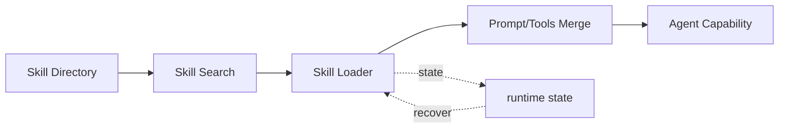

# s16: Skills System — 技能先列目录, 用到时再展开

> *"技能先列目录, 用到时再展开"* — SKILL.md frontmatter, 按需加载。
>
> **Harness 层**: 扩展生态 — agent 的知识按需加载。

---


## 代码架构图



## 学习前置知识

- Skill 是按需加载的操作指南, 不是工具本身。
- 一个好 skill 通常包含 SKILL.md、scripts、references、assets。
- 技能目录和技能正文应该分离加载。

## 本章抓住的 WorkBuddy-style 机制

- 吸收 110.md 的 Skills + Plugins + Hooks 扩展思路。
- 用 progressive disclosure 控制 token 成本。
- 让技能可以带脚本、参考资料和资源文件。

## 常见误区

- 把所有 skill 全文注入 prompt, 会浪费上下文。
- Skill 写成泛泛建议, 模型不知道什么时候触发。
- 脚本和参考资料没有边界, 会让 skill 难以复用。
## 问题

agent 有基础工具（bash、read、write），有记忆系统，有身份。但不同任务需要不同的**操作指南**——提交代码有 commit 规范，做 code review 有 review 流程，部署有部署检查清单。如果把这些全部塞进系统提示，提示会膨胀到不可接受。

你需要一种机制：**平时只列技能目录（名字 + 什么时候用），用到时才加载完整内容。** 就像人的知识——你知道图书馆里有哪些书（目录），但只有需要时才去翻开具体那本。

WorkBuddy 的 Skills 系统解决这个问题。每个技能是一个目录，包含一个 `SKILL.md` 文件。`SKILL.md` 的头部有 YAML frontmatter——标题、摘要、触发条件。系统启动时只扫描 frontmatter 建索引，不加载全文。当用户的输入匹配触发条件时，才把对应技能的完整内容加载进上下文。

---

## 解决方案

两级存储 + 按需加载：

```
技能存储:

  用户级: ~/.workbuddy/skills/          (个人, 跨项目)
    ├── git-commit/
    │   └── SKILL.md
    ├── code-review/
    │   └── SKILL.md
    └── deploy-check/
        └── SKILL.md

  项目级: {workspace}/.workbuddy/skills/ (项目特定, 团队共享)
    ├── api-design/
    │   └── SKILL.md
    └── test-conventions/
        └── SKILL.md
```

加载流程：

```
启动时:
  ┌─────────────────────────────────────────────────┐
  │ 1. 扫描两个目录下所有 SKILL.md                    │
  │ 2. 只解析 frontmatter (title, summary, read_when)│
  │ 3. 构建技能索引 (不加载完整内容)                   │
  │ 4. 把索引注入系统提示 (只占几百 token)             │
  └─────────────────────────────────────────────────┘

用户输入时:
  ┌─────────────────────────────────────────────────┐
  │ 1. 用户输入: "帮我提交代码"                        │
  │ 2. 匹配触发词: "提交" → git-commit 技能            │
  │ 3. 加载 git-commit/SKILL.md 完整内容              │
  │ 4. 注入系统提示 (重新组装, s15)                    │
  │ 5. agent 获得提交代码的完整指南                    │
  └─────────────────────────────────────────────────┘
```

| 阶段 | 做什么 | 加载量 |
|------|-------|-------|
| 索引 | 扫描 frontmatter，构建目录 | 每技能 ~50 token |
| 匹配 | 用户输入 vs 触发词 | 0 token |
| 加载 | 读取匹配技能的完整 SKILL.md | 每技能 ~500-5000 token |

---

## 工作原理

### SKILL.md 结构

每个技能的 `SKILL.md` 包含 YAML frontmatter 和 Markdown 正文：

```markdown
---
title: git-commit
summary: 规范的 git 提交流程
read_when:
  - 提交代码
  - commit
  - git push
  - 保存修改
agent_created: false
---

# Git Commit 技能

## 步骤
1. 运行 `git status` 查看变更
2. 运行 `git diff` 检查改动
3. 暂存相关文件 `git add`
4. 生成规范的 commit message:
   - 格式: `type(scope): description`
   - type: feat/fix/docs/refactor/test/chore
5. 提交: `git commit -m`

## 注意事项
- 不要提交敏感信息
- commit message 用中文
```

### Frontmatter 解析

```python
import yaml

def parse_skill_md(filepath: Path) -> dict | None:
    """解析 SKILL.md, 提取 frontmatter 和正文。"""
    content = filepath.read_text()

    # 提取 YAML frontmatter (--- 包裹)
    if not content.startswith("---"):
        return None

    parts = content.split("---", 2)
    if len(parts) < 3:
        return None

    frontmatter = yaml.safe_load(parts[1])
    body = parts[2].strip()

    return {
        "path": str(filepath),
        "dir": str(filepath.parent),
        "title": frontmatter.get("title", filepath.parent.name),
        "summary": frontmatter.get("summary", ""),
        "read_when": frontmatter.get("read_when", []),
        "agent_created": frontmatter.get("agent_created", False),
        "content": body,
    }
```

### 索引构建

启动时扫描技能目录，只解析 frontmatter，不加载正文：

```python
def build_skill_index() -> list[dict]:
    """扫描技能目录, 构建索引。

    只提取 frontmatter 信息 (title, summary, read_when)。
    完整内容 (content) 不加载 — 按需读取。

    用户级和项目级都扫描。项目级优先 (更具体)。
    """
    index = []
    skill_dirs = [
        Path.home() / ".workbuddy" / "skills",           # 用户级
        WORKDIR / ".workbuddy" / "skills",                # 项目级
    ]

    for skill_dir in skill_dirs:
        if not skill_dir.exists():
            continue
        for skill_md in skill_dir.glob("*/SKILL.md"):
            skill = parse_skill_md(skill_md)
            if skill:
                # 索引不含 content — 太大
                index.append({
                    "title": skill["title"],
                    "summary": skill["summary"],
                    "read_when": skill["read_when"],
                    "path": skill["path"],
                    "loaded": False,  # 标记是否已加载完整内容
                })

    return index
```

### 触发匹配

用户输入时，检查是否匹配某个技能的 `read_when`：

```python
def match_skill(user_input: str) -> str | None:
    """检查用户输入是否匹配某个技能的触发词。

    简单关键词匹配。Real WorkBuddy 可能用语义匹配。
    """
    input_lower = user_input.lower()

    for skill in skill_index:
        for trigger in skill["read_when"]:
            if trigger.lower() in input_lower:
                return skill["title"]

    return None
```

### 按需加载

匹配到技能时，读取完整 SKILL.md 内容，注入系统提示：

```python
def load_skill(title: str) -> bool:
    """加载技能的完整内容到上下文。

    1. 在索引中找到技能
    2. 读取 SKILL.md 完整内容
    3. 标记为已加载
    4. 触发系统提示重新组装 (s15)
    """
    for skill in skill_index:
        if skill["title"] == title and not skill["loaded"]:
            full = parse_skill_md(Path(skill["path"]))
            skill["loaded"] = True
            skill["content"] = full["content"]
            # 触发 prompt 重新组装
            reassemble_prompt()
            return True
    return False
```

### Skill 工具

模型也可以主动调用 `Skill` 工具来加载技能：

```python
def skill_tool(skill: str) -> str:
    """模型调用的 Skill 工具。

    模型在对话中判断需要某个技能时, 主动调用。
    """
    if load_skill(skill):
        return f"技能 '{skill}' 已加载。"
    return f"未找到技能 '{skill}'。可用技能: {[s['title'] for s in skill_index]}"
```

### 技能创建

模型完成任务后，可以把流程保存为新技能：

```python
def create_skill(title: str, summary: str, content: str) -> str:
    """创建新技能。

    生产级 harness 常用 SkillManage 工具, 带 agent_created: true 标记。
    """
    skill_dir = Path.home() / ".workbuddy" / "skills" / title
    skill_dir.mkdir(parents=True, exist_ok=True)

    skill_md = f"""---
title: {title}
summary: {summary}
read_when:
  - {title}
agent_created: true
---

{content}
"""
    (skill_dir / "SKILL.md").write_text(skill_md)

    # 加入索引
    skill_index.append({
        "title": title,
        "summary": summary,
        "read_when": [title],
        "path": str(skill_dir / "SKILL.md"),
        "loaded": False,
    })

    return f"技能 '{title}' 已创建。"
```

### 安全审计

安装新技能前需要安全检查。WorkBuddy 有 P0/P1/P2 风险分级：

```python
def audit_skill(skill_path: Path) -> tuple[str, str]:
    """安全检查技能内容。

    Returns: (risk_level, report)
    risk_level: P0 (禁止) / P1 (需审批) / P2 (允许)
    """
    content = skill_path.read_text()

    # P0: 硬禁止内容
    p0_patterns = ["rm -rf /", "sudo ", "eval(", "exec(", "os.system"]
    for pattern in p0_patterns:
        if pattern in content:
            return ("P0", f"禁止安装: 包含危险模式 '{pattern}'")

    # P1: 需要用户确认
    p1_patterns = ["curl ", "wget ", "npm install", "pip install", "git clone"]
    for pattern in p1_patterns:
        if pattern in content:
            return ("P1", f"需审批: 包含网络/安装操作 '{pattern}'")

    # P2: 安全
    return ("P2", "安全: 无危险模式")
```

> ⚠️ **P0/P1/P2 字符串匹配只是第一层。** 技能综述 [*Agent Skill Evaluation and
> Evolution*](https://arxiv.org/pdf/2606.11435) 中的 SKILL-INJECT 基准指出，恶意
> 技能有三类更隐蔽的攻击模式，纯模式匹配一个都拦不住：**隐藏覆盖**（表面正常，
> 悄悄改写 harness 默认行为或安全规则）、**伪装转移**（把数据外泄伪装成正常步骤）、
> **远程引导**（运行时才从外部拉取真正的恶意指令，静态扫描必然看不到）。更完整的
> 防御思路（声明式权限 + 沙盒试跑 + 出口管控）见
> [`docs/skill-evolution-and-evaluation.md`](../docs/skill-evolution-and-evaluation.md)
> 和 [`docs/security-boundaries.md`](../docs/security-boundaries.md)。
> 关于怎么把技能本身写好，可参考 datawhale 的
> [如何写出好的 Skill](https://github.com/datawhalechina/hello-agents/blob/main/Extra-Chapter/Extra08-%E5%A6%82%E4%BD%95%E5%86%99%E5%87%BA%E5%A5%BD%E7%9A%84Skill.md)。

---

## 工具延迟加载 (deferLoading)

Skills 系统解决了"操作指南按需加载"的问题。但 WorkBuddy 还面临另一个更大的 token 开销：**工具定义本身**。

### 问题：工具 schema 的 token 爆炸

WorkBuddy-style 桌面 agent 往往有数十个内置工具、多类 MCP 连接器和一组内置技能。每个工具定义包含 name、description、input_schema（带参数的 JSON Schema）。如果启动时全部加载：

```
80+ 工具定义 × ~500 tokens/工具 = ~40,000 tokens
  (不管用不用，都占着上下文)
```

系统提示还没开始干活，就先吃掉 4 万 token。

### 解决方案：两步加载模式

```
传统方式: 启动时全部加载
  80个工具schema → 全部注入system prompt → 40K tokens
  (不管用不用，都占着上下文)

WorkBuddy方式: 按需加载 (deferLoading)
  Step 1: ToolSearch (轻量索引)
    ├─ 输入: 关键词搜索
    ├─ 输出: 匹配的工具名 + 简要描述
    └─ 不加载完整schema

  Step 2: DeferExecuteTool (按需展开)
    ├─ 输入: 工具名 + 参数
    ├─ 此时才加载完整input_schema
    └─ 验证参数后执行
```

和 Skills 的思路完全一致——**先列目录，用到时再展开**。

### 教学实现（CLI bundle）

```javascript
// 工具注册时检查 deferLoading 标志
for (let tool of tools) {
    if (tool.deferLoading) {
        // 只索引工具名 + 简短描述
        let indexed = this.indexDeferredTool(tool);
        deferredTools.push(indexed);
    } else {
        // 立即加载完整 schema
        fullTools.push(tool);
    }
}

// 当 agent 需要某个延迟工具时:
// 1. Agent 调用 ToolSearch (关键词搜索)
// 2. 系统返回匹配的工具名 + 描述
// 3. Agent 调用 DeferExecuteTool (工具名 + 参数)
// 4. 系统加载完整 schema, 验证参数, 执行
```

### clean-room 对照里的关键模式

| 组件 | 作用 | 出现次数 |
|------|------|---------|
| `deferLoading` 属性 | 标记工具为延迟加载 | 工具定义上 |
| `indexDeferredTool()` | 创建轻量索引条目 | 注册时调用 |
| `ToolSearch` 工具 | 关键词搜索（MiniSearch 引擎） | 17 处引用 |
| `DeferExecuteTool` 工具 | 加载 schema 后执行延迟工具 | 12 处引用 |
| `getToolDescriptionFromProduct()` | 按需获取完整描述 | 执行前调用 |

### WorkBuddy 中的延迟工具

从系统提示可以看到，以下工具采用 deferLoading，平时不加载 schema：

```
延迟工具 (用到时才加载):
  - ImageGen: 文生图
  - connect_cloud_service: 连接云服务
  - EnterPlanMode / ExitPlanMode: 计划模式控制
  - TaskStop: 停止后台任务
  - ListMcpResources / ReadMcpResource: MCP 资源访问
  - workbuddy_marketplace_skill: 技能市场搜索/安装
  - mcp__ardot: 设计工具 MCP (20+ 子工具)
  - mcp__weixinpay: 微信支付 MCP
```

agent 需要这些工具时，先通过 `ToolSearch` 搜关键词找到工具名，再通过 `DeferExecuteTool` 加载完整 schema 并执行。

---

## 三级 Skills 架构

前面提到的两级存储（用户级 + 项目级）是简化模型。实际上 WorkBuddy 的 Skills 有三级：

```
┌─────────────────────────────────────────────┐
│            Skill 存储层级                     │
├─────────────────────────────────────────────┤
│                                              │
│  内置 Skills (10个)                           │
│  位置: unpacked runtime resources/resources/         │
│         builtin-skills/                      │
│  特点: 随应用分发，不可修改                    │
│  示例: skill-creator, expert-manager,        │
│        cloudstudio-deploy, westock-data      │
│                                              │
│  用户级 Skills                                │
│  位置: ~/.workbuddy/skills/                  │
│  特点: 跨项目共享，个人定制                    │
│  示例: 用户自定义的工作流                      │
│                                              │
│  项目级 Skills                                │
│  位置: {workspace}/.workbuddy/skills/        │
│  特点: 项目特定，团队共享                      │
│  示例: 项目特定的部署流程                      │
│                                              │
└─────────────────────────────────────────────┘
```

优先级：项目级 > 用户级 > 内置级。更具体的约定覆盖更通用的指南。

### Skill 目录结构

一个完整的 Skill 不仅有 SKILL.md，还可以包含脚本和资源：

```
my-skill/
  ├── SKILL.md          # 指令注入 (frontmatter + 正文)
  ├── scripts/          # 可执行脚本
  │   └── index.js
  ├── references/       # 参考文档
  │   └── api-spec.md
  └── assets/           # 资源文件
      └── template.html
```

当 Skill 被加载时，SKILL.md 的内容注入 agent 的上下文——这就是"临时扩展 agent 的专业知识"。scripts 和 references 不自动注入，agent 可以按需读取。

---

## WorkBuddy 架构对照

生产级桌面 agent 的 Skills 系统是扩展生态的第一层（Skills → MCP → Experts）。

### 两级存储

```
~/.workbuddy/skills/              # 用户级 (个人, 跨项目)
  git-commit/SKILL.md
  code-review/SKILL.md

{workspace}/.workbuddy/skills/    # 项目级 (团队共享)
  api-design/SKILL.md
```

项目级技能优先——更具体的项目约定覆盖通用的用户级技能。

### Frontmatter 字段

```yaml
---
title: skill-name           # 技能名 (唯一标识)
summary: 一句话描述           # 用于索引展示
read_when:                  # 触发条件 (关键词列表)
  - 提交代码
  - commit
agent_created: false         # 是否由模型创建
risk_level: P2               # 安全等级
---
```

### 加载流程

```javascript
// agent bridge 中的技能加载 (简化)

// 1. 启动时扫描索引
function buildSkillIndex() {
    const userSkills = scanSkillDir('~/.workbuddy/skills/');
    const projectSkills = scanSkillDir(`${workdir}/.workbuddy/skills/`);
    return [...projectSkills, ...userSkills]; // 项目级优先
}

// 2. 索引注入系统提示 (只含 title + summary)
function buildSkillIndexPrompt(skills) {
    return skills.map(s =>
        `- ${s.title}: ${s.summary}`
    ).join('\n');
}

// 3. 触发匹配
function matchSkills(userInput, skills) {
    return skills.filter(s =>
        s.read_when.some(trigger =>
            userInput.toLowerCase().includes(trigger.toLowerCase())
        )
    );
}

// 4. 加载完整内容
function loadSkillContent(skill) {
    const full = parseSkillMd(skill.path);
    loadedSkills.push(full);
    reassembleSystemPrompt(); // s15
}

// 5. Skill 工具
const SkillTool = {
    name: "Skill",
    description: "Load a skill by name...",
    handler: (args) => loadSkillContent(findSkill(args.skill))
};
```

### 安全审计

安装市场技能时，WorkBuddy 执行安全审计：

| 等级 | 含义 | 处理 |
|------|------|------|
| P0 | 包含危险操作 (rm -rf, sudo, eval) | 禁止安装 |
| P1 | 包含网络/安装操作 (curl, npm install) | 需用户确认 |
| P2 | 安全内容 | 直接安装 |

### 自动保存技能

WorkBuddy 的一个设计原则：**完成多步骤任务后，模型必须保存流程为技能**。这让 agent 随着使用越来越强——下次遇到类似任务直接加载技能，不用重新探索。

---

## 代码 walkthrough

`code.py` 实现了完整的 Skills 系统：

1. **`parse_skill_md()`** — 解析 SKILL.md 的 YAML frontmatter 和正文
2. **`build_skill_index()`** — 扫描用户级和项目级技能目录，构建索引
3. **`match_skill()`** — 用户输入与触发词的关键词匹配
4. **`load_skill()`** — 按需加载技能完整内容
5. **`create_skill()`** — 创建新技能（agent_created 标记）
6. **`audit_skill()`** — 安装前的 P0/P1/P2 安全审计
7. **`Skill` 工具** — 模型可主动调用的技能加载工具
8. **agent 循环** — 输入时自动匹配技能，加载后重新组装系统提示

预设了 3 个示例技能（git-commit、code-review、deploy-check）在内存中模拟。运行后试试说"帮我提交代码"——观察技能匹配和加载过程。

---

## 运行

```bash
python s16_skills_system/code.py
```

---

## 练习

1. 当前 `match_skill` 用简单关键词匹配。实现一个更智能的匹配——支持同义词（"commit" 和 "提交"都匹配 git-commit 技能）。思考：语义匹配和关键词匹配各有什么优缺点？
2. 加一个 `list_skills` 工具——让模型能列出所有可用技能及其摘要。思考：模型在什么情况下需要主动列技能？
3. 实现技能依赖——一个技能可以声明 `depends_on: [other-skill]`，加载时自动连带加载依赖技能。思考：这和 npm 的 dependencies 有什么异同？

---

## 下一课

Skills 是扩展生态的第一层——按需加载操作指南。但有些领域知识不是一个"技能"能覆盖的——它是一整套工具、规则、上下文的集合。这需要专家包。

s17 MCP Connectors → 标准协议, 信任模型, 工具池组装。
