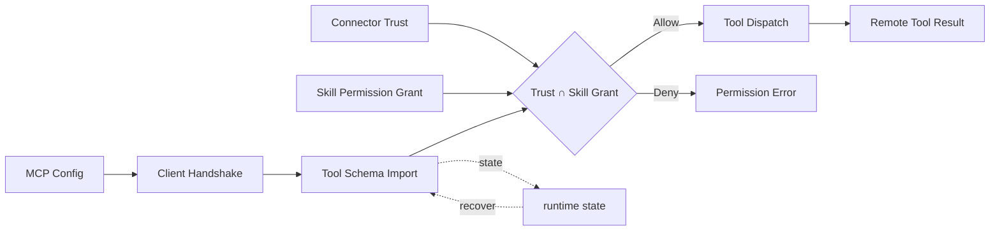

# s17: MCP Connectors - External Tools Need Trust and Grants

[中文](README.md) · [English](README.en.md)
> *A connector can expose tools, but trust and the active skill grant still decide visibility.*
>
> **Harness layer: external tool protocols and connector lifecycle.**

The lesson models configured, trusted, connected, and deferred MCP tools with namespacing and fail-closed permission checks.


## Code Architecture Diagram



## Prerequisites

The lesson uses offline connector definitions so discovery and trust decisions can be tested without a live MCP server.

## WorkBuddy-Style Mechanisms in This Chapter

The lesson treats connectors as governed tool providers with explicit discovery, trust, configuration, and deferred execution.

## Common Mistakes

A connector should not become trusted merely because it is discoverable, and unavailable tools must remain explicit to the caller.

## The Problem

The harness must extend its tool surface without giving an external connector an implicit path around local policy.

## The Solution

```
                    MCP Connector Lifecycle

  configured ──► disconnected ──► trusted ──► connected
       │              │               │            │
       │              │               │            │
  mcp.json 写入   进程未启动      用户点击 Trust   tools/list 发现
  配置已保存      工具池不可见     信任持久化       再与 Skill Grant 求交集

           ┌──────────────────────────────────────┐
           │         Agent Tool Pool              │
           │                                      │
           │  Built-in Tools    MCP Tools         │
           │  ┌──────────┐    ┌────────────────┐ │
           │  │ bash     │    │ mcp__github__  │ │
           │  │ read     │    │   create_pr    │ │
           │  │ write    │    │ mcp__feishu__  │ │
           │  │ glob     │    │   send_msg     │ │
           │  │ grep     │    │ mcp__notion__  │ │
           │  │ ...      │    │   search       │ │
           │  └──────────┘    └────────────────┘ │
           └──────────────────────────────────────┘
```

## How It Works

### Tool Discovery

```json
{
  "mcpServers": {
    "github": {
      "command": "npx",
      "args": ["-y", "@modelcontextprotocol/server-github"],
      "env": { "GITHUB_TOKEN": "ghp_xxx" }
    },
    "feishu": {
      "command": "npx",
      "args": ["-y", "@workbuddy/mcp-feishu"],
      "env": { "FEISHU_APP_ID": "cli_xxx", "FEISHU_APP_SECRET": "xxx" }
    }
  }
}
```

### Deferred Tool Loading

```python
TRUST_FILE = Path.home() / ".workbuddy" / "connector_trust.json"

def is_trusted(connector_name: str) -> bool:
    """检查连接器是否已被用户信任。"""
    trust_data = json.loads(TRUST_FILE.read_text()) if TRUST_FILE.exists() else {}
    return trust_data.get(connector_name, {}).get("trusted", False)

def trust_connector(connector_name: str):
    """用户手动信任一个连接器。"""
    trust_data = json.loads(TRUST_FILE.read_text()) if TRUST_FILE.exists() else {}
    trust_data[connector_name] = {"trusted": True, "timestamp": time.time()}
    TRUST_FILE.write_text(json.dumps(trust_data, indent=2))
```

```python
grant = MCPPermissionGrant(
    tools={"mcp__github__list_issues"},
    network=True,
)
manager = ConnectorManager(MCP_CONFIG, grant)
```

### Connector State in Context

```python
def discover_tools(connector_name: str) -> list[dict]:
    """通过 MCP 协议发现连接器提供的工具。"""
    connector = connectors[connector_name]
    response = connector.request("tools/list", {})

    discovered = []
    for tool in response.get("tools", []):
        # 命名空间化: mcp__connectorname__toolname
        namespaced_name = f"mcp__{connector_name}__{tool['name']}"
        if not active_skill_grant.allows(namespaced_name):
            continue
        discovered.append({
            "name": namespaced_name,
            "description": tool["description"],
            "input_schema": tool["inputSchema"],
        })
    return discovered
```

### WorkBuddy Architecture Comparison

This comparison maps connector configuration, trust, tool discovery, and deferred execution to the corresponding WorkBuddy-style harness boundary.

```python
# 系统提示中只告诉 agent 有哪些延迟工具可用
# 不包含完整的 schema

DEFERRED_TOOLS = [
    {"name": "mcp__github__create_pr", "description": "Create a GitHub PR"},
    {"name": "mcp__feishu__send_message", "description": "Send a Feishu message"},
    # ... 只有 name + description，没有 input_schema
]

# 当 agent 决定使用某个延迟工具时:
# 1. ToolSearch 加载 schema
schema = tool_search("mcp__github__create_pr")  # 再检查 Skill grant
# 2. DeferExecuteTool 执行
result = defer_execute_tool("mcp__github__create_pr", {"title": "...", "body": "..."})  # 再检查
```

### Configuration Files

```python
def build_connector_context() -> str:
    """构建连接器状态上下文，注入系统提示。"""
    lines = ["<available_deferred_tools>"]
    for name, conn in connectors.items():
        if conn.status == "connected":
            for tool in conn.tools:
                if not active_skill_grant.allows(tool["name"]):
                    continue
                lines.append(f"- {tool['name']}: {tool['description']}")
    lines.append("</available_deferred_tools>")
    return "\n".join(lines)
```

## WorkBuddy Architecture Comparison

This comparison maps connector configuration, trust, tool discovery, and deferred execution to the corresponding WorkBuddy-style harness boundary.

### Trust Flow

```json
{
  "mcpServers": {
    "tencent-docs": {
      "command": "npx",
      "args": ["-y", "@workbuddy/mcp-tencent-docs"],
      "env": { "TENCENT_DOCS_TOKEN": "..." }
    }
  }
}
```

### Deferred Tool Loading

### Connector Ecosystem

### Code Walkthrough

### Run

## Code Walkthrough

Trace connector configuration, trust admission, tool discovery, schema loading, and the final governed call.

## Run

```bash
python s17_mcp_connectors/code.py
python -m pytest -q tests/test_skill_permissions.py
```

## Exercises

Use these exercises to change one part of connector configuration, trust, tool discovery, and deferred execution at a time and explain the resulting contract.

## Next Lesson

- The lesson models configured, trusted, connected, and deferred MCP tools with namespacing and fail-closed permission checks.

**Reference tables**

| Stage | Meaning | Tool visibility |
|---|---|-----------|
| configured | Configuration written to `mcp.json` | Not visible |
| disconnected | Process is not running | Not visible |
| trusted | User has trusted it; process is waiting to start | Not visible |
| connected | Process started and `tools/list` completed | Only declared tools are visible, with deferred loading |

| Method | Direction | Purpose |
|------|------|------|
| `tools/list` | client -> server | Discover available tools |
| `tools/call` | client -> server | Call a tool |
| `resources/list` | client -> server | List available resources |
| `resources/read` | client -> server | Read a resource |

| Connector | Capability |
|--------|------|
| `tencent-docs` | Read and write Tencent Docs |
| `github` | GitHub PR and issue operations |
| `feishu` | Feishu messages and documents |
| `notion` | Notion page management |
| `dingtalk` | DingTalk messages and approvals |
| `wecom` | WeCom messages |
| `ardot` | AR design-tool integration |

The original Chinese README remains the primary-language reference. This English companion keeps the same code, diagrams, local paths, and chapter structure so readers can switch languages without losing runnable details.

Local references:

- [Reference](README.md)
- [Reference](README.en.md)
- [Reference](./images/mcp-connectors-en.svg)
