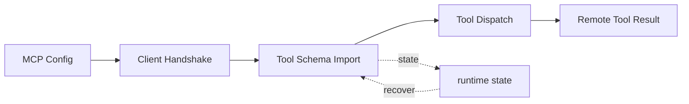

# s17: MCP Connectors — 外接工具, 标准协议, 信任模型

> *"外接工具, 标准协议, 信任模型"* — MCP 让 agent 的工具池可以无限扩展，但每个外接工具都需要用户手动信任。
>
> **Harness 层**: 扩展生态 — agent 的外接工具系统。

---


## 代码架构图



## 学习前置知识

- MCP 把外部服务能力标准化成 tools/list 和 tools/call。
- 连接器需要信任模型, 不能发现了就自动执行。
- 外部工具同样要进入权限、审计、上下文预算。

## 本章抓住的 WorkBuddy-style 机制

- 用连接器发现、信任、调用三个阶段模拟 MCP 生命周期。
- 把公开架构研究中的 MCPConnectors 思想泛化为多类连接器。
- 展示 MCP 工具如何合并进统一工具池。

## 常见误区

- 连接器越多越好是错觉, 工具膨胀会降低选择质量。
- 未信任连接器直接暴露给模型, 风险很高。
- MCP 工具不走统一审计, 会出现治理盲区。
## 问题

s16 的 Skills 系统让 agent 可以按需加载单个技能。但技能本质上是 prompt 模板——它们告诉 agent "怎么做"，而不是提供新的"能做什么"。

如果你的 agent 需要读腾讯文档、操作 GitHub PR、发飞书消息呢？这些不是 prompt 能解决的问题——你需要真正调用外部服务的 API。

当然可以把每个外部服务的调用直接写进 agent 的代码里。但这意味着：每加一个服务就改一次代码、重新发布。40 个服务就是 40 次改动。更糟糕的是，不同团队开发的工具无法复用——每个人都在造自己的 GitHub 集成。

MCP（Model Context Protocol）解决了这个问题。它定义了一个标准协议：任何工具只要实现 `tools/list`（列出你能做什么）和 `tools/call`（执行某个工具），就可以被任何 MCP 客户端发现和使用。工具开发者和 agent 开发者彻底解耦。

但"外接工具"带来了一个安全问题：一个恶意连接器可以执行任意命令、窃取数据。WorkBuddy 的答案是信任模型——每个连接器必须由用户手动 "Trust" 后才会激活。

---

## 解决方案

```
                    MCP Connector Lifecycle
                    
  configured ──► disconnected ──► trusted ──► connected
       │              │               │            │
       │              │               │            │
  mcp.json 写入   进程未启动      用户点击 Trust   tools/list 发现
  配置已保存      工具池不可见     信任持久化       tools/call 可用


           ┌──────────────────────────────────────┐
           │         Agent Tool Pool              │
           │                                      │
           │  Built-in Tools    MCP Tools         │
           │  ┌──────────┐    ┌────────────────┐ │
           │  │ bash     │    │ mcp__github__  │ │
           │  │ read     │    │   create_pr    │ │
           │  │ write    │    │ mcp__feishu__  │ │
           │  │ glob     │    │   send_msg     │ │
           │  │ grep     │    │ mcp__notion__  │ │
           │  │ ...      │    │   search       │ │
           │  └──────────┘    └────────────────┘ │
           └──────────────────────────────────────┘
```

| 阶段 | 含义 | 工具可见性 |
|------|------|-----------|
| configured | 配置写入 `mcp.json` | 不可见 |
| disconnected | 进程未启动 | 不可见 |
| trusted | 用户已信任，进程待启动 | 不可见 |
| connected | 进程启动，`tools/list` 完成 | 可见（延迟加载） |

MCP 协议核心方法：

| 方法 | 方向 | 用途 |
|------|------|------|
| `tools/list` | client → server | 发现可用工具 |
| `tools/call` | client → server | 调用某个工具 |
| `resources/list` | client → server | 列出可用资源 |
| `resources/read` | client → server | 读取资源内容 |

---

## 工作原理

### 连接器配置

WorkBuddy 的连接器配置在 `mcp.json` 中：

```json
{
  "mcpServers": {
    "github": {
      "command": "npx",
      "args": ["-y", "@modelcontextprotocol/server-github"],
      "env": { "GITHUB_TOKEN": "ghp_xxx" }
    },
    "feishu": {
      "command": "npx",
      "args": ["-y", "@workbuddy/mcp-feishu"],
      "env": { "FEISHU_APP_ID": "cli_xxx", "FEISHU_APP_SECRET": "xxx" }
    }
  }
}
```

每个连接器是一个独立的子进程，通过 stdio 与 agent 通信。配置解析后，连接器进入 `disconnected` 状态。

### 信任模型

```python
TRUST_FILE = Path.home() / ".workbuddy" / "connector_trust.json"

def is_trusted(connector_name: str) -> bool:
    """检查连接器是否已被用户信任。"""
    trust_data = json.loads(TRUST_FILE.read_text()) if TRUST_FILE.exists() else {}
    return trust_data.get(connector_name, {}).get("trusted", False)

def trust_connector(connector_name: str):
    """用户手动信任一个连接器。"""
    trust_data = json.loads(TRUST_FILE.read_text()) if TRUST_FILE.exists() else {}
    trust_data[connector_name] = {"trusted": True, "timestamp": time.time()}
    TRUST_FILE.write_text(json.dumps(trust_data, indent=2))
```

信任状态持久化在 `~/.workbuddy/connector_trust.json`。未信任的连接器不会启动进程，其工具不会出现在工具池中。

### 工具发现

连接器被信任并启动后，agent 发送 `tools/list` 请求：

```python
def discover_tools(connector_name: str) -> list[dict]:
    """通过 MCP 协议发现连接器提供的工具。"""
    connector = connectors[connector_name]
    response = connector.request("tools/list", {})
    
    discovered = []
    for tool in response.get("tools", []):
        # 命名空间化: mcp__connectorname__toolname
        namespaced_name = f"mcp__{connector_name}__{tool['name']}"
        discovered.append({
            "name": namespaced_name,
            "description": tool["description"],
            "input_schema": tool["inputSchema"],
        })
    return discovered
```

工具名被命名空间化为 `mcp__connectorname__toolname`，避免与内置工具或其他连接器的工具冲突。

### 延迟工具加载（Deferred Tools）

MCP 工具的 schema 不会一开始就全部加载到系统提示中。它们是"延迟工具"——只有当 agent 需要时才通过 `ToolSearch` 加载 schema，然后通过 `DeferExecuteTool` 执行：

```python
# 系统提示中只告诉 agent 有哪些延迟工具可用
# 不包含完整的 schema

DEFERRED_TOOLS = [
    {"name": "mcp__github__create_pr", "description": "Create a GitHub PR"},
    {"name": "mcp__feishu__send_message", "description": "Send a Feishu message"},
    # ... 只有 name + description，没有 input_schema
]

# 当 agent 决定使用某个延迟工具时:
# 1. ToolSearch 加载 schema
schema = tool_search("mcp__github__create_pr")
# 2. DeferExecuteTool 执行
result = defer_execute_tool("mcp__github__create_pr", {"title": "...", "body": "..."})
```

这个设计解决了"工具爆炸"问题——40 个连接器 × 每个 10 个工具 = 400 个工具。如果把 400 个工具的完整 schema 全塞进系统提示，会浪费大量 token。延迟加载让 agent 只在需要时付出代价。

### 连接器状态注入

连接器的状态会被注入到系统提示中，让 agent 知道哪些工具可用：

```python
def build_connector_context() -> str:
    """构建连接器状态上下文，注入系统提示。"""
    lines = ["<available_deferred_tools>"]
    for name, conn in connectors.items():
        if conn.status == "connected":
            for tool in conn.tools:
                lines.append(f"- {tool['name']}: {tool['description']}")
    lines.append("</available_deferred_tools>")
    return "\n".join(lines)
```

---

## WorkBuddy 架构对照

生产级桌面 agent 的 MCP 连接器实现分布在多个层面：

### 配置文件

连接器配置在两个位置：
- 用户级：`~/.workbuddy/mcp.json`
- 项目级：`connectors/default/mcp.json`

```json
{
  "mcpServers": {
    "tencent-docs": {
      "command": "npx",
      "args": ["-y", "@workbuddy/mcp-tencent-docs"],
      "env": { "TENCENT_DOCS_TOKEN": "..." }
    }
  }
}
```

### 连接器管理

生产级 Sidecar 通常负责连接器的生命周期管理。每个连接器是一个独立的 Node.js 子进程，通过 stdio 通信。连接器状态通过 RPC 暴露给渲染器进程，在设置界面显示。

### 信任模型实现

用户在设置界面看到新连接器时，需要点击 "Trust" 按钮。这个动作会：
1. 将信任状态写入持久化存储
2. 启动连接器子进程
3. 执行 `tools/list` 发现工具
4. 将工具注册到延迟工具池

未信任的连接器显示为 "Not Trusted" 状态，其工具完全不可见。

### 延迟工具加载

WorkBuddy 的系统提示中包含 `<available_deferred_tools>` 块，列出所有已连接连接器的工具名称和简短描述。完整的 `input_schema` 不包含在提示中。

当 agent 需要使用某个 MCP 工具时，系统提示指示它：
1. 使用 `ToolSearch` 加载工具的 schema
2. 使用 `DeferExecuteTool` 执行工具

这与内置的延迟工具（如 `ImageGen`、`LSP`）使用相同的机制。

### 连接器生态

WorkBuddy 内置 连接器生态：

| 连接器 | 功能 |
|--------|------|
| `tencent-docs` | 腾讯文档读写 |
| `github` | GitHub PR/Issue 操作 |
| `feishu` | 飞书消息/文档 |
| `notion` | Notion 页面管理 |
| `dingtalk` | 钉钉消息/审批 |
| `wecom` | 企业微信消息 |
| `ardot` | AR 设计工具集成 |

---

## 代码 walkthrough

`code.py` 模拟了 MCP 连接器的完整生命周期：

1. **连接器配置解析** — 从 JSON 配置加载连接器定义
2. **信任模型** — 模拟用户信任/拒绝连接器的交互
3. **工具发现** — 模拟 `tools/list` 协议方法
4. **延迟工具加载** — 模拟 `ToolSearch` + `DeferExecuteTool` 模式
5. **命名空间化** — 工具名格式为 `mcp__connectorname__toolname`
6. **状态注入** — 将连接器状态注入系统提示

内置模拟连接器：
- `github` — 模拟 GitHub PR 创建
- `feishu` — 模拟飞书消息发送
- `notion` — 模拟 Notion 页面搜索

---

## 运行

```bash
python s17_mcp_connectors/code.py
```

试试这些 prompt：

1. `List all available connectors`（查看连接器状态）
2. `Trust the github connector`（模拟信任流程）
3. `Create a PR on GitHub to add dark mode`（使用 MCP 工具）
4. `Send a message on Feishu saying hello`（使用另一个连接器）

观察重点：未信任的连接器工具不可见。信任后工具出现在延迟工具池中。使用时先 ToolSearch 加载 schema，再 DeferExecuteTool 执行。

---

## 练习

1. 添加一个新的模拟连接器（如 `dingtalk`），包含 `send_work_message` 工具。观察命名空间化如何避免冲突。
2. 实现 `resources/list` 和 `resources/read` 的模拟，让连接器可以暴露"资源"（如文档列表）而不仅是工具。
3. 实现连接器健康检查：如果一个连接器进程崩溃，自动将其状态回退到 `disconnected`，并从工具池中移除其工具。

---

## 下一课

s17 让 agent 可以接入无限的外部工具。但工具是"点"——它们提供单个操作。如果你需要让 agent 整体变成某个领域的专家呢？比如让它像一个软件公司的架构师那样思考，或者像一个趋势研究员那样分析？

s18 Experts System → 专家包，整包加载领域知识。
