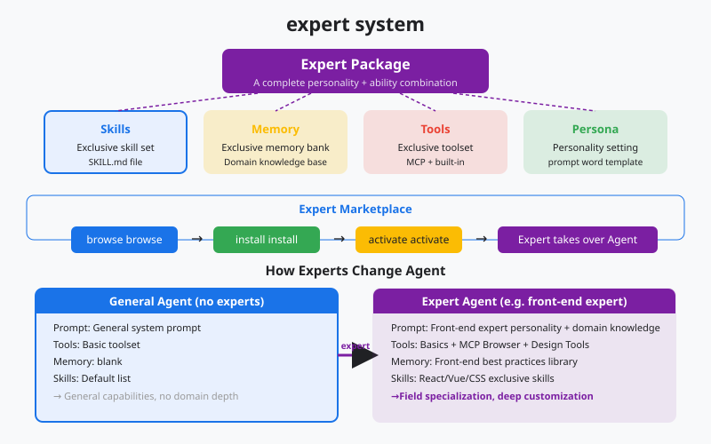
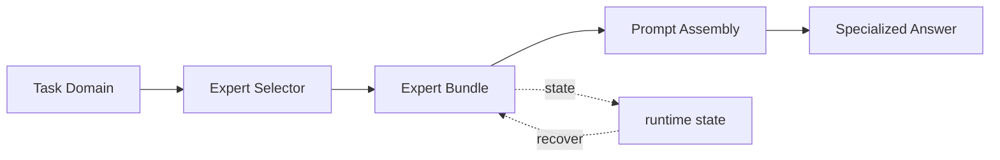

# s18: Experts System - Load a Domain Bundle

[Chinese](README.md) · [English](README.en.md)
> *Skills add capabilities; expert bundles change how the agent approaches a domain.*
>
> **Harness layer: domain knowledge, routing, and persona/tool/memory composition.**

An expert is a governed package of persona, memory, tools, skills, and output rules selected for a task domain.



## Code Architecture Diagram



## Prerequisites

The examples use local expert packages and explicit session state; no external model or marketplace is needed.

## WorkBuddy-Style Mechanisms in This Chapter

The lesson packages domain guidance as switchable expert context while keeping registry state and prompt injection explicit.

## Common Mistakes

Do not mix expert instructions with durable user memory or let a stale expert remain active after the session changes context.

## The Problem

The harness needs specialized behavior without forking the core agent loop or hiding which instructions are currently active.

## The Solution

```
              Expert Package Structure

  ┌────────────────────────────────────────┐
  │           Expert Package               │
  │                                        │
  │  ┌──────────────────────────────────┐  │
  │  │ system_prompt_specialization     │  │  ← reshape the agent's persona
  │  │ "You are a senior software       │  │
  │  │  architect at a tech company..." │  │
  │  └──────────────────────────────────┘  │
  │                                        │
  │  ┌──────────────────────────────────┐  │
  │  │ tool_configurations              │  │  ← domain-specific tools
  │  │ preferred_tools: [arch, uml]     │  │
  │  │ disabled_tools: [casual_chat]    │  │
  │  └──────────────────────────────────┘  │
  │                                        │
  │  ┌──────────────────────────────────┐  │
  │  │ skill_bundles                    │  │  ← bundled skill set
  │  │ [code_review, arch_design,       │  │
  │  │  tech_doc, api_design]           │  │
  │  └──────────────────────────────────┘  │
  │                                        │
  │  ┌──────────────────────────────────┐  │
  │  │ behavior_guidelines              │  │  ← behavior guidelines
  │  │ - Always consider scalability    │  │
  │  │ - Prefer documented patterns     │  │
  │  └──────────────────────────────────┘  │
  └────────────────────────────────────┘

         Skills vs Experts
         ─────────────────

  Skill:  add one capability (a point)        "I can now review code"
  Expert: switch personas (a surface)        "I am a software architect"
```

## How It Works

### System Prompt Injection

```python
@dataclass
class ExpertPackage:
    """A domain expert package."""
    expert_id: str          # unique identifier
    name: str               # display name
    category: str           # category
    system_prompt: str      # specialized system prompt
    tools_config: dict      # tool configuration
    skill_bundles: list     # bundled skills
    guidelines: list        # behavior guidelines
    description: str        # short description
```

### Session Persistence

```python
EXPERTS_CACHE = Path.home() / ".workbuddy" / "app" / "cache" / "experts" / "metadata.json"

def load_expert(expert_id: str) -> ExpertPackage:
    """Load an expert package from cache or marketplace."""
    cache = json.loads(EXPERTS_CACHE.read_text()) if EXPERTS_CACHE.exists() else {}

    if expert_id not in cache:
        # Fetch from marketplace
        cache[expert_id] = fetch_from_marketplace(expert_id)
        EXPERTS_CACHE.write_text(json.dumps(cache, indent=2))

    return ExpertPackage(**cache[expert_id])
```

### Switching Experts

```python
def build_system_prompt(base_prompt: str, expert: ExpertPackage | None) -> str:
    """Build system prompt with optional expert specialization."""
    if not expert:
        return base_prompt

    return f"""{base_prompt}

<expert_specialization>
You are now operating as: {expert.name}

{expert.system_prompt}

<behavior_guidelines>
{chr(10).join(f'- {g}' for g in expert.guidelines)}
</behavior_guidelines>
</expert_specialization>"""
```

### WorkBuddy Architecture Comparison

This comparison maps expert packages, prompt injection, registry state, and switching to the corresponding WorkBuddy-style harness boundary.

```python
# the expert_id field in the sessions table
session = {
    "session_id": "abc123",
    "expert_id": "SoftwareCompany",  # currently active expert
    "created_at": "...",
    # ...
}
```

### Expert Registry

```python
def switch_expert(session_id: str, new_expert_id: str):
    """Switch the active expert for a session."""
    old_expert = get_session_expert(session_id)
    new_expert = load_expert(new_expert_id)

    # Update session metadata
    update_session(session_id, expert_id=new_expert_id)

    # Rebuild system prompt
    system_prompt = build_system_prompt(BASE_PROMPT, new_expert)

    print(f"Switched expert: {old_expert.name} → {new_expert.name}")
```

## WorkBuddy Architecture Comparison

This comparison maps expert packages, prompt injection, registry state, and switching to the corresponding WorkBuddy-style harness boundary.

### expert-manager Skill

### System Prompt Injection

```json
{
  "SoftwareCompany": {
    "expert_id": "SoftwareCompany",
    "name": "Software Company Expert",
    "category": "Software Development",
    "system_prompt": "You are a senior software architect...",
    "guidelines": ["Always consider scalability", "Prefer documented patterns"],
    "skills": ["code_review", "arch_design", "tech_doc"]
  }
}
```

### Expert Marketplace

### Code Walkthrough

### Run

## Code Walkthrough

Follow expert registration, selection, prompt injection, persistence, and switching while keeping the active expert visible.

## Run

```bash
python s18_experts_system/code.py
```

## Exercises

Use these exercises to change one part of expert packages, prompt injection, registry state, and switching at a time and explain the resulting contract.

## Next Lesson

- An expert is a governed package of persona, memory, tools, skills, and output rules selected for a task domain.

**Reference tables**

| Dimension | Skills (s16) | Experts (s18) |
|------|-------------|---------------|
| Granularity | One capability | An entire domain |
| Loading | Triggered on demand | Activated for a session |
| Scope | One call or task | The personality of the session |
| System prompt | Adds skill instructions | Replaces or strengthens core instructions |
| Tool configuration | Does not change | May enable or disable domain tools |
| Persistence | Temporary load | Recorded in session metadata |
| Quantity | Several can be active | Usually one active expert |

| Category | Expert example | Function |
|------|---------|------|
| Software development | SoftwareCompany | Architecture, code review, and technical documents |
| Design | UiDesigner | UI/UX review and design systems |
| Research | TrendResearcher | Trend research, data analysis, and reports |
| Finance | FinancialAnalyst | Financial reports, valuation, and industry research |
| Writing | ContentWriter | Content strategy, copywriting, and SEO |
| Product | ProductManager | Product planning, requirements, and PRDs |

The original Chinese README remains the primary-language reference. This English companion keeps the same code, diagrams, local paths, and chapter structure so readers can switch languages without losing runnable details.

Local references:

- [Reference](README.md)
- [Reference](README.en.md)
- [Reference](./images/experts-system-en.svg)
