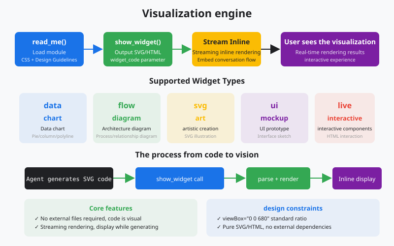
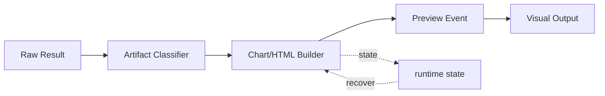

# s19: Visualizer - The Agent Can Draw

[Chinese](README.md) · [English](README.en.md)
> *Useful agent output is not limited to plain text.*
>
> **Harness layer: visual output and in-conversation artifacts.**

The visualizer turns SVG and HTML into inspectable widgets while keeping generation, validation, and rendering as separate steps.



## Code Architecture Diagram



## Prerequisites

The lesson renders deterministic SVG or HTML artifacts locally and does not require a browser service or image API.

## WorkBuddy-Style Mechanisms in This Chapter

The lesson turns structured agent output into inspectable SVG or HTML widgets with explicit artifact and failure states.

## Common Mistakes

A visualization should not hide the underlying result, claim success when rendering failed, or produce an artifact without a stable reference.

## The Problem

The harness needs richer presentation without making rendering a hidden side effect of the agent response.

## The Solution

```
         Visualizer: SVG/HTML Streaming Injection

  Agent Response
  ┌──────────────────────────────────────────┐
  │ Text: "Let me draw a diagram..."        │
  │                                          │
  │ Tool: show_widget                        │
  │ ┌────────────────────────────────────┐   │
  │ │ title: "System Architecture"       │   │
  │ │ widget_code: <svg viewBox="0 0 680 │   │
  │ │   400">...rect, path, text...</svg>│   │
  │ │ loading_messages: [                │   │
  │ │   "Preparing diagram",             │   │
  │ │   "Rendering SVG",                 │   │
  │ │   "Almost ready"                   │   │
  │ │ ]                                  │   │
  │ └────────────────────────────────────┘   │
  │                                          │
  │ Text: "As you can see, the cache..."    │
  └──────────────────────────────────────────┘
         │
         ▼
  ┌──────────────────────────────────────────┐
  │         WorkBuddy UI                     │
  │                                          │
  │  Let me draw a diagram...               │
  │                                          │
  │  ┌────────────────────────────────────┐ │
  │  │                                    │ │
  │  │     [Rendered SVG Diagram]         │ │
  │  │     ┌─────┐    ┌─────┐            │ │
  │  │     │ API │───►│ DB  │            │ │
  │  │     └─────┘    └─────┘            │ │
  │  │                                    │ │
  │  └────────────────────────────────────┘ │
  │                                          │
  │  As you can see, the cache...           │
  └──────────────────────────────────────────┘

         Two-Step Protocol

  Step 1: read_me(modules=["diagram"])
     │    → Returns CSS vars, colors, typography, layout rules
     │    → MUST be called before first show_widget
     ▼
  Step 2: show_widget(title, widget_code, loading_messages)
              → Renders SVG/HTML inline in conversation
```

## How It Works

### SVG Generation Rules

```python
DESIGN_GUIDES = {
    "diagram": {
        "css_vars": {
            "bg": "#ffffff", "fg": "#1a1a2e",
            "primary": "#3b82f6", "accent": "#f59e0b",
            "border": "#e2e8f0", "muted": "#64748b",
        },
        "rules": [
            "SVG viewBox must start with '0 0 680'",
            "Use rounded rectangles for nodes",
            "Arrows with markers for connections",
            "Maximum 7 nodes per diagram",
        ],
        "typography": {"title": "20px bold", "body": "14px", "label": "12px"},
    },
    "chart": {
        "css_vars": {
            "bg": "#ffffff", "fg": "#1a1a2e",
            "primary": "#3b82f6", "accent": "#ef4444",
            "grid": "#f1f5f9", "muted": "#94a3b8",
        },
        "rules": [
            "Use consistent color palette across series",
            "Always label axes",
            "Grid lines should be subtle",
        ],
    }
}
```

### Multiple Widgets

```python
def show_widget(title: str, widget_code: str, loading_messages: list[str]):
    """
    title:          widget identifier, used for references and download filenames
    widget_code:    raw SVG or HTML code
    loading_messages: 1-4 progress messages shown during rendering
    """
```

### Failure Awareness

```python
def generate_architecture_svg(nodes: list, edges: list) -> str:
    """Generate an SVG architecture diagram."""
    svg = ['<svg viewBox="0 0 680 400" xmlns="http://www.w3.org/2000/svg">']

    # Background
    svg.append(f'<rect width="680" height="400" fill="{design["bg"]}" rx="12"/>')

    # Nodes
    for i, node in enumerate(nodes):
        x, y = node["x"], node["y"]
        svg.append(f'<rect x="{x}" y="{y}" width="120" height="60" '
                   f'fill="{design["primary"]}" rx="8" opacity="0.15"/>')
        svg.append(f'<rect x="{x}" y="{y}" width="120" height="60" '
                   f'fill="none" stroke="{design["primary"]}" rx="8"/>')
        svg.append(f'<text x="{x+60}" y="{y+35}" text-anchor="middle" '
                   f'fill="{design["fg"]}" font-size="14">{node["label"]}</text>')

    # Edges
    svg.append(f'<defs><marker id="arrow" markerWidth="10" markerHeight="10" '
               f'refX="8" refY="3" orient="auto"><path d="M0,0 L8,3 L0,6 Z" '
               f'fill="{design["muted"]}"/></marker></defs>')
    for edge in edges:
        svg.append(f'<line x1="{edge["x1"]}" y1="{edge["y1"]}" '
                   f'x2="{edge["x2"]}" y2="{edge["y2"]}" '
                   f'stroke="{design["muted"]}" stroke-width="2" '
                   f'marker-end="url(#arrow)"/>')

    svg.append('</svg>')
    return '\n'.join(svg)
```

### WorkBuddy Architecture Comparison

This comparison maps widget rendering, artifact protocols, and failure-aware visualization to the corresponding WorkBuddy-style harness boundary.

```python
# Agent generates a multi-widget narrative:
#
# Text: "Let me break this down into three parts..."
#
# show_widget("Component Overview", svg_1, ["Loading overview..."])
#
# Text: "Now let's look at the data flow..."
#
# show_widget("Data Flow", svg_2, ["Preparing flow...", "Rendering..."])
#
# Text: "Finally, here's the deployment topology..."
#
# show_widget("Deployment Topology", svg_3, ["Drawing topology..."])
```

### Artifact Protocol

```python
def get_theme_colors(theme: str = "light") -> dict:
    """Get colors for the current UI theme."""
    if theme == "dark":
        return {"bg": "#1a1a2e", "fg": "#e2e8f0", "primary": "#60a5fa",
                "border": "#334155", "muted": "#94a3b8"}
    return {"bg": "#ffffff", "fg": "#1a1a2e", "primary": "#3b82f6",
            "border": "#e2e8f0", "muted": "#64748b"}
```

## WorkBuddy Architecture Comparison

This comparison maps widget rendering, artifact protocols, and failure-aware visualization to the corresponding WorkBuddy-style harness boundary.

### Rendering Pipeline

### Output Types

### Image Handling

### Code Walkthrough

### Run

## Code Walkthrough

Trace widget data through rendering, loading messages, artifact storage, and failure-aware delivery.

## Run

```bash
python s19_visualizer/code.py
```

## Exercises

Use these exercises to change one part of widget rendering, artifact protocols, and failure-aware visualization at a time and explain the resulting contract.

## Next Lesson

- The visualizer turns SVG and HTML into inspectable widgets while keeping generation, validation, and rendering as separate steps.

**Reference tables**

| Component | Purpose |
|------|------|
| `read_me` | Load design guidance such as CSS variables, colors, and typography before the first `show_widget` |
| `show_widget` | Render an SVG or HTML widget with a title, code, and loading messages |
| Module system | `diagram`, `mockup`, `interactive`, `chart`, and `art` each provide different guidance |
| Theme awareness | Use a light background for light themes and a dark background for dark themes |
| Loading messages | Show 1-4 progress messages during rendering |

| Module | Use | Typical scenario |
|------|------|---------|
| `diagram` | Architecture and flow diagrams | System design and data flow |
| `mockup` | UI prototypes | Interface and layout previews |
| `interactive` | Interactive widgets | Exploratory data work |
| `chart` | Data charts | Trends, comparisons, and distributions |
| `art` | Decorative graphics | Concept visualization and creative work |

| Dimension | Visualizer | ImageGen |
|------|-----------|----------|
| Output | SVG or HTML code | PNG or JPG image |
| Rendering | Native browser rendering | Generated by an AI model |
| Precision | Vector and infinitely scalable | Bitmap with resolution limits |
| Editable | Code can be changed | Image is not directly editable |
| Speed | Immediate rendering | Requires generation time |
| Use | Charts, architecture, and UI | Illustrations, photos, and art |

The original Chinese README remains the primary-language reference. This English companion keeps the same code, diagrams, local paths, and chapter structure so readers can switch languages without losing runnable details.

Local references:

- [Reference](README.md)
- [Reference](README.en.md)
- [Reference](./images/visualizer-en.svg)
