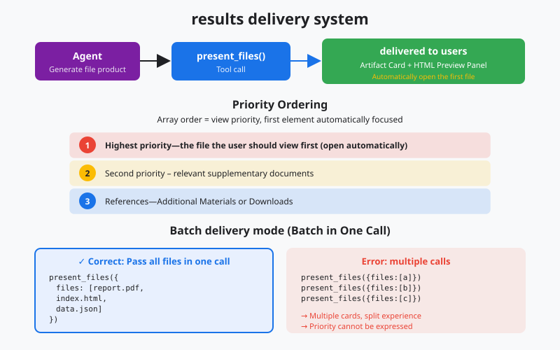
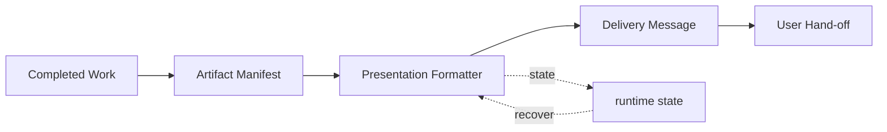

# s20: Result Presentation - Finish by Delivering the Artifact

[中文](README.md) · [English](README.en.md)
> *A task is complete when the user can see the result, not when the agent says it is done.*
>
> **Harness layer: interaction and final artifact delivery.**

The present_files boundary groups outputs, opens the primary result, and exposes the remaining files as artifact cards.



## Code Architecture Diagram



## Prerequisites

The lesson assumes an artifact already exists and focuses on previews, metadata, links, and concise user-facing explanations.

## WorkBuddy-Style Mechanisms in This Chapter

The lesson defines how completed files, previews, and explanations are delivered as a coherent user-facing result.

## Common Mistakes

Do not expose a path without context, flood the conversation with file contents, or claim delivery before the artifact is available.

## The Problem

The harness must turn internal outputs into useful handoff material while keeping large files outside the conversation body.

## The Solution

```
         present_files: Single Entry Point for Delivery

  Task Complete
       │
       ▼
  ┌──────────────────────────────────────────────┐
  │            present_files(files)              │
  │                                              │
  │  files = [                                   │
  │    "/path/to/report.html",   ← 第一个自动打开 │
  │    "/path/to/chart.svg",     ← artifact card │
  │    "/path/to/data.json",     ← artifact card │
  │    "http://localhost:3000",  ← 浏览器预览    │
  │  ]                                           │
  └──────────────────────────────────────────────┘
       │
       ├──► 第一个文件: 自动打开/聚焦
       ├──► HTML 文件: 实时预览面板 + artifact card
       ├──► localhost URL: 内置浏览器预览面板
       ├──► 本地文件: artifact card (图片/报告/PPT/视频/代码)
       └──► http/https URL: 内置浏览器预览面板

  ┌──────────────────────────────────────────────┐
  │            WorkBuddy UI                       │
  │                                               │
  │  Agent: "I've generated the report..."       │
  │                                               │
  │  ┌─ Auto-opened Preview ──────────────────┐  │
  │  │                                        │  │
  │  │     [report.html rendered live]        │  │
  │  │                                        │  │
  │  └────────────────────────────────────────┘  │
  │                                               │
  │  ┌─ Artifact Cards ───────────────────────┐  │
  │  │                                        │  │
  │  │  ┌────────┐  ┌────────┐  ┌────────┐   │  │
  │  │  │📄 chart│  │📊 data │  │🌐 url  │   │  │
  │  │  │.svg    │  │.json   │  │:3000   │   │  │
  │  │  └────────┘  └────────┘  └────────┘   │  │
  │  │                                        │  │
  │  └────────────────────────────────────────┘  │
  └──────────────────────────────────────────────┘
```

## How It Works

### Artifact Card Generation

```python
def present_files(files: list[str], explanation: str = ""):
    """
    Present files to the user as the final delivery step.

    Args:
        files: Ordered list of file paths or URLs.
               First item is auto-opened. Order = viewing priority.
        explanation: Brief description of what was produced.
    """
    if not files:
        return "Error: No files to present."

    # First file: auto-open
    primary = files[0]
    open_primary(primary)

    # Remaining files: artifact cards
    for f in files[1:]:
        create_artifact_card(f)
```

### What Should Be Presented

```python
def open_primary(file_path: str):
    """Open the primary file based on its type."""
    if file_path.startswith(("http://", "https://")):
        # URL: open in built-in browser preview
        open_browser_preview(file_path)
    elif file_path.startswith("http://localhost"):
        # localhost: open dev server preview
        open_browser_preview(file_path)
    elif file_path.endswith((".html", ".htm")):
        # HTML file: live preview panel + artifact card
        open_html_preview(file_path)
        create_artifact_card(file_path)
    else:
        # Other files: just artifact card
        create_artifact_card(file_path)
```

### Complementary Presentation

```python
FILE_TYPE_ICONS = {
    ".html": "🌐", ".htm": "🌐",
    ".svg": "🖼️", ".png": "🖼️", ".jpg": "🖼️",
    ".pdf": "📄", ".docx": "📄", ".pptx": "📊",
    ".mp4": "🎬", ".mov": "🎬",
    ".py": "🐍", ".js": "📜", ".ts": "📜",
    ".json": "📋", ".csv": "📋",
    ".md": "📝",
}

def create_artifact_card(file_path: str):
    """Create an artifact card for a file."""
    path = Path(file_path)
    ext = path.suffix.lower()
    icon = FILE_TYPE_ICONS.get(ext, "📎")
    size = path.stat().st_size if path.exists() else 0

    return {
        "path": str(path),
        "name": path.name,
        "type": ext,
        "icon": icon,
        "size": format_size(size),
        "exists": path.exists(),
    }
```

### WorkBuddy Architecture Comparison

This comparison maps artifact delivery, file previews, and presentation contracts to the corresponding WorkBuddy-style harness boundary.

```python
# 正确: present 新生成的报告
present_files(["/workspace/report.html", "/workspace/chart.svg"])

# 错误: present 仅仅读取过的文件
present_files(["/workspace/existing_config.json"])  # 只是读过，不是产出

# 错误: present 修改过的源代码文件
present_files(["/workspace/src/main.py"])  # 只是改了几行，不是交付物
```

### `present_files` Tool Contract

```python
# Agent 的正确行为:
# 1. 用文字简要说明做了什么
# 2. 调用 present_files 展示交付物
# 3. 文字 + 交付物一起呈现给用户

# 错误行为:
# 1. 只调用 present_files，不写任何文字说明
# 2. 写了 500 字描述文件内容，而不是让用户直接看文件
```

## WorkBuddy Architecture Comparison

This comparison maps artifact delivery, file previews, and presentation contracts to the corresponding WorkBuddy-style harness boundary.

### Supported File Types

### Localhost Handling

### `cwd` Argument

### Difference from Visualizer

### Code Walkthrough

### Run

## Code Walkthrough

Follow how an internal artifact becomes a presentation card with a safe preview and a stable file reference.

## Run

```bash
python s20_result_presentation/code.py
```

## Exercises

Use these exercises to change one part of artifact delivery, file previews, and presentation contracts at a time and explain the resulting contract.

## Next Lesson

- The present_files boundary groups outputs, opens the primary result, and exposes the remaining files as artifact cards.

**Reference tables**

| File type | Presentation | Behavior |
|---------|---------|------|
| HTML (`.html`/`.htm`) | Preview panel plus artifact card | Live and interactive rendering |
| Localhost URL | Browser preview panel | Opens a local development server |
| HTTP/HTTPS URL | Browser preview panel | Opens an external page |
| Images (`png`/`jpg`/`svg`) | Artifact card | Thumbnail preview |
| Reports (`pdf`/`docx`/`pptx`) | Artifact card | Download or open |
| Video (`mp4`/`mov`) | Artifact card | Playback |
| Code (`.py`/`.js`/`.ts`) | Artifact card | Syntax-highlighted preview |
| Other files | Artifact card | File information card |

| Type | Extensions or format | Presentation |
|---------|-----------|---------|
| HTML | `.html`, `.htm` | Preview panel plus artifact card |
| Image | `.png`, `.jpg`, `.jpeg`, `.svg`, `.gif`, `.webp` | Artifact card with thumbnail |
| Document | `.pdf`, `.docx`, `.pptx`, `.xlsx` | Downloadable artifact card |
| Video | `.mp4`, `.mov`, `.avi`, `.webm` | Playable artifact card |
| Code | `.py`, `.js`, `.ts`, `.go`, `.rs`, `.java`, `.c`, `.cpp` | Syntax-highlighted artifact card |
| Data | `.json`, `.csv`, `.yaml`, `.xml` | Artifact card |
| URL | `http://`, `https://` | Browser preview panel |
| localhost | `http://localhost:PORT` | Browser preview after reachability check |

| Dimension | Visualizer (s19) | `present_files` (s20) |
|------|-----------------|---------------------|
| Timing | Visualization during work | Delivery at task completion |
| Output | Inline SVG or HTML | File or URL presentation |
| Purpose | Explain and inspect | Deliver the final result |
| Persistence | In the conversation stream | Independent artifact card |
| Call count | May be called several times | Usually once at the end |

The original Chinese README remains the primary-language reference. This English companion keeps the same code, diagrams, local paths, and chapter structure so readers can switch languages without losing runnable details.

Local references:

- [Reference](README.md)
- [Reference](README.en.md)
- [Reference](./images/result-presentation-en.svg)
