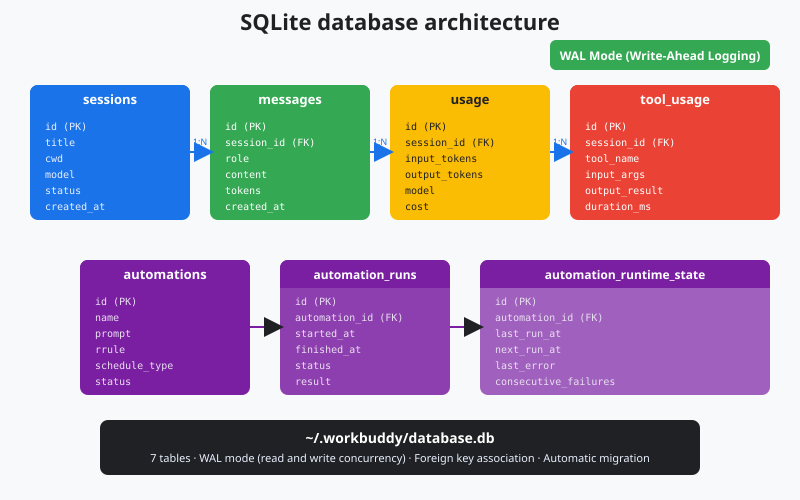
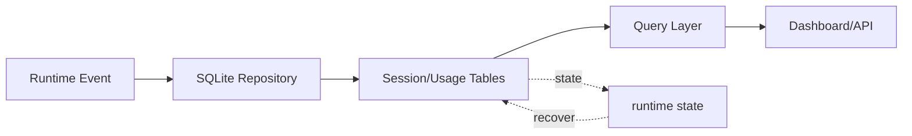

# s21: SQLite Database - Persist Sessions and Track Usage

[中文](README.md) · [English](README.en.md)
> *Sessions need durable storage; usage needs a queryable history.*
>
> **Harness layer: local persistence, WAL, and usage accounting.**

SQLite stores session metadata, automation state, usage, and indexes, while JSONL remains the source of session events.



## Code Architecture Diagram



## Prerequisites

The examples use Python SQLite and a temporary workspace, so the persistence boundary can be exercised without a service.

## WorkBuddy-Style Mechanisms in This Chapter

The lesson gives sessions, messages, automations, and usage records a durable SQLite persistence boundary.

## Common Mistakes

Avoid scattering schema assumptions across callers, deleting records that need audit history, or ignoring transaction and WAL behavior.

## The Problem

The harness needs restart-safe state without making every runtime component responsible for raw database details.

## The Solution

```
~/.workbuddy/
  workbuddy.db          ← main database file
  workbuddy.db-wal      ← Write-Ahead Log (WAL)
  workbuddy.db-shm      ← shared-memory index
```

### How It Works

```
┌─────────────────────────────────────────────────────┐
│                  workbuddy.db                        │
├──────────────┬──────────────────────────────────────┤
│ sessions     │ session metadata: cwd, title, model, mode   │
├──────────────┼──────────────────────────────────────┤
│ messages     │ session messages: role, content, tool_calls   │
├──────────────┼──────────────────────────────────────┤
│ automations  │ automation definitions: prompt, rrule, status     │
├──────────────┼──────────────────────────────────────┤
│ auto_runtime │ runtime state: last_run, next_run        │
├──────────────┼──────────────────────────────────────┤
│ auto_runs    │ execution history: started, completed, output  │
├──────────────┼──────────────────────────────────────┤
│ tool_usage   │ tool usage: tool_name, call_count       │
├──────────────┼──────────────────────────────────────┤
│ usage_track  │ token tracking: input, output, cost       │
└──────────────┴──────────────────────────────────────┘
```

## How It Works

### 2. Define the Schema

```python
import sqlite3

db = sqlite3.connect("~/.workbuddy/workbuddy.db")
db.execute("PRAGMA journal_mode=WAL")    # enable WAL
db.execute("PRAGMA synchronous=NORMAL")  # balance safety and performance
db.execute("PRAGMA foreign_keys=ON")     # foreign-key constraints
```

### 3. Session CRUD

```sql
CREATE TABLE IF NOT EXISTS sessions (
    id          TEXT PRIMARY KEY,
    cwd         TEXT NOT NULL,
    title       TEXT,
    status      TEXT DEFAULT 'active',   -- active / archived / deleted
    mode        TEXT DEFAULT 'code',     -- code / ask / plan
    model       TEXT,
    expert_id   TEXT,
    created_at  TEXT NOT NULL,
    updated_at  TEXT NOT NULL
);
```

```sql
CREATE TABLE IF NOT EXISTS automations (
    id              TEXT PRIMARY KEY,
    name            TEXT NOT NULL,
    prompt          TEXT NOT NULL,
    schedule_type   TEXT NOT NULL,    -- recurring / once
    rrule           TEXT,
    scheduled_at    TEXT,
    status          TEXT DEFAULT 'ACTIVE',  -- ACTIVE / PAUSED / deleted
    valid_from      TEXT,
    valid_until     TEXT,
    cwds            TEXT,             -- JSON array
    expert_id       TEXT,
    model_id        TEXT,
    connector_ids   TEXT,             -- JSON array
    created_at      TEXT NOT NULL,
    updated_at      TEXT NOT NULL
);
```

```sql
CREATE TABLE IF NOT EXISTS usage_tracking (
    id                      INTEGER PRIMARY KEY AUTOINCREMENT,
    session_id              TEXT NOT NULL,
    model                   TEXT NOT NULL,
    input_tokens            INTEGER DEFAULT 0,
    output_tokens           INTEGER DEFAULT 0,
    cache_creation_tokens   INTEGER DEFAULT 0,
    cache_read_tokens       INTEGER DEFAULT 0,
    cost                    REAL DEFAULT 0.0,
    created_at              TEXT NOT NULL,
    FOREIGN KEY (session_id) REFERENCES sessions(id)
);
```

### 4. Usage Tracking

```python
def create_session(cwd, model="claude-sonnet-4-20250514"):
    sid = f"sess_{int(time.time()*1000)}"
    now = datetime.now().isoformat()
    db.execute(
        "INSERT INTO sessions (id, cwd, title, status, mode, model, created_at, updated_at) "
        "VALUES (?, ?, ?, 'active', 'code', ?, ?, ?)",
        (sid, cwd, "New Session", model, now, now)
    )
    db.commit()
    return sid

def list_sessions(status="active"):
    rows = db.execute(
        "SELECT id, title, cwd, updated_at FROM sessions "
        "WHERE status = ? ORDER BY updated_at DESC", (status,)
    ).fetchall()
    return rows
```

### 5. Soft Delete

```python
def track_usage(session_id, model, response):
    usage = response.usage
    cost = calc_cost(model, usage)
    db.execute(
        "INSERT INTO usage_tracking "
        "(session_id, model, input_tokens, output_tokens, "
        " cache_creation_tokens, cache_read_tokens, cost, created_at) "
        "VALUES (?,?,?,?,?,?,?,?)",
        (session_id, model, usage.input_tokens, usage.output_tokens,
         usage.cache_creation_input_tokens, usage.cache_read_input_tokens,
         cost, datetime.now().isoformat())
    )
    db.commit()
```

```python
def monthly_cost(year_month="2026-07"):
    row = db.execute(
        "SELECT SUM(cost), SUM(input_tokens), SUM(output_tokens) "
        "FROM usage_tracking WHERE created_at LIKE ?",
        (f"{year_month}%",)
    ).fetchone()
    return {"cost": row[0] or 0, "input": row[1] or 0, "output": row[2] or 0}
```

### WorkBuddy Architecture Comparison

This comparison maps SQLite schema, WAL persistence, soft deletion, and usage tracking to the corresponding WorkBuddy-style harness boundary.

```python
def soft_delete(table, item_id):
    """Soft delete: mark as deleted instead of removing from the table"""
    db.execute(
        f"UPDATE {table} SET status='deleted', updated_at=? WHERE id=?",
        (datetime.now().isoformat(), item_id)
    )
    db.commit()
```

## WorkBuddy Architecture Comparison

This comparison maps SQLite schema, WAL persistence, soft deletion, and usage tracking to the corresponding WorkBuddy-style harness boundary.

### Soft Delete for Automations

```javascript
// simplified initialization schema
const db = new Database(path.join(homeDir, '.workbuddy', 'workbuddy.db'));
db.pragma('journal_mode = WAL');
db.pragma('synchronous = NORMAL');
```

### Usage Tracking in the UI

```javascript
// actual pattern: mark status instead of DELETE
db.prepare(
  "UPDATE automations SET status = 'deleted', updated_at = ? WHERE id = ?"
).run(new Date().toISOString(), automationId);
```

```javascript
const automations = db.prepare(
  "SELECT * FROM automations WHERE status != 'deleted' ORDER BY updated_at DESC"
).all();
```

### Code Walkthrough

## Code Walkthrough

Read schema setup, transaction boundaries, CRUD operations, soft deletion, and usage tracking as one persistence contract.

## Run

```bash
python s21_sqlite_database/code.py
```

## Exercises

Use these exercises to change one part of SQLite schema, WAL persistence, soft deletion, and usage tracking at a time and explain the resulting contract.

## Next Lesson

- SQLite stores session metadata, automation state, usage, and indexes, while JSONL remains the source of session events.

**Reference table**

| Design decision | Choice | Reason |
|---------|------|------|
| Database engine | SQLite | Embedded, zero configuration, single file |
| Concurrency mode | WAL | Reads and writes do not block each other as much |
| Table count | Seven | Separate responsibilities without duplication |
| Delete strategy | Soft delete | Data remains recoverable |
| File location | `~/.workbuddy/` | User-level directory that persists across app versions |

The original Chinese README remains the primary-language reference. This English companion keeps the same code, diagrams, local paths, and chapter structure so readers can switch languages without losing runnable details.

Local references:

- [Reference](README.md)
- [Reference](README.en.md)
- [Reference](./images/sqlite-schema-en.svg)
