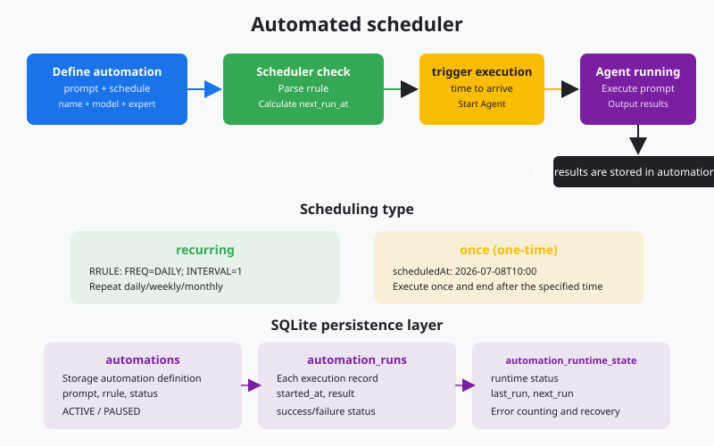
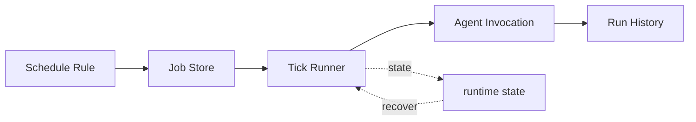

# s22: Automation Scheduler - Run at the Right Time

[中文](README.md) · [English](README.en.md)
> *A desktop agent can wake up at a scheduled time without a person starting it.*
>
> **Harness layer: scheduling and background invocation.**

Once and recurring jobs are durable records. The scheduler calculates due work, prevents duplicate runs, and records history.



## Code Architecture Diagram



## Prerequisites

The scheduler uses deterministic timestamps and local persistence so missed runs and restart behavior can be tested offline.

## WorkBuddy-Style Mechanisms in This Chapter

The lesson schedules isolated prompts with persisted definitions, explicit run history, and predictable missed-run behavior.

## Common Mistakes

A scheduler must not duplicate runs after restart, execute a deleted definition, or share mutable session state with unrelated tasks.

## The Problem

The harness needs time-based invocation without turning scheduling into an unbounded background side effect.

## The Solution

```
┌──────────────────────────────────────────────────┐
│              Automation Scheduler                 │
│                                                  │
│  ┌─────────┐   ┌─────────┐   ┌───────────────┐  │
│  │ Once    │   │ Daily   │   │ Weekly        │  │
│  │ (ISO    │   │ (RRULE  │   │ (RRULE        │  │
│  │  datetime)│   │  FREQ=  │   │  FREQ=WEEKLY) │  │
│  │         │   │  DAILY) │   │               │  │
│  └────┬────┘   └────┬────┘   └──────┬────────┘  │
│       │              │               │            │
│       ▼              ▼               ▼            │
│  ┌────────────────────────────────────────────┐  │
│  │          next_run calculator               │  │
│  │   (RRULE parse → next datetime)            │  │
│  └──────────────────┬─────────────────────────┘  │
│                     │                             │
│  ┌──────────────────▼─────────────────────────┐  │
│  │     Scheduler Loop (every 60s)             │  │
│  │   if now >= next_run:                      │  │
│  │     1. Execute prompt in isolated session  │  │
│  │     2. Record run history                  │  │
│  │     3. Update runtime state                │  │
│  │     4. Calculate next next_run             │  │
│  └────────────────────────────────────────────┘  │
└──────────────────────────────────────────────────┘
```

## How It Works

### 2. The Tick Loop

```
FREQ=DAILY;INTERVAL=1       → 每天一次
FREQ=DAILY;INTERVAL=2       → 每两天一次
FREQ=HOURLY;INTERVAL=6      → 每 6 小时一次
FREQ=WEEKLY;BYDAY=MO,WE,FR  → 每周一三五
FREQ=MONTHLY;BYDAY=1MO      → 每月第一个周一
FREQ=YEARLY                 → 每年一次
```

```python
from datetime import datetime, timedelta

def next_run_from_rrule(rrule: str, after: datetime) -> datetime:
    """简化版 RRULE 解析器。"""
    parts = dict(p.split("=") for p in rrule.upper().split(";"))
    freq = parts.get("FREQ", "DAILY")
    interval = int(parts.get("INTERVAL", "1"))

    if freq == "HOURLY":
        return after + timedelta(hours=interval)
    elif freq == "DAILY":
        return after + timedelta(days=interval)
    elif freq == "WEEKLY":
        return after + timedelta(weeks=interval)
    elif freq == "MONTHLY":
        return after + timedelta(days=30 * interval)
    elif freq == "YEARLY":
        return after + timedelta(days=365 * interval)
    return after + timedelta(days=1)
```

### 3. Automatic Invocation

```python
def scheduler_tick():
    """每 60 秒调用一次, 检查到期任务。"""
    now = datetime.now()

    # 查找所有 ACTIVE 且到期的自动化
    due = db.execute("""
        SELECT a.id, a.name, a.prompt, a.schedule_type, a.rrule, a.scheduled_at
        FROM automations a
        LEFT JOIN automation_runtime_state r ON a.id = r.automation_id
        WHERE a.status = 'ACTIVE'
          AND (r.next_run IS NULL OR r.next_run <= ?)
    """, (now.isoformat(),)).fetchall()

    for auto in due:
        execute_automation(auto)
        update_runtime_state(auto)
```

### 4. Soft Delete

```python
def execute_automation(auto):
    """在隔离会话中执行自动化。"""
    # 创建新会话, 不复用用户的会话
    session_id = create_session(cwd=auto["cwds"], model=auto["model_id"])

    # 记录执行开始
    run_id = db.execute(
        "INSERT INTO automation_runs (automation_id, started_at, status) "
        "VALUES (?, ?, 'running')",
        (auto["id"], datetime.now().isoformat())
    ).lastrowid

    try:
        # 执行 prompt (agent loop)
        messages = [{"role": "user", "content": auto["prompt"]}]
        agent_loop(messages, session_id)

        # 记录成功
        db.execute(
            "UPDATE automation_runs SET completed_at=?, status='success' WHERE id=?",
            (datetime.now().isoformat(), run_id)
        )
    except Exception as e:
        db.execute(
            "UPDATE automation_runs SET completed_at=?, status='failed', output=? WHERE id=?",
            (datetime.now().isoformat(), str(e), run_id)
        )
```

### 5. Missed Runs

```python
def delete_automation(auto_id):
    """
    软删除: 标记 status='deleted'。
    NEVER use: DELETE FROM automations
    NEVER use: rm, sqlite3 CLI, or file operations
    """
    db.execute(
        "UPDATE automations SET status='deleted', updated_at=? WHERE id=?",
        (datetime.now().isoformat(), auto_id)
    )
    db.commit()
    # 行从 list/view 中消失, 但数据仍在数据库中, 可恢复
```

### WorkBuddy Architecture Comparison

This comparison maps RRULE scheduling, isolated prompts, persistence, and soft deletion to the corresponding WorkBuddy-style harness boundary.

```python
def calculate_next_run(auto) -> str | None:
    """根据调度类型计算下次运行时间。"""
    now = datetime.now()

    if auto["schedule_type"] == "once":
        # 单次: 跑完就没了, next_run = None
        return None

    elif auto["schedule_type"] == "recurring":
        # 重复: 根据 RRULE 计算下次
        last = get_last_run(auto["id"]) or now
        return next_run_from_rrule(auto["rrule"], last)

    return None
```

## WorkBuddy Architecture Comparison

This comparison maps RRULE scheduling, isolated prompts, persistence, and soft deletion to the corresponding WorkBuddy-style harness boundary.

### Scheduler in the Sidecar

```javascript
// create 模式的核心字段
{
  mode: "create",
  name: "每日项目检查",
  prompt: "检查项目状态, 生成日报",
  scheduleType: "recurring",
  rrule: "FREQ=DAILY;INTERVAL=1",
  status: "ACTIVE",
  cwds: "/Users/me/project",
  expertId: "SoftwareCompany",
  modelId: "claude-sonnet-4-20250514"
}
```

### Soft Delete in Practice

```javascript
// 简化的调度器循环
setInterval(async () => {
    const dueAutomations = db.prepare(`
        SELECT a.*, r.next_run
        FROM automations a
        LEFT JOIN automation_runtime_state r ON a.id = r.automation_id
        WHERE a.status = 'ACTIVE'
          AND (r.next_run IS NULL OR r.next_run <= ?)
    `).all(new Date().toISOString());

    for (const auto of dueAutomations) {
        await executeAutomation(auto);
        updateRuntimeState(auto);
    }
}, 60_000);  // 每分钟检查一次
```

### Prompt Persistence

```javascript
// automation_update mode="delete"
// NEVER: db.prepare("DELETE FROM automations WHERE id=?").run(id)
// NEVER: fs.unlinkSync(automationFile)
// ALWAYS: soft delete
db.prepare(
    "UPDATE automations SET status='deleted', updated_at=? WHERE id=?"
).run(new Date().toISOString(), id);
```

```javascript
// list 模式
db.prepare("SELECT * FROM automations WHERE status != 'deleted'").all();
// view 模式
db.prepare("SELECT * FROM automations WHERE id=? AND status != 'deleted'").get(id);
```

### Code Walkthrough

## Code Walkthrough

Trace schedule calculation, persisted definitions, isolated execution, run history, and soft deletion through one tick.

## Run

```bash
python s22_automation_scheduler/code.py
```

## Exercises

Use these exercises to change one part of RRULE scheduling, isolated prompts, persistence, and soft deletion at a time and explain the resulting contract.

## Next Lesson

- Once and recurring jobs are durable records. The scheduler calculates due work, prevents duplicate runs, and records history.

**Reference table**

| Concept | Meaning |
|------|------|
| `schedule_type` | `"recurring"` or `"once"` |
| `rrule` | RFC 5545 rule string, such as `FREQ=DAILY;INTERVAL=1` |
| `scheduled_at` | ISO 8601 time used only by `once` schedules |
| `status` | `ACTIVE`, `PAUSED`, or `deleted` (soft delete) |
| `runtime_state` | Stores `last_run`, `next_run`, and `last_status` |
| `automation_runs` | History of each execution |

The original Chinese README remains the primary-language reference. This English companion keeps the same code, diagrams, local paths, and chapter structure so readers can switch languages without losing runnable details.

Local references:

- [Reference](README.md)
- [Reference](README.en.md)
- [Reference](./images/automation-scheduler-en.svg)
