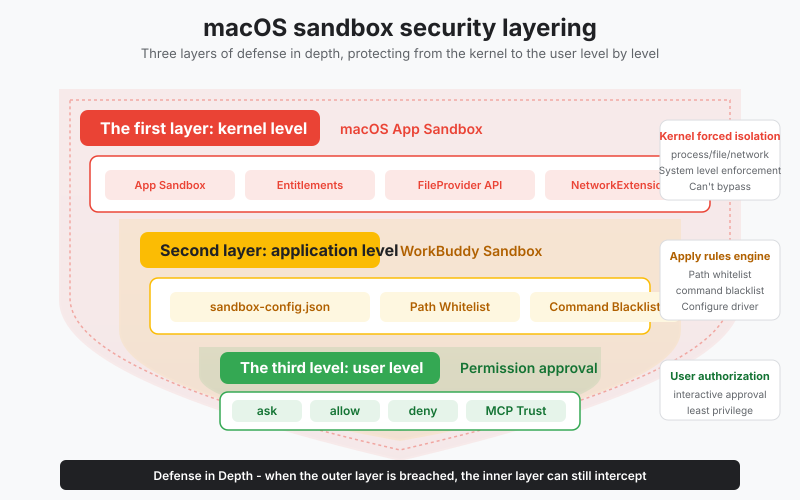
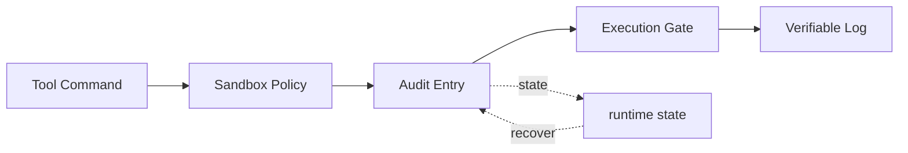

# s23: Audit and Sandbox - Leave Evidence for Every Step

[中文](README.md) · [English](README.en.md)
> *Every consequential step needs a trace, and every command needs a boundary.*
>
> **Harness layer: command safety, sandboxing, and tamper-evident audit.**

Hash-linked JSONL audit records connect requests, decisions, executions, and results while sandbox policy limits command reach.



## Code Architecture Diagram



## Prerequisites

The lesson uses local commands and policy data to demonstrate approval, denial, path scope, and tamper-evident records.

## WorkBuddy-Style Mechanisms in This Chapter

The lesson connects command policy, sandbox boundaries, and hash-linked audit records into one inspectable execution gate.

## Common Mistakes

Do not rely on a log without integrity checks, allow path escapes through aliases, or treat user consent as a substitute for a hard deny rule.

## The Problem

The harness must make consequential commands reviewable while limiting where and how they can execute.

## The Solution

```
┌──────────────────────────────────────────────────┐
│              Agent Action Pipeline                │
│                                                  │
│  ┌──────────┐   ┌──────────┐   ┌─────────────┐  │
│  │  Agent   │──▶│  Sandbox │──▶│  Execute    │  │
│  │  decides │   │  Check   │   │  Command    │  │
│  │  action  │   │          │   │             │  │
│  └──────────┘   └────┬─────┘   └──────┬──────┘  │
│                      │                │          │
│               ┌──────▼──────┐  ┌──────▼──────┐  │
│               │  Allow?     │  │  Audit Log  │  │
│               │  - paths    │  │  (hash chain)│ │
│               │  - commands │  │  JSONL file  │  │
│               │  - consent  │  └─────────────┘  │
│               └─────────────┘                    │
└──────────────────────────────────────────────────┘

Hash-chain illustration:

  Entry 1                Entry 2                Entry 3
  ┌────────────┐         ┌────────────┐         ┌────────────┐
  │ data: {...}│         │ data: {...}│         │ data: {...}│
  │ prev: 000..│         │ prev: H1   │         │ prev: H2   │
  │ hash: H1   │         │ hash: H2   │         │ hash: H3   │
  └────────────┘         └────────────┘         └────────────┘
       │                       │                       │
       └─── H2 = SHA256(data2 + H1) ───┘               │
                               └─── H3 = SHA256(data3 + H2) ───┘

  Tamper with Entry 1 → H1 changes → H2 does not match → H3 does not match → the entire chain breaks
```

## How It Works

### 2. JSONL Audit Log

```python
import hashlib, json

def compute_hash(entry_data: dict, prev_hash: str) -> str:
    """entry.hash = SHA256(entry_data + prev_entry.hash)"""
    payload = json.dumps(entry_data, sort_keys=True) + prev_hash
    return hashlib.sha256(payload.encode()).hexdigest()

# genesis record: prev_hash = "0" * 64
GENESIS_HASH = "0" * 64
```

```python
def verify_chain(entries: list) -> bool:
    """Verify the hash chain is intact."""
    prev_hash = GENESIS_HASH
    for entry in entries:
        expected = compute_hash(
            {k: v for k, v in entry.items() if k != "hash"},
            prev_hash
        )
        if entry["hash"] != expected:
            return False  # chain is broken!
        prev_hash = entry["hash"]
    return True
```

### 3. Sandbox Policy

```python
from pathlib import Path
from datetime import datetime

AUDIT_DIR = Path.home() / ".workbuddy" / "audit-log"
AUDIT_DIR.mkdir(parents=True, exist_ok=True)

def audit_log_path() -> Path:
    """one file per day: ~/.workbuddy/audit-log/2026-07-08.jsonl"""
    return AUDIT_DIR / f"{datetime.now().strftime('%Y-%m-%d')}.jsonl"

def append_audit_entry(action: str, params: dict, result: str):
    """append an audit record."""
    entry = {
        "timestamp": datetime.now().isoformat(),
        "action": action,
        "params": params,
        "result": result,
    }

    # read the previous record's hash
    path = audit_log_path()
    prev_hash = GENESIS_HASH
    if path.exists():
        lines = path.read_text().strip().split("\n")
        if lines and lines[0]:
            prev_hash = json.loads(lines[-1])["hash"]

    # calculate the current record's hash
    entry["hash"] = compute_hash(entry, prev_hash)

    # append without modifying existing content
    with open(path, "a") as f:
        f.write(json.dumps(entry, ensure_ascii=False) + "\n")
```

### 4. Command File Safety

```json
{
    "allowed_paths": ["/Users/me/project", "/tmp/workbuddy"],
    "blocked_paths": ["/etc", "/var", "/System"],
    "blocked_commands": ["rm -rf /", "sudo", "shutdown", "mkfs"],
    "allowed_env": ["HOME", "PATH", "ANTHROPIC_API_KEY"],
    "blocked_env": ["AWS_SECRET_ACCESS_KEY", "DATABASE_PASSWORD"],
    "network": "workspace_only"
}
```

```python
def check_sandbox(command: str, config: dict) -> tuple[bool, str]:
    """Check if a command is allowed by sandbox config."""
    # 1. check for forbidden commands
    for blocked in config.get("blocked_commands", []):
        if blocked in command:
            return False, f"Blocked command: {blocked}"

    # 2. check path access
    for blocked_path in config.get("blocked_paths", []):
        if blocked_path in command:
            return False, f"Blocked path: {blocked_path}"

    # 3. check high-risk areas
    high_risk = ["Desktop", "Downloads", "Documents", "Home"]
    for zone in high_risk:
        if zone in command and "rm" in command:
            return False, f"HIGH-RISK zone: {zone} — requires explicit consent"

    return True, "OK"
```

### macOS Sandbox Architecture

```python
def classify_safety(command: str) -> str:
    """Classify command safety level."""
    if any(d in command for d in ["rm -rf /", "sudo", "mkfs", "shutdown"]):
        return "BLOCKED"
    if "rm " in command or "rmdir" in command:
        return "DESTRUCTIVE"
    if any(z in command for z in ["Desktop", "Downloads", "Documents"]):
        return "HIGH_RISK"
    if any(r in command for r in ["mv ", "rename", "delete", "truncate"]):
        return "CAUTION"
    if command.strip().startswith(("ls", "cat", "head", "grep", "find", "echo")):
        return "SAFE"
    return "UNKNOWN"
```

## 1. App Sandbox and Entitlements

```
macOS security layers:
  ┌──────────────────────────────────┐
  │  macOS App Sandbox (kernel-level)       │  ← cannot be bypassed, enforced by the kernel
  │  ├─ Entitlements (Info.plist)     │
  │  ├─ File Access Restrictions      │
  │  ├─ Network Restrictions           │
  │  └─ Process Isolation             │
  ├──────────────────────────────────┤
  │  WorkBuddy sandbox (application-level)          │  ← configurable, checked within the application
  │  ├─ sandbox-config.json           │
  │  ├─ Path Whitelist                │
  │  ├─ Command Blacklist             │
  │  └─ Env Var Filtering             │
  ├──────────────────────────────────┤
  │  Permission approval (user-level)                │  ← user decision
  │  ├─ ask / allow / deny            │
  │  └─ MCP Trust model                │
  └──────────────────────────────────┘
```

### 2. FileProvider Access

### 3. NetworkExtension

### 4. App Groups

```
Agent → HTTP request → NetworkExtension filter → allow/deny
                        ├─ workspace internal API: allowed
                        ├─ allowlisted domains: allowed
                        └─ other external domains: deny
```

### 5. Crashpad

```
App Group: group.com.workbuddy.workbuddy
  ┌─────────────────────────────────────────┐
  │  Shared Container                        │
  │  ├─ audit-log/         ← shared audit logs    │
  │  ├─ sessions/          ← shared session state    │
  │  ├─ mcp-approvals.json ← shared connector approvals  │
  │  └─ memory/            ← shared memory cache    │
  └─────────────────────────────────────────┘
       ▲           ▲           ▲
       │           │           │
  Main Process  Sidecar    CLI Session
  (Electron)    (Node.js)  (agent bridge module)
```

### 6. SandboxHelper

```python
import logging, traceback

logging.basicConfig(
    filename="~/.workbuddy/crash.log",
    level=logging.ERROR
)

try:
    agent_loop()
except Exception:
    # Teaching version: record crash information (Crashpad does the same in production, but at a lower level)
    logging.error("Agent loop crashed:\n%s", traceback.format_exc())
```

### 7. Security Control Matrix

```python
import os

class SandboxHelper:
    """SandboxHelper — path resolution and validation."""

    def resolve_path(self, path: str, cwd: str) -> str:
        """Resolve path, handling ~, symlinks, relative paths."""
        expanded = os.path.expanduser(path)
        if not os.path.isabs(expanded):
            expanded = os.path.join(cwd, expanded)
        return os.path.realpath(expanded)  # Follow symlinks

    def is_path_allowed(self, path: str, allowed: list) -> bool:
        """Check if resolved path is within allowed directories."""
        resolved = self.resolve_path(path, os.getcwd())
        for allowed_dir in allowed:
            allowed_resolved = self.resolve_path(allowed_dir, os.getcwd())
            if resolved.startswith(allowed_resolved):
                return True
        return False

    def detect_traversal(self, path: str) -> bool:
        """Detect path traversal attacks."""
        return ".." in path or path.startswith("/")
```

### WorkBuddy Architecture Comparison

This comparison maps hash-chain audit logs, sandbox policy, and command-file safety to the corresponding WorkBuddy-style harness boundary.

## WorkBuddy Architecture Comparison

This comparison maps hash-chain audit logs, sandbox policy, and command-file safety to the corresponding WorkBuddy-style harness boundary.

### Hash-Chain Rules

```
~/.workbuddy/audit-log/
  2026-07-08.jsonl    ← today's audit log
  2026-07-07.jsonl    ← yesterday
  2026-07-06.jsonl    ← ...
```

### Sandbox Policy

```javascript
// simplified hash-chain construction
const crypto = require('crypto');

function computeHash(entryData, prevHash) {
    const payload = JSON.stringify(entryData) + prevHash;
    return crypto.createHash('sha256').update(payload).digest('hex');
}

// prevHash of the genesis record
const GENESIS_HASH = '0'.repeat(64);
```

### Command File Safety

```javascript
// check before executing a Bash tool
if (!dangerouslyDisableSandbox) {
    const result = checkSandbox(command, sandboxConfig);
    if (!result.allowed) {
        return { error: `Sandbox blocked: ${result.reason}` };
    }
}
// if dangerouslyDisableSandbox = true,
// the user must explicitly click "Allow" in the UI
```

### Code Walkthrough

```
- Desktop, Downloads, Documents, Home are HIGH-RISK zones
- Scan = read-only (generate report only, don't act)
- Vague requests = ask first
- Warn + list + confirm before any destructive action
- Back up before move/rename/delete
- Use trash, not rm
- Max 10 files per batch
```

## Code Walkthrough

Follow a command through sandbox classification, policy admission, execution, hash chaining, and verification.

## Run

```bash
python s23_audit_sandbox/code.py
```

## Exercises

Use these exercises to change one part of hash-chain audit logs, sandbox policy, and command-file safety at a time and explain the resulting contract.

## Next Lesson

- Hash-linked JSONL audit records connect requests, decisions, executions, and results while sandbox policy limits command reach.

**Reference tables**

| Mechanism | Purpose |
|------|------|
| Hash chain | Each record contains the previous hash; tampering breaks the chain |
| JSONL log | One file per day, one record per line, append-only |
| Sandbox configuration | Defines allowed and denied paths, commands, and environment variables |
| Risk levels | HIGH-RISK areas require additional confirmation |
| Personal file protection | Special handling for Desktop, Downloads, and Documents |

| Rule | Meaning |
|------|------|
| Scan means read-only | Produce a report without changing anything |
| Ambiguous request means ask first | Ask the user when intent is unclear |
| Destructive operation means confirm | List the impact and wait for confirmation |
| Back up first | Back up before move, rename, or delete |
| Use trash, not `rm` | Delete through the recycle bin |
| At most 10 files | Limit batch operations |

| Entitlement | Purpose |
|-------------|------|
| `com.apple.security.app-sandbox` | Enable App Sandbox |
| `com.apple.security.network.client` | Allow outbound network connections |
| `com.apple.security.files.user-selected.read-write` | Read and write user-selected files |
| `com.apple.security.application-groups` | Access an App Group container |

| WorkBuddy (macOS) | Teaching version (Python) | Purpose |
|-------------------|---------------------------|------|
| App Sandbox + Entitlements | `check_sandbox()` | Restrict accessible paths |
| FileProvider | Direct file I/O | Secure file-access proxy |
| NetworkExtension | `network: "workspace_only"` | Network access control |
| App Group | Shared directory | Cross-process data sharing |
| Crashpad | `try/except` plus logging | Crash reporting |
| SandboxHelper | `resolve_path()` plus `is_path_allowed()` | Path resolution and validation |

The original Chinese README remains the primary-language reference. This English companion keeps the same code, diagrams, local paths, and chapter structure so readers can switch languages without losing runnable details.

Local references:

- [Reference](README.md)
- [Reference](README.en.md)
- [Reference](./images/sandbox-layers-en.svg)
- [Reference](../docs/security-boundaries.md)
