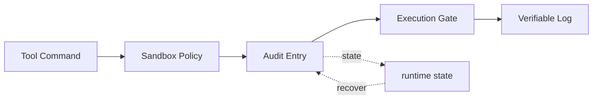

# s23: Audit & Sandbox — 每步留痕, 不可篡改

> *"每步留痕, 不可篡改"* — SHA256 哈希链审计日志 + 命令沙盒, 安全可追溯。
>
> **Harness 层**: 安全 — agent 的每一步行动都有记录, 且无法被篡改。

---


## 代码架构图



## 学习前置知识

- 安全治理需要预防、审批、执行隔离和事后审计一起工作。
- 哈希链让日志具备篡改可见性。
- 沙盒策略应该按路径、网络、命令和资源分层。

## 本章抓住的 WorkBuddy-style 机制

- 吸收 110.md 的沙盒隔离 + 权限审批 + Hook 评估 + 文件安全策略。
- 实现命令策略和 SHA256 hash chain。
- 把安全系统接回工具执行路径。

## 常见误区

- 只有审批没有沙盒, 一旦放行就缺少边界。
- 只有沙盒没有审计, 出事后无法复盘。
- 日志 hash 不覆盖 prev_hash 和 canonical event, 防篡改会失效。
- **哈希链只能防"改", 防不了"删尾"**：任何一个合法链条的前缀本身也是合法链条，所以攻击者删掉末尾几条记录，`verify()` 依然通过。`mini_workbuddy` 的做法是额外写一个链外锚点文件 `audit.head`（记录条数 + 链尾 hash），验证时交叉比对，从而检测截断。真正的生产环境还应把锚点写到本机之外（远端 / WORM 存储），否则拿到机器的攻击者既能作恶又能改账本。详见 [`docs/security-boundaries.md`](../docs/security-boundaries.md)。
## 问题

Agent 有了工具, 有了记忆, 有了持久化, 有了自动化。它能读写文件、执行命令、调用 API。能力越大, 风险越大。

两个问题必须回答：

**问题一：出了事, 怎么追溯？**

Agent 在凌晨 3 点执行了一个自动化任务, 修改了 10 个文件。第二天你发现某个文件被改坏了。哪个命令改的？改之前是什么样？按什么顺序执行的？如果没有审计日志, 你只能猜。

普通的日志不够。如果有人（或 agent 自己）修改了日志, 删掉了不利记录, 日志就失去了可信度。你需要的是**不可篡改**的审计链。

**问题二：怎么防止 agent 做不该做的事？**

Agent 收到"清理一下临时文件"的指令, 它可能 `rm -rf` 整个目录。它不是恶意的, 它只是没有安全边界。你需要一个沙盒, 限制 agent 能访问什么路径、能执行什么命令、能访问什么环境变量。

---

## 解决方案

```
┌──────────────────────────────────────────────────┐
│              Agent Action Pipeline                │
│                                                  │
│  ┌──────────┐   ┌──────────┐   ┌─────────────┐  │
│  │  Agent   │──▶│  Sandbox │──▶│  Execute    │  │
│  │  decides │   │  Check   │   │  Command    │  │
│  │  action  │   │          │   │             │  │
│  └──────────┘   └────┬─────┘   └──────┬──────┘  │
│                      │                │          │
│               ┌──────▼──────┐  ┌──────▼──────┐  │
│               │  Allow?     │  │  Audit Log  │  │
│               │  - paths    │  │  (hash chain)│ │
│               │  - commands │  │  JSONL file  │  │
│               │  - consent  │  └─────────────┘  │
│               └─────────────┘                    │
└──────────────────────────────────────────────────┘

哈希链示意:

  Entry 1                Entry 2                Entry 3
  ┌────────────┐         ┌────────────┐         ┌────────────┐
  │ data: {...}│         │ data: {...}│         │ data: {...}│
  │ prev: 000..│         │ prev: H1   │         │ prev: H2   │
  │ hash: H1   │         │ hash: H2   │         │ hash: H3   │
  └────────────┘         └────────────┘         └────────────┘
       │                       │                       │
       └─── H2 = SHA256(data2 + H1) ───┘               │
                               └─── H3 = SHA256(data3 + H2) ───┘

  篡改 Entry 1 → H1 变化 → H2 不匹配 → H3 不匹配 → 整条链断裂
```

| 机制 | 作用 |
|------|------|
| 哈希链 | 每条记录包含前一条的哈希, 篡改任何记录会断裂整条链 |
| JSONL 日志 | 每天一个文件, 一行一条记录, 追加写入 |
| 沙盒配置 | 定义允许/禁止的路径、命令、环境变量 |
| 安全分级 | HIGH-RISK 区域需要额外确认 |
| 个人文件保护 | Desktop/Downloads/Documents 特殊处理 |

---

## 工作原理

### 1. SHA256 哈希链

每条审计记录包含一个 `hash` 字段, 它是当前记录数据加上前一条记录 `hash` 的 SHA256：

```python
import hashlib, json

def compute_hash(entry_data: dict, prev_hash: str) -> str:
    """entry.hash = SHA256(entry_data + prev_entry.hash)"""
    payload = json.dumps(entry_data, sort_keys=True) + prev_hash
    return hashlib.sha256(payload.encode()).hexdigest()

# 创世记录: prev_hash = "0" * 64
GENESIS_HASH = "0" * 64
```

验证链的完整性：

```python
def verify_chain(entries: list) -> bool:
    """Verify the hash chain is intact."""
    prev_hash = GENESIS_HASH
    for entry in entries:
        expected = compute_hash(
            {k: v for k, v in entry.items() if k != "hash"},
            prev_hash
        )
        if entry["hash"] != expected:
            return False  # 链断裂!
        prev_hash = entry["hash"]
    return True
```

如果有人修改了第 3 条记录的数据, 第 3 条的 hash 不再匹配, 后续所有记录的 hash 都不匹配。篡改被立即发现。

### 2. JSONL 审计日志

```python
from pathlib import Path
from datetime import datetime

AUDIT_DIR = Path.home() / ".workbuddy" / "audit-log"
AUDIT_DIR.mkdir(parents=True, exist_ok=True)

def audit_log_path() -> Path:
    """每天一个文件: ~/.workbuddy/audit-log/2026-07-08.jsonl"""
    return AUDIT_DIR / f"{datetime.now().strftime('%Y-%m-%d')}.jsonl"

def append_audit_entry(action: str, params: dict, result: str):
    """追加一条审计记录。"""
    entry = {
        "timestamp": datetime.now().isoformat(),
        "action": action,
        "params": params,
        "result": result,
    }

    # 读取上一条记录的 hash
    path = audit_log_path()
    prev_hash = GENESIS_HASH
    if path.exists():
        lines = path.read_text().strip().split("\n")
        if lines and lines[0]:
            prev_hash = json.loads(lines[-1])["hash"]

    # 计算当前记录的 hash
    entry["hash"] = compute_hash(entry, prev_hash)

    # 追加写入 (不修改已有内容)
    with open(path, "a") as f:
        f.write(json.dumps(entry, ensure_ascii=False) + "\n")
```

### 3. 沙盒配置

```json
{
    "allowed_paths": ["/Users/me/project", "/tmp/workbuddy"],
    "blocked_paths": ["/etc", "/var", "/System"],
    "blocked_commands": ["rm -rf /", "sudo", "shutdown", "mkfs"],
    "allowed_env": ["HOME", "PATH", "ANTHROPIC_API_KEY"],
    "blocked_env": ["AWS_SECRET_ACCESS_KEY", "DATABASE_PASSWORD"],
    "network": "workspace_only"
}
```

沙盒检查流程：

```python
def check_sandbox(command: str, config: dict) -> tuple[bool, str]:
    """Check if a command is allowed by sandbox config."""
    # 1. 检查禁止命令
    for blocked in config.get("blocked_commands", []):
        if blocked in command:
            return False, f"Blocked command: {blocked}"

    # 2. 检查路径访问
    for blocked_path in config.get("blocked_paths", []):
        if blocked_path in command:
            return False, f"Blocked path: {blocked_path}"

    # 3. 高风险区域检查
    high_risk = ["Desktop", "Downloads", "Documents", "Home"]
    for zone in high_risk:
        if zone in command and "rm" in command:
            return False, f"HIGH-RISK zone: {zone} — requires explicit consent"

    return True, "OK"
```

### 4. 个人文件安全规则

WorkBuddy 对个人文件有严格的安全规则：

| 规则 | 说明 |
|------|------|
| 扫描 = 只读 | 生成报告, 不修改 |
| 模糊请求 = 先问 | 不确定就问用户 |
| 破坏性操作 = 确认 | 列出影响范围, 等待确认 |
| 备份优先 | move/rename/delete 前先备份 |
| 用 trash, 不用 rm | 删除走回收站, 不直接删除 |
| 最多 10 个文件 | 批量操作限制 |

```python
def classify_safety(command: str) -> str:
    """Classify command safety level."""
    if any(d in command for d in ["rm -rf /", "sudo", "mkfs", "shutdown"]):
        return "BLOCKED"
    if "rm " in command or "rmdir" in command:
        return "DESTRUCTIVE"
    if any(z in command for z in ["Desktop", "Downloads", "Documents"]):
        return "HIGH_RISK"
    if any(r in command for r in ["mv ", "rename", "delete", "truncate"]):
        return "CAUTION"
    if command.strip().startswith(("ls", "cat", "head", "grep", "find", "echo")):
        return "SAFE"
    return "UNKNOWN"
```

---

## macOS 沙盒架构

前面讲的是 WorkBuddy **应用级**的沙盒（`sandbox-config.json`、路径白名单、命令黑名单）。但 WorkBuddy 还有一层更底层的保护——macOS **操作系统级**的沙盒。这一层不由应用控制, 而由 macOS 内核强制执行, 不可绕过。

```
macOS 安全分层:
  ┌──────────────────────────────────┐
  │  macOS App Sandbox (内核级)       │  ← 不可绕过, 内核强制
  │  ├─ Entitlements (Info.plist)     │
  │  ├─ File Access Restrictions      │
  │  ├─ Network Restrictions           │
  │  └─ Process Isolation             │
  ├──────────────────────────────────┤
  │  WorkBuddy 沙盒 (应用级)          │  ← 可配置, 应用内检查
  │  ├─ sandbox-config.json           │
  │  ├─ Path Whitelist                │
  │  ├─ Command Blacklist             │
  │  └─ Env Var Filtering             │
  ├──────────────────────────────────┤
  │  权限审批 (用户级)                │  ← 用户决策
  │  ├─ ask / allow / deny            │
  │  └─ MCP Trust 模型                │
  └──────────────────────────────────┘
```

三层安全从上到下：内核级 → 应用级 → 用户级。即使某一层被突破, 下一层仍然生效。

### 1. App Sandbox 与 Entitlements

WorkBuddy 运行在 macOS **App Sandbox** 内。这是 macOS 提供的强制访问控制系统, 由内核中的 AMFI（Apple Mobile File Integrity）和 `sandboxd` 守护进程共同执行。

核心原则：**默认拒绝**。应用只能做 Entitlements 中声明的事, 其他一律禁止。

WorkBuddy 的 `Info.plist` 中声明的关键 Entitlements：

| Entitlement | 作用 |
|-------------|------|
| `com.apple.security.app-sandbox` | 启用 App Sandbox |
| `com.apple.security.network.client` | 允许出站网络连接 |
| `com.apple.security.files.user-selected.read-write` | 允许读写用户选择的文件 |
| `com.apple.security.application-groups` | 允许访问 App Group 容器 |

这是 OS 级基础——即使 WorkBuddy 自身的 `check_sandbox()` 因 bug 失效, macOS 内核仍然阻止应用越权访问。比如, 没有 `com.apple.security.files.user-selected.read-write`, 即使代码里写了 `open("/etc/passwd")`, 内核也会直接拒绝。

### 2. FileProvider — 文件访问代理

App Sandbox 限制了应用的文件访问范围。但 WorkBuddy 需要读写项目文件（在沙盒容器之外）。解决方案是 **FileProvider** framework。

FileProvider 创建一个虚拟文件系统扩展, 可以访问用户授权的目录。工作流程：

1. 用户在 UI 中选择项目目录 → macOS 授予该目录的访问权限
2. Agent 需要读写文件时, 请求经过 FileProvider 代理
3. FileProvider 在 OS 层面记录所有文件访问 → 额外的审计追踪
4. 文件操作在沙盒外执行, 但受 FileProvider 监控

这意味着 WorkBuddy **不需要** 以非沙盒模式运行就能访问项目文件。FileProvider 是桥梁——在保持沙盒隔离的同时提供必要的文件访问能力。

### 3. NetworkExtension — 网络代理

当沙盒配置声明 `"network": "workspace_only"` 时, **NetworkExtension** 在 OS 层面强制执行网络访问策略：

- Agent 的所有 HTTP 请求经过过滤
- 只有白名单中的域名可以被访问
- 未授权的出站连接被直接阻断

这防止了数据泄露：即使一个恶意 Skill 试图将代码发送到外部服务器, NetworkExtension 会在内核层拦截请求。应用级的网络检查可能被绕过, 但内核级的过滤不行。

```
Agent → HTTP 请求 → NetworkExtension 过滤 → 允许/拒绝
                        ├─ workspace 内部 API: 允许
                        ├─ 白名单域名: 允许
                        └─ 其他外部域名: 拒绝
```

### 4. App Group — 跨进程共享

WorkBuddy 是多进程架构：主进程（Electron）、Sidecar（Node.js）、CLI 会话进程（`agent bridge`）。这些进程需要共享数据——审计日志、会话状态、连接器审批记录。

macOS 的 **App Group** 机制提供了跨进程的共享容器：

```
App Group: group.com.workbuddy.workbuddy
  ┌─────────────────────────────────────────┐
  │  Shared Container                        │
  │  ├─ audit-log/         ← 审计日志共享    │
  │  ├─ sessions/          ← 会话状态共享    │
  │  ├─ mcp-approvals.json ← 连接器审批共享  │
  │  └─ memory/            ← 记忆缓存共享    │
  └─────────────────────────────────────────┘
       ▲           ▲           ▲
       │           │           │
  Main Process  Sidecar    CLI Session
  (Electron)    (Node.js)  (agent bridge module)
```

App Group 容器位于 `~/Library/Group Containers/group.com.workbuddy.workbuddy/`。这是三个进程都能读写的唯一共享目录。

为什么重要？CLI 进程执行命令后写入审计日志, 主进程需要**立即**读取并显示在 UI 上。如果日志写在 CLI 进程的私有容器里, 主进程看不到。App Group 解决了这个问题——共享容器中的文件对所有同组进程可见。

### 5. Crashpad — 崩溃报告

WorkBuddy 使用 **Crashpad**（Google 开发的崩溃报告系统）捕获进程崩溃：

- 任何进程（主、Sidecar、CLI 会话）崩溃时, Crashpad 自动捕获崩溃转储
- 崩溃转储包含栈追踪、寄存器状态、线程信息
- 报告发送到 WorkBuddy 的崩溃报告服务器（Datong 系统）

在 Agent 场景下这尤其关键：如果 agent loop 在执行中途崩溃（比如工具调用时段错误）, 崩溃报告能精确定位崩溃位置。审计日志记录了"执行了什么", 崩溃报告记录了"在哪里中断"——两者结合才能完整还原事故现场。

教学版用 `try/except` + `logging` 模拟这一机制：

```python
import logging, traceback

logging.basicConfig(
    filename="~/.workbuddy/crash.log",
    level=logging.ERROR
)

try:
    agent_loop()
except Exception:
    # 教学版: 记录崩溃信息 (Crashpad 在生产中做同样的事, 但更底层)
    logging.error("Agent loop crashed:\n%s", traceback.format_exc())
```

### 6. SandboxHelper — 沙盒辅助工具

**SandboxHelper** 是 WorkBuddy 内部的沙盒操作工具类, 负责：

- **路径解析** — 处理 `~` 展开、符号链接、相对路径
- **权限检查** — 判断路径是否在允许的目录内
- **遍历攻击检测** — 识别 `../../../etc/passwd` 等路径穿越
- **临时文件管理** — 在沙盒内安全创建临时文件

简化版实现：

```python
import os

class SandboxHelper:
    """SandboxHelper — path resolution and validation."""

    def resolve_path(self, path: str, cwd: str) -> str:
        """Resolve path, handling ~, symlinks, relative paths."""
        expanded = os.path.expanduser(path)
        if not os.path.isabs(expanded):
            expanded = os.path.join(cwd, expanded)
        return os.path.realpath(expanded)  # Follow symlinks

    def is_path_allowed(self, path: str, allowed: list) -> bool:
        """Check if resolved path is within allowed directories."""
        resolved = self.resolve_path(path, os.getcwd())
        for allowed_dir in allowed:
            allowed_resolved = self.resolve_path(allowed_dir, os.getcwd())
            if resolved.startswith(allowed_resolved):
                return True
        return False

    def detect_traversal(self, path: str) -> bool:
        """Detect path traversal attacks."""
        return ".." in path or path.startswith("/")
```

关键点：`resolve_path` 使用 `os.path.realpath()` 跟随符号链接。如果攻击者创建一个指向 `/etc` 的符号链接放在允许目录内, `realpath` 会暴露真实路径, `is_path_allowed` 随后拒绝访问。

### 7. 安全机制对照表

| WorkBuddy (macOS) | 教学版 (Python) | 作用 |
|-------------------|----------------|------|
| App Sandbox + Entitlements | `check_sandbox()` | 限制可访问的路径 |
| FileProvider | 直接文件 I/O | 安全文件访问代理 |
| NetworkExtension | `network: "workspace_only"` | 网络访问控制 |
| App Group | 共享目录 | 跨进程数据共享 |
| Crashpad | try/except + logging | 崩溃报告 |
| SandboxHelper | `resolve_path()` + `is_path_allowed()` | 路径解析和验证 |

教学版用 Python 标准库模拟了 WorkBuddy 的核心安全机制。生产环境的 macOS 原生框架（App Sandbox、FileProvider、NetworkExtension）在内核层提供更强的保障, 但核心思想一致：**分层防御, 最小权限, 默认拒绝**。

---

## WorkBuddy 架构对照

> 基于桌面 agent harness 可观察行为抽象出的 clean-room 对照。

### 审计日志位置与格式

WorkBuddy 的审计日志存储在 `~/.workbuddy/audit-log/` 目录下, 按天分文件：

```
~/.workbuddy/audit-log/
  2026-07-08.jsonl    ← 今天的审计日志
  2026-07-07.jsonl    ← 昨天
  2026-07-06.jsonl    ← ...
```

每行是一个 JSON 对象, 包含 `timestamp`、`action`、`params`、`result` 和 `hash`。

### 哈希链的构造

```javascript
// 简化的哈希链构造
const crypto = require('crypto');

function computeHash(entryData, prevHash) {
    const payload = JSON.stringify(entryData) + prevHash;
    return crypto.createHash('sha256').update(payload).digest('hex');
}

// 创世记录的 prevHash
const GENESIS_HASH = '0'.repeat(64);
```

### 沙盒配置

WorkBuddy 的沙盒配置在 `sandbox-config.json` 中定义。Bash 工具的 `dangerouslyDisableSandbox` 参数需要用户明确同意：

```javascript
// Bash 工具执行前检查
if (!dangerouslyDisableSandbox) {
    const result = checkSandbox(command, sandboxConfig);
    if (!result.allowed) {
        return { error: `Sandbox blocked: ${result.reason}` };
    }
}
// 如果 dangerouslyDisableSandbox = true,
// 需要用户在 UI 中明确点击"允许"
```

### 个人文件保护

WorkBuddy 的系统提示词中包含明确的安全规则：

```
- Desktop, Downloads, Documents, Home 是 HIGH-RISK zones
- Scan = read-only (generate report only, don't act)
- Vague requests = ask first
- Warn + list + confirm before any destructive action
- Back up before move/rename/delete
- Use trash, not rm
- Max 10 files per batch
```

这些规则直接写入 system prompt, 让 agent 在决策时就遵守。

---

## 代码 walkthrough

`code.py` 模拟了 WorkBuddy 的审计与沙盒机制：

1. **SHA256 哈希链** — 完整的链构造、追加、验证
2. **JSONL 审计日志** — 按天分文件, 追加写入
3. **沙盒配置解析** — 路径/命令/环境变量检查
4. **安全分级** — BLOCKED / DESTRUCTIVE / HIGH_RISK / CAUTION / SAFE
5. **Agent loop 集成** — 每次工具调用前检查沙盒, 后写审计日志
6. **链验证** — `/verify` 命令验证当天审计链的完整性

---

## 运行

```bash
python s23_audit_sandbox/code.py
```

试试这些操作：

1. 和 agent 聊天, 让它执行一些命令, 观察审计日志的记录
2. 输入 `/audit` 查看今天的审计记录
3. 输入 `/verify` 验证哈希链的完整性
4. 尝试让 agent 执行 `rm -rf /tmp/test` 等命令, 观察沙盒拦截
5. 手动编辑 `~/.workbuddy/audit-log/今天.jsonl` 修改某条记录, 再运行 `/verify`, 观察链断裂

---

## 练习

1. 给审计日志添加 `undo` 功能：根据某条记录的 `action` 和 `params`, 生成反向操作
2. 实现沙盒的 `allowed_paths` 通配符匹配（如 `/Users/me/project/*`）
3. 添加环境变量过滤：执行命令时只暴露 `allowed_env` 中的变量, 隐藏敏感变量

---

## 下一课

23 课学完了。23 个机制, 从 agent loop 到审计沙盒, 每一个都是独立的概念。但它们不是 23 个孤岛——它们全部围绕同一个 `while True` 循环运转。

s24 Comprehensive → 全部机制归到一个循环, 终点即起点。
