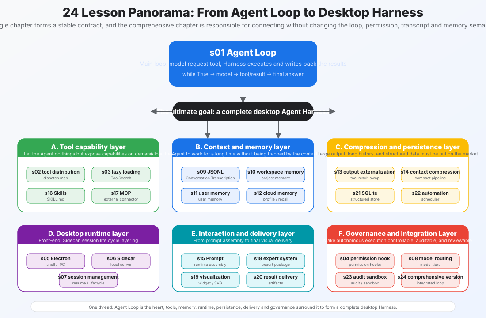
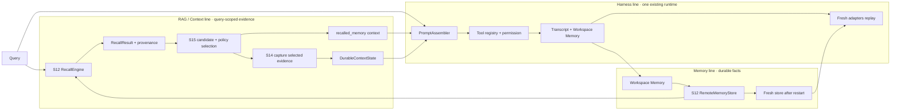

# s24: Comprehensive - Many Mechanisms, One Loop

[中文](README.md) · [English](README.en.md)
> *The mechanisms are many; the contract is one.*
>
> **Harness layer: integration. The loop belongs to the agent; the mechanisms belong to the harness.**

The final lesson composes the earlier contracts into one offline RAG-memory harness and verifies that restart does not change their meaning.



## Code Architecture Diagram



## Prerequisites

The final lesson assumes the earlier contracts are available and combines them in a keyless offline walkthrough.

## WorkBuddy-Style Mechanisms in This Chapter

The final lesson composes the earlier boundaries into one runtime and checks that restart preserves their contracts.

## Common Mistakes

Integration failures usually come from hidden ownership, duplicated writes, or losing evidence while moving between mechanisms.

## The Problem

```
s01  agent loop              → 循环本身
s02  tool dispatch           → 循环里的工具分发
s03  deferred loading        → 循环里的工具按需展开
s04  permission hooks        → 循环里的安全门
s05  electron shell          → 循环的进程外壳
s06  sidecar server          → 循环的通信管道
s07  session management      → 循环的生命周期
s08  model routing           → 循环的模型选择
s09  jsonl transcript        → 循环的事件记录
s10  workspace memory        → 循环的工作区记忆
s11  user memory             → 循环的用户级记忆
s12  cloud memory            → 循环的远端召回抽象
s13  output externalization  → 循环的大输出换出
s14  context compact         → 循环的上下文压缩
s15  prompt assembly         → 循环的 prompt 组装
s16  skills system           → 循环的技能加载
s17  mcp connectors          → 循环的外部工具协议
s18  experts system          → 循环的领域专家
s19  visualizer              → 循环的输出可视化
s20  result presentation     → 循环的结果交付
s21  sqlite database         → 循环的持久化层
s22  automation scheduler    → 循环的定时触发
s23  audit sandbox           → 循环的安全审计
s24  comprehensive           → 所有机制回到一个循环
```

## The Solution

```
                    ┌─────────────────────────────────┐
                    │         System Prompt            │
                    │  ┌─────┐ ┌─────┐ ┌───────────┐  │
                    │  │SOUL │ │USER │ │SKILLS list │  │
                    │  │     │ │MEM  │ │EXPERTS    │  │
                    │  └─────┘ └─────┘ └───────────┘  │
                    └──────────────┬──────────────────┘
                                   │
                    ┌──────────────▼──────────────────┐
                    │       ┌─────────────┐           │
                    │       │  Agent Loop │           │
                    │       │  while True │           │
                    │       └──────┬──────┘           │
     ┌──────────────┼──────────────│──────────────────┼──────────────┐
     │              │              │                  │              │
     │   ┌──────────▼─────────┐   │   ┌──────────────▼───────────┐  │
     │   │  Tool Dispatch     │   │   │  Context Management       │  │
     │   │  ┌──────────────┐  │   │   │  ┌──────────────────────┐ │  │
     │   │  │ Permission   │  │   │   │  │ Compaction (s14)     │ │  │
     │   │  │ Check (s04)  │  │   │   │  │ Prompt Assembly (s15)│ │  │
     │   │  ├──────────────┤  │   │   │  └──────────────────────┘ │  │
     │   │  │ Sandbox      │  │   │   └──────────────────────────┘  │
     │   │  │ Check (s23)  │  │   │              │                  │
     │   │  ├──────────────┤  │   │   ┌──────────▼───────────┐     │
     │   │  │ Execute      │  │   │   │  Memory (s10-s12)     │     │
     │   │  ├──────────────┤  │   │   │  workspace / user /   │     │
     │   │  │ Audit Log    │  │   │   │  cloud                 │     │
     │   │  │ (s23)        │  │   │   └───────────────────────┘     │
     │   │  ├──────────────┤  │   │              │                  │
     │   │  │ Usage Track  │  │   │   ┌──────────▼───────────┐     │
     │   │  │ (s21)        │  │   │   │  SQLite DB (s21)      │     │
     │   │  └──────────────┘  │   │   │  sessions / usage /   │     │
     │   └────────────────────┘   │   │  automations           │     │
     │              │              │   └───────────────────────┘     │
     │   ┌──────────▼─────────┐   │              │                  │
     │   │  Visualizer (s19)  │   │   ┌──────────▼───────────┐     │
     │   │  present_files     │   │   │  Automation (s22)     │     │
     │   │  (s20)             │   │   │  Scheduler            │     │
     │   └────────────────────┘   │   └───────────────────────┘     │
     │              │              │              │                  │
     └──────────────┼──────────────│──────────────│──────────────────┘
                    │              │              │
                    └──────────────▼──────────────┘
                    ┌─────────────────────────────┐
                    │    Electron Shell (s05-s07) │
                    │    main + renderer + sidecar│
                    │    + CLI session            │
                    └─────────────────────────────┘
```

### How It Works

## How It Works

### 2. Mechanism Groups

```python
def comprehensive_agent_loop(messages, session):
    while True:
        # ── 1. Prompt Assembly (s15) ──
        system = assemble_prompt(
            soul=get_soul(),           # s11: 身份
            user_mem=get_user_memory(), # s11: 用户偏好
            workspace_mem=get_workspace_log(),  # s10: 工作区日志
            cloud_profile=get_cloud_profile(),  # s12: 云端记忆
            skills=list_skills(),       # s16: 技能目录
            expert=get_expert(),        # s18: 领域专家
            tools_context=get_tools_info()  # s17: MCP 连接器
        )

        # ── 2. Context Compaction (s14) ──
        if token_count(messages) > THRESHOLD:
            messages = compact_context(messages)

        # ── 3. Model Routing (s08) ──
        model = route_model(session.agent_type)  # lite/default/craft

        # ── 4. API Call ──
        response = client.messages.create(
            model=model, system=system,
            messages=messages, tools=session.tools,
        )

        # ── 5. JSONL Transcript (s09) ──
        transcript.append({
            "type": "message",
            "role": "assistant",
            "content": response.content
        })

        # ── 6. Usage Tracking (s21) ──
        db.track_usage(session.id, model, response.usage)

        # ── 7. Inspect normalized content blocks (s01) ──
        messages.append({"role": "assistant", "content": response.content})
        tool_blocks = [b for b in response.content if b.type == "tool_use"]
        if not tool_blocks:
            # ── 8. Result Presentation (s19, s20) ──
            present_result(response.content)
            # ── 9. Memory Update (s10) ──
            update_workspace_memory(session, messages)
            return

        # ── 10. Tool Dispatch (s02) + Deferred Loading (s03) ──
        results = []
        for block in tool_blocks:
                # ── 10a. Deferred Tool? (s03) ──
                if block.name in DEFERRED_TOOLS:
                    tool_schema = tool_search(block.name)  # ToolSearch
                    result = defer_execute(tool_schema, block.input)  # DeferExecuteTool
                    results.append({"type": "tool_result",
                                    "tool_use_id": block.id, "content": result})
                    continue

                # ── 10b. Permission Check (s04) ──
                decision = check_permission(block.name)
                if decision is DENY:
                    results.append(denied_result(block.id))
                    continue

                # ── 10c. Sandbox Check (s23) ──
                if not check_sandbox(block.input):
                    results.append(blocked_result(block.id))
                    continue

                # ── 10d. Execute + Audit (s23) ──
                audit_entry("tool_execute", block.name, block.input)
                output = TOOL_HANDLERS[block.name](**block.input)
                audit_entry("tool_result", block.name, output)

                # ── 10e. Output Externalization (s13) ──
                if should_externalize(output):
                    pointer = write_to_disk(output)
                    output = make_pointer(pointer)  # 上下文只留指针

                # ── 10f. Tool Usage (s21) + JSONL (s09) ──
                db.record_tool_call(session.id, block.name)
                transcript.append({
                    "type": "function_call_result",
                    "tool": block.name, "result": output
                })

                results.append({
                    "type": "tool_result",
                    "tool_use_id": block.id,
                    "content": output,
                })

        messages.append({"role": "user", "content": results})
```

### 3. Core Insight

```
┌──────────────────────────────────────────────────────────────────┐
│                       Agent Loop (s01)                            │
│                                                                  │
│  ┌──────────┐  ┌──────────┐  ┌──────────┐  ┌────────────────┐  │
│  │ 工具层    │  │ 进程层    │  │ 持久层    │  │  记忆层         │  │
│  │ s02 s03  │  │ s05 s06  │  │ s09 s21  │  │  s10 s11 s12  │  │
│  │ s16 s17  │  │ s07 s08  │  │ s22      │  │  s15          │  │
│  │ s18      │  │          │  │          │  │                │  │
│  └──────────┘  └──────────┘  └──────────┘  └────────────────┘  │
│                                                                  │
│  ┌──────────────┐  ┌──────────┐  ┌──────────┐                  │
│  │ 上下文管理层  │  │ 安全层    │  │ 交互层    │                  │
│  │ s13 s14      │  │ s04 s23  │  │ s19 s20  │                  │
│  └──────────────┘  └──────────┘  └──────────┘                  │
└──────────────────────────────────────────────────────────────────┘
```

### WorkBuddy Architecture Comparison

This comparison maps the integrated harness and RAG-memory restart invariants to the corresponding WorkBuddy-style harness boundary.

```
Agency 来自模型。
Harness 让 agency 落地。

模型 = Claude / GPT / GLM (推理 + 决策)
Harness = 24 个机制 (执行环境 + 安全 + 记忆 + 持久化)

Agent = 模型 × Harness
```

## WorkBuddy Architecture Comparison

This comparison maps the integrated harness and RAG-memory restart invariants to the corresponding WorkBuddy-style harness boundary.

### Multi-Process Architecture

### One-Sentence Summary

```
Electron Main Process
  ├── SidecarServer
  │     ├── JSON-RPC over Unix Socket (s06)
  │     ├── Model Router lite/default/craft (s08)
  │     ├── SQLite Database (s21)
  │     ├── Automation Scheduler (s22)
  │     └── Audit Log Writer (s23)
  ├── Renderer Process (renderer/)
  │     └── React UI (s05)
  ├── Preload Script (preload/)
  │     └── IPC Bridge (s05)
  └── CLI Session Process (cli/)
        └── Agent Loop (agent bridge module)
              ├── Prompt Assembly (s15)
              ├── Tool Dispatch (s02)
              ├── Deferred Loading (s03)
              ├── JSONL Transcript (s09)
              ├── Output Externalization (s13)
              ├── Context Compaction (s14)
              └── Memory Management (s10-s12)
```

### Code Walkthrough

```
WorkBuddy-style harness = 一个 agent loop (s01)
                        + 22 个累加机制 (s02-s23)
                        + 一个综合收束 (s24)
```

## Code Walkthrough

### Compaction and Restart Invariants

### Why Retry Must Not Write Another Memory

### Run

## Run

### The 24-Lesson Takeaway

```bash
python3 s24_comprehensive/code.py --walkthrough
```

```bash
python3 -m pytest -q tests/test_comprehensive_contracts.py
```

```bash
python3 -m pytest -q
python3 scripts/verify.py
```

```bash
python s24_comprehensive/code.py
```

## Exercises

Use these exercises to change one part of the integrated harness and RAG-memory restart invariants at a time and explain the resulting contract.

## The 24-Lesson Takeaway

```
s01  Agent Loop            ──▶  起点: 一个循环 + 一个工具
s02  Tool Dispatch         ──▶  多个工具, 一个 dispatch map
s03  Deferred Loading      ──▶  ToolSearch + DeferExecuteTool 两步调用
s04  Permission Hooks      ──▶  先划边界, 再给自由
s05  Electron Shell        ──▶  三个进程, 一个应用
s06  Sidecar Server        ──▶  JSON-RPC, RingBuffer
s07  Session Management    ──▶  每个会话一个子进程
s08  Model Routing         ──▶  lite/default/craft 三级路由
s09  JSONL Transcript      ──▶  对话持久化, 追加写入, 崩溃恢复
s10  Workspace Memory      ──▶  每天的工作记下来
s11  User Memory           ──▶  跨项目的偏好
s12  Cloud Memory          ──▶  服务端检索
s13  Output Externalization──▶  大输出写磁盘, 上下文留指针
s14  Context Compact       ──▶  四层压缩管线
s15  Prompt Assembly       ──▶  运行时分段拼接
s16  Skills System         ──▶  按需加载技能
s17  MCP Connectors        ──▶  连接器生态
s18  Experts System        ──▶  领域专家包
s19  Visualizer            ──▶  SVG/HTML 可视化
s20  Result Presentation   ──▶  文件交付
s21  SQLite Database       ──▶  WAL 模式, 7 张表
s22  Automation Scheduler  ──▶  到点自动跑
s23  Audit & Sandbox       ──▶  每步留痕, 不可篡改
s24  Comprehensive         ──▶  终点: 全部归到一个循环
```

- The final lesson composes the earlier contracts into one offline RAG-memory harness and verifies that restart does not change their meaning.

**Reference tables**

| Lesson | Mechanism | Motto | Position in the loop |
|---|---|---|---|
| s01 | Agent Loop | One loop is enough | The loop itself |
| s02 | Tool Dispatch | Add tools without changing the loop | Inside the loop, tool dispatch |
| s03 | Deferred Loading | Do not load every tool | Discover tools on demand |
| s04 | Permission Hooks | Set the boundary before granting freedom | Before tool execution |
| s05 | Electron Shell | One process is not enough; use three | The loop's outer shell |
| s06 | Sidecar Server | Main does not run the agent | Inter-process communication |
| s07 | Session Management | One child process per session | Loop lifecycle |
| s08 | Model Routing | Use AI to manage AI | Model choice before an API call |
| s09 | JSONL Transcript | Append the conversation to disk | Persistence after each turn |
| s10 | Workspace Memory | Scope project facts | After substantive work |
| s11 | User Memory | Keep cross-project preferences at user scope | Prompt assembly |
| s12 | Cloud Memory | Some memory lives remotely | Prompt assembly |
| s13 | Output Externalization | Put large output on disk and keep a pointer | After tools, before context |
| s14 | Context Compact | Context always fills up | Before the API call |
| s15 | Prompt Assembly | A prompt is assembled | Each API call |
| s16 | Skills System | List skills first | Prompt assembly and tool pool |
| s17 | MCP Connectors | External tools use a standard protocol | Tool-pool extension |
| s18 | Experts System | Load a domain expert bundle | Prompt, tools, and memory |
| s19 | Visualizer | The agent can draw | Output processing |
| s20 | Result Presentation | Finish by delivering the result | Output processing |
| s21 | SQLite Database | Sessions must persist | After each operation |
| s22 | Automation Scheduler | Run at the right time | Trigger outside the loop |
| s23 | Audit and Sandbox | Leave evidence at every step | Before and after tools |
| **s24** | **Comprehensive** | **Many mechanisms, one loop** | **All mechanisms integrated** |

| Layer | Lessons | Responsibility |
|---|---|---|
| Tool layer | s02, s03, s16, s17, s18 | Dispatch, deferred loading, skills, connectors, and experts |
| Process layer | s05, s06, s07, s08 | Electron, Sidecar, sessions, and model routing |
| Persistence layer | s09, s21, s22 | JSONL transcripts, SQLite, and automation |
| Memory layer | s10, s11, s12, s15 | Three memory scopes and prompt assembly |
| Context layer | s13, s14 | Output externalization and compaction |
| Safety layer | s04, s23 | Permission checks, sandboxing, and audit logs |
| Interaction layer | s19, s20 | Visualization and result delivery |

The original Chinese README remains the primary-language reference. This English companion keeps the same code, diagrams, local paths, and chapter structure so readers can switch languages without losing runnable details.

Local references:

- [Reference](README.md)
- [Reference](README.en.md)
- [Reference](./images/comprehensive-overview-en.svg)
